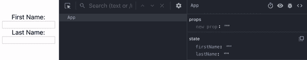
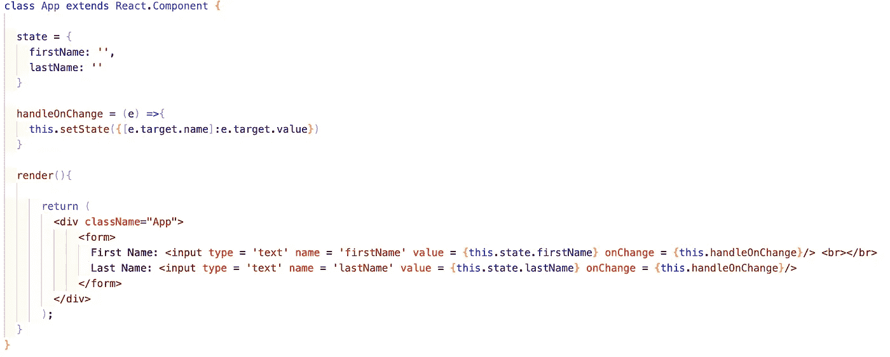
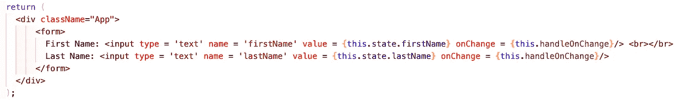
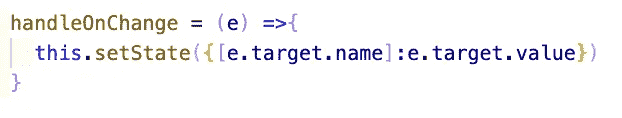

# 在 React.js 中构建简单的控件表单

> 原文：<https://levelup.gitconnected.com/building-a-simple-controlled-form-in-react-js-b7e28236bf2e>


今天，我们将在 React.js 中构建一个简单的受控表单。

## 什么是受控表单？

受控表单的输入字段值由应用程序的状态决定，而应用程序的状态由输入字段值决定。当通过 API 调用发送/接收信息时，控制表单是非常重要的；我们可以使用应用程序的当前状态来反映表单中提交或填充了什么值。

下面是一个实际控制表单的示例:



如你所见，左边的输入与右边的应用状态相对应。

你可以在这里找到这个演示的回购[的链接](https://github.com/jonathanbrierre/Simple-Controlled-Form)。

这是我的 App.js 组件:



因为这里发生了很多事情，所以让我们从表格 JSX 开始一点一点地分解它:



对于每个输入，我们需要三个重要的属性来控制它:名称**、**值**和 **onChange** 事件监听器。**

****name** 属性将与我们的状态对象中存在的特定键相对应。**

****

****值**属性将引用我们状态中相应键的精确值。**

****onChange** 事件监听器将接受一个改变状态值的回调函数，从而同时改变输入字段的值。这是我们的回调函数:**

****

**当回调接收一个事件对象(在本例中称为“e”)时，我们可以访问与该函数中的事件相关的信息。这就是我们用下面一行代码改变状态的地方:**

```
this.setState({[e.target.name]:e.target.value})
```

**我们通过使用事件对象提供给我们的值，在状态中动态生成一个键。这是通过使用括号符号— [e.target.name]来完成的。这样做使得这个函数对于两个输入字段都是可重用的，因为当我们在一个字段上键入一个特定的名称时，这个回调将使用那个输入的名称来动态地在我们的状态中找到一个键进行编辑。**

**现在你知道了！如果我们想将这个表单提交到后端，那么我们将获取存储在状态中的数据，然后将其与 API 调用一起传递——这是我们以前不控制表单就无法直接完成的事情。**

# **资源**

**[](https://reactjs.org/docs/forms.html) [## 表单-反应

### HTML 表单元素的工作方式与 React 中的其他 DOM 元素稍有不同，因为表单元素自然会保持…

reactjs.org](https://reactjs.org/docs/forms.html) [](https://github.com/jonathanbrierre/Simple-Controlled-Form) [## jonathanbrierre/简单控制形式

### 这个项目是用 Create React App 引导的。在项目目录中，您可以运行:在…中运行应用程序

github.com](https://github.com/jonathanbrierre/Simple-Controlled-Form)**