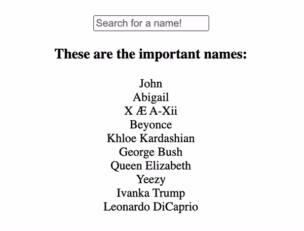
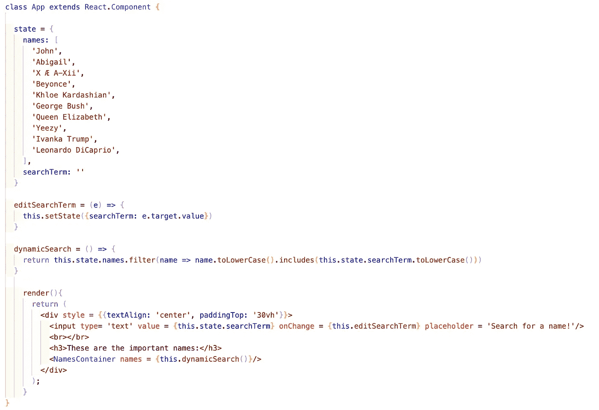
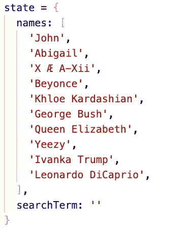
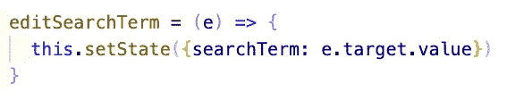
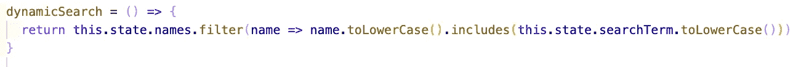
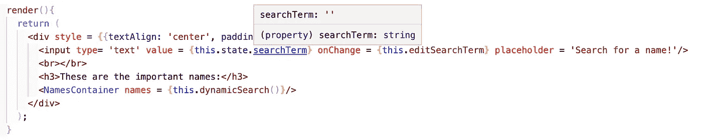
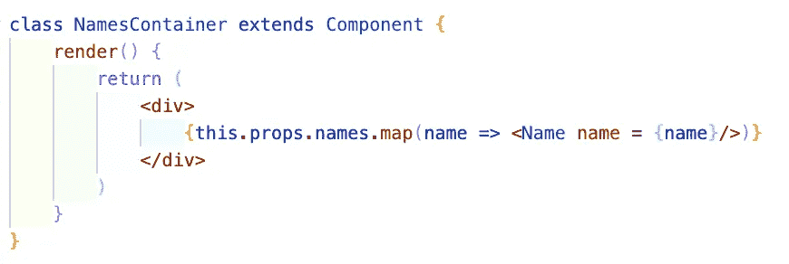
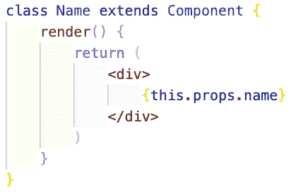

# 在 React.js 中构建一个简单的动态搜索栏

> 原文：<https://levelup.gitconnected.com/building-a-simple-dynamic-search-bar-in-react-js-f1659d64dfae>

今天，我们将在 React.js 中创建一个动态搜索栏！

# 什么是动态搜索？

动态搜索是一种功能，允许用户在搜索字段中键入内容，以过滤结果并立即呈现在屏幕上。

下面是一张展示实际功能的 gif 图:

我们如何实现这样一个特性？让我们继续阅读来寻找答案吧！
顺便说一句，你可以在[这个公开的 GitHub repo](https://github.com/jonathanbrierre/Simple-Dynamic-Search) 中找到这篇博客中提到的代码！

下面是我的主要组件 App.js 的截图:

我们来分解一下！

**状态:**

我们这里的状态包含指向一个名称数组的“names”键，以及引用一个空字符串的“searchTerm”键，该空字符串由我们的输入 JSX 标记控制。如果您对控制输入字段不熟悉，我推荐您阅读我的博客文章，“[在 React.js 中构建一个简单的受控表单”.](/building-a-simple-controlled-form-in-react-js-b7e28236bf2e)

**editSearchTerm 函数:**

这个函数允许我们的输入字段控制状态中的“searchTerm”值。

**动态搜索功能:**

这个函数允许我们动态地呈现页面上显示的内容。当我们在输入字段中键入并控制我们的“searchTerm”字符串时，我们会检查是否有任何姓名包含该字符串。如果是，那么它将被过滤函数返回。如果你不熟悉 JavaScript 的。filter()高阶函数，我将在这里向您推荐[文档](https://developer.mozilla.org/en-US/docs/Web/JavaScript/Reference/Global_Objects/Array/filter)。

请记住，当输入字段中没有任何内容时，dynamicSearch 过滤器函数将返回完整的姓名列表。每个字符串总是包含一个空字符串，即空白文本字段的默认值。

另外，您可能会注意到我包含了。toLowerCase()函数应用于名称和搜索词。我这样做是为了当用户输入时，输入不需要区分大小写。如果用户键入全大写，结果将根据小写值进行过滤。

**JSX:**

在这里，您可以看到我们的受控输入字段以及一个名为“NamesContainer”的名称容器组件

NamesContainer 组件接受一个名称数组，该数组将被解析为单独的名称组件，如下所示:

现在让您的动态搜索工作的关键是将我们的 dynamic search 函数的返回值作为 props 传递下去，这个数组由我们的输入字段连续过滤。**注意**:我们**必须**在传递函数时调用它；否则，我们得不到返回值，而只是传递一个函数。

现在，你可以在你的应用程序中实现这个高度通用的特性，就像你渴望成为的专业程序员一样！

# 资源:

 [## 在 React.js 中构建简单的控件表单

### 今天，我们将在 React.js 中构建一个简单的受控表单。

levelup.gitconnected.com](/building-a-simple-controlled-form-in-react-js-b7e28236bf2e)  [## Array.prototype.filter()

### filter()方法创建一个新数组，其中所有元素都通过了由提供的函数实现的测试…

developer.mozilla.org](https://developer.mozilla.org/en-US/docs/Web/JavaScript/Reference/Global_Objects/Array/filter)  [## jonathanbrierre/简单动态搜索

### 这个项目是用 Create React App 引导的。在项目目录中，您可以运行:在…中运行应用程序

github.com](https://github.com/jonathanbrierre/Simple-Dynamic-Search)