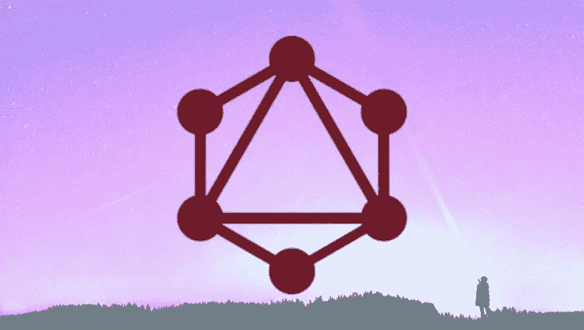
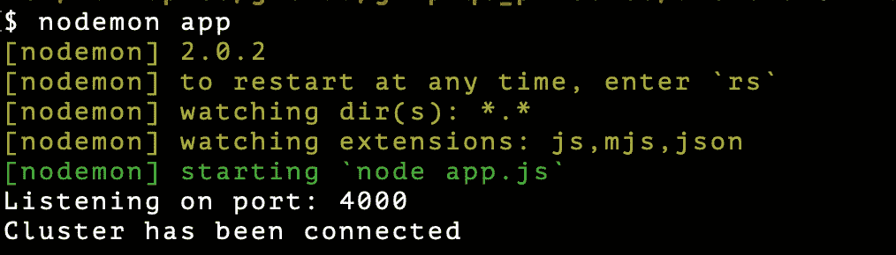
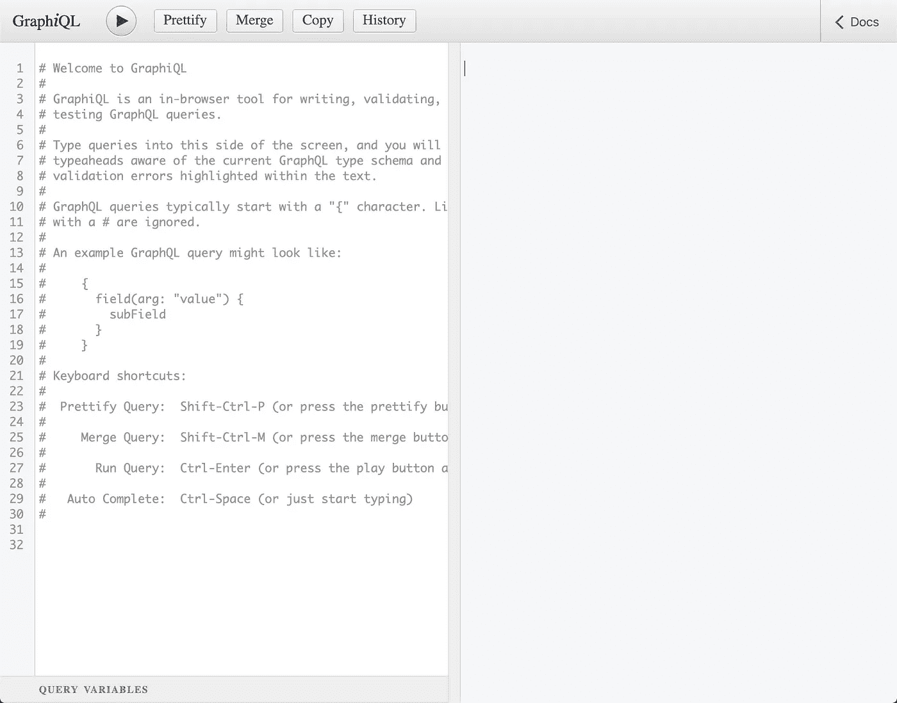
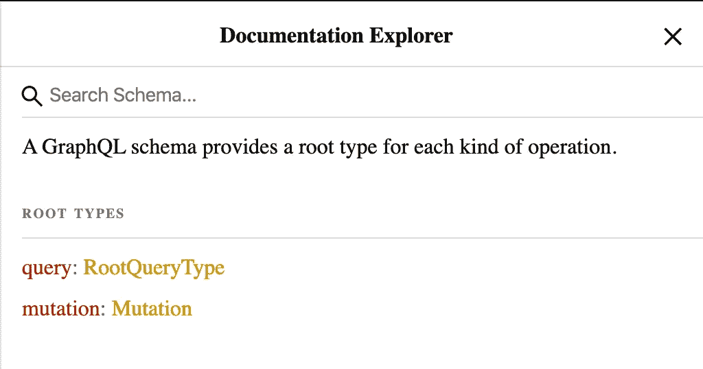
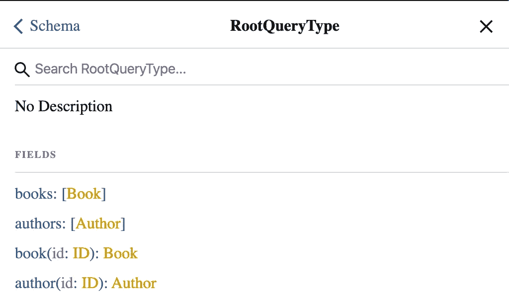
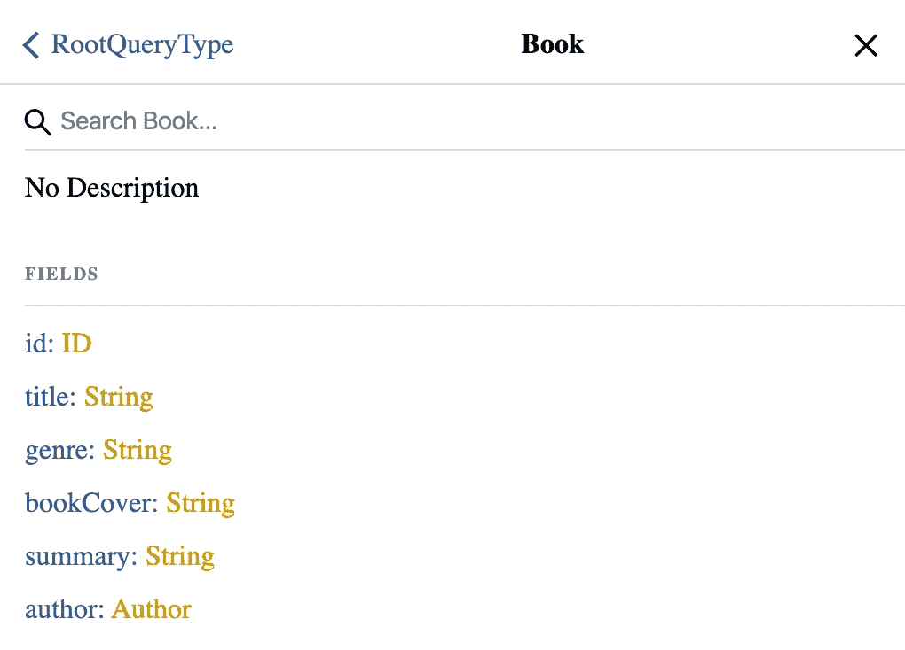
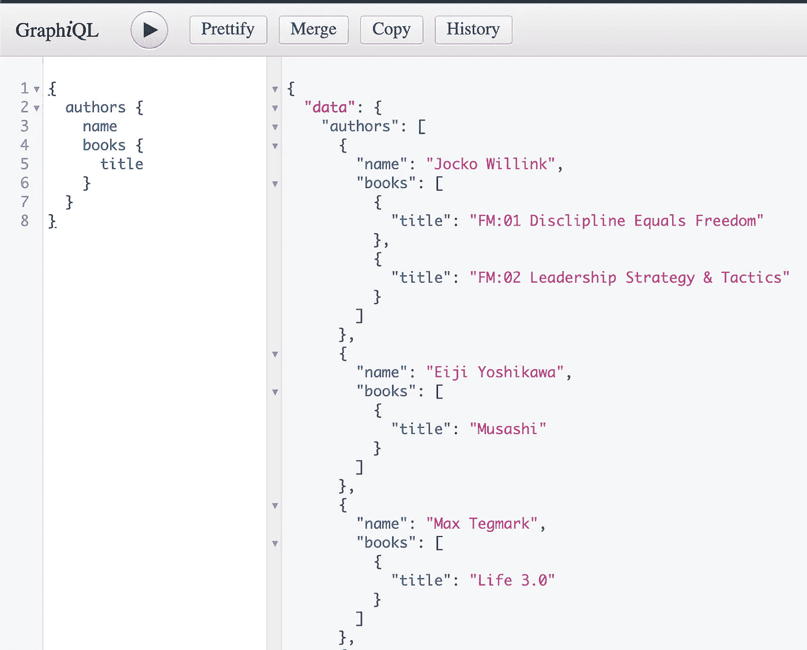

# 构建一个简单的 GraphQL 服务器

> 原文：<https://levelup.gitconnected.com/building-a-simple-graphql-server-6c26f6b916f9>



GraphQL

随着编程的时代精神不断变化，很难确定什么是时尚，什么会持续下去。幸存下来的工具之一是 GraphQL，它是标准 RESTful route 查询和操作数据方法的替代方案。上周我决定着手解决开源项目的基础问题，我明白了它为什么如此受欢迎。

*   GraphQL 是一种用于 API 的开源数据查询和操作语言，是一个用现有数据完成查询的运行时。
*   GraphQL 是脸书在 2012 年内部开发的，2015 年公开发布。
*   GraphQL 支持读取、写入(变异)和订阅对数据的更改(实时更新——最常用 WebHooks 实现)。

GraphQL 提供了一种开发 web APIs 的方法，并与 REST 架构风格进行了对比。它允许客户端定义所需的数据结构，并且从服务器返回相同的数据结构，从而防止返回过多的数据。

对于这个例子，我们将结合 Express 和 MongoDB 构建一个 GraphQL 服务器。如果您需要在开始学习本教程之前快速浏览一下，请查看以下内容:

[](/introduction-to-express-js-a-node-js-framework-fa3dcbba3a98) [## Express.js 简介:Node.js 框架

### 狂热者终于找到了我。我已经决定深入研究 Express.js 框架，以及它是如何补充

levelup.gitconnected.com](/introduction-to-express-js-a-node-js-framework-fa3dcbba3a98) [](/mernn-to-do-app-dab1e3173493) [## MERNN:待办事项应用

### 用 Mongo、Express、React Native、Node 搭建一个 app

levelup.gitconnected.com](/mernn-to-do-app-dab1e3173493) 

前往您的终端，导航到您的项目目录并输入以下命令:

```
mkdir graphql-example
cd graphql-example
touch server.js
touch .env
touch .gitignore
npm init -y
yarn add cors dotenv express express-graphql graphql lodash mongoose nodemon
```

## 家属:

`cors` : CORS 是一个 node.js 包，用于提供一个 [Connect](http://www.senchalabs.org/connect/) / [Express](http://expressjs.com/) 中间件，可以用来启用 [CORS](http://en.wikipedia.org/wiki/Cross-origin_resource_sharing) 的各种选项。

`dotenv` : Dotenv 是一个零依赖模块，将环境变量从`.env`文件加载到`[process.env](https://nodejs.org/docs/latest/api/process.html#process_process_env)`

`express`:用于[节点](http://nodejs.org/)的快速、非个性化、极简的 web 框架。

`express-graphql`:用任何支持 connect 风格中间件的 HTTP web 框架创建一个 GraphQL HTTP server，包括 [Connect](https://github.com/senchalabs/connect) 本身、 [Express](https://expressjs.com/) 和 [Restify](http://restify.com/) 。

`graphql`:可以针对任何服务的查询语言和运行时。

`lodash` : Lodash 模块化公用事业。

`mongoose`:mongose 是一个 [MongoDB](https://www.mongodb.org/) 对象建模工具，设计用于在异步环境中工作。猫鼬支持承诺和回调。

`nodemon` : nodemon 是一个帮助开发基于 node.js 的应用程序的工具，当检测到目录中的文件改变时，它会自动重启 node 应用程序。

太好了。现在让我们开始设置我们的`server.js`文件的框架。

```
const express = require("express");
const app = express();
require("dotenv").config()
const PORT = 4000 || process.env.PORTapp.listen(PORT, () => {
    console.log(`Listening on port: ${PORT}`)
});
```

如果您打开终端并运行以下命令，您的终端应该输出“监听端口:4000”:

```
nodemon server
```

在我们深入研究代码之前，[前往 MongoDB，创建一个帐户，然后创建一个免费的分层集群用于我们的应用程序。](https://docs.atlas.mongodb.com/tutorial/deploy-free-tier-cluster/)部署集群后，[您需要使用 URI，通过“连接您的应用程序”选项将集群连接到应用程序](https://docs.atlas.mongodb.com/connect-to-cluster/)。这将生成一个字符串，您可以通过它将应用程序连接到数据库。一旦有了字符串，打开`.env`文件，用集群提供的 URI 添加以下内容:

```
PORT=4000
MONGODB_URI=mongodb+srv://<name>:<password>@cluster.mongodb.net/test?retryWrites=true&w=majority
```

完美。现在我们可以开始设置我们的数据模型和模式了。打开终端，输入以下命令:

```
mkdir models
cd models
touch author.model.js
touch book.model.js
cd ..
```

现在打开`author.model.js`，让我们开始构建我们的数据模型。我们的作者模型将由姓名、年龄、简历和图片组成。我们将首先为 Mongo 建立模型，然后为 graphql 建立模式。

*/模型/作者.模型. js*

```
const mongoose = require("mongoose")
const Schema = mongoose.Schemaconst AuthorSchema = new Schema({
   name: { type: String, required: true },
   age: { type: Number, required: true },
   bio: { type: String, required: true },
   picture: { type: String, required: true }
})module.exports = mongoose.model("Author", AuthorSchema)
```

现在，我们需要为图书建立一个模式，该模式将由标题、流派、图书封面、摘要和作者 ID 组成。

```
const mongoose = require("mongoose")
const Schema = mongoose.Schemaconst BookSchema = new Schema({
   title: { type: String, required: true },
   genre: { type: String, required: true },
   summary: { type: String, required: true },
   bookCover: { type: String, required: true },
   authorID: { type: String, required: true }
})module.exports = mongoose.model("Book", BookSchema)
```

现在让我们回到我们的`server.js`文件，在我们的应用程序和数据库之间建立连接。

*server.js*

```
const express = require("express");
const app = express();
require("dotenv").config()
const PORT = 4000 || process.env.PORT
**const mongoose = require("mongoose")
const uri = process.env.MONGODB_URI****mongoose.connect(uri, {
   useNewUrlParser: true,
   useCreateIndex: true,
   useUnifiedTopology: true
});****const connection = mongoose.connection;****connection.once("open", () => {
  console.log("Cluster has been connected.");
});**app.listen(PORT, () => {
    console.log(`Listening on port: ${PORT}`)
});
```

如果您在运行`nodemon server`时遵循了创建和连接集群的指导，您的终端应该输出以下内容:



如果您在这方面有困难，请打开您的 MongoDB 仪表板并确保:

1.  您的集群已经部署
2.  您已将您的 IP 地址列入“网络访问”白名单

现在我们可以构建我们的 GraphQL 模式、查询和变异。回到您的终端，创建目录和文件:

```
mkdir schema
cd schema 
touch schema.js
cd ..
```

首先，让我们为书籍构建 GraphQL 模式:

*/schema/schema.js*

```
const graphql = require("graphql")
const { GraphQLObjectType,
        GraphQLString, 
        GraphQLID,
        GraphQLSchema,
        GraphQLList,
        GraphQLNonNull,
        GraphQLInt
      } = graphql
const Book = require("../models/book.model")
const Author = require("../models/author.model")const BookType = new GraphQLObjectType({
   name: "Book",
   fields: () => ({
     id: { type: GraphQLID },
     title: { type: GraphQLString },
     genre: { type: GraphQLString },
     bookCover: { type: GraphQLString },
     summary: { type: GraphQLString }, author: {
        type: AuthorType,
        resolve(parent, args) {
         return Author.findById(parent.authorID)
        }
      }
    })
 });const AuthorType = new GraphQLObjectType({
   name: "Author",
   fields: () => ({
     id: { type: GraphQLID },
     name: { type: GraphQLString },
     age: { type: GraphQLInt },
     bio: { type: GraphQLString },
     picture: { type: GraphQLString }, books: {
        type: BookType,
        resolve(parent, args) {
         return Book.find({ authorID: parent.id })
        }
      }
    })
 });
```

既然我们已经使用 MongoDB 模型定义了 GraphQL 模式，我们就可以设置我们的根查询了。在我们刚刚编写的代码下面，让我们创建我们的根查询。

/架构/schema.js

```
const RootQuery = new GraphQlObjectType({
   name: "RootQueryType",
   fields: {
    books: {
      type: new GraphQLList(BookType),
      resolve(parent, args) {
        return Book.find({});
      }
    },
    authors: {
      type: new GraphQLList(AuthorType),
      resolve(parent, args) {
         return Author.find({})
       }
    },
    book: {
     type: BookType, 
     args: { id: { type: GraphQLID } },     
     resolve(parent, args) {
         return Book.findById(args.id);
       }
    },
    author: {
     type: AuthorType, 
     args: { id: { type: GraphQLID } },     
     resolve(parent, args) {
         return Author.findById(args.id);
       }
    }
  }
});
```

我们的查询现在已经设置好了，但是现在没有用，因为我们的数据库中没有数据。让我们设置一些突变，以便我们可以添加一些数据。在我们刚刚编写的代码下面，添加以下内容:

```
**const Mutation = new GraphQLObjectType({
   name: "Mutation",
   fields: {
     addAuthor: {
        type: AuthorType,
        args: {
          name: { type: new GraphQLNonNull(GraphQLString) },
          age: { type: new GraphQLNonNull(GraphQLInt) },
          bio: { type: new GraphQLNonNull(GraphQLString) },
          picture: { type: new GraphQLNonNull(GraphQLString) }
         },
         resolve(parent, args) {
            let author = new Author({
              name: args.name,
              age: args.age,
              bio: args.bio,
              picture: args.picture
            });

         return author.save();
        }
      },
    addBook: {
      type: BookType,
      args: {
        title: { type: new GraphQLNonNull(GraphQLString) },
        genre: { type: new GraphQLNonNull(GraphQLString) },
        bookCover: { type: new GraphQLNonNull(GraphQLString) },
        summary: { type: new GraphQLNonNull(GraphQLString) },
        authorID: { type: new GraphQLNonNull(GraphQLID) }
       },
      resolve(parent, args) {
        let book = new Book({
          title: args.title,
          genre: args.genre,
          bookCover: args.bookCover,
          authorID: args.authorID
        });** **return book.save();
      }
    }
  }
});****module.exports = new GraphQLSchema({
    query: RootQuery,
    mutation: Mutation
});**
```

然后转到您的`server.js`文件，建立我们的路线图 QL。

*/server.js*

```
...
**const schema = require("./schema/schema")
const graphqlHTTP = require("express-graphql")**
...**app.use("/graphql", graphqlHTTP({
      schema,
      graphiql: true
   })
);**app.listen(PORT, () => {
   console.log(`Listening on port: ${PORT}`);
});
```

用`nodemon server`命令启动服务器，然后打开浏览器到[http://localhost:4000/graph](http://localhost:4000/graphql)l 您应该会看到 GraphQL 的内置 graph QL，您可以在其中进行查询和修改。



图形 QL

GraphiQL 有一些非常酷的特性。如果查询和突变设置正确，您应该能够点击右上角的“Docs ”,并查看您可以查询的可能字段。



让我们添加一些种子数据。为此，首先使用以下格式创建一个作者:

```
mutation {
  addAuthor(name: "Eiji Yoshikawa", age: 70, bio: "was a Japanese historical novelist. Among his best-known novels are revisions of older classics.", picture: "[https://upload.wikimedia.org/wikipedia/commons/d/d9/Eiji_Yoshikawa.jpg](https://upload.wikimedia.org/wikipedia/commons/d/d9/Eiji_Yoshikawa.jpg)" ) {
    name
    bio
  }
}
```

然后添加一本书:

```
mutation {
  addBook(title: "Musashi", summary: "The long epic comprises seven \"books\" detailing the exploits of Miyamoto Musashi", genre: "Historical Fiction", bookCover: "[https://external-content.duckduckgo.com/iu/?u=https%3A%2F%2Fupload.wikimedia.org%2Fwikipedia%2Fen%2F3%2F34%2FMusashiNovel.jpg&f=1&nofb=1](https://external-content.duckduckgo.com/iu/?u=https%3A%2F%2Fupload.wikimedia.org%2Fwikipedia%2Fen%2F3%2F34%2FMusashiNovel.jpg&f=1&nofb=1)", authorID: "5e62c5ea811aaf5e98e00073") {
    title 
    author {
      name
    }
  }
}
```

现在，您可以进行一些查询:

```
{
  authors {
   name
   books {
     title
    }
  }
}
```



就这么简单。