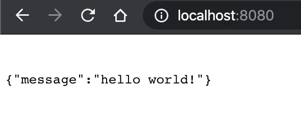

# 在 Go 中构建一个简单的 Rest API

> 原文：<https://levelup.gitconnected.com/building-a-simple-rest-api-in-go-ee29cf3e7334>

## Go 的 net/http 包使用介绍


Philipp Katzenberger 在 Unsplash 上的照片

在最近加入 [Central Tech](https://central.tech) 后，我接到了我的第一个项目:实现一个新产品，在 Go 中创建和查询一个 API。我把这当成一个最终深入围棋的机会，这是我在听到许多人对它的称赞后一直想做的事情。我还决定开始详细描述我一路上学到的东西，既是为了个人参考，也是为了确保我对概念的理解足以用文字来解释。

因此，这篇文章和我的[网站](https://tansawit.me)将有望成为我可以参考的资源，也有望对其他人有所帮助。

# 基础

这篇文章假设你已经在电脑上安装并运行了 Go。如果没有，请看 Go 语言官方入门[指南](https://golang.org/doc/install)。

在编写要执行的实际函数之前，我们首先需要定义我们的程序并导入必要的包。创建一个名为`main.go`的新文件，并添加以下几行。

```
**package** main

**import** (
    "log"
    "net/http"
)
```

让我们检查一下上面代码的每个组件。

# 包装

[包](https://golang.org/pkg/)是 Go 的源代码，组织成系统目录。它们允许不同应用程序之间的代码重用。为了将一个可执行程序与其他程序使用的库区分开，Go 要求我们在任何可执行程序的主文件头中包含`package main`。编译时，那个`package main`告诉 Go 编译器这个包应该编译成一个可执行程序，而不是构建成一个库。

# 进口

关键字' import '用于将包导入我们的程序或另一个包。导入包时，Go 编译器将在两个环境变量指定的位置中查找:

*   `$GOROOT`Go 附带的[标准库](https://golang.org/pkg/)中的包存放的地方
*   `$GOPATH`用于抓取第三方或自制包。

> ***注意*** *: Go by design 不允许声明未使用的导入，如果在编译时发现任何未使用的导入，将坚决投诉*

在我们的例子中，两个包都来自标准库:

*   `log`允许我们记录错误和其他问题。
*   `net/http`为我们提供了构建实际 API 的 HTTP 客户端和服务器实现

在声明包之后，我们可以开始定义和服务我们的 API。在不使用第三方库和路由器的情况下，有两种主要的“方法”可以做到这一点。

如果我们将处理程序实现为一个函数，我们将使用`http.HandleFunc`。否则，如果我们用`ServeHTTP`方法将我们的处理程序实现为一个类型，我们将使用`http.Handle`。

对于简单的实现，第一个选项更容易阅读和理解。但是使用 struct 类型允许在其中存储有用的信息，一个例子是来自标准库的[文件服务器](https://golang.org/src/net/http/fs.go?s=12662:12702#L418)。该结构包含文件服务的根目录。更详细的解释见[堆栈溢出帖子](https://stackoverflow.com/questions/21957455/difference-between-http-handle-and-http-handlefunc)。

由于我们的程序相当简单明了，我们将坚持第一种方法。

> ***注*** *: HTTP 处理程序是为响应 web 应用程序的请求而运行的进程。更多信息，请参见其* [*维基百科页面*](https://en.wikipedia.org/wiki/HTTP_handler)

# 构建 Web 服务器

现在我们开始定义 API 服务器的实际行为，以及我们将作为响应发送的内容。在我们的进口和包装声明下面添加以下几行:

```
func apiResponse(w http.ResponseWriter, r *http.Request) { 
  w.WriteHeader(http.StatusOK)
  w.Header().Set("Content-Type", "application/json")
  w.Write([]byte(`{"message":"hello world!"}`))
}

func main() {
  http.HandleFunc("/",apiResponse)
  log.Fatal(http.ListenAndServe(":8080",**nil**))
}
```

同样，让我们浏览一下每个函数。

# apiResponse

函数`apiResponse`负责写响应代码和 JSON。函数本身有两个参数:`http.ResponseWriter`类型的`w`组装我们的 HTTP 服务器的响应，而`r`读取并解析请求。现在遍历函数的每一行:

*   `w.WriteHeader(http.StatusOK)`写 HTTP [响应代码](https://developer.mozilla.org/en-US/docs/Web/HTTP/Status) 200，表示请求的资源(在我们的例子中是 JSON 响应)已经被成功获取并在消息体中传输。
*   `w.Header().Set("Content-Type", "application/json")`表示所请求资源的返回类型。
*   最后，在消息正文中写入我们的响应。

# 主要的

`main()`函数在 Go 中有一个特殊的用途:它充当可执行程序的入口点。它不接受任何参数，也不返回任何内容。而且不像其他一些语言，我们不需要显式调用`main`，因为 Go 运行时会自动调用该函数。

在我们的主函数中，`HandleFunc`调用告诉 HTTP 包用我们的`apiResponse`函数处理所有对 web 根(“/”)的请求。然后它调用`http.ListenAndServe`，指定它应该监听任何接口上的端口`8080`。

如果我们现在运行命令`go run .`并在 web 浏览器上导航到`localhost:8080`，我们应该会看到类似这样的内容。

我们也可以使用“GET”方法将相同的 URL 输入到我们的 REST 客户端(即 [Postman](https://www.getpostman.com/) 、[失眠症](https://www.insomnia.rest)、 [Paw](https://paw.cloud/) )中，以获得相同的结果。



# 让它宁静

现在我们的服务器可以返回一个响应，我们可以根据请求的方法配置它做不同的事情。

为此，我们可以这样修改我们的`apiResponse`函数:

```
func apiResponse(w http.ResponseWriter, r *http.Request) {
  *// Set the return Content-Type as JSON like before
*  w.Header().Set("Content-Type", "application/json")

  *// Change the response depending on the method being requested
*  switch r.Method {
    case "GET":
      w.WriteHeader(http.StatusOK)
      w.Write([]byte(`{"message": "GET method requested"}`))
    case "POST":
        w.WriteHeader(http.StatusCreated)
        w.Write([]byte(`{"message": "POST method requested"}`))
    default:
        w.WriteHeader(http.StatusNotFound)a
        w.Write([]byte(`{"message": "Can't find method requested"}`))
    }
}
```

现在，如果我们用`ctrl-c`关闭先前版本的服务器，并再次启动它，我们应该会得到不同的响应，这取决于我们从 REST 客户机请求的方法。

我们最终的`main.go`应该是这样的:

```
**package** main

**import** (
    "log"
    "net/http"
)

func apiResponse(w http.ResponseWriter, r *http.Request) {
  *// Set the return Content-Type as JSON like before
*  w.Header().Set("Content-Type", "application/json")

  *// Change the response depending on the method being requested
*  switch r.Method {
    case "GET":
      w.WriteHeader(http.StatusOK)
      w.Write([]byte(`{"message": "GET method requested"}`))
    case "POST":
        w.WriteHeader(http.StatusCreated)
        w.Write([]byte(`{"message": "POST method requested"}`))
    default:
        w.WriteHeader(http.StatusNotFound)a
        w.Write([]byte(`{"message": "Can't find method requested"}`))
    }
}

func main() {
  http.HandleFunc("/",apiResponse)
  log.Fatal(http.ListenAndServe(":8080",**nil**))
}
```

# 关闭

这涵盖了构建 REST API 服务器的基础知识。在后面的文章中，我计划更详细地研究一下`net/http`库，并使用第三方路由器库，如[‘gorilla/mux’](https://github.com/gorilla/mux)和[‘go-chi/chi’](https://github.com/go-chi/chi)进行更复杂的路由。

如果你有任何问题，请随时通过推特或电子邮件联系我。

*原载于 2020 年 1 月 30 日*[*https://tans awit . me*](https://tansawit.me/posts/building-a-simple-rest-api-with-go/)*。*