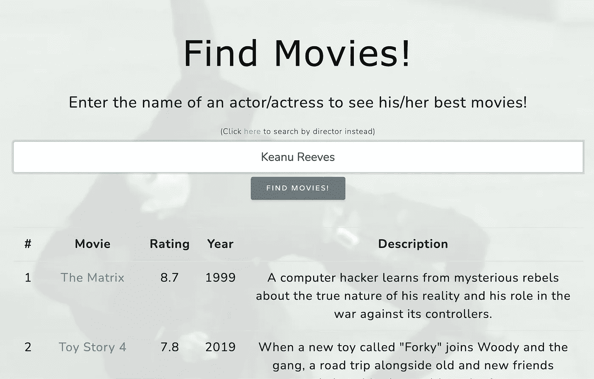
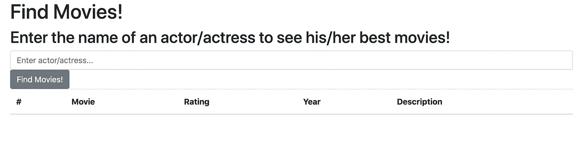
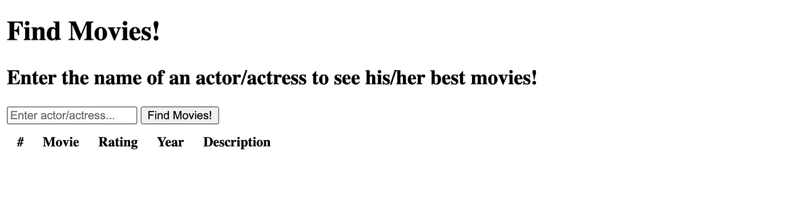
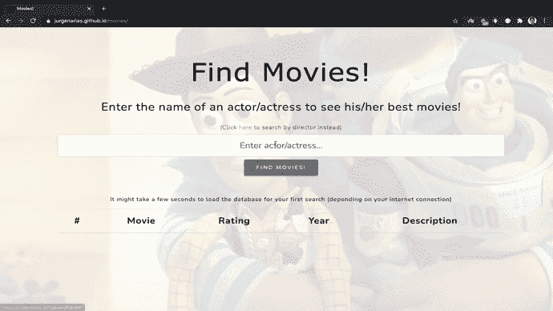

# 建立一个简单的网站，使用用户的输入从 CSV 输出结果

> 原文：<https://levelup.gitconnected.com/building-a-simple-website-that-outputs-results-from-a-csv-using-users-input-bfcb782ced45>



https://jurgenarias.github.io/movies/山谬·里维最佳电影

我在寻找一个网站，在那里我可以搜索任何演员/女演员的最佳电影，但我不能找到任何一个提供我想要的特定电影。我不得不谷歌一个男演员/女演员，然后找到他/她的电影，然后找到每部电影的评级，然后进行比较。它效率不高…所以我决定为它做一个网站。

我在 [kaggle](https://www.kaggle.com/stefanoleone992/imdb-extensive-dataset) 的 IMDB 上找到了电影数据。CSV 包含大约 85k 部电影和 175k+演职人员。CSV 包括我需要的一切，从电影的名字，演员的名字，它的 IMDB 评级等等。一个简单的通过*字符串过滤包含*和按等级排序的演员列将产生期望的输出。有趣的部分是用它做一个网站…

下面，我将介绍构建网站所需的 html 和 JavaScript。

# **HTML**

为了建立网站，我使用了 Visual Studio 代码(然而，任何软件都可以完成这项工作)。你一打*！+ tab* 将出现基本的 html 模板:

```
<!DOCTYPE html><html lang=”en”><head><meta charset=”UTF-8"><meta name=”viewport” content=”width=device-width, initial-scale=1.0"><title>Document</title></head><body></body></html>
```

第一步是添加引导链接，以改善网站的视觉效果，使其更加用户友好。这一步完全是可选的，但是如果没有它，网站看起来就像是 90 年代制作的。

为了能够使用 bootstrap，我在头部添加了以下内容:

```
<link rel=”stylesheet” href=”https://stackpath.bootstrapcdn.com/bootstrap/4.3.1/css/bootstrap.min.css" integrity=”sha384-ggOyR0iXCbMQv3Xipma34MD+dH/1fQ784/j6cY/iJTQUOhcWr7x9JvoRxT2MZw1T” crossorigin=”anonymous”>
```

…完成了！我现在可以使用 bootstrap 了。

我把 *<体>* 分成两部分:输入和输出。下面是输入部分:

```
<body><div class=”container”><div class=”row”><div class=”col-md-12"><h1 class=>Find Movies!</h1><h2 class=>Enter the name of an actor/actress to see his/her best movies!</h2><form id=”form”><input class=”form-control” id=”user-input” placeholder=”Enter actor/actress…”><button id=”button” class=”btn btn-secondary”>Find Movies!</button></form>
```

*容器*、*行*和 *col-md-12* 的前 3 个< *div >和*只是引导结构，用于在容器中对齐内容。然后我用< *h1 >* 创建了一个标题，用< *h2 >* 创建了一个副标题。

接下来是重要的部分。我使用了一个带有 id 的<*表单>* (注意 id 和类对于引用 JavaScript 文件或引导样式很重要)。在表单内部，我有一个< *输入>* ，其中包含用于引导的类、用于 JavaScript 的 id 和一个用于在网站中显示的占位符。最后，我有一个< *按钮>* ，id 为 JavaScript，类为 bootstrap，有一些文本显示在网站中。

下面是输出部分:

```
<table class="table" cellpadding="10"><thead><tr><th scope="col">#</th><th scope="col">Movie</th><th scope="col">Rating</th><th scope="col">Year</th><th scope="col">Description</th></tr></thead><tbody></div></div></div>
```

我创建了一个<*表格>* ，并添加了一些填充(让它看起来更好)。然后，我创建了< *和>* ，这是创建列标题的地方。在这一步之后，我需要为所有的标题设置一行，因此为每一列设置了*<>*和所有的*<>*。然后我关闭了 *<和>* 并启动了 *< tbody >* 这是输出将出现的地方。最后，我正在关闭来自*容器*、*行*和之前的 *col-md-12* 的 3 个 *< div >* 。

网站的骨架完成了！从这一点来看，网站应该是这样的:



与没有自举的情况相比:



这标志着网站 html 部分的结束。当然，在这个阶段，网站什么都不做。它仍然需要一个 JavaScript 文件才能变得有用。

# Java Script 语言

我使用 JavaScript 加载 CSV，获取用户输入，过滤 CSV 并显示结果。

一个*。需要 js* 文件。我把它命名为 *app.js* ，保存在 html 和 CSV 文件旁边的文件夹里。

我使用了 [D3](https://d3js.org/) ，这是一个非常有用的 JavaScript 库，用于基于数据操作文档。为了使用 D3，我需要将脚本添加到 html 的头部:

```
<script src=”https://d3js.org/d3.v5.min.js"></script>
```

一切都取决于来自 CSV 的数据，因此首先要做的是使用 D3 读取 CSV，然后应用一个函数:

```
d3.csv(“movies.csv”).then(function (data) {var movies = data;var button = d3.select(“#button”);var form = d3.select(“#form”);button.on(“click”, runEnter);form.on(“submit”, runEnter);
```

我创建了 3 个变量:引用 CSV 的 *movies* ，引用 html 中按钮的 *button* ，引用 html 中表单的 *form* 。使用 button.on("click "，runEnter)和 form.on("submit "，runEnter)，允许用户在我们的网站上按下按钮或按下回车键，javascript 将运行 runEnter 函数。

现在我们可以定义我们的 runEnter 函数，我将更详细地解释它，因为它是最重要的部分:

```
// Defining the functionfunction runEnter() { // This line of code selects the <tbody> from the html and clears it. If this is not used, then the results would appear on top of the previous result.d3.select(“tbody”).html(“”) 
// This code is needed to prevent the page from reloading.d3.event.preventDefault(); 
// This code will get the user's input from what the user will type in the html <input> since we assigned it the "user-input" id. It will get the value and store it in our inputValue variablevar inputValue = d3.select(“#user-input”).property("value"); // This code will filter the movies looking at the actors column. It will store the values when there is a match from the text sequence the user entered and the text from our actors column from the CSV data.var filteredMovies = 
movies.filter(movies => movies.actors.includes(inputValue)); // This was the easiest approach I found to sort the results by a different column in descending order. I had to include a new script in my head to use the _.sortBy 
This is the script:  
*<script type="text/javascript" src="//cdnjs.cloudflare.com/ajax/libs/lodash.js/0.10.0/lodash.min.js"></script>*var output = _.sortBy(filteredMovies, ‘avg_vote’).reverse() // Once I had all the values in my output variable, all I needed was to loop through them and add them to the table one by one. This was done using d3, where I inserted the value for each one of the columns I wanted using the necessary html to fit each table row.for (var i = 0; i < filteredMovies.length; i++) {d3.select(“tbody”).insert(“tr”).html(
“<td>” + [i+1] + ”</td>” +
”<td>” + (output[i][‘original_title’])+”</a>”+“</td>” + 
”<td>” + (output[i][‘avg_vote’])+”</td>” +
”<td>” + (output[i][‘year’])+”</td>” +
”<td>” + (output[i][‘description’])+”</td” ) }};});
```

编码部分到此为止！为了使网站正常运行，剩下的工作就是将脚本添加到网站的 html 中(我在标题上添加了这个脚本) :

```
<script src=”app.js”></script>
```

你可以使用 css 或者通过下载模板和添加你的代码来添加很多风格，让你的网站看起来像你想要的那样！

# 结果

你可以在这里 看到并使用我的最终版本 [***。***](https://jurgenarias.github.io/movies/)

