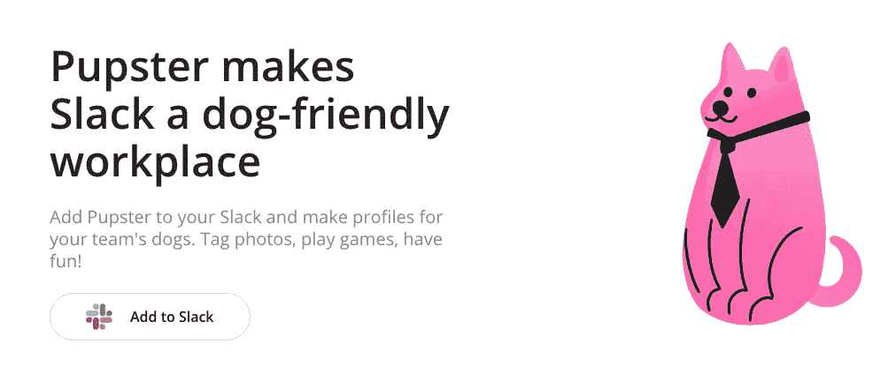

# 使用无服务器和 Go 构建松弛块套件应用程序

> 原文：<https://levelup.gitconnected.com/building-a-slack-block-kit-app-with-serverless-and-go-cd62445db177>

新员工在 Twitter 上发布全公司名单，询问我们为什么不能改变“办公室里有狗”的政策，这是一个笑话。在 Clever，我们提出了一种理论，认为高管团队中有人对持续抵制带狗上班过敏。我很乐意在 LaunchDarkly 一个对狗友好的办公室工作，但自从 2020 年 5 月我开始工作以来，我们(和我们的狗)都是 WFH。

Pupster Slack 应用程序主页

我建造了 [Pupster](https://pupster.app/) 来让远程团队很容易遇见彼此的狗。这是一个 Slack 应用程序，您可以将其添加到共享狗狗照片的频道中。您可以创建“小狗档案”来了解您团队的宠物。我的灵感来自于 Clever 基于 Tumblr 和 Hubot 构建的低代码系统，但我想对它进行技术升级:

*   [**无服务器**](https://www.serverless.com/) ，这使得在 AWS 上部署 HTTPS API 变得很容易
*   [**slack-go**](https://github.com/slack-go/slack) ，因为我一直在用 go，以前也用过这个 SDK
*   [**Slack Block Kit**](https://api.slack.com/block-kit)，我在现代 Slack 应用中见过，支持消息内 UI 控件，如按钮、选择菜单等。

在这篇文章中，我想分享用 Go 设置无服务器 Slack Block Kit 应用程序背后的有趣之处。这并没有进入[创建 Slack app](https://api.slack.com/start) 的过程，所以如果你要跟进，你会想先这么做。

我需要为我的 Slack 应用程序支持四个 API:

*   `POST /interactions`被 [Slack Block Kit 交互 API](https://api.slack.com/interactivity) 调用来构建 UI
*   `POST /events`由[松弛事件 API](https://api.slack.com/apis/connections/events-api) 调用，以响应与 Block Kit 应用程序交互之外的松弛事件
*   `GET /auth_callback`用于响应 [OAuth 2 授权码授予流程](https://api.slack.com/authentication/oauth-v2)当有人添加你的 Slack app 时
*   `POST /select`用于返回[动态外部数据选择下拉式菜单控件](https://api.slack.com/reference/block-kit/block-elements#external_multi_select)

下面的`serverless.yml`片段展示了基于 Go 二进制文件定义这些端点的有趣部分。支持不同的无服务器[阶段](https://serverless-stack.com/chapters/stages-in-serverless-framework.html) (如`dev`、`prod`)。

构建和部署逻辑存在于一个`Makefile`中:

`interactions/main.go`代码需要处理不同的用户交互:按钮点击、模态提交和快捷方式。您可以依靠 slack-go 型号来完成大部分繁重的工作。不要忘记使用松弛签名令牌来验证每个请求。

`eventhandler/main.go`代码需要处理不同的事件: [URL 验证](https://api.slack.com/events/url_verification)、“应用主页打开”、“应用提及”等。

`authcallback/main.go`代码在 OAuth 2 舞蹈中扮演自己的角色，以获得一个 API 令牌:

最后一部分是`selectmenu/main.go`代码，您只需要支持[外部选择菜单](https://api.slack.com/reference/block-kit/block-elements#external_multi_select):

这就是你开始工作所需要的全部样板文件。你可以在下面的公开报道中看到一些使用 Block Kit 和 slack-go 构建 Slack 应用的例子:

 [## bushelpowered/slackbot

### 一个 Go Slack 机器人框架。在 GitHub 上创建一个帐户，为 bushelpowered/slackbot 开发做贡献。

github.com](https://github.com/bushelpowered/slackbot)  [## Aristat/slack-bot

### 松弛机器人 Golang。在 GitHub 上创建一个帐户，为 Aristat/slack-bot 开发做贡献。

github.com](https://github.com/Aristat/slack-bot)  [## 奥吉多/戈博特

### gobot 是一个使用松弛交互消息的 bot 框架。在 gobot 中，一系列的交互被称为机器…

github.com](https://github.com/ogidow/gobot) 

你可以开始[构建 Slack Blocks](https://api.slack.com/block-kit/building) ，对事件做出响应，并最终部署到 [Slack 应用商店](https://launchdarkly.slack.com/apps)来取悦成千上万快乐的客户，或者对我来说，狗主人。玩得开心！