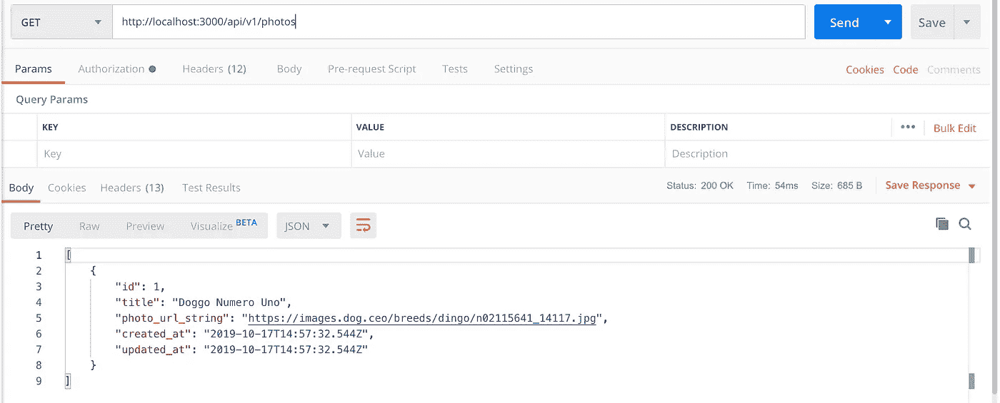
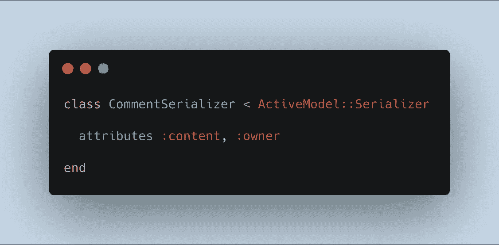

# 用序列化器构建一个小型 Rails API

> 原文：<https://levelup.gitconnected.com/building-a-small-rails-api-with-serializers-32e3e69a078>


泰勒·维克摄(Unsplash)

## 先决条件

本指南将涵盖设置 Rails API 的必要步骤。开始之前，请确保 Postgres 已在您的机器上安装并初始化。如果不是，可以在[https://postgresapp.com](https://postgresapp.com/)找到。此外，Postman 将用于测试 API 端点。从[https://www.getpostman.com/](https://www.getpostman.com/)下载并安装 postman。

# 模型

API 的目标是将照片和相关的评论一起发送回去。模型将保持简单，我们只需要 2-照片和评论。关联是一张有**多条评论**的照片，而一条评论**属于**一张照片。

```
Photo -< Comments
```

照片的属性将是`title`和`photo_url_string`。评论的属性有`content`、`owner`和`photo_id`。

# 设置

在您的终端中，使用以下命令生成 API:

```
rails new photo_api --database=postgresql --api
```

为了澄清，我们包含了标志`--database`来指示 Postgres 将被使用而不是 SQLite，以及标志`--api`来避免生成视图和视图助手，因为它们对于 API 来说不是必需的。打开并将目录更改为新生成的文件夹。

导航到 gem 文件，取消对以下内容的注释:

```
gem 'rack-cors'
```

这允许 API 中的跨来源资源共享(CORS)。CORS 阻止来自未知来源的 API 调用。有关 CORS 的更多信息，请参阅:

[](https://medium.com/@baphemot/understanding-cors-18ad6b478e2b) [## 了解 CORS

### 如果您曾经使用过 AJAX 调用，您可能对浏览器控制台中显示的以下错误很熟悉:

medium.com](https://medium.com/@baphemot/understanding-cors-18ad6b478e2b) 

仍然在 gem 文件中，添加以下 gem:

```
gem 'active_model_serializers'
```

串行器 gem 用于在发出请求时构造数据的格式。稍后将通过使用 Postman 来解释这个想法。

接下来，导航到`config/initializers/cors.rb` 并取消注释以下代码:


克-奥二氏分级量表

在 **allow** 块中， **origins '*'** 允许来自所有来源的请求，并允许对 API 的 GET、POST、PATCH 和 DELETE 请求。

设置的最后一步是捆绑。为了安全起见，如果存在 Gemfile.lock，请删除该文件并运行:

```
bundle install
```

# 生成模型和控制器

通过运行以下命令创建照片和评论模型:

```
rails g model Photo title:string photo_url_string:stringrails g model Comment content:string owner:string photo_id:integer
```

导航到`app/models/photo.rb`并添加带有注释的关联以及一个验证，以确保照片有标题:


照片模型

在`app/models/comment.rb` *中，增加:*


评论模型

接下来，通过运行以下命令创建照片和评论控制器:

```
rails g controller api/v1/Photosrails g controller api/v1/Comments
```

该命令将在控制器下生成嵌套路径。此外，控制器的命名空间为`Api::V1::PhotosController`。因为这是 API 的第一个版本，控制器应该在`api/v1`里面。如果其他人也在使用这个 API，控制器和路由的更新可能会破坏他们的项目。任何更新都应该有自己的 API 版本。

在`app/controllers/api/v1/photos_controller.rb`中，添加以下方法:


照片控制器

在上述方法中发生了一些事情:

1.  所有照片都以 JSON 的形式渲染。
2.  `check_params`代表从前端接收的数据。
3.  无论何时发出补丁请求，check_params 方法都允许使用键 title 和`photo_url_string`。

同样在`app/controllers/api/v1/comments_controller.rb`中，添加以下方法，


注释控制器

接下来，导航到`config/routes.rb`并添加以下对应于命名空间控制器的路线:


照片路线

对于评论，路线将嵌套在照片中，因为评论属于照片。在`routes.rb`中，包括以下评论路线:


照片和评论路线

模型、控制器和路线都设置好了，可以开始了。现在运行以下命令:

```
rails db:create && rails db:migrate
```

**重要提示**:对数据库使用 Postgres 时，迁移前必须运行`rails db:create`。

还有一点，确保数据确实存在，以便在发出请求时返回响应。导航到`db/seeds.rb` 并输入一些种子数据。


种子数据

有一个照片对象和与之相关的四个评论对象。最后，跑步，

```
rails db:seed
```

既然已经设置了 Rails API，那么就该用 rails s 运行服务器并使用 Postman 测试端点了。

# 通过邮递员获得请求

通过我们的 api 可以访问的路线可以通过输入以下内容在浏览器中查看:

```
[http://localhost:3000/rails/info/routes](http://localhost:3000/rails/info/routes)
```

这是可用路线的图像，


API 路线

打开 Postman 并测试路径。从获取所有照片的请求开始。在 Postman 中，HTTP 动词是 GET，URL 请求是 to，

```
http://localhost:3000/api/v1/photos
```

单击 send 后，会向 API 发出一个状态代码为 200 的请求，API 的响应在主体中。为了更好地查看返回的数据，请确保选择了 JSON 和 Pretty 选项。从响应中，返回了一个数组，其中包含一个作为种子的照片对象。



获取照片请求

因为只有一个照片对象，所以用对 url 的 GET 请求来访问这一张照片，

```
http://localhost:3000/api/v1/photos/1
```

API 控制器读取所提供的 ID 参数，特别是 1，并返回与之相关的照片。


照片对象

仔细检查返回的对象，有东西不见了。在种子数据中，生成了属于这张照片的四条评论，但是它们没有出现在响应中。此外，`created_at`和`updated_at`属性可能不是必需的。有一个处理返回数据的解决方案，序列化器。

回到 Rails API，停止服务器并运行下面的代码，

```
rails g serializer photo
```

这将为照片模型生成一个序列化程序目录。导航到`serializers/photo_serializer.rb`。在这个文件中，可以指定响应中可用的属性。如上所述，`created_at`和`updated_at`属性不需要包含在响应 JSON 中。在该文件中，添加以下宏，

```
class PhotoSerializer < ActiveModel::Serializer attributes :title, :photo_url_stringend
```

添加这些内容后，用 Postman 发出另一个请求，并观察响应中的变化。


序列化程序更改后的响应

JSON 响应中只发送`title`和`photo_url_string`。使用序列化程序，可以将响应结构化为包含某些信息。缺少注释的问题仍然存在。知道数据可以用序列化程序操作，注释就可以包含在内了。`serializers/photo_serializer.rb`内还包括以下*、*:


照片串行器

再次请求:

```
http://localhost:3000/api/v1/photos/1
```

现在 JSON 响应包括了与之相关的注释！


JSON 回应，包括评论

然而，同样有一些信息是不必要的。让我们为注释生成一个序列化程序，并选择要发回的属性。停止 rails 服务器并运行，

```
rails g serializer comment
```

导航至`serializers/comment_serializer.rb`，选择哪些属性是必需的。



注释序列化程序

最后，再发出一个 GET 请求，并研究 JSON 响应。


JSON 响应已简化，带有注释

数据现在被结构化为包括与照片相关联的评论以及显示特定属性。

# 通过邮递员发布/修补请求

## 发表评论

从可用的路由中，可以发出 POST 请求以在该路径上创建新的评论，

```
http://localhost:3000/api/v1/photos/1/comments
```

在 postman 中，设置发布请求。将选项卡切换到“body”，选择“raw”，并从“Text”更改为“JSON”。在主体内，设置一个带有键、“内容”和“所有者”的对象。确保键由逗号分隔，并为这些键赋值。


邮递员邮件正文对象

赋值后，发送请求。该响应应该包括一个状态代码 200 和相同的对象信息。这表示一个 OK 序列，意味着在 api 中成功地创建了注释。


成功创建评论

## 修补照片

可以发出补丁请求来更新路径上现有照片的信息，

```
http://localhost:3000/api/v1/photos/1
```

在 postman 中，将发出补丁请求。与上面的 POST 请求设置类似，唯一的更改是对对象进行的。只会更改照片的标题值。


邮递员补丁体对象

将响应发送给 API。同样，应该包含状态代码 200，表示操作成功，标题字段已更改。JSON 的响应将反映这些变化。


成功更新照片标题

验证被分配给需要标题字段的照片模型。如果发送给 API 的补丁请求没有空的标题字段，会发生什么？


错误响应

同样，包含状态代码 200，但带有错误响应，在这种情况下，标题不能为空。这是正常的，因为在照片更新控制器中定义了如果照片更新无效，错误消息将作为 JSON 被发送回来。

# 用邮递员删除请求

仅为此路线定义了选择路线。如果向照片实例路由发送删除请求会怎样？


对/photos/1 的删除请求的响应

现在返回状态代码 404，表示未找到该路由。路径本身不可用，任何使用 API 的人都无法访问。其他未定义的路由(如创建新照片)将导致 404 状态代码。

讨论了 rails API 的基本结构。请随意添加更多路线，以便与 Postman 一起练习和测试。顺便提一下，active_model_serializer 是定制 JSON 数据的一种方法。本指南介绍了创建 Rails API 的许多方法之一。感谢您的阅读。请参考我的 GitHub 库来获取本指南:

 [## reirey noso/rails _ simple _ API _ serializer

### 通过在 GitHub 上创建一个帐户，为 reirey noso/rails _ simple _ API _ serializer 开发做出贡献。

github.com](https://github.com/reireynoso/rails_simple_api_serializer)