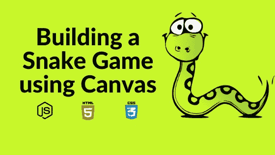
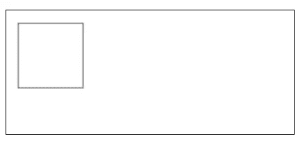
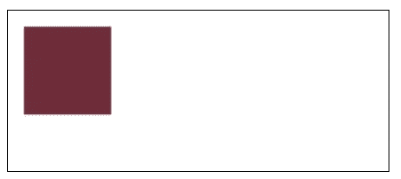
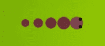
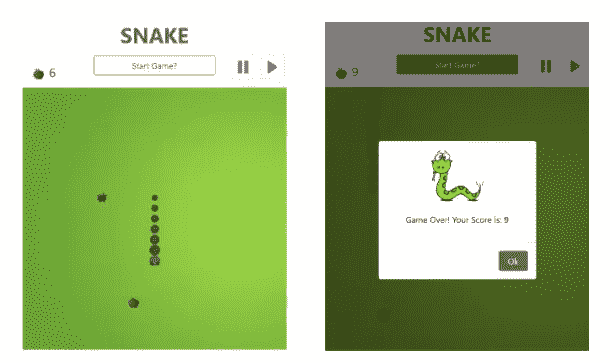
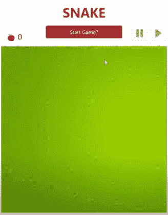

# 使用画布构建一个贪吃蛇游戏

> 原文：<https://levelup.gitconnected.com/building-a-snake-game-using-canvas-260a738edcec>



使用画布构建一个贪吃蛇游戏

HTML“canvas”元素是 HTML5 中添加的新元素之一。它是一个固定大小的容器，允许您使用 JavaScript 在其中绘制图形。 ***Canvas 有几种绘制路径、框、圆、文本、添加图像的方法。*** 还可以制作互动动画和游戏。

***< canvas >*** 元素是 HTML 代码中定义的可绘制区域，其高度和宽度属性如下:

```
<canvas id=”firstCanvas” width=”500" height=”500"></canvas>
```

这里的***【id】***很重要，因为它用于使用文档对象模型(DOM) 在 JavaScript ***中定位该元素，如下所示:***

```
var canvas = document.getElementById(“firstCanvas”);
```

在 JavaScript 中，绘图方法不是在 canvas 元素上调用，而是在通过调用 ***获得的绘图上下文上调用。getContext('2d')*** 如下:

```
var context = canvas.getContext(“2d”);
```

该方法识别目标 canvas 元素的上下文，这意味着用户可以访问 canvas drawing API，该 API 提供了在 canvas 上进行绘制的方法和属性。例如，如果我们想在画布上画一个矩形，我们可以使用***context . rect()***方法如下:

```
context.rect(20, 20, 100, 100);
```

该方法取四个参数:矩形左上角的 x 和 y 坐标以及矩形的宽度和高度: ***rect(x，y，width，height)*** 。需要调用方法***context . stroke()***在画布上显示形状。它看起来会像这样:



使用画布创建的矩形

类似地，可以使用 ***绘制填充矩形。接受相同参数的 fillRect()*** 方法。在调用 ***之前，可以使用***context . fill style***方法定义填充颜色。*fill rect**方法:

```
context.fillStyle= "#6c2c3a";context.fillRect(20, 20, 100, 100);
```

下图显示了由上述代码行创建的矩形:



要画一个圆，可以使用方法***context . arc()***来获取圆心坐标、圆的半径以及以弧度表示的开始和结束角度，在圆的情况下是 0 到 2*Math。圆周率(360 弧度)。也可以通过使用 ***lineTo()*** 方法为每条边绘制一条线来绘制其他形状，如三角形。除了形状，我们还可以绘制文本、插入图像和添加变换，如***【scale】、rotate()、translate()*** 等。

制作交互式动画也很容易(对鼠标点击、键盘按键、按钮点击、触摸屏上的手指移动等做出反应的动画)。例如，下面的贪吃蛇游戏是基于点击按钮和按箭头键(用于改变蛇的方向)。

构建基本贪吃蛇游戏的步骤:

## **制作画布**

第一步是制作一个 ***<画布>*** 元素并设置其尺寸。绘图表面的背景，即 ***< canvas >*** 元素，可以使用 CSS 或 JavaScript 方法设置。

## **设置移动**

在这一步中，画布被设置为在游戏中进行移动。为此，我们在显示元素(蛇、水果等)的下一个位置之前清空画布区域，更新它们的坐标，然后再次显示它们，这个过程一直重复到游戏结束。通过使用 JavaScript 方法 window.setInterval( *函数*，*毫秒*)来实现。该方法在每个指定的时间间隔重复一个给定的函数。时间以毫秒为单位。

在这个游戏中，***window . setinterval***中定义的函数基本上做了三件事。首先，它在某个位置绘制水果。其次，更新蛇的位置并显示出来。然后它检查蛇是否吃了水果，并根据它更新水果位置和分数。

```
function main() {//update state of game and display changes after specified intervalinterval = window.setInterval(() => {context.clearRect(0, 0, 500, 500);drawFruit();moveSnakeForward();drawSnake();//check if snake eats the fruit - increase size of its tailand find new fruit positionif (snakeHeadX === fruitX && snakeHeadY === fruitY) {totalTail++;fruitPosition();}}, 200);}
```

## **创造画蛇的方法**

这是通过创建两个函数来实现的，***draw snakehead()***和***draw snakebody()***。使用蛇身体每个部分的 x 和 y 坐标来绘制蛇，其中 x 和 y 表示该部分的左上角。

在方法***draw snakehead()***中，变量***snakeheax***和***snakeheay***分别存储蛇头的 x 和 y 值。这里使用 context.arc 方法为头部绘制一个圆。选择适当的坐标，蛇的眼睛也可以类似的画出来。变量“scale”存储了蛇身体每一部分的像素数。

```
function drawSnakeHead(color) {context.beginPath();context.arc(snakeHeadX+scale/2, snakeHeadY+scale/2, scale/2,0, 2 * Math.PI);context.fillStyle = color;context.fill();}
```

***数组 tail[]*** 存储尾部各部分的坐标。函数***drawswangebody()***包含一个循环，使用“tail”数组迭代绘制尾部的每个部分。在这里，变量“tailRadius”只是用来从后向前增加蛇尾的大小。所以，如果尾巴长度是 4，这条蛇看起来像这样:



使用画布创建的蛇身

```
function drawSnakeTail() {let tailRadius = scale/4;for (i = 0; i < tail.length; i++) {tailRadius=tailRadius+((scale/2-scale/4)/tail.length);context.beginPath();context.fillStyle = "#6c2c3a";context.arc((tail[i].tailX+scale/2), (tail[i].tailY+scale/2), tailRadius, 0, 2 * Math.PI);context.fill();}}
```

然后在***window . setinterval()***函数中执行的 ***drawSnake()*** 方法中调用上述两个函数。

函数***moveSnakeForward()***将蛇尾和蛇头的坐标移动到下一个位置。变量 ***xSpeed*** 和 ***ySpeed*** 代表特定方向的运动，即如果蛇水平运动， ***xSpeed*** 将等于“scale”(向右为正，向左为负) ***ySpeed*** 将为零，反之亦然。因此，蛇头的新值是使用这些变量赋值的。

```
function moveSnakeForward() {tail0=tail[0];for (let i = 0; i < tail.length - 1; i++) {tail[i] = tail[i + 1];}tail[totalTail - 1] = { tailX: snakeHeadX, tailY: snakeHeadY };snakeHeadX += xSpeed;snakeHeadY += ySpeed;}
```

## **根据方向移动蛇**

创建了一个方法，根据玩家按下的键来改变蛇头的方向。函数***change direction()***使用一个开关盒，并获取使用“keydown”事件按下的箭头键的详细信息，以更改方向。例如，如果按下向上箭头键:

```
switch (directionVar) {case "Up"://move "up" only when previous direction is not "down"if (previousDir !== "Down") {direction=directionVar;xSpeed = 0;ySpeed = scale * -1;}Break;//similar cases for other directions}
```

变量 ***directionVar*** 包含玩家按下的键的细节。前一个方向存储在变量 ***previousDir*** 中。随着蛇向上移动(垂直方向)， ***xSpeed*** 转到 0(无水平移动)，y speed***转到负。通过为 ***xSpeed*** 和 ***ySpeed*** 选择适当的值，可以为其他方向定义类似的情况。***

## **创造果实**

方法***generate coordinates()***在画布的高度和宽度范围内生成随机的 x 和 y 值，可用于水果的位置。使用 ***fillRect()*** 方法可以在这个位置制作一个正方形。或者，可以使用 ***drawImage()*** 内部方法在此位置插入水果的图像。

## **检查碰撞**

在每一个间隔，都需要检查蛇是与曲面的边界发生了碰撞，还是与它的尾巴本身发生了碰撞(如下面的代码所示)。

```
//check snake's collisionfunction checkCollision() {let tailCollision=false, boundaryCollision=false;//with its own tailfor (let i = 0; i < tail.length; i++) {if (snakeHeadX == tail[i].tailX && snakeHeadY == tail[i].tailY) {tailCollision=true;}}//with boundariesif(snakeHeadX >= canvas.width || snakeHeadX < 0 || snakeHeadY >= canvas.height || snakeHeadY < 0){boundaryCollision=true;}return (tailCollision || boundaryCollision);}
```

上述方法在函数 ***drawSnake()*** 中调用如下:

```
//display snakefunction drawSnake() {drawSnakeHead("#7d4350");drawSnakeTail();if (checkCollision()) {clearInterval(gameInterval);setTimeout(()=>{scoreModal.textContent = totalTail;$('#alertModal').modal('show');modalBtn.addEventListener("click", ()=>{context.clearRect(0, 0, 500, 500);score.innerText = 0; }); }, 1000); }}
```

如果发生碰撞，将向玩家显示一条消息，其中包含文本“游戏结束”以及最终得分。这里，自举模型用于此目的。文本的 ***< span >*** 元素(在模态体中)id 为***‘score modal’***被设置为最终得分如下:

```
scoreModal.textContent = totalTail;
```

然后使用 jQuery 在屏幕上显示这个模态。方法***clearInterval()***停止更新画布(蛇、水果等的位置)的已定义间隔。

这篇文章回顾了创建一个基本的贪吃蛇游戏的方法。



为了增加游戏的难度，蛇的关卡也可以用类似的方法设置。通过使用***clearInterval()***暂停游戏并再次调用 ***main()*** 方法在交替按空格键时恢复游戏，也可以在按空格键时添加暂停和恢复游戏等功能。

完整代码请前往[***GitHub***](https://github.com/dev-catalyst/snake-game)***。***



在这里，病毒在特定的时间间隔后被抽取到随机的位置。当蛇吃掉它时，游戏结束。创建您自己的游戏并享受。🤗

通过[***insta gram***](https://www.instagram.com/ctsolutions.sh/)*[***推特***](https://twitter.com/catalyst_sh)*[***LinkedIn***](https://www.linkedin.com/company/13707239/admin/)联系我们**

**或者给我们发电子邮件✉️在 **admin@catalyst.sh.****

**点击查看我们的其他博客[。](https://medium.com/@alka.jha_87549)**

**[](https://medium.com/@alka.jha_87549/the-importance-of-email-design-e2daddffeca9) [## 电子邮件设计的重要性

### 好的邮件设计能吸引读者的眼球，并诱使他们在打开邮件后继续阅读。

medium.com](https://medium.com/@alka.jha_87549/the-importance-of-email-design-e2daddffeca9) [](https://medium.com/@alka.jha_87549/how-to-make-your-website-seo-friendly-b3bb7db44c87) [## 如何让你的网站 SEO 友好？

### 搜索引擎优化是在谷歌搜索结果上提高网站索引的方法。在制作过程中…

medium.com](https://medium.com/@alka.jha_87549/how-to-make-your-website-seo-friendly-b3bb7db44c87)**