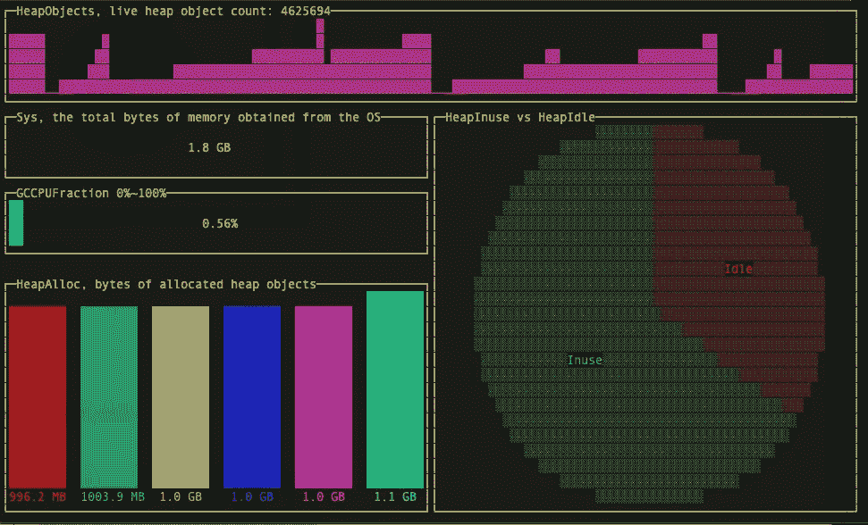
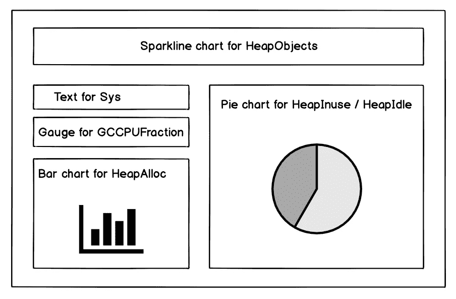

# 用 300 行代码在 Golang 中构建一个终端仪表板

> 原文：<https://levelup.gitconnected.com/building-a-terminal-dashboard-in-golang-in-300-lines-of-code-3b9f83f363a8>



我喜欢 CLI 应用程序。它们是轻量级的、无依赖性的，并且消耗更少的资源。然而，从头开始为终端构建应用程序远非易事。

幸运的是，我们总是可以用工具或库来简化任务。在本教程中，我将向您展示如何利用一个强大的终端库 [**termui**](https://github.com/gizak/termui) ，用不到 300 行的 Golang 源代码构建一个基于终端的仪表板。

# 背景

我们有一个每天服务数百万用户的 web 应用程序。我们希望监控这个应用程序的实时内存消耗(和 GC)。

你可能会想到一些像[Prometheus](https://prometheus.io/)+[Grafana](https://grafana.com/)这样的监控系统和可观测性平台，但是对于这种情况来说有点大材小用了。

所以我决定在 Golang 建一个简单的。

# 它是如何工作的

Golang 内置了对内存统计的支持:[运行时。MemStats](https://pkg.go.dev/runtime?tab=doc#MemStats) 。

这个对象可以通过 HTTP 在`/debug/vars`以 JSON 格式公开。

我们所需要做的就是在我们的 HTTP 服务器中的`import _ “expvar”`(更多细节请参考 expvar 的[官方文档)。](https://pkg.go.dev/expvar?tab=doc)

下面是我想监控的`runtime.MemStats`的字段:

> **HeapObjects** ，是分配的堆对象的数量。
> 
> **Sys** ，是从操作系统获得的内存总字节数。
> 
> **GCCPUFraction** ，是程序启动以来 GC 使用的该程序可用 CPU 时间的一部分。
> 
> **HeapAlloc** ，是分配的堆对象的字节数。
> 
> **HeapInuse / HeapIdle** ，是使用中/空闲区间的字节数。
> 
> —摘自[golang 官方文件](https://pkg.go.dev/runtime?tab=doc#MemStats)

我的计划是从 web 应用程序获取统计数据，并在终端仪表板中可视化它们。

UX 的设计非常直观，每个领域都以恰当的方式呈现:



仪表板模型

# 履行

## 数据加载器

首先，我们需要定义一个加载统计数据的接口:

```
// MemStatsLoader is the interface to load memory statistics data
type **MemStatsLoader** interface {
   Load() (*runtime.MemStats, error)
}
```

然后实现这个接口，从目标服务器加载 JSON 数据并解析成一个`runtime.MemStats`对象。

通过`MemStatsLoader`的抽象，我们保持了添加更多数据源的能力。例如，我们可以添加一个新的实现，从 JSON 文件中读取统计数据。

## 用户界面

接下来，让我们定义一个`Controller`接口，概念控制器是从 [MVC](https://en.wikipedia.org/wiki/Model%E2%80%93view%E2%80%93controller) 模式借用来的。它的职责是协调数据和视图协同工作，确保视图在数据改变后得到更新。

```
type **Controller** interface {
   Render(*runtime.MemStats)
   Resize()
}
```

方法`Render`接受统计对象作为参数，然后更新窗口小部件，方法`Resize`在终端窗口调整大小时被调用，确保所有窗口小部件的布局是正确的。

然后我们实现接口。下面是类定义:

类`controller`包含来自 **termui** 的几个 UI 组件和保存最新数据系列的数据容器:

*   `Grid`是一个小部件容器，它呈现其中的所有小部件，并负责 UI 布局
*   HeapObjectsData 和 HeapAllocBarChartData 是存储统计数据系列的辅助类，因为有些小部件需要历史数据。
*   其他字段是 termui 小部件，用于可视化不同的指标。

创建`controller`的实例很容易:

注意方法`initUI` **，**它初始化小部件并把它们放到网格布局中:

在这个方法中，我们给小部件添加固定标题，调整它们的颜色和填充，然后按照我们的 UX 设计初始化网格布局，将小部件放入网格单元。

接下来，这个类最重要的方法`Render`:

我们从`data *runtime.MemStat`获取数据字段，如果有必要的话转换它们，然后将值分配给 UI 小部件。

在赋值过程之后，我们调用`ui.Render`来更新终端 UI。

## UI 主循环

函数`Run`负责初始化 UI 库，启动主循环，监听事件，触发每秒钟用新的统计数据更新 UI:

## 将所有代码放在一起

在`**main.go**`中，我们简单地解析 URL 参数，构建`pkg.MemStatsLoader`实例，并启动 UI 主循环:

## 跑起来

到现在为止，所有的工作都完成了。让我们开始吧:

```
go run main.go -url=http://xx_host/debug/vars
```

您将看到一个实时仪表板，就像下面的快照一样，每秒都在刷新。


它将随着终端窗口的调整而调整大小(目前只有高度)。按任意键将退出应用程序。

# 结论

有时，您可能需要构建一个简单的 GUI 应用程序，而没有严重的依赖性。

终端往往是一个不错的选择。如上所示，在 **termui** 的帮助下，我们可以毫不费力地构建一个仪表板。我们只需要**不到 300 行**的代码就可以创建一个实时的仪表盘，这太不可思议了。

**练习:**添加对来自 JSON 文件的统计数据的支持，而不涉及任何与 UI 相关的代码。

关注我，喜欢这篇文章就留言回复。

## 资源:

*   为了清楚起见，我没有把所有的代码都放到本教程中。如果你需要完整版本的代码，请查看 [GitHub 库](https://github.com/dche423/temi)。