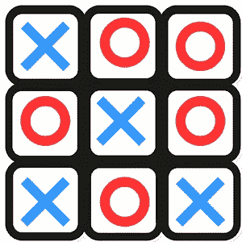
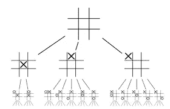
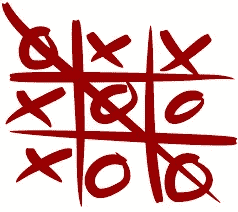
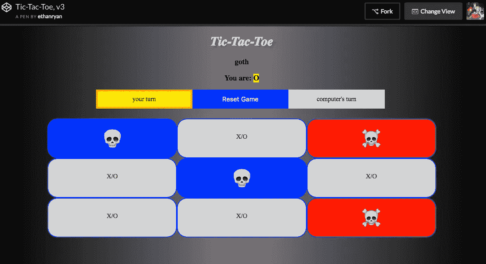

# 用 JavaScript 构建井字游戏应用程序

> 原文：<https://levelup.gitconnected.com/building-a-tic-tac-toe-game-app-with-javascript-5916e58071fb>



tic_tac_toe.png

我一直在研究 var blueWin2 = $("#four.blue, #five.blue, #six.blue").length === 3
var blueWin3 = $("#seven.blue, #eight.blue, #nine.blue").length === 3
var blueWin4 = $("#one.blue, #four.blue, #seven.blue").length === 3
var blueWin5 = $("#two.blue, #five.blue, #eight.blue").length === 3
var blueWin6 = $("#three.blue, #six.blue, #nine.blue").length === 3
var blueWin7 = $("#one.blue, #five.blue, #nine.blue").length === 3
var blueWin8 = $("#seven.blue, #five.blue, #three.blue").length === 3var redWin1 = $("#one.red, #two.red, #three.red").length === 3
var redWin2 = $("#four.red, #five.red, #six.red").length === 3
var redWin3 = $("#seven.red, #eight.red, #nine.red").length === 3
var redWin4 = $("#one.red, #four.red, #seven.red").length === 3
var redWin5 = $("#two.red, #five.red, #eight.red").length === 3
var redWin6 = $("#three.red, #six.red, #nine.red").length === 3
var redWin7 = $("#one.red, #five.red, #nine.red").length === 3
var redWin8 = $("#seven.red, #five.red, #three.red").length === 3//var winningCombos = [x]
//refactor below too... not DRY at all!!!
//note: playerOne is always blue
var blueWins = (blueWin1 || blueWin2 || blueWin3 || blueWin4 || blueWin5 || blueWin6 || blueWin7 || blueWin8)var redWins = (redWin1 || redWin2 || redWin3 || redWin4 || redWin5 || redWin6 || redWin7 || redWin8)var redCount = getRedCount()
//console.log('redCount is: ', redCount)
var blueCount = getBlueCount()
//console.log('blueCount is: ', blueCount)
var fullGrid = redCount + blueCount
console.log('fullGrid is: ', fullGrid)var draw = (fullGrid === 9) && (!blueWins) && (!redWins)if (blueWins) { //playerOne is always blue
winner = blueWins
console.log(`${playerOne} wins!`)
$("#gameResult, #congratsOrSorry").removeClass("displayNone")
$("#gameResult").html(`<span class='yellowBig'>${playerOne} wins!</span>`)
$("#congratsOrSorry").html("<span class='yellow'>Congratulations! You won!</span>")
$("#gameInfo").addClass("displayNone")
disableRemainingItems()
return winner
}
if (redWins) { //red is computer
winner = redWins
console.log(`${computer} wins!`)
$("#gameResult, #congratsOrSorry").removeClass("displayNone")
$("#gameResult").html(`<span class='redBig'>${computer} wins!</span>`)
$("#congratsOrSorry").html("<span class='red'>Sorry, you lost.</span>")
$("#gameInfo").addClass("displayNone")
disableRemainingItems()
return winner
}
if (draw) {
winner = draw
console.log('Draw game!')
$("#gameResult, #congratsOrSorry").removeClass("displayNone")
$("#gameResult").html(`<span class='redBig'>Game is a draw.</span>`)
$("#congratsOrSorry").html("<span>Game ended in a draw.</span>")
$("#gameInfo").addClass("displayNone")
disableRemainingItems()
return winner
} else {
console.log('game on...')
}
}

恶心！对于一个函数来说太长了。我可以做得更好。

# 第二步:做得更好

是时候重构了。



井字游戏金字塔计划

为了重构，我仔细检查了我的代码，寻找重复多次的代码行。这些情况为创建较小的助手函数提供了机会，然后可以从其他函数调用这些函数。

> 我想这是我可以抛出一些大词的地方，比如封装、多态和面向对象编程，但我不确定。也许这只是函数式编程的一个例子。

例如，在上面那个大的`checkForWinner`函数中，如果蓝色赢了(人类玩家之一是蓝色)，或者如果红色赢了(计算机是红色)，或者如果游戏以平局结束，我也在做类似的事情。

因此，我删除了那些重复的代码行，并为 checkForWinner 构建了新的函数来调用:`playerOneWins`、`computerWins`和`drawGame`。

然后，我从那些函数的*中删除了重复的代码，并创建了*另一个*辅助函数`winLoseOrDraw`，供这些辅助函数中的每一个调用。*

产生的新函数如下所示:

```
function playerOneWins() {
 var playerOne = getPlayerOne()
 console.log(`${playerOne} wins!`)
  $("#gameResult").html(`<span class='yellowBig'>${playerOne} wins!</span>`)
  $("#congratsOrSorry").html("<span class='yellow'>Congratulations! You won!</span>")
  winLoseOrDraw()
}function computerWins() {
 var computer = getComputer()
  console.log(`${computer} wins!`)
  $("#gameResult").html(`<span class='redBig'>${computer} wins!</span>`)
  $("#congratsOrSorry").html("<span class='red'>Sorry, you lost.</span>")
  winLoseOrDraw()
}function drawGame() {
  console.log('Draw game!')
  $("#gameResult").html(`<span class='redBig'>Game is a draw.</span>`)
  $("#congratsOrSorry").html("<span>Game ended in a draw.</span>")
  winLoseOrDraw()
}function winLoseOrDraw() {
 $("#gameResult, #congratsOrSorry").removeClass("displayNone")
  $("#gameInfo").addClass("displayNone")
  disableRemainingItems()
}
```

但是等等，还有呢！这只是我做的一些重构的一个例子。

我真的不喜欢我为红蓝写的 8 个获奖组合:

```
var blueWin1 = $("#one.blue, #two.blue, #three.blue").length === 3
var blueWin2 = $("#four.blue, #five.blue, #six.blue").length === 3
var blueWin3 = $("#seven.blue, #eight.blue, #nine.blue").length === 3
var blueWin4 = $("#one.blue, #four.blue, #seven.blue").length === 3
var blueWin5 = $("#two.blue, #five.blue, #eight.blue").length === 3
var blueWin6 = $("#three.blue, #six.blue, #nine.blue").length === 3
var blueWin7 = $("#one.blue, #five.blue, #nine.blue").length === 3
var blueWin8 = $("#seven.blue, #five.blue, #three.blue").length === 3var redWin1 = $("#one.red, #two.red, #three.red").length === 3
var redWin2 = $("#four.red, #five.red, #six.red").length === 3
var redWin3 = $("#seven.red, #eight.red, #nine.red").length === 3
var redWin4 = $("#one.red, #four.red, #seven.red").length === 3
var redWin5 = $("#two.red, #five.red, #eight.red").length === 3
var redWin6 = $("#three.red, #six.red, #nine.red").length === 3
var redWin7 = $("#one.red, #five.red, #nine.red").length === 3
var redWin8 = $("#seven.red, #five.red, #three.red").length === 3var blueWins = (blueWin1 || blueWin2 || blueWin3 || blueWin4 || blueWin5 || blueWin6 || blueWin7 || blueWin8)var redWins = (redWin1 || redWin2 || redWin3 || redWin4 || redWin5 || redWin6 || redWin7 || redWin8)
```

那段代码很难看，而且超级重复——是 DRY 的反义词。它完成了工作，但是现在是时候重构，抽象它，使它变得更好。

有很多方法可以做到这一点，但我选择的方法是用几个 map 函数来创建两个数组，一个`blueWinArray`和一个`redWinArray`。这两个都映射到我的抽象的`eightWinningCombos`字符串数组，用“红色”或“蓝色”替换“颜色”,然后检查任一数组是否以及何时从包含八个错误条件变为真条件，当这些数组中的一个确实包含一个获胜组合时。

```
function checkForWinner() {
  console.log("checking for winner...")
  var winner
  var playerOne = getPlayerOne() //playerOne is always blue
  var computer = getComputer() //computer is always red var eightWinningCombos = [
    "#one.COLOR, #two.COLOR, #three.COLOR",
    "#four.COLOR, #five.COLOR, #six.COLOR",
    "#seven.COLOR, #eight.COLOR, #nine.COLOR",
    "#one.COLOR, #four.COLOR, #seven.COLOR",
    "#two.COLOR, #five.COLOR, #eight.COLOR",
    "#three.COLOR, #six.COLOR, #nine.COLOR",
    "#one.COLOR, #five.COLOR, #nine.COLOR",
    "#seven.COLOR, #five.COLOR, #three.COLOR"
  ] var blueWinArray = eightWinningCombos.map(function(combo) {
    var eachCombo = combo.replace(/COLOR/g, "blue")
    return eachCombo = $(eachCombo).length === 3
  })

  var redWinArray = eightWinningCombos.map(function(combo) {
    var eachCombo = combo.replace(/COLOR/g, "red")
    return eachCombo = $(eachCombo).length === 3
  }) var blueWins = blueWinArray.includes(true)
  var redWins = redWinArray.includes(true) var redCount = getRedCount()
  var blueCount = getBlueCount()
  var fullGrid = redCount + blueCount
  var draw = (fullGrid === 9) && (!blueWins) && (!redWins) if (blueWins) { //playerOne is always blue
    playerOneWins()
    return winner = blueWins
  }
  if (redWins) { //red is computer
    computerWins()
    return winner = redWins
  }
  if (draw) {
    drawGame()
    return winner = draw
  } else {
    console.log('game on...')
  }
}
```

当然，这个函数还可以进一步重构，但是就我的目的而言，我很高兴它已经被抽象了一些，现在变得更简洁了。

啊，管它呢，让我们更抽象一点。

我可以将其中两个函数分解成两个辅助函数:

```
function getBlueWinArray(array) {
  return array.map(function(combo) {
    var eachCombo = combo.replace(/COLOR/g, "blue")
    return eachCombo = $(eachCombo).length === 3
  })
}function getRedWinArray(array) {
  return array.map(function(combo) {
    var eachCombo = combo.replace(/COLOR/g, "red")
    return eachCombo = $(eachCombo).length === 3
  })
}
```

我可以将这两个函数重构为一个函数，它将一个字符串作为单独的参数:

```
function getWinningArray(array, string) {
  return array.map(function(combo) {
    var eachCombo = combo.replace(/COLOR/g, string)
    return eachCombo = $(eachCombo).length === 3
  })
}
```

现在我的`checkForWinner`函数是这样的:

```
function checkForWinner() {
  console.log("checking for winner...")
  var winner var eightWinningCombos = [
    "#one.COLOR, #two.COLOR, #three.COLOR",
    "#four.COLOR, #five.COLOR, #six.COLOR",
    "#seven.COLOR, #eight.COLOR, #nine.COLOR",
    "#one.COLOR, #four.COLOR, #seven.COLOR",
    "#two.COLOR, #five.COLOR, #eight.COLOR",
    "#three.COLOR, #six.COLOR, #nine.COLOR",
    "#one.COLOR, #five.COLOR, #nine.COLOR",
    "#seven.COLOR, #five.COLOR, #three.COLOR"
  ] var blueWinArray = getWinningArray(eightWinningCombos, "blue")
  var redWinArray = getWinningArray(eightWinningCombos, "red")
  var blueWins = blueWinArray.includes(true)
  var redWins = redWinArray.includes(true)
  var fullGrid = getRedCount() + getBlueCount()
  var draw = (fullGrid === 9) && (!blueWins) && (!redWins)

  if (blueWins) {
    playerOneWins()
    return winner = blueWins
  }
  if (redWins) {
    computerWins()
    return winner = redWins
  }
  if (draw) {
    drawGame()
    return winner = draw
  } else {
    console.log('game on...')
  }
}
```

还是长功能，不过现在干净多了。除了那个大的`eightWinningCombos`数组，函数大部分是调用其他函数的变量，然后是一些`if`语句。简洁多了。

我的应用程序现在有 18 个 JavaScript 函数，大约 210 行代码。

下面是[井字游戏 v2](https://codepen.io/ethanryan/full/jYmVzN/) 的最终版本:

井字游戏，v2



Xs 和 Os

# 第三步:让它变酷

最后，现在我已经有了一个可以工作的应用程序，我对它进行了一点重构，使它更加易读和简洁。我想考虑用户体验，以及我如何改进游戏，使它在视觉上更有趣。

颜色有很长的路要走，所以首先我会给我的游戏添加一些颜色，让它更有趣。

接下来，我给玩家一个选项，让他们在三种不同的游戏风格中进行选择:

1.  经典(X 和 O)
2.  哥特(☠️和💀)
3.  武器(⚔️和💣)

游戏是一样的，但是给了用户更多的选择，让游戏变得更有趣。说到游戏 app，多点乐趣是好事！



哥特井字游戏

这是我的井字游戏的最终版本，v3:

井字游戏，v3

这里有一个快速演示:

哥特井字游戏 gif 演示

在这里玩[我最后的井字游戏版本](https://codepen.io/ethanryan/full/zpPxaR/)。

制作这个应用程序非常有趣。

感谢阅读！

[](https://levelup.gitconnected.com)[](https://gitconnected.com/learn/javascript) [## 学习 JavaScript -最佳 JavaScript 教程(2019) | gitconnected

### 前 65 名 JavaScript 教程-免费学习 JavaScript。课程由开发人员提交并投票，从而实现…

gitconnected.com](https://gitconnected.com/learn/javascript)