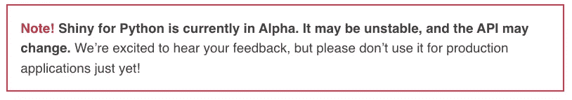
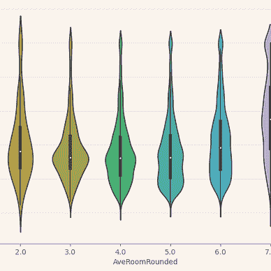

# 使用 Shiny For Python 构建待办事项应用程序

> 原文：<https://levelup.gitconnected.com/building-a-to-do-app-with-shiny-for-python-e2982a0c2d78>

## 计算机编程语言

由[雅各布·费罗斯](https://medium.com/@dreamferus)生成的图像。

Shiny 是 R 中一个流行的框架，可以快速构建 web 应用程序，而不必为服务器和客户端创建单独的程序，也不必编写 JavaScript。最近， [Shiny for Python](https://shiny.rstudio.com/py/) 已经创建。截至撰写本文时，它仍处于 alpha 阶段，正如他们在网站上谨慎警告的那样:

这个框架将与 dash 和 streamlit 竞争，它们有着相似的目标，即只使用 Python 就能创建 web 应用程序。

我决定尝试用它创建一个待办事项应用程序。有了这样一个应用程序，我可以测试它如何处理动态行为，即创建一个可以添加和删除的可变长度项目列表。

我将首先向您展示我创建的内容，然后回顾我对该框架的看法，以及我是否认为您应该使用它。在我展示代码之前，我将向您展示最终结果的 GIF:

我会尽我所能解释这段代码，但是如果没有浏览过教程，可能会很难理解。如果您想了解更多信息，请访问官方网站:

 [## 蟒蛇皮闪亮

### Shiny 使得利用 Python 的数据和科学堆栈的力量构建交互式 web 应用程序变得很容易…

shiny.rstudio.com](https://shiny.rstudio.com/py/) 

让我们一步一步地检查代码。一、界面:

这里，接口是静态定义的。虽然它是静态的，但不同部分的输出可以是动态的，例如:

*   `ui.output_text(“cleared_tasks")`将包含来自相应功能`cleared_tasks()`的动态文本
*   `ui.output_ui("tasks")`将包含来自相应功能`tasks()`的动态 UI

在 Shiny 中，通常使用的列系统的总宽度是 12 列。我在每边放了 3 个空栏，在中间放了 6 个包含实际内容的栏。

现在的逻辑是:

一切都包含在一个大函数中。注意，这个外部函数只被调用一次。因此，它不像 streamlit 那样一遍又一遍地调用所有的东西。首先，初始化一些状态，比如待办事项列表和两个计数器。然后，定义几个函数来描述不同状态改变时会发生什么。使用两种不同的方法:

*   `@output`会将 text/UI 返回给界面中与函数名 id 相同的元素。
*   `@reactive.Effect`会导致副作用，比如更新状态或 UI 值，这反过来会导致其他`@output`函数更新。

完整的代码如下所示:

# 回顾一下，如果你应该使用它

我将从积极的方面开始。闪亮是有弹性的。您可以使用 HTML 元素，对它们进行样式化，并将元素包装在其他元素中。因此，那些熟悉 web 开发和 HTML/CSS 的人仍然可以使用他们的知识来创建更高级的界面。国家管理也是高效的。只有当函数依赖的状态改变时，它才会重新运行。

消极的一面，我会说，作为一个初学者，花了一些时间来组装这个应用程序。在某种程度上，由于这个框架是新的，你不能像使用更流行的库那样，只通过谷歌搜索就能得到答案。此外，我认为它的学习曲线比 streamlit 更陡峭，例如，streamlit 很容易上手。

总的来说，因为它处于 alpha 状态，我不会推荐它超过 dash 或 streamlit。此外，它不像那些图书馆那样受欢迎。在写这篇文章的时候，py-shiny 有 270 颗星，dash 17.8k 和 streamlit 21.8k，因此它还有很长的路要走。虽然没有必要让一个图书馆受欢迎，但它有很多好处。

*   如果很多人使用它，学习起来会更容易(更多教程，更多实际例子)
*   解决问题会更容易(更多的堆栈溢出线程)
*   将会有更多的贡献者，因此库更有可能被更快地开发/改进

话虽这么说，R 版的 Shiny 有 4.9k 星。因此，当它进入更稳定的版本时，它可能会增长得更快。此外，如果你已经熟悉 R-shiny，我认为采用 Py-shiny 会容易得多。

如果您有兴趣阅读更多关于 Python 的文章，请查看我下面的阅读列表:

雅各布·费罗斯

## 计算机编程语言

[View list](https://medium.com/@dreamferus/list/python-c8e4719d93da?source=post_page-----e2982a0c2d78--------------------------------)32 stories

如果你想成为中级会员，你可以使用我的[推荐链接](https://medium.com/@dreamferus/membership)。祝你有愉快的一天。