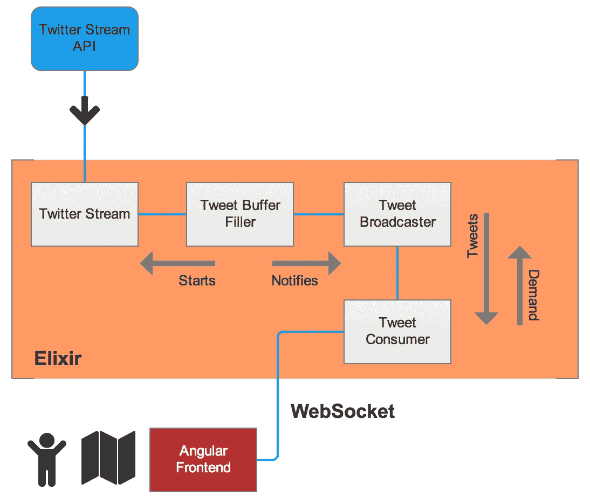

# 使用 Elixir 的 GenStage、Phoenix Channels 和 Angular 构建 Twitter 表情地图😀🙃😘

> 原文：<https://levelup.gitconnected.com/building-a-twitter-emoji-map-with-elixirs-genstage-phoenix-channels-and-angular-134319061b8a>

从开普敦的海点长廊看去。

# 背景

2017 年 2 月，我在开普敦度假，在某个时候感到无聊(老实说，我的信用卡在长街的一个简陋的酒吧被刷了——别去那里——这限制了我的预算，打乱了我的旅行计划，并将我绑在了这座城市上)。因此，我认为用 Elixir 的 GenStage 构建一个小的周末项目会很好，因为它是最近推出的，我没有用它来构建一些东西。

我选择 Twitter 作为数据源，因为他们的 Stream API 提供了持续的数据流，这可能会使系统过载——这正是 GenStage 承诺要处理好的事情之一。我选择 Angular 是因为我喜欢使用它，而且我没有找到很多关于如何将 Phoenix 频道与 Angular 前端连接在一起的文章。

基本的想法是过滤一个 tweets 流，并在前端尽可能快地显示结果，只需要很少的资源，而且不会使系统崩溃。我通常喜欢看得见的有趣的东西，但是在引擎盖下有复杂的技术。所以在组合中加入表情符号和地图是非常有意义的。

如果你不喜欢阅读整篇文章:我在 GitHub 上发布了整个项目。你可以自由使用和修改它。如果你发现任何你更了解的东西，请提交一份个人简历！

 [## ospaarmann/ex-emoji-map

### ex-emoji-map -用 Elixir 的 GenStage 和 Angular 构建的 emoji 地图。

github.com](https://github.com/ospaarmann/ex-emoji-map/blob/master/backend/lib/emoji_map/twitter_stream.ex) 

# 这个应用程序是做什么的？

基本上，它显示所有附有地理位置的推文，并(几乎)实时地在地图上包含一个表情符号。它显示了第一个表情符号，当点击它时，你可以阅读整个推文。它还显示了自你访问该页面以来 Twitter 上全球表情符号使用情况的快照统计。

它不积累任何东西，也不在数据库中存储任何东西。它总是只显示你现在正在发生的事情。而且真的很快。在 http://emojimap.ospaarmann.com/的[试试自己。打开地图，放大任意位置，拿起手机发送推文，在该位置进行地理标记并包含表情符号。](http://emojimap.ospaarmann.com/)

# 在过去

让我们记住，如果没有 Streams、OTP 和 WebSockets，我们将如何构建这样的东西。我们将有一个后端不断轮询 Twitter 的 REST API，寻找新的推文(可能达到速率限制)。符合我们标准的推文必须进入数据库——可能是 Redis——因为投票将由一些后台工作完成，这些工作不会直接回复客户的请求。客户端会不断轮询后端(可能会超载和崩溃)以获取新的推文。但是很难决定我们应该发回什么数据，因为每个客户在不同的时间开始投票，可能已经收到了不同的推文。我们将需要更多的服务器能力，我们将有更多的移动部件，这将非常难以设计，我们将不得不在发送一条推文和看到它在地图上弹出之间等待至少几秒钟。

# 为什么是 GenStage？

我强烈推荐从阅读马里奥·弗拉克的[宣布 GenStage](http://elixir-lang.org/blog/2016/07/14/announcing-genstage/) 和[这篇伟大的文章开始。基本上，GenStage 是 OTP 中的一种行为，或者更准确地说，是 Elixir GenServer 的一种变体，它在设计时考虑到了反压力，这样消息的消费者就不会被消息的数量淹没。或者换句话说:这是一个需求驱动的系统，在这个系统中，消息的消费者只接收她所能处理的尽可能多的消息，并且只有在她请求时才接收。](https://almightycouch.org/blog/reactive-tweets-elixir-genstage/)

> 为了启动事件流，我们将消费者订阅给生产者。一旦他们之间的沟通渠道建立起来，消费者就会向生产者要求事件。我们通常说消费者正在向上游发送需求。一旦需求到来，生产者将发出物品，决不会发出比消费者要求的更多的物品。这提供了背压机制。
> [*GenStage 文档*](https://hexdocs.pm/gen_stage/GenStage.html)

当我们想要处理一个数据流，而又不知道有多少消息会到达我们这里时，这就非常方便了。比如说，一串带着滑稽面孔的推文。

在 GenStage 中，我们有发布事件的生产者(或广播者)，消费事件的消费者，以及两者兼而有之的生产者-消费者，他们通常位于生产者和消费者之间。但是我不想在这里涉及太多的细节，我建议阅读提到的文章和文档。我还会在本文末尾列出参考文献。

# 移动部件—概述

我不是平面设计师，我几乎是色盲，所以闭嘴。

在 Elixir 端，我们有处理到 Twitter 流 API 的连接的 TwitterStream(通过 [ExTwitter 客户端库](https://github.com/parroty/extwitter))。它接收推文，只保留包含表情符号和地理坐标的推文。我从一个非常粗糙的正则表达式开始，但后来发现了 [Exmoji](https://github.com/mroth/exmoji) ，它自称是处理 Elixir 中表情符号的瑞士刀，是 Elixir 社区疯狂增长的一个伟大标志。

然后我们有 TweetBufferFiller，它是一个 GenServer，封装了 TwitterStream，启动它并通知 TweetBroadcaster 关于新的 tweets。这非常容易，因为 TwitterStream 模块从 ExTwitter 接收一个 [Elixir Stream](https://hexdocs.pm/elixir/Stream.html) ，应用过滤器和一些规范化，并再次返回一个流。所以我可以使用`Stream.map/2`为流中的每个 tweet 调用`TweetBroadcaster.sync_notify/1`。

`TweetBroadcaster`和`TweetConsumer`是我们 GenStage 的生产者和消费者。他们确保系统不会超载。每当有新的推文到达，`TweetBroadcaster`就会收到通知。它会缓冲推文，直到`TweetConsumer`请求更多推文。每当`TweetConsumer`完成将它们向下推到前端时，就会发生这种情况。如果在某个时候没有足够的 tweets 可用，那么`TweetBroadcaster`也会存储需求。`TweetConsumer`通过 WebSocket 或者在我们的例子中 WebSocket 的 Phoenix 实现将它们推送给客户端: [Phoenix Channels](https://hexdocs.pm/phoenix/channels.html) 。

前端写的是 Angular 2。那现在已经过时了，但是对这个目的来说，那真的不重要。它在启动时与凤凰频道连接，然后在样式化的[地图框](http://mapbox.com)地图上放置一个带有表情符号的标记作为符号，推文作为弹出内容。它总是只显示最新的 700 条推文，以避免浏览器过载(这样已经有点滞后了)。还有一个小小的统计，统计并显示每个表情符号的使用情况(排序顺序每 5 秒改变一次，以节省 CPU)。

就是这样。没那么复杂吧。

# 活动部件——详细

在文章的这一部分，我将更详细地讨论代码中最重要的部分。如果你更喜欢自己阅读代码，请前往我的 [GitHub repo](https://github.com/ospaarmann/ex-emoji-map) 并跳过这一部分。但是它可能会有帮助和有趣。另外:如果我做了什么傻事，请在评论或 GitHub 上告诉我！

## EmojiMap。Twitter stream—lib/e moji _ map/Twitter _ stream . ex

这里的主要功能是`get_emoji_stream/0` *。*它启动 Twitter 流并进行标准化和过滤。这里的第一个小技巧是，我只想要有地理位置的推文。我不能将此作为一个选项传递给 Twitter，我不想在我这边进行过滤。所以我使用`[ExTwitter.stream_filter/1](https://hexdocs.pm/extwitter/ExTwitter.html#stream_filter/1)`并传递一个覆盖整个星球的边界框作为选项。这样我只能得到地理标记的推文。但是一些有位置，一些有实际纬度/经度地理位置。剩下的代码会处理好这个问题。

然后，我将这个流(这是一个灵丹妙药流)传递到一个函数管道中，以进一步过滤和规范推文。为此，我可以方便地使用`[Stream.filter/2](https://hexdocs.pm/elixir/Stream.html#filter/2)`和`[Stream.map/2](https://hexdocs.pm/elixir/Stream.html#map/2)`。主函数`get_emoji_stream/0` 最终返回一串经过过滤和规范化的推文。

## EmojiMap。TweetBufferFiller—lib/e moji _ map/tweet _ buffer _ filler . ex

该模块将所有内容联系在一起。它启动`EmojiMap.TweetBroadcaster` 和`EmojiMap.TweetConsumer`生产者和消费者。这一对通过发电阶段和背压负责系统的稳定性(还记得吗？).

它还调用`EmojiMap.TwitterStream.get_emoji_stream/0` *，*接收经过过滤和规范化的 tweet 的 Elixir 流，对其调用`Stream.map/2`，并通知`TweetBroadcaster`每条传入的 tweet。

它也是应用程序启动时在 supervisor 树中启动的模块。因此，一旦应用程序启动，一切都启动并运行。请参见`lib/emoji_map.ex`。

## EmojiMap。tweet broadcaster-lib/e moji _ map/tweet _ broadcaster . ex

这非常符合标准实践。这里没什么特别的。

## EmojiMap。tweet consumer-lib/e moji _ map/tweet _ consumer . ex

消费者最终从广播公司接收经过过滤、标准化的推文，并通过 WebSocket 或 Phoenix Channel 将其发送到前端。这里唯一重要的是:不要把`EmojiMap.Endpoint.broadcast`和 GenStage 系统的一部分混淆。它只是`[Phoenix.Endpoint.broadcast/3](https://hexdocs.pm/phoenix/Phoenix.Endpoint.html#c:broadcast/3)`并向一个频道的所有订户发送消息。

# 就这样&谢谢

如果你有任何问题，反馈，评论:请评论或给我发消息。我希望这篇文章有助于理解 GenStage。也许这是一个有趣的想法，你们中的一些人想用我扔出去的相当不完美的代码做点什么。

**如果你想了解更多关于我们在**[**codeshift**](https://www.codeshift.co)**的工作，请查看我们的** [**网站**](https://www.codeshift.co) **。**

❤️谢谢。