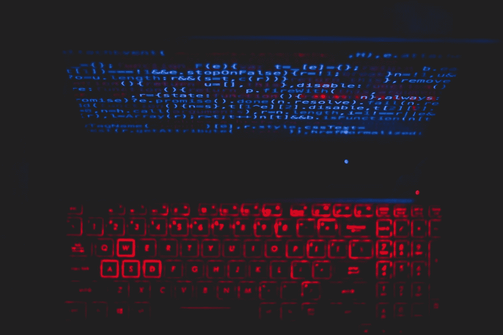
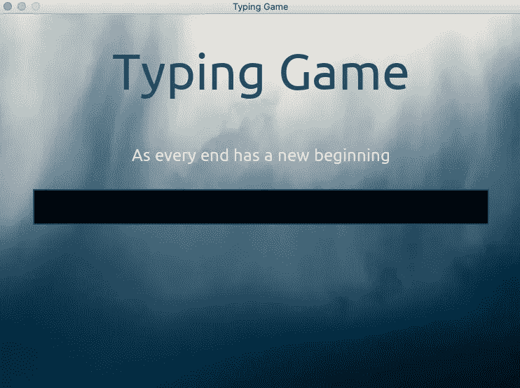
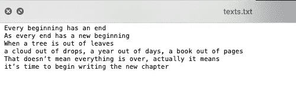
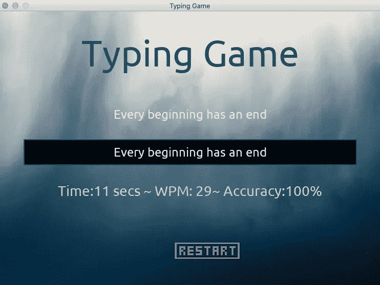

# 使用 Python 构建打字游戏

> 原文：<https://levelup.gitconnected.com/building-a-typing-game-using-python-9cbfddbd0ce>

## PyGame 入门和设计图形用户界面



拉胡尔·潘迪特摄于 [Pexels](https://www.pexels.com/photo/blue-and-red-light-from-computer-1933900/?utm_content=attributionCopyText&utm_medium=referral&utm_source=pexels)

在本教程中，我们将使用 Python 构建一个快速打字游戏。这将是一个直接动手的项目。我们将使用 PyGame python 模块来制作这个游戏。完成这个项目后，你会对如何使用 Python 创作游戏有所了解。此外，您还将学习如何开发和设计图形用户界面。

最终的程序可能看起来很容易，但实际上需要定义和跟踪许多变量和属性。比如这个快速打字游戏项目，我们会计算运行时间，单词的准确率，每分钟写了多少字。这些都是必须在幕后完成的不同计算。

**这是游戏的最终外观:**



作者图片

# 入门指南

如果你准备好了，让我们开始吧！

## PyGame 库

首先，让我们浏览一下这个项目中需要的库。有一个主库，就是 Pygame。剩下的都是一般的 python 库。为了能够使用 Pygame，我们必须安装它。让我们使用画中画:

```
pip install pygame
```

安装完成后，我们将继续和新的代码文件。我正在使用 Atom 代码编辑器。请随意使用您个人最喜欢的。我将它命名为 main.py，并放在一个新文件夹中。最好将它们放在一个新文件夹中，因为我们将在下面的步骤中添加字体文件、图像和句子文本文件。

如果你想在 Pygame 中有更多的动手练习，我想分享一下[米希尔甘地](https://medium.com/u/441174745a22?source=post_page-----9cbfddbd0ce--------------------------------) : [交通路口模拟使用 Pygame](https://towardsdatascience.com/traffic-intersection-simulation-using-pygame-689d6bd7687a) 写的这篇好看的文章。非常酷的项目！

## 导入库

这是我们将库/模块导入程序的地方。

```
import pygame
import sys, time, random
```

## 文件

好吧。库已设置。现在，我们必须找到两张图片和一个我们想在打字游戏中使用的句子列表。我们需要的文件列表:

*   一张背景图，会拍下整个游戏的背景。
*   重启按钮标志。这可以是图标图像或文本图像。最好是透明的背景。看起来好多了。
*   最后是一个包含句子的文本文件。确保每个句子都在新的一行。

以下是我选择使用的文件。

**背景图片:**


由[埃伯哈德](https://unsplash.com/@eberhardgross?utm_source=unsplash&utm_medium=referral&utm_content=creditCopyText)在 [Unsplash](https://unsplash.com/s/photos/abstract?utm_source=unsplash&utm_medium=referral&utm_content=creditCopyText) 上拍摄

**重启按钮图像:**


作者设计

**和句子文件(来自我写的一首诗:** [**新年快乐！**](https://sonsuzdesign.blog/2020/01/01/happy-new-year/) **):**



作者的文本文件截图

下面是我们定义这些文件并将它们赋给变量的代码。

```
background_image = 'bg_s.jpg'
sentences_file = 'texts.txt'
restart_logo = 'restart.png'
```

# 功能

在我们开始写函数之前，我们必须在程序中定义我们的类。这与描述函数非常相似。我们现在开始编写的所有任务都将归入这个新类。您可以选择任何类名，这就像定义一个变量名:

```
class Type_Game:
```

## 初始化

在这个函数中，我们定义了一些变量并为图形用户界面设置了值。例如，文本颜色、窗口的高度和宽度、背景图像。

```
def __init__(self):
        self.color_heading = (49, 58, 82)
        self.color_text = (235, 230, 232)
        self.color_results = (216, 222, 146)self.w=750
        self.h=550
        self.screen = pygame.display.set_mode((self.w, self.h))self.active = False
        self.results = "Time:0 ~ Accuracy:0 % ~ Words Per Minute:0"
        self.accuracy = "0%"
        self.reset=Truepygame.init()
        pygame.display.set_caption("Typing Game")self.bg_img = pygame.image.load(background_image)
        self.bg_img = pygame.transform.scale(self.bg_img, (750,550))
```

## 写文本

在这个函数中，我们定义字体类型并在用户界面上呈现文本。请随意选择不同的字体类型或字体大小。我已经用谷歌字体找到字体并下载了 ttf 文件。

```
def write_text(self, screen, title, y ,f_size, text_color):
        font_family = pygame.font.Font("Ubuntu-Regular.ttf", f_size)
        text = font_family.render(title, 1, text_color)
        text_box = text.get_rect(center=(self.w/2, y))
        screen.blit(text, text_box)
        pygame.display.update()
```

## 显示结果

在这项职能中，我们要做多件事情。

*   计算打字速度，找出每分钟平均写的字数。
*   用词的准确性。
*   与用户分享结果。
*   渲染重启游戏标志。点击后将重启游戏，我们将在*运行*功能中添加该功能。

```
def show_result(self, screen):
        if(not self.end):
            self.total_time = time.time() - self.start_time
            count = 0
            for i,c in enumerate(self.word):
                try:
                    if self.input_text[i] == c:
                        count = count + 1
                except:
                    pass
            self.accuracy = (count*100)/len(self.word)self.wpm = (len(self.input_text)*60)/(5*self.total_time)
            self.end = Trueself.results = "Time: "+str(round(self.total_time)) +" secs ~ Accuracy: "+ str(round(self.accuracy)) + "% ~ WPM: " + str(round(self.wpm))self.reply_img = pygame.image.load(restart_logo)
            self.reply_img = pygame.transform.scale(self.reply_img, (200,100))
            screen.blit(self.reply_img, (self.w/2-70,self.h-130))pygame.display.update()
```

## 获取句子

这是一个简单的函数。我们只是在读课文中的句子。

```
def get_sentence(self):
        return random.choice(open(sentences_file).read().split('\n'))
```

## 重新开始游戏

在这个函数中，我们重置了值。你可以理解，我们会在用户按下重启键的时候调用它。如果我们不重置这些值，它们将在下一轮中继续更新。

```
def restart_game(self):
        time.sleep(1)self.reset=False
        self.end = Falseself.input_text=''
        self.word = ''
        self.start_time = 0
        self.total_time = 0
        self.wpm = 0self.word = self.get_sentence()
        if (not self.word): self.restart_game()self.screen.fill((0,0,0))
        self.screen.blit(self.bg_img,(0,0))
        title = "Typing Game"
        self.write_text(self.screen, title, 80, 72,      self.color_heading)pygame.draw.rect(self.screen,(255,190,20), (50,200,700,50), 2)self.write_text(self.screen, self.word, 200, 24, self.color_text)pygame.display.update()
```

## 奔跑

最后，我们的主要运行功能。我们通过调用*重启游戏*功能来清除一切。然后，我们通过添加标题和用于键入的框来进行布局设计。

当循环运行的时候。当检测到点击重启按钮时，程序调用*重启游戏*功能。代码看起来有点复杂，但是语法很容易理解。

```
def run(self):
        self.restart_game()self.running=Truewhile(self.running):
            clock = pygame.time.Clock()
            pygame.draw.rect(self.screen,self.color_heading, (50,200,700,50), 3)
            self.write_text(self.screen, self.input_text, 274, 24,(250,250,250))
            pygame.display.update()for event in pygame.event.get():
                if event.type == QUIT:
                    self.running = False
                    sys.exit()
                elif event.type == pygame.MOUSEBUTTONUP:
                    x,y = pygame.mouse.get_pos() 
                    if(x>=50 and x<=700 and y>=200 and y<=300):
                        self.active = True
                        self.input_text = ''
                        self.start_time = time.time()
                    if(x>=310 and x<=510 and y>=390 and self.end):
                        self.restart_game()
                        x,y = pygame.mouse.get_pos()
                elif event.type == pygame.KEYDOWN:
                    if self.active and not self.end:
                        if event.key == pygame.K_RETURN:
                            print(self.input_text)
                            self.show_result(self.screen)
                            print(self.results)
                            self.write_text(self.screen, self.results,350, 28, self.color_results)
                            self.end = True
                        elif event.key == pygame.K_BACKSPACE:
                            self.input_text = self.input_text[:-1]
                        else:
                            try:
                                self.input_text += event.unicode
                            except:
                                passpygame.display.update()

      clock.tick(60)
```

# 最后外观

你成功了！这是最后一步，我们将调用 Type_Game 类。然后，游戏开始了。

```
if __name__=='__main__':
    Type_Game().run()
```

以下是一些截图:


作者图片



作者图片

恭喜你。本文到此为止。我们已经用 python 创建了一个快速打字游戏。我们从头开始设计了整个用户界面。Python 在很多领域都很棒，游戏开发就是其中之一。希望你喜欢读这篇文章，并且今天学到了一些新的东西。如果您在执行代码时有任何问题，请随时[联系我](https://sonsuzdesign.blog/)。我尽最大努力回复大家。

> 我们来连线。查看我的[博客](https://medium.com/@lifexplorer)和 [youtube](https://www.youtube.com/watch?v=7I9eg3G1mnE&list=PLudLCLvpppAJ7OsgrQxqY-n8Ok9Nt-Rtr) 来获得灵感。谢谢你，

## 为您提供更多动手的 Python 项目

[](https://towardsdatascience.com/building-an-image-color-analyzer-using-python-12de6b0acf74) [## 使用 Python 构建图像颜色分析器

### 使用 Scikit-learn 和 OpenCV 的机器学习项目

towardsdatascience.com](https://towardsdatascience.com/building-an-image-color-analyzer-using-python-12de6b0acf74) [](https://towardsdatascience.com/building-a-speech-emotion-recognizer-using-python-4c1c7c89d713) [## 用 Python 构建语音情感识别器

### 用 MLP 人工神经网络逐步指导语音情感识别

towardsdatascience.com](https://towardsdatascience.com/building-a-speech-emotion-recognizer-using-python-4c1c7c89d713)