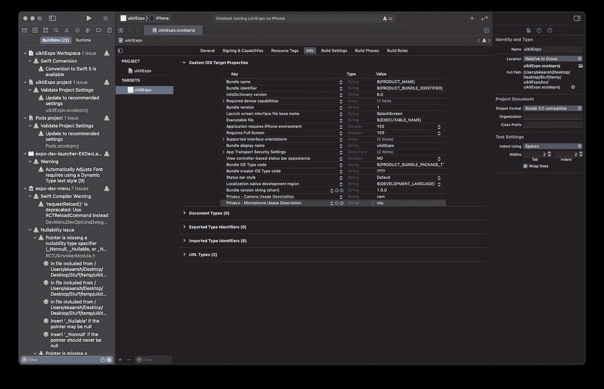

# 使用 Expo 上的 Agora SDK 构建视频通话应用程序(React Native)

> 原文：<https://levelup.gitconnected.com/building-a-video-calling-app-using-the-agora-sdk-on-expo-react-native-98d3a0579a5d>

**3 月 20 日至 22 日**更新:该博客已更新，可与 Agora React Native UIKit 的 4.0.0 版兼容。

随着 Expo SDK 42 的[发布](https://blog.expo.dev/expo-sdk-42-579aee2348b6),现在可以使用定制开发客户端定制应用的本地运行时。我花了一段时间来理解所有的新概念，但我真的很兴奋！

本质上，这意味着我们现在可以在 Expo 中使用包含本机代码的库(如 Swift 和 Kotlin ),而不必求助于裸露的工作流(这会剥夺 Expo 的大部分好处和易用性)。新的体验非常容易设置和开始使用。你可以在这个[官方博客](https://blog.expo.dev/expo-sdk-42-579aee2348b6)和[世博会文档](https://docs.expo.dev/clients/getting-started/)中找到更多信息。

# **这不是什么:**

*   您不能使用 Expo Go 应用程序来测试带有本机模块的代码。这意味着你需要构建你的应用程序并分发给任何想测试它的人。
*   如果你想在无法访问 Mac 的情况下为 iOS 构建，你需要使用 EAS Build 或其他云服务。
*   这将比世博会 JS-only 体验稍微复杂一些。你需要设置 Android Studio 和/或 XCode。

# **要求**

*   [集市账户](https://sso.agora.io/en/signup?utm_source=medium&utm_medium=blog&utm_campaign=building-a-video-calling-app-using-the-agora-sdk-on-expo)
*   [Node.js LTS 发布](https://nodejs.org/en/)
*   [Git](https://git-scm.com/)
*   [守夜人](https://facebook.github.io/watchman/docs/install#buildinstall) (brew 安装守夜人)
*   [纱线](https://yarnpkg.com/getting-started/install) (npm i -g 纱线)
*   世博气候(npm i -g expo-cli)
*   Android Studio/XCode

安装 Node.js 和 Git 取决于您的操作系统。要安装 Yarn 和 Expo，只需运行`npm i -g yarn expo-cli`即可。

# **创建新项目**

为了创建一个 Expo 项目，我们将使用 [Expo CLI](https://docs.expo.dev/workflow/expo-cli/) 。打开一个新的终端，执行`expo init`调出 CLI，引导您完成整个过程。让我们通过选择空白 TS 选项来利用 typescript 模板。

您可以使用本机模块在 React Native 中运行本机平台代码。随着 Expo dev 客户端的新发布，现在可以在不离开托管工作流的情况下使用本机模块。

为了使本地模块(使用本地平台代码的库)与 Expo 一起工作，我们将通过在 Expo CLI 创建的项目目录中运行`yarn add expo-dev-client`来安装 Expo dev 客户端。

> *注意:*我们不能使用 Expo Go 应用程序来运行项目，因为我们正在捆绑本机代码。我们将通过构建一个定制客户端来解决这个问题。

# **安装本机模块**

让我们安装原生依赖:Agora React 原生 SDK。在终端中，执行`yarn add react-native-agora@3 agora-react-native-rtm`。你不需要为 Agora SDKs 做任何额外的配置。如果你的库需要修改本地运行时，你可以在这里阅读更多关于如何编写定制插件[的内容。](https://docs.expo.dev/clients/getting-started/#customizing-your-runtime)

对于应用程序演示，让我们安装 Agora React 原生 UIKit。它是一个纯 JavaScript 库，帮助我们用十行代码搭建一个视频通话 app。可以执行`yarn add agora-rn-uikit`来安装。它的功能依赖于 Agora React Native SDK。

我们现在可以开始编写应用程序了:

为了获得更好的错误和日志，文档建议将`import ‘expo-dev-client’;`添加到`App.tsx`文件的顶部。

要构建一个视频通话 app，我们所需要的就是 UIKit 库中的`AgoraUIKit`高层组件。我们可以将`appId`和`channel`传递给`RtcProps`。我们可以使用一个状态变量来呈现调用 UI，我们可以使用`EndCall`回调来更新它。当`videoCall`状态为真时，呈现 AgoraUIKit 组件。

你可以在这里阅读更多关于 UIKit 如何工作的信息。

# **运行你的应用**

现在是关键时刻:让我们试着运行这个应用程序。要构建定制客户端，我们可以在终端中执行`expo run:android`或`expo run:ios`。如果您正在为 iOS 构建，请使用物理设备进行测试，因为 iOS 模拟器中没有摄像头功能。系统将提示您选择捆绑包 ID(您的应用程序的唯一标识符)。您可以输入自定义 ID 或使用预填充选项。

> *注意:*如果你正在为 iOS 构建，你需要使用 XCode 向你的`info.plist`文件添加摄像头和麦克风许可文本:

完成后，您需要等待几分钟，以便 CLI 构建自定义客户端并将其安装到您的设备上。您将看到项目目录被 iOS 和 Android 文件夹填充。您现在可以通过在项目目录中执行`expo start --dev-client`来运行 Expo dev 服务器。应用程序加载后，您可以扫描服务器二维码或从应用程序的列表中选择它。您的应用程序应该像普通的 React 原生应用程序一样从 metro 加载。

# **结论**

Expo SDK 在 React Native 之上提供了许多开发人员友好的特性。过去，我们使用简单的工作流程。然而，如果我们的应用程序需要任何本机模块，它会带走一些好处。另外，设置它是一项任务。使用定制客户端，我们可以利用 Expo 的强大功能和本地模块的灵活性。

你可以在这里阅读我关于 React 原生 UIKit [的博客。](https://www.agora.io/en/creating-a-react-native-video-chat-app-in-a-few-lines-of-code-using-agora-uikit/)

# 其他资源

有关使用 Agora SDKs 构建应用的更多信息，请查看 [Agora 视频通话快速入门指南](https://docs.agora.io/en/Video/landing-page?platform=React%20Native)和 [Agora API 参考](https://docs.agora.io/en/Video/API%20Reference/react_native/index.html)。还可以看看 [UIKit GitHub Repo](https://github.com/AgoraIO-Community/ReactNative-UIKit) 、 [API 参考](https://agoraio-community.github.io/ReactNative-UIKit)、 [Wiki](https://github.com/AgoraIO-Community/ReactNative-UIKit/wiki) 。

我邀请你加入 [Agora 开发者松弛社区](https://www.agora.io/en/join-slack/)。你可以在`#react-native-help-me`频道问任何关于 Agora 的问题。