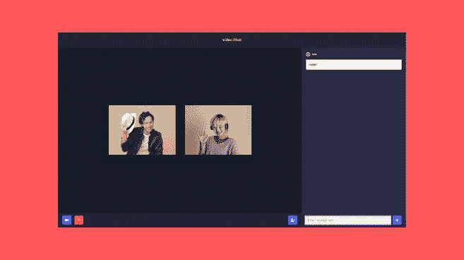
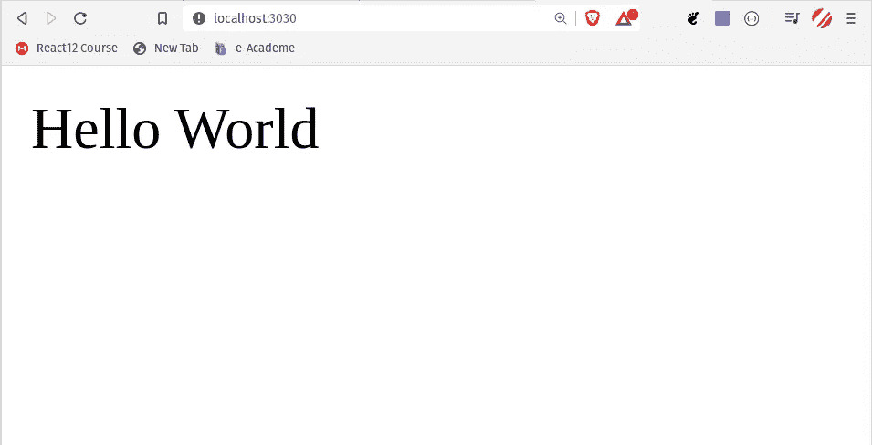
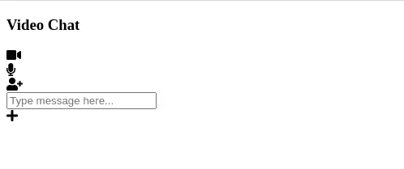
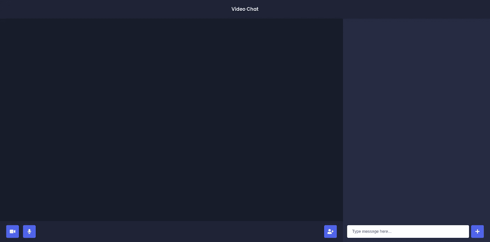
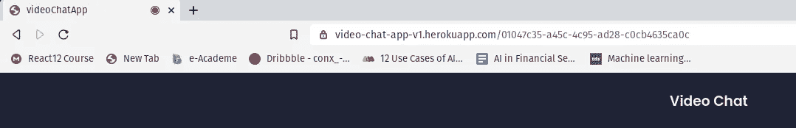

# 用 Node.js + Socket.io + WebRTC 构建视频聊天 App

> 原文：<https://levelup.gitconnected.com/building-a-video-chat-app-with-node-js-socket-io-webrtc-26f46b213017>



本教程将向你展示如何使用 JavaScript 和 NodeJS 构建一个视频聊天应用。它还将向您展示如何使用 PeerJS、WebRTC 和 Socket.io。

> [**点击此处**](https://video-chat-app-v1.herokuapp.com/) **查看我们将要构建的应用程序的实例。**

# 项目前期设置

这是你需要的:

*   **NodeJS:** 访问官方 [Node.js 网站](https://nodejs.org/en/)下载安装 Node。
*   NPM: 当你安装 Node.js 的时候，你的电脑上就安装了 NPM 程序

# 项目设置

> 这个项目的所有代码都可以在 GitHub Repo 中找到

1.  创建一个名为`video-chat-app`的空目录。
2.  打开你的控制台，导航到我们的新目录，运行`npm init.`
3.  填写所需的信息来初始化我们的项目。
4.  在`video-chat-app`目录下，运行`npm install express ejs socket.io uuid peer`。这将安装构建该应用程序所需的所有依赖项。
5.  同样作为一个开发依赖，我们将安装 [Nodemon](https://nodemon.io/) 。运行`npm install — dev nodemon.`这将安装 nodemon 作为一个开发依赖。
6.  创建一个名为`server.js`的文件——这个文件将保存我们所有的服务器端逻辑

现在我们已经有了项目设置，我们可以开始构建了！

# 创建我们的服务器(使用 Express JS)

我们需要做的第一件事是启动并运行我们的服务器。我们将使用 Express 来完成这个任务。Express 是 Node.js 的一个极简 web 框架——Express 使得用 Node 创建和运行 web 服务器变得非常容易。

让我们创建一个样板快速入门应用程序文件。

```
**// server.js**
const express = require(“express”);
const app = express();
const server = require(“http”).Server(app);
app.get(“/”, (req, res) => {
    res.status(200).send(“Hello World”);
});
server.listen(3030);
```

现在我们的服务器已经运行，我们可以通过运行以下命令来测试我们的服务器:

```
> nodemon server.js
```

现在打开你的浏览器并访问: `localhost:3000`你应该会看到 Hello World。



# **创建我们的第一个视图**

当有人访问我们的根路由时，我们不是用文本来响应，而是用 HTML 文件来响应。为此，我们将使用 EJS(嵌入式 JavaScript)。EJS 是一种模板语言。

为了在 Express 中使用 EJS，我们需要设置我们的模板引擎。要设置，请在`server.js` 文件中添加这行代码。

```
app.set(‘view engine’, ‘ejs’)
```

默认情况下，可以在视图目录中访问 EJS。现在在您的目录中创建一个名为`views`的新文件夹。在那个`views`文件夹中，添加一个名为`room.ejs`的文件。现在把我们的`room.ejs`文件想象成一个 HTML 文件。

到目前为止，我们的文件结构是这样的:

```
|-- video-chat-app
   |-- views
      |-- room.ejs
   |-- package.json
   |-- server.js
```

现在我们有了`room.ejs`文件的样板文件。现在我们将把我们的 HTML 代码添加到`room.ejs the`文件中。

一旦你复制了上面的代码，我们需要替换我们的应用程序。js 获取代码:

```
app.get(‘/’, function (req, res) {
 **// OLD CODE**
 res.status(200).send("Hello World");
})
```

上面是我们发送文本“Hello World！”的旧代码给客户。相反，我们想发送我们的`room.ejs`文件:

```
app.get(‘/’, function (req, res) {
 **// NEW CODE**
 res.render(‘room’);
})
```

现在打开您的浏览器并访问:`localhost:3030` ，您应该看到我们的 room.ejs 文件正在显示！



# 添加 CSS 文件

这看起来不太好，对吧？这是因为我们的项目中没有任何样式表文件。所以我们来添加一些 CSS。

我们需要在我们的项目中添加一个名为`public.`的新文件夹，在该文件夹中创建一个名为`style.css`和`script.js`的文件。这是我们新的文件结构:

```
|-- weather-app
   |-- views
      |-- index.ejs
   |-- public
      |-- style.css
      |-- script.js
   |-- package.json
   |-- server.js
```

默认情况下，Express 不允许访问这个文件，所以我们需要用下面一行代码来公开它:

```
app.use(express.static(‘public’));
```

这段代码允许我们访问“公共”文件夹中的所有静态文件。最后，我们需要我们的 CSS。由于这不是一门 CSS 课程，我不打算详细讲解，但是如果你想使用我的 CSS，你可以从 [**这里**](https://github.com/itstaranarora/video-chat-v1/blob/master/public/style.css) **复制它。**

一旦你添加了 CSS。您可以访问:`localhost:3030/` 您会发现您的应用程序看起来更好了。



# 布置我们的房间

现在，您的`server.js`文件应该如下所示:

我们有一个 get 路径，然后创建我们的服务器。然而，为了让我们的应用程序正常工作，每当一个新用户访问我们的默认路由时，我们会将他重定向到一个唯一的 URL。我们将使用 [**uuid**](https://www.npmjs.com/package/uuid) 库为每个房间创建一个随机的唯一 URL。

UUID 是一个 javascript 库，允许我们创建唯一的 ID。在我们的应用程序中，我们将使用 uuid 版本 4 来创建我们唯一的 URL。但是首先让我们在`server.js` 文件中导入 uuid。

```
const { v4: uuidv4 } = require("uuid");
```

现在，我们将使用 [uui *d*](https://www.npmjs.com/package/uuid) 库为每个房间创建一个随机的唯一 id。我们会将用户重定向到那个房间。

```
app.get(“/”, (req, res) => { res.redirect(`/${uuidv4()}`);});
```

在我们测试之前，我还想为每个独特的房间添加一个视图，我们将把当前的 URL 传递给该视图。

```
app.get(“/:room”, (req, res) => { res.render(“room”, { roomId: req.param.room });});
```

我们已经将`**roomId**`传递给了 room.ejs，这样我们就完成了房间的设置。现在，如果你访问`localhost:3030.`，你将被重定向到一个唯一的网址。



# 添加当前用户视频

我们将继续我们之前创建的`script.js`文件。`script.js`将包含我们所有的客户端代码。

因此，这里我们需要做的是，我们需要获得视频流，也就是用户媒体，然后我们将该流添加到视频元素中。

```
let myVideoStream;
const videoGrid = document.getElementById("video-grid");
const myVideo = document.createElement("video");
myVideo.muted = true;
navigator.mediaDevices.getUserMedia({
    audio: true,
    video: true,
})
.then((stream) => {
    myVideoStream = stream;
    addVideoStream(myVideo, stream);
});
```

现在我们将创建`addVideoStream` 函数。这将把流添加到视频元素。

```
const addVideoStream = (video, stream) => {
    video.srcObject = stream;
    video.addEventListener("loadedmetadata", () => {
       video.play();
       videoGrid.append(video);
    });
};
```

这段代码将向视频元素添加一个用户流。您可以通过访问`localhost:3030` 进行测试，您将在视频元素中看到您的视频弹出窗口


# **5。增加了允许其他人播放视频的功能**

现在该用 Socket.io 和 PeerJS 了。对于那些不知道 Socket.io 的人来说，它允许我们进行实时通信。PeerJS 允许我们实现 WebRTC。

首先，我们将在 server.js 文件中导入 socket.io 和 peerjs，并监听加入房间事件。

```
// **server.js**const express = require(“express”);const app = express();const server = require(“http”).Server(app);const { v4: uuidv4 } = require(“uuid”);app.set(“view engine”, “ejs”);const io = require(“socket.io”)(server);const { ExpressPeerServer } = require(“peer”);const peerServer = ExpressPeerServer(server, {debug: true,});app.use(“/peerjs”, peerServer);app.use(express.static(“public”));app.get(“/”, (req, res) => {res.redirect(`/${uuidv4()}`);});app.get(“/:room”, (req, res) => {res.render(“room”, { roomId: req.param.room });});io.on(“connection”, (socket) => {socket.on(“join-room”, (roomId, userId) => {socket.join(roomId);socket.to(roomId).broadcast.emit(“user-connected”, userId);});});server.listen(3030);
```

现在，我们让服务器主动监听加入房间事件。接下来，我们将设置我们的 script.js。

```
// **public/script.js**const socket = io(“/”);const videoGrid = document.getElementById(“video-grid”);const myVideo = document.createElement(“video”);myVideo.muted = true;var peer = new Peer(undefined, {path: “/peerjs”,host: “/”,port: “3030”,});let myVideoStream;navigator.mediaDevices.getUserMedia({audio: true,video: true,}).then((stream) => {myVideoStream = stream;addVideoStream(myVideo, stream);peer.on(“call”, (call) => {call.answer(stream);const video = document.createElement(“video”);call.on(“stream”, (userVideoStream) => {addVideoStream(video, userVideoStream);});});socket.on(“user-connected”, (userId) => {connectToNewUser(userId, stream);});});const connectToNewUser = (userId, stream) => {const call = peer.call(userId, stream);const video = document.createElement(“video”);call.on(“stream”, (userVideoStream) => {addVideoStream(video, userVideoStream);});};peer.on(“open”, (id) => {socket.emit(“join-room”, ROOM_ID, id);});const addVideoStream = (video, stream) => {video.srcObject = stream;video.addEventListener(“loadedmetadata”, () => {video.play();videoGrid.append(video);});};
```

现在，如果有新用户加入房间，我们将看到他们的视频。

# **6。构建用户界面**

我们已经完成了视频部分。现在让我们做一些造型。但是首先，让我们给 **room.ejs** 文件添加一些内容。(在你的头部标签中添加字体 awesome CDN)

```
// **views/room.ejs**<body> <div class="header"> <div class="logo"> <h3>Video Chat</h2> </div> </div> <div class="main"> <div class="main__left"> <div class="videos__group"> <div id="video-grid"></div> </div> <div class="options"> <div class="options__left"> <div class="options__button"> <i class="fa fa-video-camera" aria-hidden="true"></i> </div> <div class="options__button"> <i class="fa fa-microphone" aria-hidden="true"></i> </div> </div> <div class="options__right"> <div class="options__button background__red"> <i class="fa fa-phone" aria-hidden="true"></i> </div> </div> </div> </div> <div class="main__right"> <div class="main__chat_window"> <ul class="messages"></ul> </div> <div class="main__message_container"> <input id="chat_message" type="text" placeholder="Type message here..."> <div class="options__button"> <i class="fa fa-plus" aria-hidden="true"></i> </div> </div> </div> </div></body>
```

接下来，让我们打开我们的 style.css 文件添加一些 css。

```
@import url(“https://fonts.googleapis.com/css2?family=Poppins:wght@400;500;600&display=swap");:root {— main-darklg: #1d2635;— main-dark: #161d29;— primary-color: #2f80ec;— main-light: #eeeeee;font-family: “Poppins”, sans-serif;}* {margin: 0;padding: 0;}.header {display: flex;justify-content: center;align-items: center;height: 8vh;width: 100%;background-color: var( — main-darklg);}.logo > h3 {color: var( — main-light);}.main {overflow: hidden;height: 92vh;display: flex;}.main__left {flex: 0.7;display: flex;flex-direction: column;}.videos__group {flex-grow: 1;display: flex;justify-content: center;align-items: center;padding: 1rem;background-color: var( — main-dark);}video {height: 300px;border-radius: 1rem;margin: 0.5rem;width: 400px;object-fit: cover;transform: rotateY(180deg);-webkit-transform: rotateY(180deg);-moz-transform: rotateY(180deg);}.options {padding: 1rem;display: flex;background-color: var( — main-darklg);}.options__left {display: flex;}.options__right {margin-left: auto;}.options__button {display: flex;justify-content: center;align-items: center;background-color: var( — primary-color);height: 50px;border-radius: 5px;color: var( — main-light);font-size: 1.2rem;width: 50px;margin: 0 0.5rem;}.background__red {background-color: #f6484a;}.main__right {flex: 0.3;background-color: #242f41;}.main__chat_window {flex-grow: 1;}.main__message_container {padding: 1rem;display: flex;align-items: center;justify-content: center;}.main__message_container > input {height: 50px;flex: 1;border-radius: 5px;padding-left: 20px;border: none;}#video-grid {display: flex;justify-content: center;flex-wrap: wrap;}
```

就是这样！恭喜你，你已经成功制作了视频聊天应用程序。现在你可以将它部署到 Heroku 并向全世界展示。

现场演示:[https://video-chat-app-v1.herokuapp.com/](https://video-chat-app-v1.herokuapp.com/a2ad563c-37c3-484b-a763-38546b11c922)

源代码:[https://github.com/itstaranarora/video-chat-v1](https://github.com/itstaranarora/video-chat-v1)

如果你觉得这篇文章有用，请在 LinkedIn 和 Github 上关注我

# 分级编码

感谢您成为我们社区的一员！升级正在改变技术招聘。 [**在最好的公司**找到你最理想的工作](https://jobs.levelup.dev/talent) **。**

[](https://jobs.levelup.dev/talent) [## 提升——改变招聘流程

### 🔥让软件工程师找到他们热爱的完美角色🧠寻找人才是最痛苦的部分…

作业. levelup.dev](https://jobs.levelup.dev/talent)