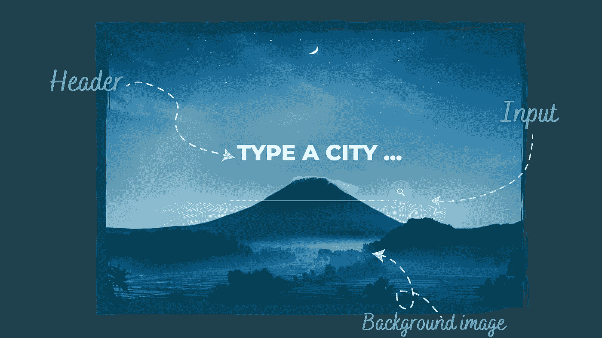
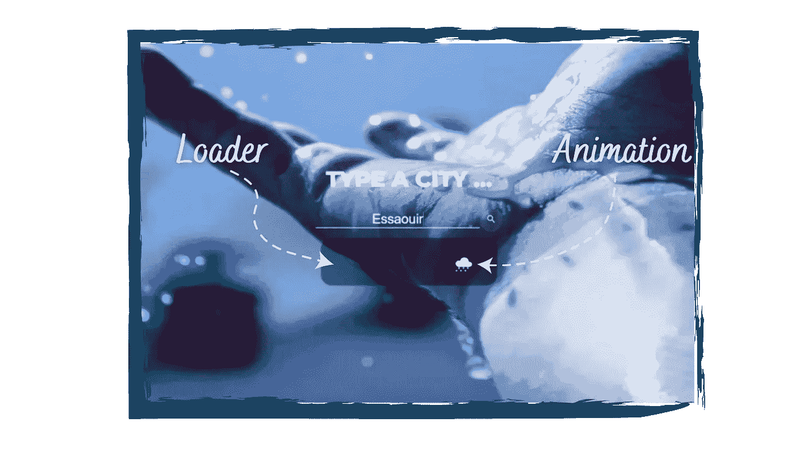
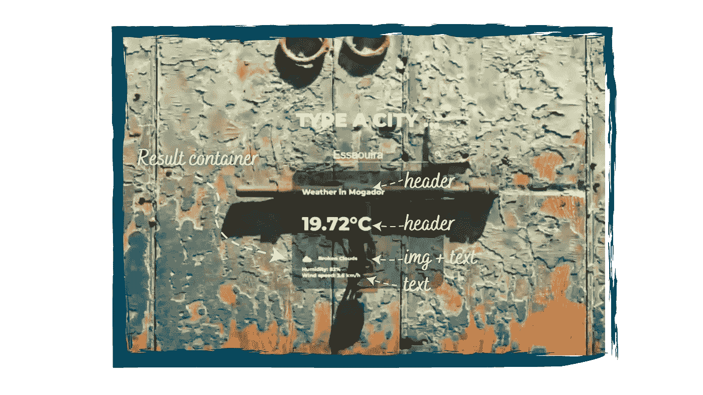

# 构建天气应用程序

> 原文：<https://levelup.gitconnected.com/building-a-weather-app-e25e4363b93c>

## 应用 2022 网络计划的第 1、2、3、4 和 5 章

作者:FAM

## 你好👋

为了从整个练习中获得最大的收益，请按照计划一步一步地执行。当你卡住超过 30 分钟时，检查源代码，修复问题并继续自己实现，以此类推…

> 准备好了吗？让我们尽情享受吧！

# I-框架(HTML)💀

在构建框架时，硬编码所有文本，甚至结果，直到 UI 完成。你可以进入下一步，用 JS 赋予它生命。对于这一步，你需要从 [**HTML 章节中获得的知识。**](https://famzil.medium.com/your-html-essentials-69d9b2349355?source=your_stories_page----------------------------------------)

## 应用程序的状态 1

正如你所看到的，在我们的 HTML 文档中，网站的初始状态需要 3 个主要的东西:

*   ***表头*** (大一:`***<h1>***`)
*   ***输入*** (以按钮为图标)
*   适应于被搜索城市的背景图像。让我们的应用程序更性感，并利用你对 API 的了解。

## 应用程序的状态 2

app 的**第二种状态**是我们在搜索的时候:

*   指示我们正在搜索的微调按钮
*   动画(CSS)

## 应用程序的状态 3

应用程序的**最后状态**是我们显示结果的时候:

# 二-风格(CSS) ✨

确保创建了所有的 HTML 块，没有隐藏任何块。现在，用虚拟文本编码。我们将在 JS 部分显示/隐藏和插入准确的结果。对于这一步，你需要从 [**CSS 章节中获得的知识。**](https://medium.com/geekculture/recap-of-the-css-chapter-ae388d51e564?source=your_stories_page----------------------------------------)

*   使图像占据整个背景。
*   创建搜索块样式。
*   用动画制作加载块(`**flex**` **、**、`**transition**`、**、**、`**@keyframes**`、**、**、`**transform**`)
*   使结果成为块样式。

## III-交互(JS、DOM 和 BOM)🎬

要完成这一步，你需要来自 [**JS 章节**](/congrats-to-js-chapter-finishers-e38a3ca1612c) 和 [**BOM/DOM 章节**](https://famzil.medium.com/congrats-for-completing-chapter-n-5-516b8fc67d30) **的知识。**

*   **显示/停止加载模式(app 状态 2)**`**stopLoading()**`**/**`**showLoading()**`**。**
*   **显示/隐藏结果块。**使用 DOM 对象`**document**` 选择 HTML 元素，然后将样式`**results.style.display = block**` 改为显示，`**="none"**`改为移除。
*   **实现搜索方法:**

→通过**点击按钮上的**(搜索图标)。添加一个监听器来检测用户何时完成输入(`***input.addEventListener("keyup", keyupEventHandler);***`)

→通过获取**用户位置** `**searchWeatherByLocation(lat, lon)**`。使用地理定位 web API。

→由**用户键入的** (KeyUp 事件)`**searchWeatherByCity(city)**`

*   **从 OpenWeatherMap API** 获取结果(你需要订阅该 API(它是免费的)并获取你的 API 密钥)。使用**获取 API** 和 JS promise。
*   **用新的结果更新 HTML**(使用 DOM 对象，例如:`**document.querySelector(".temperature").innerText = temp + "°C";**`)
*   **用**Unsplash**API(source.unsplash.com)和新的搜索结果更新背景图片**。

# 🙈在线应用

 [## 天气应用程序(HTML、CSS 和 JS)

### 编辑描述

weather-app-tan-eight-80 . vercel . app](https://weather-app-tan-eight-80.vercel.app/) 

# 💻源代码

在检查源代码之前，确保你玩过这个游戏😉如果你喜欢它，可以在 GitHub 上给它一颗星，^^

 [## GitHub-fam zila/天气应用程序

### 在 GitHub 上创建一个帐户，为 fam zila/天气应用程序的开发做出贡献。

github.com](https://github.com/famzila/weather-app) 

# ❔Got 问题

在 LinkedIn 的 DM，我很乐意回答你😉

今天就到这里，看阿雅🙋

如果您有任何问题或反馈，请点击评论或通过 LinkedIn 联系我— **我洗耳恭听！**

[**想请我喝杯咖啡吗？☕️**](https://www.buymeacoffee.com/fatimaamzil)

> 让我们为 2022 年打造一个更好的‘我们’！

## 了解有关 2022 年网络快车计划的更多信息:

I- [网络常识](https://medium.com/geekculture/2022-web-program-chapter-n-1-is-done-499fb0707220?source=your_stories_page----------------------------------------)

[II-网页框架:HTML](https://famzil.medium.com/your-html-essentials-69d9b2349355?source=your_stories_page----------------------------------------)

[III-网页样式:CSS](https://medium.com/geekculture/recap-of-the-css-chapter-ae388d51e564?source=your_stories_page----------------------------------------)

[IV-网络互动:JavaScript](/congrats-to-js-chapter-finishers-e38a3ca1612c)

[虚拟物料清单& DOM](http://8c48)

## VI-网络性能

*   关键渲染路径(CRP 和 CSSOM)
*   回流
*   预加载、预连接、预取、预呈现
*   渲染性能
*   工人
*   图像优化

 [## 2022 网络计划启动！

### 改变来自心态和习惯

medium.com](https://medium.com/geekculture/2022-web-program-is-launched-f38a3280af1a) 

与想成为 web 开发人员的人分享该程序！这将有助于保持进步，并在旅途中互相帮助。

> 如果你喜欢我的文章， [**订阅**](https://famzil.medium.com/subscribe) 获取我的最新。如果你自己喜欢体验媒介，可以考虑通过[**注册会员**](https://famzil.medium.com/membership) 来支持我和其他成千上万的作家。它只需要每月 5 美元，它支持我们，作家，你也有机会用你的作品赚钱。当然，你可以随时取消会员资格。通过注册[这个链接](https://famzil.medium.com/membership)，你将直接用你的一部分费用来支持我，它不会花费你更多。如果你这样做了，万分感谢！

让我们在 [**上**取得联系****](https://medium.com/@famzil/)**[**Linkedin**](https://www.linkedin.com/in/fatima-amzil-9031ba95/)**[**脸书**](https://www.facebook.com/The-Front-End-World)**[**insta gram**](https://www.instagram.com/the_frontend_world/)**[**YouTube**](https://www.youtube.com/channel/UCaxr-f9r6P1u7Y7SKFHi12g)**或**********

****** [## 通过我的推荐链接——FAM 加入 Medium

### 作为一个媒体会员，你的会员费的一部分会给你阅读的作家，你可以完全接触到每一个故事…

famzil.medium.com](https://famzil.medium.com/membership)******