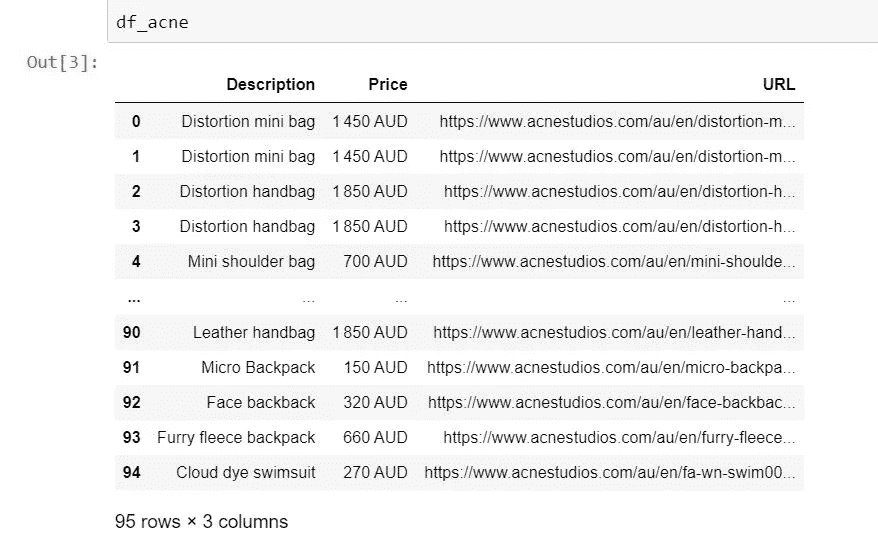

# 为三种常见用例构建一个 Web Scraper

> 原文：<https://levelup.gitconnected.com/building-a-web-scraper-for-three-common-use-cases-7a5ffc88284f>

## 分页搜索、无限滚动和图像搜索——使用 Python 的实用分步指南


由 [Unsplash](https://unsplash.com?utm_source=medium&utm_medium=referral) 上 [charlesdeluvio](https://unsplash.com/@charlesdeluvio?utm_source=medium&utm_medium=referral) 拍摄的照片

# 动机

最近，我在当地零售商的[网站](https://www.harveynorman.com.au/computers-tablets/computers/laptops)上浏览新笔记本电脑，发现自己不得不手动记下多台笔记本电脑的品牌、规格和价格(用于比较)，同时浏览多页搜索结果。我向我的合作伙伴表达了我对手工操作的失望，他也表达了对一个电子商务网站的类似失望。

然后，我探索了一个潜在的案例，使用 web scraper 将网站上的内容手动转换为结构化(例如表格)数据。本文针对以下三(3)种常见使用情形，提供了此类 web 刮刀的实用分步指南:

1.  搜索跨多个页面返回搜索结果的网站(“分页搜索”)
2.  通过手动向下滚动(“无限滚动”)搜索返回更多搜索结果的网站
3.  下载网站上托管的图像(“图像抓取”)

# 网页抓取的非技术性介绍

用户在网站上遇到的大多数内容实际上是一些 HTML 代码的输出。这些代码通常由所有网站都遵循的一些通用规则编译而成。这意味着在网站“前端”对用户可见的内容被存储在 HTML 代码的相关层中，并且可以通过查询 HTML 代码的相关层来下载。

用于本文目的的 web 抓取器主要使用 [BeautifulSoup](https://beautiful-soup-4.readthedocs.io/en/latest/) 和 [Selenium](https://selenium-python.readthedocs.io/) 库在 Python 中构建。特别是，BeautifulSoup 库提供了从网站背后的 HTML 代码中搜索、查询和返回数据的功能，而 Selenium 库支持浏览器自动化(例如，在 Google Chrome 或 Firefox 浏览器中执行某些操作)。

# 用例 1:用于分页搜索的 Web Scraper

为了演示这个用例，我们将从 [Sephora](https://www.sephora.com.au/search?q=foundation&page=1) 网站上搜集与搜索“基金会”相关的数据(不要评判)。我们将从导入 Python 库开始，如下所示。

```
from bs4 import BeautifulSoup
from selenium import webdriver
import pandas as pd # for storing data in a dataframe
```

然后，我们将尝试使用 Google Chrome 来抓取搜索的“第一页”上感兴趣的数据，然后在此基础上对所有其他页面进行 For 循环。为了分别抓取化妆品的**品牌**、**描述**和**价格**，我们首先将网站的 HTML 代码解析为一个名为 *soup_sephora* 的 Python 对象，如下所示。

```
## url of page 1 of a search for "foundation" on the Sephora website
url = "[https://www.sephora.com.au/search?q=foundation&page=](https://www.sephora.com.au/search?q=foundation&page=)1"## The option below prevents Chrome from physically opening 
options = webdriver.ChromeOptions()
options.add_argument('--headless')## Download and specify the location of the chromedriver
driver = webdriver.Chrome(
                          executable_path = r'C:\Users\Jin\Documents\Webscraping\Drivers\chromedriver.exe',
                          chrome_options = options
                           )
driver.get(url)## Return the HTML codes
soup_sephora = BeautifulSoup(driver.page_source, 'lxml')
```

我建议将 HTML 代码(存储在 *soup_sephora* 对象中)粘贴到可搜索的文档类型中，例如 Microsoft Word 或 Notepad，因为它有助于识别我们需要查询以返回感兴趣的数据的属性。举例来说，页面 1 上每个产品的价格属性都存储在 HTML 结构中的“product-price”类中，这可以通过对给定产品的价格执行“CTRL+F”来识别。在 YSL foundation 定价为$95 的实例中，如下面的第一张图片所示，这是作为“product-price”类下的文本字符串嵌入到 *soup_sephora* 对象中的，如下面的第二张图片所示，可以通过在 Microsoft Word 文档中搜索“$95”来找到它。


图 1:丝芙兰[网站](https://www.sephora.com.au/search?q=foundation&page=1)截图


图 2: HTML 代码片段。作者图片

下面的代码返回 Python 列表中第 1 页上所有产品的价格。

```
soup_sephora.findAll(class_ = "product-price")
```

如上所述，搜索结果的第 1 页上的所有产品的品牌、描述和价格可以存储在熊猫数据框架中，如下所示。

```
brand = []
description = []
price = []url = "[https://www.sephora.com.au/search?q=foundation&page=](https://www.sephora.com.au/search?q=foundation&page=)1"options = webdriver.ChromeOptions()
options.add_argument('--headless')driver = webdriver.Chrome(
                                 executable_path = r'C:\Users\Jin\Documents\Webscraping\Drivers\chromedriver.exe',
                                 chrome_options = options
                                )
driver.get(url)
soup_sephora = BeautifulSoup(driver.page_source, 'lxml')i = 0for item in soup_sephora.findAll(class_ = "product-card-brand"):
    i = i + 1
    brand.append(item.get_text(strip = True))for item in soup_sephora.findAll(class_ = "product-card-product"):
    i = i + 1
    description.append(item.get_text(strip = True))

for item in soup_sephora.findAll(class_ = "product-price"):
    i = i + 1
    price.append(item.get_text(strip = True))driver.close() ## Converting into a pandas dataframedf_sephora = pd.DataFrame(
                        {'Brand': brand,
                         'Description': description,
                         'Price': price
                        })df_sephora.head(10)
```

上面熊猫数据帧的输出如下图所示。


图 3:从网站上抓取的结构化内容——分页滚动。作者图片

请注意,“价格”列可能保证对与看似销售折扣相关的产品进行进一步的清理。

现在要抓取后续页面，只需用 for 循环包装上面的代码，并如下软编码 *url* 对象(在将列绑定到 dataframe 之前)。

```
## Specify number of pages for the For-Loop**for j in range(1, number of pages):** **url = "**[**https://www.sephora.com.au/search?q=foundation&page=**](https://www.sephora.com.au/search?q=foundation&page=)**" +       str(j)** **INSERT CODE ABOVE per Page 1 Scrape **
             .
             .
             .
```

# 用例 2:无限滚动的 Web Scraper

无限滚动是一种网站设计，当用户向下滚动一页时，它会加载更多的内容，不再需要分页(用户需要单击才能看到后续页面)。这使得为用例 1 构建的 For 循环用处不大。

也就是说，无限滚动也可以通过模仿向下滚动的 web scraper 实现自动化。这可以通过告诉 scraper 在将 HTML 代码解析为 Python 对象之前，首先滚动网页的整个长度，等待几秒钟(以便加载内容)，然后再次滚动网页的整个长度，直到它到达无限滚动的结尾来实现。

为了演示这个用例，我们将从 [Acne Studio](https://www.acnestudios.com/au/en/search?q=handbag) 网站上收集与搜索“眼袋”相关的数据。

我们需要的 Python 库在很大程度上符合用例 1，并增加了以下内容:

```
import time ## for setting a wait time
from urllib.parse import urljoin ## for joining strings for urls
```

我们将从启动 Google Chrome 开始，根据用例 1 设置 URL，并指定“滚动，等待几秒钟，然后再次滚动”的动作顺序，如下所示。

```
options = webdriver.ChromeOptions()
options.add_argument('--headless')driver = webdriver.Chrome(executable_path = r'C:\Users\Jin\Documents\Webscraping\Drivers\chromedriver.exe'
                         , chrome_options = options)
url_acne = "[https://www.acnestudios.com/au/en/search?q=bag](https://www.acnestudios.com/au/en/search?q=handbag)s"
print(url_acne)driver.get(url_acne)time.sleep(2)  # Allow 2 seconds for the web page to open
scroll_pause_time = 2 # wait 2 seconds for web page to load

screen_height = driver.execute_script("return window.screen.height;")   # get the screen height of the webi = 1while True:
    # scroll one screen height each time
    driver.execute_script("window.scrollTo(0, {screen_height}*{i});".format(screen_height = screen_height, i = i))  
    i += 1
    time.sleep(scroll_pause_time)
    # update scroll height after each scroll
    scroll_height = driver.execute_script("return document.body.scrollHeight;")  
    # Break the loop at the very end of the web page
    if (screen_height) * i > scroll_height:
        break
```

一旦我们到达无限滚动的物理末端，我们就可以存储 HTML 代码并使用与用例 1 相同的方法下载感兴趣的数据，如下所示。对于这个用例，我们将分别为每个手提包下载**描述**、**价格**和**图片 URL** 。

```
description = []
price = []
url = []
soup = BeautifulSoup(driver.page_source, "html.parser")for desc in soup.find_all(class_ = "product-tile__name"):

    description.append(desc.get_text(strip = True))

for desc in soup.find_all(class_ = "product-tile__price font--monospace"):

    price.append(desc.get_text(strip = True))

for item in soup.find_all(class_ = "tile__link"):

    base = "[https://www.acnestudios.com/](https://www.acnestudios.com/)"
    link = item.attrs["href"]
    url_join = urljoin(base, link)

    url.append(url_join)## Converting into a pandas dataframe
df_acne = pd.DataFrame(
                        {
                         'Description': description,
                         'Price': price,
                         'URL': url
                        })df_acne
```

dataframe 输出的示例如下所示。如果没有无限滚动，数据帧可能只包含 10 多条记录。



图 4:从网站上抓取的结构化内容——无限滚动。作者图片

# 用例 3:图像刮擦

图像抓取指的是一种自动化，其中网站托管的图像被下载并系统地保存在本地计算机中。由于以下原因，这可能很有用:

*   网站发布的图片有可能在日后被删除
*   下载的图像可以离线重新访问(即没有互联网)
*   可以以更全面的方式查看下载的图像(例如，按特定顺序，或按命名约定)

为了演示这个用例，我们将从 [MangaPark](https://v2.mangapark.net/manga/h2/i294558/c1) 网站抓取一个漫画系列下的所有图像。随着整个漫画保存在个人电脑本地，人们可以轻松地浏览漫画页面，而不是在网上点击每一章的“下一页”按钮，并在中间遇到大量的在线广告。

使用与用例 1 和 2 相同的 Python 库，我们(类似地)从尝试抓取单个章节下的图像开始，并使用 for 循环在这个抓取的基础上构建其他章节下的图像。对于日本漫画系列《H2》的[第一章](https://v2.mangapark.net/manga/h2/i294558/c1):

```
url = "[https://v2.mangapark.net/manga/h2/i294558/c1](https://v2.mangapark.net/manga/h2/i294558/c1)"
print(url)options = webdriver.ChromeOptions()
options.add_argument('--headless')
driver = webdriver.Chrome( 
                          executable_path = r'C:\Users\Jin\Documents\Webscraping\Drivers\chromedriver.exe',
                          chrome_options = options
                         )
driver.get(url)soup = BeautifulSoup(driver.page_source, 'html')## The number of images under a chapter varies, but the error skip
## lets us download up to 50 without an out-of-index error
## Image is saved and named in chronological order, in the H2 folder
## in the path where the Python script is savedtry:for i in range(50):    
        urllib.request.urlretrieve(str(soup.find_all(class_ = "img")[i].attrs["src"]),
                               "H2/" + str(i) + ".jpg".format(i))except:
    pass
```

一旦我们完成了上面的工作，就变成了定位“下一个”页面的 URL 并重复上面的抓取。这可以如下进行。

```
url = "[https://v2.mangapark.net/manga/h2/i294558/c1](https://v2.mangapark.net/manga/h2/i294558/c1)"
chapter_number = 338for j in range(1, upper_limit + 1):

    print(url)
    options = webdriver.ChromeOptions()
    options.add_argument('--headless')
    driver = webdriver.Chrome(
                              executable_path = r'C:\Users\Jin\Documents\Webscraping\Drivers\chromedriver.exe',
                              chrome_options = options
                             )
    driver.get(url)
    soup = BeautifulSoup(driver.page_source, 'html')try:for i in range(50):    
            urllib.request.urlretrieve(str(soup.find_all(class_ = "img")[i].attrs["src"]),
                                   "H2/" + str(j) + "_" + str(i) + ".jpg".format(i))except: ## number of pictures may vary on a webpage
        pass## Below locates the URL for the "Next" page
base_url = "[https://v2.mangapark.net/](https://v2.mangapark.net/)"
    next_page = soup.find_all("a", href = True)[12].get("href")url = urljoin(base_url, next_page)
```

现在坐下来，一边喝茶，一边享受阅读 H2 漫画的乐趣(我读了很多)。

# 结论

在这篇文章中，我展示了三(3)个带有现成代码的 web 抓取用例。这些用例可以很容易地扩展，以包括 HTML 代码在网站上拥有的附加属性——一个供读者探索的属性！

作为下一步，戴上我的精算师/数据科学家的帽子，我将探索商业机会，例如监控竞争对手网站的变化或收集评论网站上客户的潜在正面/负面评论——请关注此空间！