# 用 FastAPI 构建网站启动器

> 原文：<https://levelup.gitconnected.com/building-a-website-starter-with-fastapi-92d077092864>

## 快速 API 入门


图片来自 [Pixabay](https://pixabay.com/?utm_source=link-attribution&amp;utm_medium=referral&amp;utm_campaign=image&amp;utm_content=4890800) 的[维基图片](https://pixabay.com/users/wikiimages-1897/)

[更新:2022–1–18 Python 依赖项和引导 5]

# 介绍

在本文中，我们将使用 [FastAPI](https://fastapi.tiangolo.com/) 、 [Jinja2Templates](https://jinja.palletsprojects.com/en/2.11.x/templates/) 和 [Bootstrap](https://getbootstrap.com/) 创建一个简单的静态网站启动器。您可以以此为基础，根据自己的需要填充特定于站点的路线和模板/视图。

FastAPI 是一个现代、快速(高性能)的 web 框架，用于基于标准 Python 类型提示用 Python 3.6+构建 API。

您可以跟随本文一起编写代码，或者下载文件。

[演示](https://fastapi-webstarter-demo.deta.dev/)

如果你想免费托管你的 FastAPI app，请阅读 Heroku 的 [**到 Deta 免费托管 Python 项目**](https://medium.com/mkdir-awesome/from-heroku-to-deta-to-host-python-project-for-free-1e967139e234) ***。***

```
**Table of Contents**
· [Creating a Virtual Environment](#16e4)
· [Creating a GitHub Repository (Optional)](#9a58)
· [Structure](#6052)
· [How to Use requirements.txt](#2bac)
· [Creating app/main.py](#eb36)
· [How to Add JinjaTemplates to FastAPI](#499c)
· [How to Add Static Files to FastAPI](#ed7a)
· [How to Use Jinja Templates](#78ed)
  ∘ [Creating base.html and other HTML files](#54eb)
· [How to Add Markdown Pages to FastAPI](#a31f)
· [How to Import Other Python Files in FastAPI](#2024)
· [How to Add Routers to FastAPI](#c05b)
· [How to Add .env File](#6a55)
· [How to Add Active Class to Menu](#846c)
· [Form: How to Add More Than One Form to FastAPI](#e696)
· [How to Add a Bootstrap Accordion Menu](#0133)
· [Testing](#69f2)
· [Conclusion](#7cf8)
· [Newsletter](#a3d9)
· [References](#427d)
```

# 创建虚拟环境

开始之前，让我们设置我们的虚拟环境。
我将使用 [pyenv + pyenv-vitualenv](https://towardsdatascience.com/python-environment-101-1d68bda3094d) ，你可以找到关于 [pyenv 和 pyenv-virtualenv](https://towardsdatascience.com/python-environment-101-1d68bda3094d#258a) 的更多细节。

对于 macOS 用户:

```
$ brew install pyenv 
$ pyenv install 3.9.6
$ brew pyenv-virtualenv
$ pyenv virtualenv 3.9.6 py396
$ mkdir my-fastapi-starter
$ cd my-fastapi-starter
```

# 创建 GitHub 存储库(可选)

你可以使用 [Gitstart](https://towardsdatascience.com/automate-creating-a-new-github-repository-with-gitstart-1ae961b99866) 创建一个新的 Github repo。

```
$ gitstart -d . -l python
```

这将为 Python 添加 run `git init`，添加 READM.md 和`[.gitignore](https://github.com/github/gitignore/blob/master/Python.gitignore)`。它会推送至你的 Github 账户。

# 结构

以下是项目结构。

```
.
├── README.md
├── app
│   ├── __init__.py
│   ├── library
│   │   ├── __init__.py
│   │   └── helpers.py
│   ├── main.py
│   ├── pages
│   │   ├── about.md
│   │   ├── contact.md
│   │   ├── home.md
│   │   ├── info.md
│   │   └── portfolio.md
│   └── routers
│       ├── __init.py
│       ├── accordion.py
│       ├── twoforms.py
│       └── unsplash.py
├── requirements.txt
├── runtime.txt
├── static
│   ├── css
│   │   ├── mystyle.css
│   │   └── style3.css
│   ├── images
│   │   ├── favicon.ico
│   │   └── logo.svg
│   └── js
│       └── index.js
├── templates
│   ├── accordion.html
│   ├── base.html
│   ├── include
│   │   ├── sidebar.html
│   │   └── topnav.html
│   ├── page.html
│   ├── twoforms.html
│   └── unsplash.html
└── tests
    ├── __init__.py
    └── test_main.py
```

我们将为这个项目使用多个文件。在根目录下，我们创建了`app`、`static`、`templates`和`test`目录。因为它是一个 Python 包，我们在所有包含 Python 文件的目录中添加了一个空的`__init__.py`文件。我们在`app/library/helpers.py`中保留了所有的辅助函数。我们在`app/pages`目录中为网页编写 markdown 文件。我们将所有静态文件保存在`static`目录中，将所有模板保存在`templates`目录中。

# 如何使用 requirements.txt

在根目录下创建`requirements.txt`。

```
requests==2.26.0
fastapi==0.70.0
uvicorn==0.15.0
python-dotenv==0.19.1
aiofiles==0.7.0
python-multipart==0.0.5
jinja2==3.0.2
Markdown==3.3.4
pytest==6.2.5
```

我们需要`fastapi`和`uvicorn`来使用 FastAPI。我们使用`jinja2`作为模板引擎，`aiofiles`作为静态文件，`python-dotenv`作为环境变量。`python-multipart`是为了一个表格。`requests`是一个 HTTP 库。我们使用`Markdown`来渲染降价文件。

让我们从这个 rquirements.txt 安装 Python 包。

```
$ pip install -r requirements.txt
```

# 正在创建 app/main.py

我们从`app/main.py`开始。

然后在您的终端上运行:

```
$ uvicorn app.main:app --reload --port 8080
```

在您的浏览器上访问 [http://127.0.0.1:8080/](http://127.0.0.1:8080/) 和[http://127 . 0 . 0 . 1:8080/page/about](http://127.0.0.1:8080/page/about)。你可以看到第一页。

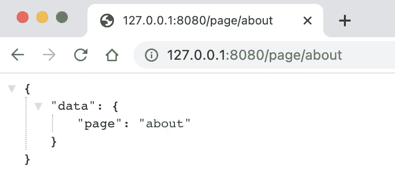

[http://127 . 0 . 0 . 1:8080/page/关于](http://127.0.0.1:8080/page/about)图片作者

**注意:**当你运行根目录下的`main.py`时:

```
$ uvicorn main:app --reload
```

因为我们把`main.py`移到了`app/main.py`，所以我们需要换到`uvicorn app.main:app`来运行这个应用程序。我们也可以将端口号设置为`--port 8080`。

# 如何将 JinjaTemplates 添加到 FastAPI

Jinja 是一种现代的、设计者友好的 Python 模板语言。

让我们添加 Jinja 模板引擎并创建`templates/page.html`。

在你的`app/main.py`:

第 1 行:从`fastapi`导入`Request`。
第 7 行:导入`Jinja2Templates`，设置模板目录`templates`。
第 10 行& 18:追加`request`作为参数。
第 14 行& 22:添加`request`作为返回值。
第 9 行& 17:指定`response_class`至`HTMLResponse`。
第 14 行& 22:返回`templates.TemplateResponse()`页面 HTML 和数据。

更新`template/page.html`:

```
<h1>
    Welcome to FastAPI Starter.
</h1>{{data.page}}
```

您可以使用`{{variable}}`来显示从`app/main.py`文件发送的值。

在您的浏览器上访问 [http://127.0.0.1:8080/](http://127.0.0.1:8080/) 和[http://127 . 0 . 0 . 1:8080/page/about](http://127.0.0.1:8080/page/about)。

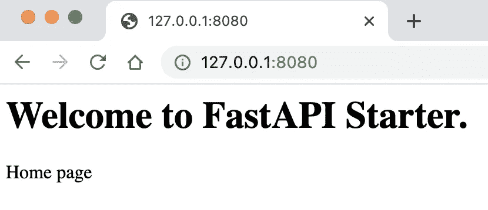

[http://127.0.0.1:8080/](http://127.0.0.1:8080/) 图片作者

# 如何向 FastAPI 添加静态文件

通过添加以下内容更新`app/main.py`:

第 3 行:从`fastapi.staticfiles`导入`StaticFiles`。
亚麻 9:挂载`static`目录。

# 如何使用 Jinja 模板

## 创建 base.html 和其他 HTML 文件

我们将使用[引导工具条](https://bootstrapious.com/p/bootstrap-sidebar)。这将加载[引导程序 4](https://getbootstrap.com/) 和[字体 Awesome](https://fontawesome.com/) 。请找到[边栏演示](https://bootstrapious.com/tutorial/sidebar/index3.html)。我们将 jQuery slim 版本改为完整版本，这样**我们就可以使用 AJAX** 。

请使用自己的字体牛逼套件。你可以从 Fontawesome 网站免费注册。

创建`templates/base.html` 和`templates/include/sidebar.html`。

`base.html` **:**

[Jinja 模板](https://jinja.palletsprojects.com/en/2.11.x/templates/#)使用``、``和``从子 HTML 中插入内容。
使用``来包含另一个 HTML 文件。当你从`static`目录加载文件时，像这样使用它们:

```
{{ url_for('static', path='/images/favicon.png') }}
```

**修改** `**templates/page.html**` **:**

``告诉模板引擎这个模板“扩展”了另一个模板`base.html`。`{{ super() }}`确保加载父内容。

`**templates/include/sidebar.html**`T32:

添加`templates/include/topnav.html`并使用[该代码](https://gist.github.com/shinokada/a090746256cc2abbd45489040260e0c7)。
使用此[样式代码](https://gist.github.com/shinokada/0090654be57ca9d8a0001f7770a9171f)添加`static/css/style3.css`。

到目前为止，您应该已经有了一个工作模板。

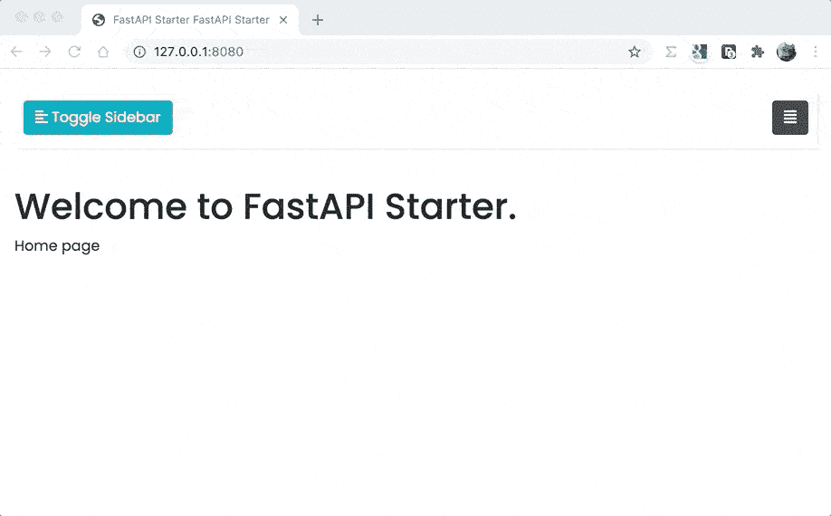

带有侧边栏的模板。图片作者。

创建`static/css/mystyle.css`:

我们在这个文件中添加我们的样式代码。

# 如何向 FastAPI 添加降价页面

使用 Markdown 比在 Python 文件中编写 HTML 容易得多。

您可以在`app/library`目录中添加您的所有助手代码。我们将创建`app/library/helpers.py`文件。这里我们添加一个助手函数。

该函数获取`app/pages`中的 markdown 文件，将其转换为 HTML 并返回。

# 如何在 FastAPI 中导入其他 Python 文件

在我们的`app/main.py`:

```
from .library.helpers import *
```

这将从`library/helpers.py`文件导入所有功能。现在我们可以使用`app/main.py`中的`openfile()`功能:

让我们创建`app/pages/home.md`、`app/pages/about.md`和`app/pages/info.md`。添加一些虚拟降价文本。

`app/pages/home.md`:

```
# Welcome FastAPI Web Starter
This project uses [FastAPI]([https://fastapi.tiangolo.com/](https://fastapi.tiangolo.com/)), [Jinja2]([https://jinja.palletsprojects.com/en/2.11.x/](https://jinja.palletsprojects.com/en/2.11.x/)), and [Bootstrap4]([https://getbootstrap.com/docs/4.1/getting-started/introduction/](https://getbootstrap.com/docs/4.1/getting-started/introduction/)).
```

这个设置也允许我们使用普通的 HTML 标签。

```
<div id="myarticle">
<h1>Welcome to FastAPI Starter</h1>
<p>
Please read <a href="https://levelup.gitconnected.com/building-a-website-starter-with-fastapi-92d077092864">my Medium article.</a>
</p>
<p>
This project uses <a href="https://fastapi.tiangolo.com/">FastAPI</a>, <a href="https://jinja.palletsprojects.com/en/2.11.x/">Jinja2</a>, and <a href="https://getbootstrap.com/docs/4.1/getting-started/introduction/">Bootstrap4</a>.
</p>
</div>
```

`app/pages/about.md`:

```
# AboutLorem ipsum dolor sit amet, consectetur adipiscing elit. Suspendisse velit nunc, tincidunt sed tempus eget, luctus venenatis ex. Morbi et felis pharetra, rhoncus erat et, feugiat ipsum...
```

`app/pages/info.md`:

```
# InformationLorem ipsum dolor sit amet, consectetur adipiscing elit. Suspendisse velit nunc, tincidunt sed tempus eget, luctus venenatis ex. Morbi et felis pharetra, rhoncus erat et, feugiat ipsum...
```

我们需要更新`templates/page.html`:

```
<main role="main" class="container">
    <div class="row">
        <div class="col">
            {{data.text|safe}}
        </div>
    </div>
</main><!-- /.container -->
```

Jinja 的内置过滤器，`[safe](https://jinja.palletsprojects.com/en/2.11.x/templates/?highlight=safe#safe)` [允许我们使用变量而不用转义。](https://jinja.palletsprojects.com/en/2.11.x/templates/?highlight=safe#safe)

访问 [http://127.0.0.1:8080/](http://127.0.0.1:8080/) :

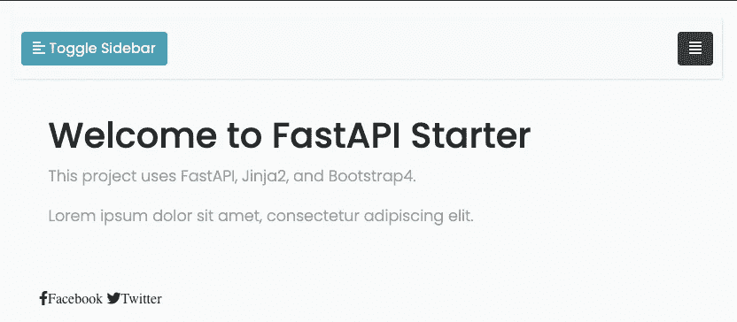

对主页使用 Markdown。图片作者。

访问[http://127 . 0 . 0 . 1:8080/page/info](http://127.0.0.1:8080/page/info):

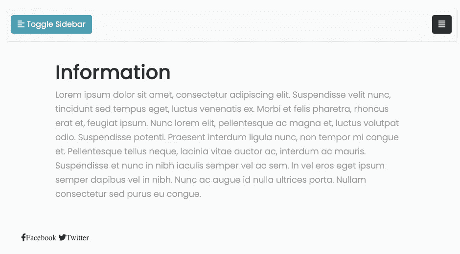

对信息页面使用降价。图片作者。

添加更多页面后，我们可以更新`templates/include/sidebar`和`templates/include/topnav`。

如果你添加一个链接`/page/portfolio`，那么你需要创建一个页面`app/pages/portfolio.md`。

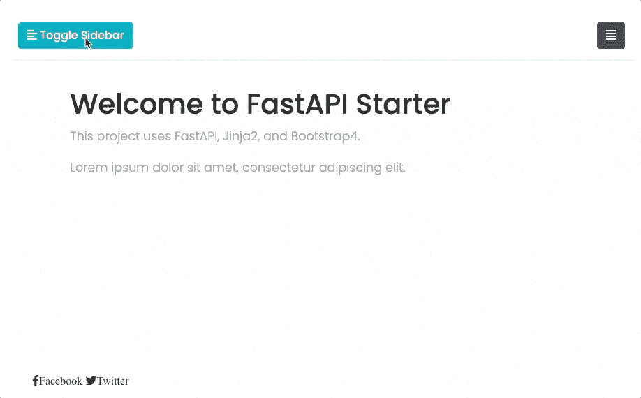

侧边栏正在运行。图片作者。

# 如何向 FastAPI 添加路由器

当你的项目变大时，你需要组织你的文件。一种方法是使用路由器。

在`app/main.py`中，从`routers`目录导入文件，使用`include_router()`添加路径。

```
from app.routers import unsplashapp.include_router(unsplash.router)
```

创建`app/routers/unsplash.py`。

第 1 行:从`fastapi`导入`APIRouter`。
第 7 行:追加`router = APIRouter()`。
第 9 行:用`@router`代替`@app`。

以上路线使用`templates/unsplash.html`:

这将从 Unsplash 中随机搜索图像。请在这里找到更多关于 [Unsplash API 的信息](https://unsplash.com/documentation)。

我们在顶部导航中有 Unsplash 菜单。

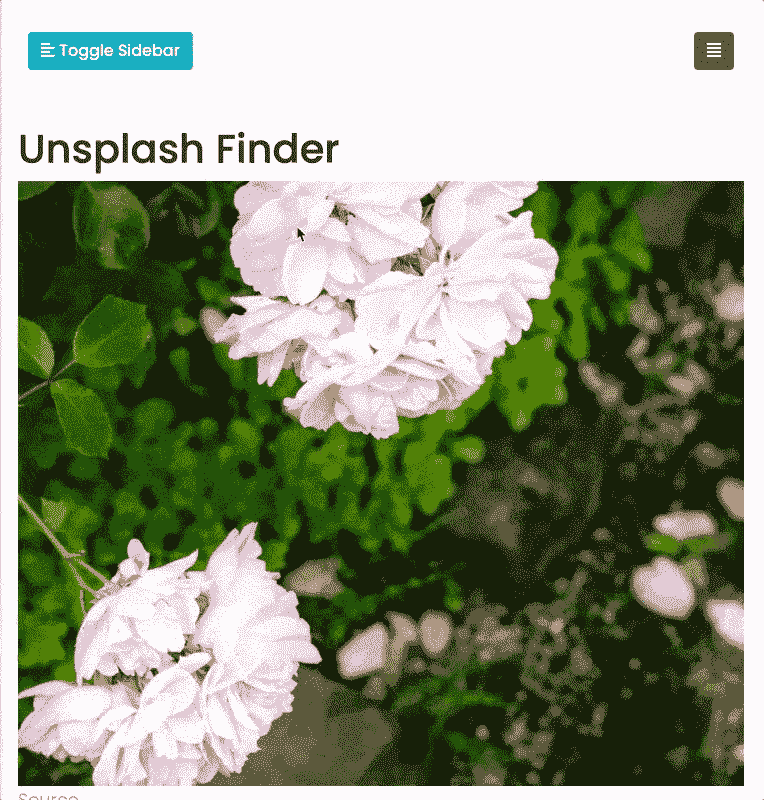

顶部菜单中的取消飞溅。图片作者。

# 如何添加。环境文件

当你想使用其他 API 或服务时，你需要存储像`access`或`secret`这样的外部设置。例如， [UnsplashAPI](https://unsplash.com/documentation#creating-a-developer-account) 提供访问密钥和秘密密钥。你不应该公开这些。通常，您将这些键保存在`.env`或一个环境文件中。您的`.gitignore`文件应该包含[您的环境文件](https://gist.github.com/shinokada/9d10cea9b76c64487ebd7d2ac8a173dd)。

当你运行`pip install -r requirements.txt`时，我们已经安装了 [python-dotenv](https://pypi.org/project/python-dotenv/) 。

在根目录下创建`.env`文件。

```
unsplash_key=12345
unsplash_secret=67890
```

修改`app/routers/unsplash.py`:

第 1 行:导入 os 模块。
第 6–7 行:导入`load_dotenv`并初始化。第 16 行:使用`os.getenv`返回环境变量的值。

现在，我们只是把它们打印到终端上。

**重启**服务器:

```
$ uvicorn app.main:app --reload --port 8080
```

并访问[http://127 . 0 . 0 . 1:8080/unsplash](http://127.0.0.1:8080/unsplash)查看您的终端:

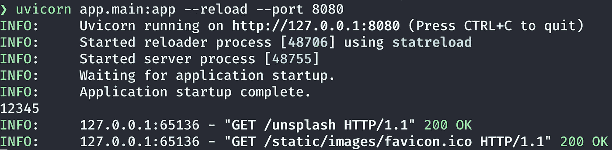

检查终端的环境变量输出。图片作者。

# 如何将活动类添加到菜单

让我们给顶部的导航项目添加一个类`active`，这样当你在那个页面上时，它会高亮显示导航项目。

更新`templates/include/topnav.html`:

第 16、19、22 行:我们为每个列表项添加了`{{'active' if active_page == 'page_name' }}`。您需要相应地更改`page_name`。

通过添加以下行来更新`templates/unsplash.html`:

```

```

这将变量`active_page`设置为`unsplash`。

让我们创建`templates/twoforms.html`:

第 2 行:我们将`active_page`设置为`twoforms`。

`templates/accordion.html`:

第 2 行:我们在上面的文件中将`active_page`设置为`accordion`。

Unsplash 菜单应该显示活动类。我们将在下一节介绍两个表单和折叠页面。

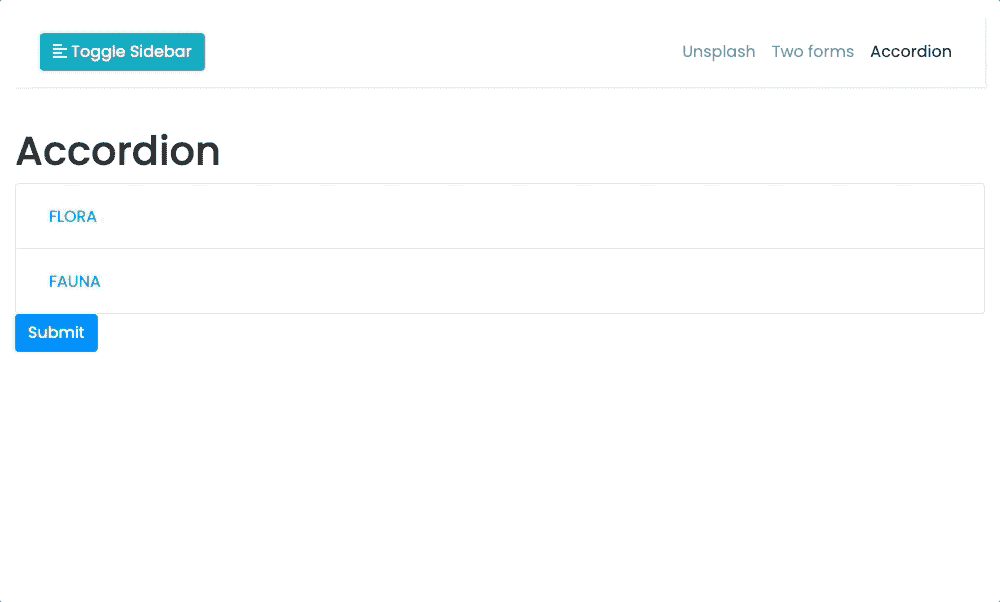

菜单项中的“活动”类。图片作者。

# 表单:如何向 FastAPI 添加多个表单

你可以找到关于如何定义文件和表单域的 [FastAPI 文档。](https://fastapi.tiangolo.com/tutorial/request-forms-and-files/)

这里，我们将添加两个表单。

通过添加路由器更新`app/main.py`:

FastAPI 使用了`python-multipart`，我们已经安装了它。(请参见 requirements.txt。)

更新`templates/twoforms.html`:

第 18 & 24 行:我们添加了不同的动作链接。第 14–16 行:使用 Jinja 的 if 语句显示结果。

创建`app/routers/twoforms.py`:

第一行:我们从`fastapi`进口`Form`。
第 2 行:添加`HTMLResponse`渲染 HTML。我们创建了两个不同的端点。
第 16 行& 22:我们指定`number`参数。数字字段将作为表单数据上传，并在每个 post 函数中接收它。

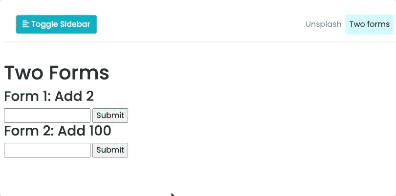

这两种形式在起作用。图片作者。

**手风琴占位符**

因为我们添加了`accordion`路线，所以我们需要创建它。

创建`app/routers/accordion.py`:

创建`templates/accordion.html`:

# 如何添加一个自举折叠菜单

更新`templates/accordion.html`:

这里我们使用了[引导崩溃](https://getbootstrap.com/docs/4.0/components/collapse/#accordion-example)。

更新`app/routers/accordion.py`:

类似于前面的例子，两个表单，我们从`fastapi`导入`Form`，从`fastapi.responses`导入`HTMLResponse`。

我们创建一个 post 端点并返回所选择的标签。

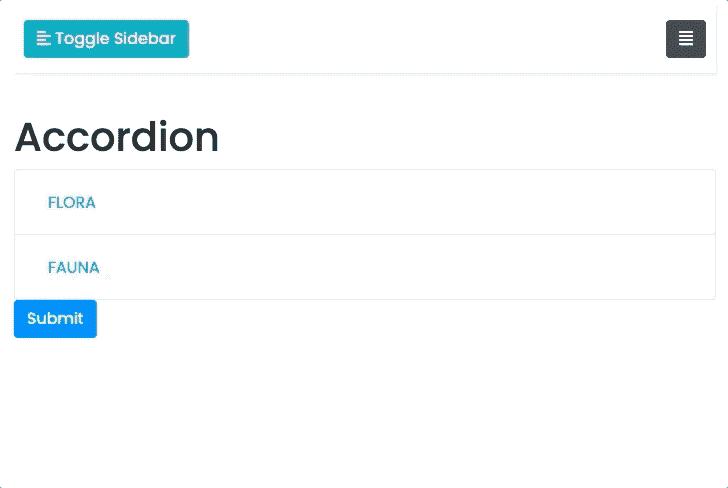

手风琴菜单的作用。图片作者。

# 测试

FastAPI 使用 [Starlette 测试客户端](https://fastapi.tiangolo.com/tutorial/testing/)。对于我们的例子，我们需要使用`from app.main`,因为在`app`目录中有`main.py`。以下是该项目的简单测试代码。

第 1–2 行:导入`TestClient`和`app`。
第 4 行:创建`TestClient`对象。
第 9 行:追加`headers`。
第 10 行:断言 HTTP 状态代码 200。
第 11 行:断言`response.content`中的句子。
第 12–13 行:断言我们的样式表的状态代码是否为 200。

在根目录中，在终端中运行以下命令来运行测试:

```
$ pytest -v
```

标志`-v`表示增加输出的详细程度。

如果要在测试运行开始时移除所有缓存内容:

```
$ pytest --cache-clear
```

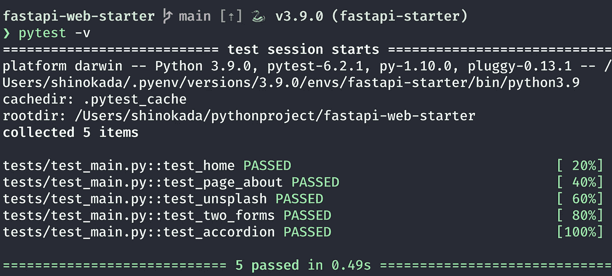

pytest -v 输出。作者图片

# 结论

我们在本文中讨论了模板、静态文件、路由器、降价、导入其他 python 文件、环境变量、表单。在创建这个静态网站时，我发现不仅 [FastAPI 的文档](https://fastapi.tiangolo.com/tutorial/)有用，而且 [Jinja 的文档](https://jinja.palletsprojects.com/en/2.11.x/templates/)也有用。

为了创建这个简单的 web starter，我们只涉及了一些 FastAPI 特性。您可以探索和添加更多功能。我希望本文为您的 FastAPI 项目提供了一个良好的开端。

# 更新

[更新:2022–1–5 Bootstrap 5]
[更新:2021–11–07 FastAPI&依赖版本]
[更新:2021–08–15，Python，FastAPI 和依赖版本]

**通过** [**成为**](https://blog.codewithshin.com/membership) **的会员，可以完全访问媒体上的每一个故事。**


请点击此链接订阅。

# 参考

*   [FastAPI](https://fastapi.tiangolo.com/)
*   [金佳](https://jinja.palletsprojects.com/en/2.11.x/templates/)
*   [自举 4](https://getbootstrap.com/)
*   [FastAPI 测试](https://fastapi.tiangolo.com/tutorial/testing/)