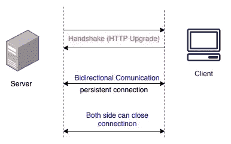

# 在 Golang 中构建 Websocket 通道以传输实时加密货币数据

> 原文：<https://levelup.gitconnected.com/building-a-websocket-channel-in-golang-to-stream-real-time-cryptocurrency-data-117841ef7806>

## with WebSocket 入门

照片由 [Dmitry Demidko](https://unsplash.com/@wildbook?utm_source=medium&utm_medium=referral) 在 [Unsplash](https://unsplash.com?utm_source=medium&utm_medium=referral) 上拍摄

加密货币数据更新非常快，我们总是需要获取最新的数据。传统的 HTTP 请求速度不够快，无法获得最新的数据。所以我们需要使用 **WebSockets** 来获取实时数据。

在这篇文章中，我们将讨论如何在一个真实的例子中实现 WebSocket。

# 什么是 WebSockets？

WebSocket 是一种允许客户端和服务器之间进行通信的协议。这是一个全双工协议，意味着双方都可以互相发送消息。通信连接是长期的。这意味着客户端和服务器之间的实时通信是可能的。

如果你想了解更多关于 WebSocket 的细节，你可以阅读下面这篇文章。

 [## 深入研究 WebSockets

### 了解每个开发人员都应该知道的 WebSockets 的重要属性

blog.bitsrc.io](https://blog.bitsrc.io/deep-dive-into-websockets-e6c4c7622423) 

# WebSocket 入门

## 先决条件

*   [大猩猩 WebSocket 包](https://github.com/gorilla/websocket)
*   [coin cap trade web socket streams](https://docs.coincap.io/#9d1f0874-aa46-420c-9091-8bf9859c0743)API

在下面的例子中。我们将连接到一个加密货币 WebSocket 服务器，并接收实时交易数据。

## 步骤 1:创建连接

`websocket.DefaultDialer.Dial`是 [gorilla/WebSocket](https://github.com/gorilla/websocket) 包中的一个函数。它返回给定 URL 的新 WebSocket 连接。

## 步骤 2:数据建模

我们将要接收的数据流中的每个数据记录都是一个 JSON 字符串，它包含以下字段:

交易对象

*   `Exchange`:交易所名称，如币安、Bitfinex 等。
*   `Base`:正在交易的货币，如比特币、dogecoin 等。
*   `Quote`:被交易的货币，如比特币、dogecoin 等。
*   `Direction`:贸易的方向。可以是“买”也可以是“卖”。
*   `Price`:交易价格。
*   `Volume`:交易的报价币种金额。
*   `Timestamp`:交易的毫秒时间戳。
*   `PriceUsd`:以旧换新的美元价格。

## 第三步:流式数据

在这一部分中，我们将从 WebSocket 读取数据流，并将其发送到 Golang 通道。

*   1️⃣我们定义了一个渠道类型贸易。
*   2️⃣:我们定义了一个匿名函数，当收到新消息时调用这个函数。
*   3️⃣ `ReadMessage`的方法是从 WebSocket 连接中读取下一条消息。
*   4️⃣:我们将消息解组到交易结构中。
*   5️⃣:我们将贸易结构发送给渠道。
*   6️⃣，我们关闭频道。

## 第四步:数据管道

在这个阶段，我们只过滤 dogecoin 交易，并将它们发送到输出通道，然后打印到控制台。

我希望你喜欢这篇文章，并对 WebSocket 有所了解。如果您觉得这篇文章有用👏？看看我下面的其他文章吧！

 [## Golang 频道是如何工作的

### 了解戈朗通道的内部运作

levelup.gitconnected.com](/how-does-golang-channel-works-6d66acd54753)  [## 举例说明戈兰语中的固体原理

### 对于有经验的程序员来说，这些坚实的原则并不陌生。它们为我们提供了如何安排功能和…

levelup.gitconnected.com](/solid-principles-in-golang-explained-by-examples-4a4cccf47388)  [## Golang 中的观察者设计模式及实例

### 在 Golang 中实现观察者设计模式

levelup.gitconnected.com](/observer-design-pattern-in-golang-with-an-example-6c24898059b1)