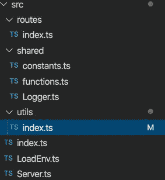
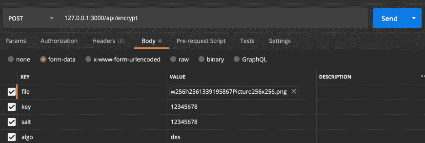

# 用 NodeJS、TypeScript 和 Express 构建加密文件的 API

> 原文：<https://levelup.gitconnected.com/building-an-api-for-encrypting-files-with-nodejs-typescript-and-express-3b31480cf4b3>

在本教程中，我们将建立加密用户文件的快速 API。与其他文件加密服务相比，它有一些优势，用户可以选择加密算法，服务器不会保存文件，所有操作都将在内存中完成。

我们的应用程序应该接受一个带有其他参数的文件，这些参数描述了它应该如何被加密，并且它应该能够加密\解密这个文件并将其发送回客户端。听起来不错。开始吧！

> 要理解这里发生的事情，您应该熟悉基本的 JavaScript 和 TypeScript。

为了创建一个项目，我们将使用“express-generator-typescript”。

在你的终端运行`npx express-generator-typescript "projectName"`。
然后通过运行`cd projectName`CD 到这个项目，安装所有的包`npm install`，并在你的代码编辑器中打开这个文件夹。

在 src 文件夹中，您将有许多我们不需要的文件，这些文件是由脚本生成的。您可以将其中一些作为文件和导入文件删除。这是你的 src 文件夹的截图。如果您没有一些文件，请不要担心，我们稍后会创建它们。

我们来编辑 Server.ts 文件吧！转到一个文件的末尾，删除注释下面写着“提供前端内容”的代码块，但是不要碰导出。我们这样做是因为我们不会渲染任何前端。我们将只关注应用程序的后端。

因为我们希望根据用户的请求访问文件，所以我们还应该安装 express 中间件，以便能够轻松地做到这一点。这个包叫做“快速文件上传”。要安装它，运行`npm i express-fileupload --save`。然后在 Server.ts 中导入，并通过添加以下行使 express 使用它:

我们在这里做的是应用中间件。因此，当 express 收到请求时，它会调用 fileUpload 来处理请求，这样我们就可以轻松地访问文件。我们作为参数提供的对象是选项。在那里，我们规定了文件大小的限制(5MB ),并要求 fileUpload 在文件大小超过限制时发送 403 代码。如果您想了解更多选项，请访问 packages [GitHub 页面](https://github.com/richardgirges/express-fileupload)。

现在让我们为我们的应用程序创建路线。转到 src/routes/index.ts，它应该是这样的:

删除第 8 行并在第 2 行导入，因为我们的项目中不需要用户，而是添加 2 个新的 POST 路由。

所以现在我们可以通过这条路线`/api/encrypt`和`/api/decrypt`访问这些路线。为什么会有`api`？因为我们刚刚创建了子路由，并且通过这一行`app.use(‘/api’, BaseRouter)`将它们添加到`api`下的 Server.ts 文件中

让我们在 src 中创建一个 utils 文件夹，并在那里创建 index.ts 文件。在这里，我们将存储我们所有的助手方法。我们将创建的第一种方法将用于加密。

让我们回顾一下这个要点。首先，我们导入了 crypto，这个包默认包含在 Node 中，所以你不需要安装任何东西。在接下来的 2 行中，我们为 TypeScript 导入了类型，在最后一次导入中，我们导入了尚不存在的文件。但是我们将很快创建它，它将保存一个具有所有可用加密算法的对象。

然后我们为我们的函数创建了类型。我想那里的一切都很明显。我们的函数将接受文件，解密值(如果它是假的，我们将加密文件，否则解密)，然后一个有 3 个密钥的主体。Algo 将包含一个我们将用于加密的算法名称，key 和 salt 将包含用于加密\解密文件的值。

> 你可能知道什么是密钥，它基本上是一个文件的密码。**但是盐是什么？**它的另一个名字是**初始化向量**。它是添加到文件开头的一组随机字节。因此，如果有人破解了你的加密文件，他就不能解密其他文件，因为盐是不同的。至少应该是。因此，请确保每次加密文件时都提供不同的 salt。密钥可能是相同的。

继续讨论函数本身。`decrypt`参数默认为假，`algo`默认包含一个“aes-256-ctr”字符串，它是算法的名称。该算法需要 32 位密钥和 16 位初始化向量。所以对于 key 和 salt，我们生成随机字节，并将其转换为十六进制字符串(16 字节转换为十六进制将成为 32 位字符串)。该函数将返回一个缓冲区。

在函数中，我们首先决定我们应该做什么，加密还是解密。然后使用参数创建新的加密/解密实例，然后通过连接`cipher.update()`和`cipher.final()`获得加密/解密文件缓冲区。`update`方法对数据进行加密，在调用`final`方法之前可以使用。最后，我们返回加密/解密文件缓冲区。

让我们返回到路线并使用我们的功能。

如您所见，我们首先从请求文件中获取文件字段。因此，您应该在文件字段中将文件发送到服务器。然后，我们将这个文件传递给我们刚刚创建的函数，并将其发送回客户端。

但这不是结束。很可能它不能正常工作，我们仍然应该添加一个参数检查，并设置头来告诉客户端我们想要发送一个文件。所以让我们开始吧。

但是首先，让我们定义我们的服务器将接受什么算法。cryptos `createcipheriv`函数可以与安装在您机器上的 OpenSSL 支持的任何算法一起工作。要列出所有可用的密码算法，请在终端中运行`openssl list-cipher-algorithms`。

让我们从列表中选择 3 种算法。在`shared/constants`中添加一个新的常量算法列表。我们将定义密钥和初始化向量所需的算法名称和位。

回到我们的`utils/index.ts`。

因此，我们添加了一些函数来检查文件是否存在，如果提供了所有的参数，并且 key 和 salt 具有有效的长度。然后我们设置头，`Content-Type`会给客户端关于文件扩展名的信息，`Content-disposition`会给客户端关于文件名的信息。

让我们使用这些函数。

好了，我们的 API 已经准备好了！让我们测试一下。我会用邮递员。你可以在[链接](https://www.postman.com/)免费下载。

在我们项目的根文件夹中运行`npm run start:dev`。

发送用这些参数创建一个请求(我已经附上了图片)并发送它。

如果你得到的回复是一个无法读取的文件，那么一切都正常！保存这个文件，我们将测试解密功能。

现在创建另一个请求并附加这个加密文件

点击发送按钮。

如你所见，我收到了最初发送的文件。感谢意味着一切正常！

感谢您阅读本文！如果有用，请鼓掌并跟随。

GitHub 链接到已完成并略有改进的项目:[https://github.com/webmarkyn/cryptme-server](https://github.com/webmarkyn/cryptme-server)