# 使用 Tokio 和 Warp 构建带 Rust 的 API

> 原文：<https://levelup.gitconnected.com/building-an-api-using-warp-and-tokio-26a52173860a>

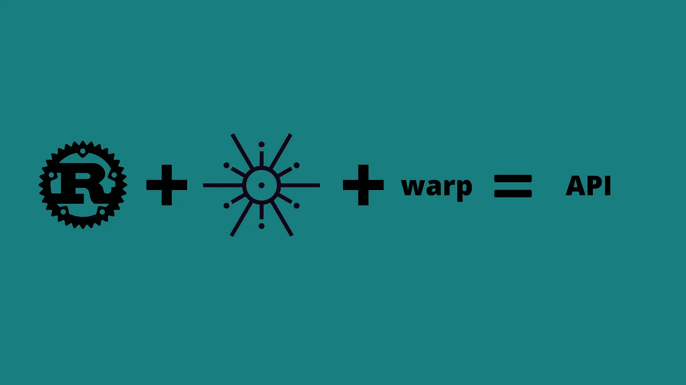

一个使用 Warp 和 Tokio 构建简单异步 API 的示例项目。

本教程通过构建一个异步 CRUD API 来介绍 Warp 框架。我写这篇文章的目的如下:

1.  熟悉 Warp 框架。
2.  更加熟悉在 Rust 中使用 async/await
3.  更好地理解 Rust 中的 API 设计

# 设计

在进入任何编码之前，我将勾画出 API 的设计。这将有助于确定必要的端点、处理函数以及如何存储数据。

## 路线

对于这个 API，我只需要两条路线。

```
/customers 
    - GET -> list all customers in data store - POST -> create new customer and insert into data store 
/customers/{guid} 
    - GET -> list info for a customer 
    - POST -> update information for a customer 
    - DELETE -> remove customer from data store
```

## 经理人

根据定义的路线，我需要以下处理程序:

```
list_customers -> return a list all customers in database create_customer -> create a new customer and add it to the database get_customer -> return the details of a single customer update_customer -> update the details of a single customer delete_customer -> delete a customer from the database
```

## 数据库ˌ资料库

现在，我将只使用内存中的数据存储来跨路由处理程序共享。

我使用 [Mockaroo](https://www.mockaroo.com/) 生成客户数据的 JSON 数据集。数据是一个 JSON 数组，其中每个对象具有以下结构:

```
{
    "guid": "String",
    "first_name": "String",
    "last_name": "String",
    "email": "String",
    "address": "String"
}
```

此外，一旦服务器启动，数据库模块将需要能够初始化数据存储。

# 属国

截至目前，我知道我将需要以下依赖项:

*   [Warp](https://crates.io/crates/warp)—Rust 的 web 服务器框架
*   [Tokio](https://crates.io/crates/tokio)—Rust 的异步运行时间
*   [Serde](https://crates.io/crates/serde) —用于将 JSON 转换为类型化数据的 de/serialization 库，反之亦然。

# 履行

## 模型

我想做的第一件事是定义我的客户模型，并开始向代码中添加一些结构。

在`main.rs`中，定义一个名为`models`的新模块，如下所示:

```
mod models;

fn main() {
    // ...
}
```

然后创建一个名为`models.rs`的新文件，并添加以下内容:

```
pub struct Customer {
    pub guid: String,
    pub first_name: String,
    pub last_name: String,
    pub email: String,
    pub address: String,
}
```

由于我正在设计一个 API，这个数据结构需要能够在 JSON 之间转换。我还希望能够将结构复制到数据存储中或从数据存储中复制出来，而不必担心借用检查器。

为了实现这一点，我将添加一个 derive 语句来使用 Serde 库中的几个宏和 Rust 中的几个宏。现在`models.rs`看起来像这样:

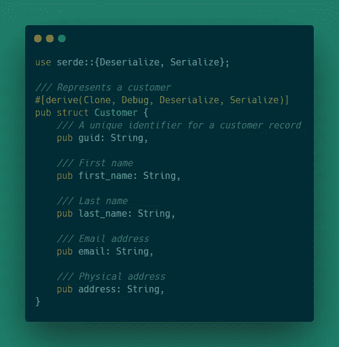

## 数据库ˌ资料库

这个示例 API 的数据库将是一个内存数据库，它是`Customer`模型的一个向量。然而，数据存储将需要跨多个路由共享，因此我们可以使用 Rust 的一个智能指针和一个互斥锁来实现线程安全。

首先，用一个名为`db`的新模块更新`main.rs`:

```
mod db;
mod models;

fn main() {
    // ...
}
```

然后创建一个名为`db.rs`的新文件。

在这个文件中有几件事情要做，但是首先要做的是定义数据存储的外观。

一个简单的数据存储只是一个`Customer`结构的向量，但是它需要被包装在一个线程安全的引用中，以便能够在多个异步处理程序中使用数据存储的多个引用。

将以下内容添加到`db.rs`:

```
use std::sync::Arc;
use tokio::sync::Mutex;

use crate::models::Customer;

pub type Db = Arc<Mutex<Vec<Customer>>>;
```

现在我们已经定义了数据存储的结构，我们需要一种初始化数据存储的方法。初始化数据存储有两种结果，要么是空的数据存储，要么是加载了数据文件中的数据的数据存储。

一个空的商店是相当直接的。

```
pub fn init_db() -> Db {
    Arc::new(Mutex::new(Vec::new()))
}
```

但是为了从文件中加载数据，我们需要添加另一个依赖项:

*   [serde_json](https://crates.io/crates/serde_json) —用于读取原始 json

将以下内容添加到`Cargo.toml`文件中:

```
serde_json = "1.0"
```

现在我们可以用下面的内容更新`db.rs`:

```
use std::fs::File;
use serde_json::from_reader;

pub fn init_db() -> Db {
    let file = File::open("./data/customers.json");
    match file => {
        Ok(json) => {
            let customers = from_reader(json).unwrap();
            Arc::new(Mutex::new(customers))
        },
        Err(_) => {
            Arc::new(Mutex::new(Vec::new()))
        }
    }
}
```

该函数试图读取位于`./data/customers.json`的文件。如果成功，该函数返回一个装载了客户数据的数据存储，否则返回一个空向量。

`db.rs`现在应该是这样的:

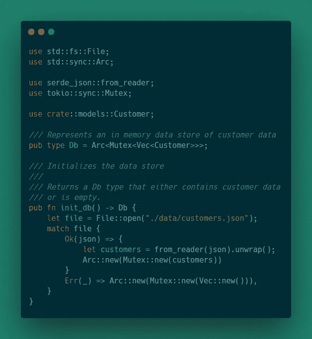

## 经理人

至此，我们已经有了模型和数据库设置。现在我们需要一种方法将它们联系在一起。这就是负责人介入的地方。

首先让我们在`main.rs`中定义一个新模块，并创建一个名为`handlers.rs`的新文件。

```
mod handlers;
```

我们还需要添加一些导入。在`handlers.rs`文件中添加以下内容:

```
use std::convert::Infallible;
use warp;

use crate::models::Customer;
use crate::db::Db;
```

这个代码片段使得我们在其他模块中定义的`Customer`模型和`Db`类型在`handlers`模块中可用。它还导入根`warp`模块和`[Infallible](https://doc.rust-lang.org/std/convert/enum.Infallible.html)`枚举，后者是永远不会发生的错误的错误类型。

现在提醒一下，下面是我们想要实现的处理程序:

*   list_customers ->返回数据库中所有客户的列表
*   create_customer ->创建一个新客户，并将其添加到数据库中
*   get_customer ->返回单个客户的详细信息
*   update_customer ->更新单个客户的详细信息
*   delete_customer ->从数据库中删除客户

## 列出客户

`list_customers`处理程序将引用数据存储作为参数，并返回一个包装 JSON 响应的`Result`类型。

函数定义将如下所示:

```
pub async fn list_customers(db: Db) -> Result<impl warp::Reply, Infallible> {
   // ... 
}
```

对于函数体，我们需要从数据存储中获取客户列表，并将其作为 JSON 对象返回。为了方便起见，`warp`提供了一个将 vector 转换成 json 对象的回复方法。

用以下内容更新函数:

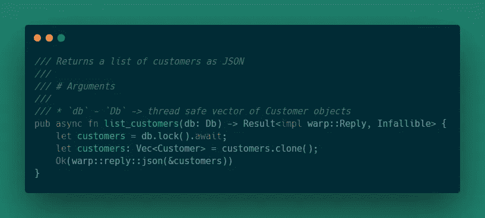

行`let customers = db.lock().await;`导致当前任务让步，直到可以获得锁并且可以安全地引用数据存储。

线条`let customers: Vec<Customer> = customers.clone()`将内部向量从`MutexGuard`中取出。

最后一行`Ok(warp::reply::json(&customers))`将 JSON 回复封装在`Result`类型的`Ok`变量中。

## 创建客户

`create_customer`处理程序将把一个`Customer`对象和一个对数据存储的引用作为参数，如果新客户被添加到客户列表中，则返回一个已创建的状态代码，如果客户已经存在，则返回一个错误的请求代码。

在我们使用这个函数之前，我们需要更新 warp import 语句以允许使用状态代码。

在`handlers.rs`中，将行`use warp;`改为如下:

```
use warp::{self, http::StatusCode};
```

这将允许使用`StatusCode`枚举作为响应。

函数定义将类似于`list_customers`处理程序，所以我们可以直接跳到完整的定义。

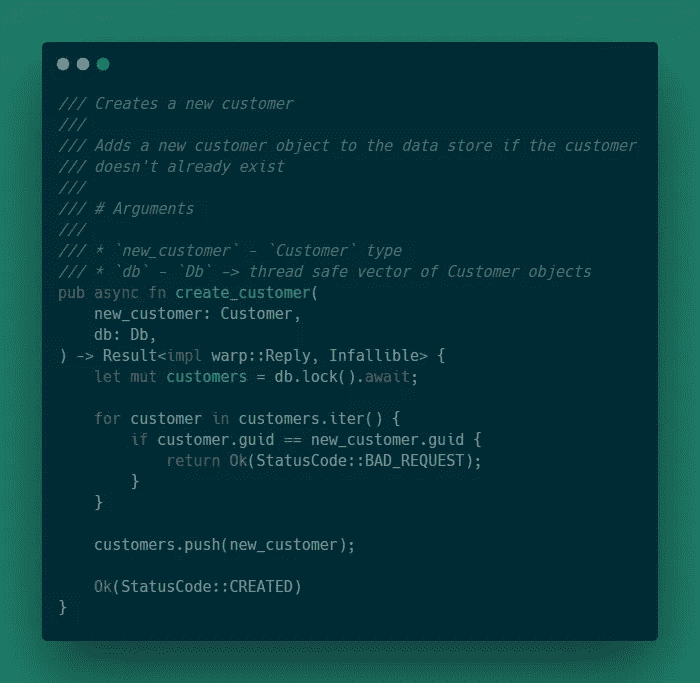

## 获取客户

`get_customer`处理程序将一个 guid 和一个数据存储引用作为参数，如果找到客户，则返回客户的 JSON 对象，否则返回默认客户。

在我们编写这个实现之前，我们需要向`Customer`结构添加一个宏。将`models.rs`中的`Customer`结构更新如下:

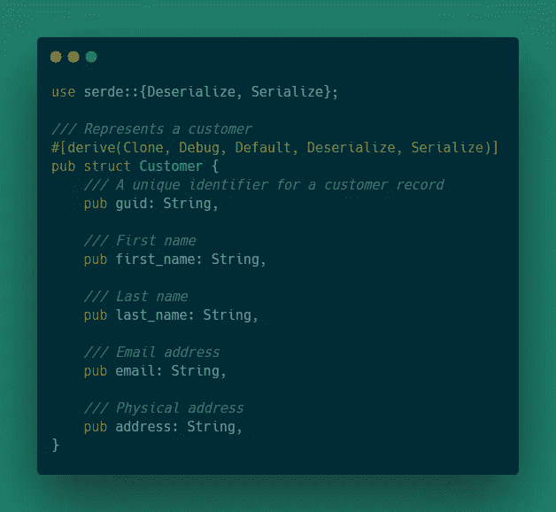

函数定义如下所示:

```
pub async fn get_customer(guid: String, db: Db) -> Result<Box<dyn warp::Reply>, Infallible> {

}
```

返回类型与其他函数略有不同。原因是我们需要能够返回一个 JSON 对象或者一个表明未找到错误的状态代码。由于`warp::reply::json()`和`StatusCode`实现了`warp::Reply`特征，我们可以使用[动态分派](https://doc.rust-lang.org/1.8.0/book/trait-objects.html)返回适当的类型。

有了正确的返回类型，我们的函数体相当简单:

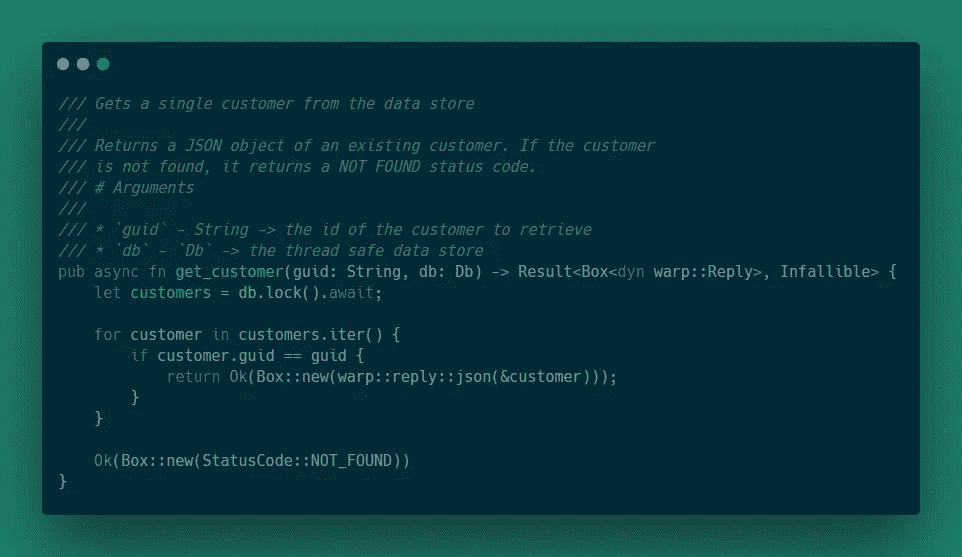

`update_customer`处理程序将一个客户和一个数据存储引用作为参数，如果找到并更新了客户，则返回一个状态代码 OK，如果客户不在数据存储中，则返回 NOT FOUND。

该函数应该如下所示:

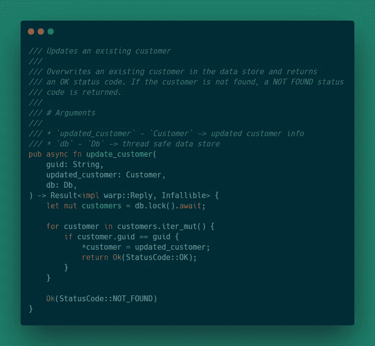

## 删除客户

`delete_customer`处理程序将 guid 和对数据存储的引用作为参数。该函数将删除具有匹配 guid 的客户，并返回无内容状态代码。如果没有找到匹配，那么它将返回一个未找到的状态代码。

该函数应该如下所示:

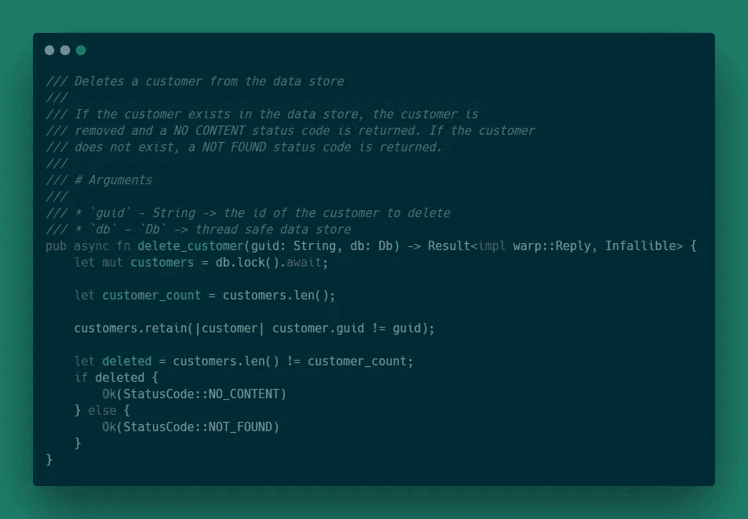

# 路线

我们现在已经实现了所有的处理函数。接下来，我们需要将调用处理程序的路由组合在一起。

在`main.rs`中，定义另一个模块:

```
mod routes;
```

然后，我们在`src`目录中创建一个名为`routes.rs`的文件，并添加以下内容:

```
use std::convert::Infallible;
use warp::{self, Filter};

use crate::db::Db;
use crate::handlers;
use crate::models::Customer;
```

首先，我们需要一个助手函数将数据存储的引用从路由传递到处理程序中。

将以下内容添加到`routes.rs`:

```
fn with_db(db: Db) -> impl Filter<Extract = (Db,), Error = Infallible> {
    warp::any().map(move || db.clone())
}
```

该函数允许将数据存储注入到路由中，并传递给处理程序。`Filter`是 warp 库中的一个特性。`Filter`特征提供了组合路由的功能，这些路由是一个或多个`Filter`方法的结果。这用一个例子会更有意义。

提醒一下，以下是我们需要定义的路线:

```
/customers
    - GET -> list all customers in data store
    - POST -> create new customer and insert into data store
/customers/{guid}
    - GET -> list info for a customer
    - POST -> update information for a customer
    - DELETE -> remove customer from data store
```

## 获取/客户

第一条路线将简单地获取数据存储中的所有客户。将以下内容添加到`routes.rs`:

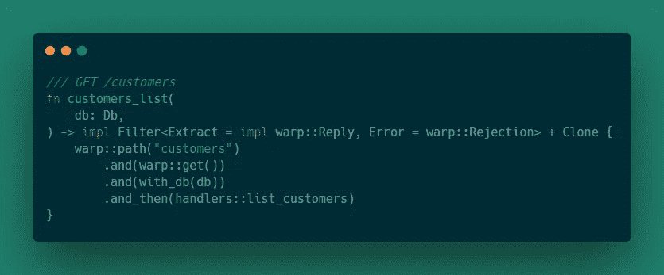

该函数返回一个实现`Filter`特征的类型。当出现匹配时使用`Extract`并返回`Extract`的值。

基本上，当请求的路径是“/customers”并且是一个 GET 请求时，该函数定义一个匹配的路由。

此外，为了节省以后的工作，我将实现另一个函数，作为所有客户路线的包装器。当我们把所有的事情都联系在一起的时候，事情会变得容易些。

因此将以下内容添加到`routes.rs`:

```
pub fn customer_routes(db: Db) -> impl Filter<Extract = impl warp::Reply, Error = warp::Rejection> + Clone {
    customers_list(db.clone())
}
```

## 邮政/客户

如果不存在新客户，此路线会向数据存储中添加一个新客户。

在我们为路由添加函数之前，需要添加一个助手函数来从 POST 请求体中提取 JSON。

将以下内容添加到`routes.rs`:

```
fn json_body() -> impl Filter<Extract = (Customer,), Error = warp::Rejection> + Clone {
    warp::body::content_length_limit(1024 * 16)
        .and(warp::body::json())
}
```

除了处理器之外，该功能与`customers_list`非常相似。将以下内容添加到`routes.rs`:

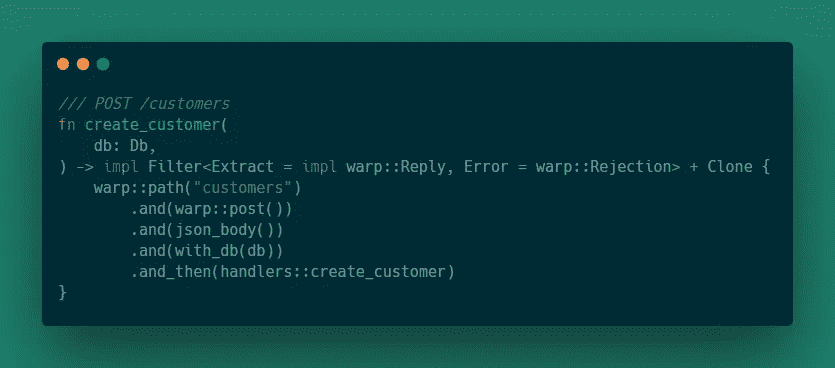

当路径为“/customers”并且是 post 请求时，此函数定义匹配的路由。然后从 post 请求和数据存储引用中提取 JSON，并传递给处理程序。

## GET /customers/{guid}

此路由将尝试从数据存储中检索单个客户。

该路由功能将从`warp`引入`path!`宏。这个宏使我们能够创建一个带有变量的路径。

在`routes.rs`中增加以下内容:

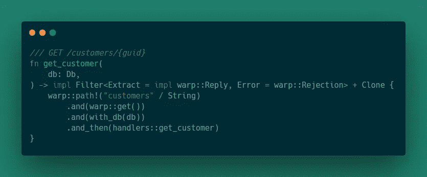

这定义了一个将匹配“customers/{some string value}”和一个 GET 请求的路由。然后，它提取数据存储并将其传递给处理程序。

对于路由，需要考虑的一件事是，应该首先检查最具体的路由，否则路由可能不匹配。

例如，如果路线的助手功能更新为:

```
pub fn customer_routes(
    db: Db,
) -> impl Filter<Extract = impl warp::Reply, Error = warp::Rejection> + Clone {
    customers_list(db.clone())
        .or(create_customer(db.clone()))
        .or(get_customer(db.clone()))
}
```

`get_customer`路由永远不会匹配，因为它们共享一个共同的根路径-“/customers”-这意味着客户列表路由将匹配“/customers”和“/customers/{guid}”。

要解决不匹配问题，请安排路线，使最匹配的路线排在最前面。像这样:

```
pub fn customer_routes(
    db: Db,
) -> impl Filter<Extract = impl warp::Reply, Error = warp::Rejection> + Clone {
    get_customer(db.clone())
        .or(customers_list(db.clone()))
        .or(create_customer(db.clone()))
}
```

## PUT /customers/{guid}

如果客户存在，此路由将尝试更新客户，并返回 OK 状态代码，否则返回 NOT FOUND 状态代码。

该路线看起来类似于创建客户路线，但它将匹配不同的路径。在`routes.rs`中增加以下内容:

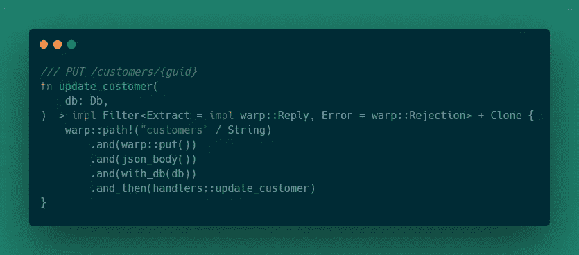

然后更新客户路线包装:

```
pub fn customer_routes(
    db: Db,
) -> impl Filter<Extract = impl warp::Reply, Error = warp::Rejection> + Clone {
    get_customer(db.clone())
        .or(update_customer(db.clone()))
        .or(create_customer(db.clone()))
        .or(customers_list(db))
}
```

## 删除/customers/{guid}

最后一个路由只是从数据存储中删除一个与给定 guid 匹配的客户，然后返回一个 NO CONTENT 状态代码，否则返回一个 NOT FOUND 状态代码。

将以下内容添加到`routes.rs`:

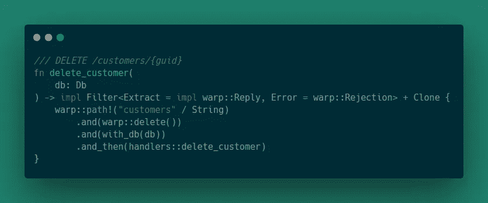

然后更新客户路由包装。添加完所有路由后，包装器应该如下所示:

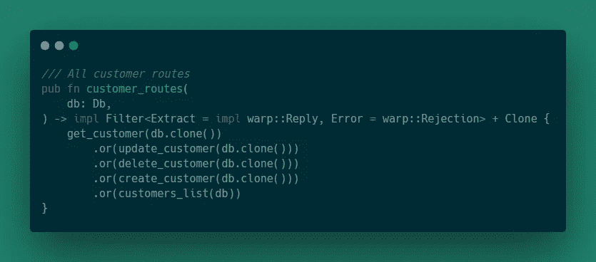

这结束了所有的路线。现在，我们可以继续将所有内容联系在一起。

# 主要的

`main.rs`会把所有的碎片拉在一起。它将初始化数据存储，获取所有路由，并启动服务器。这也是一个相当短的文件，所以我只展示全部内容:

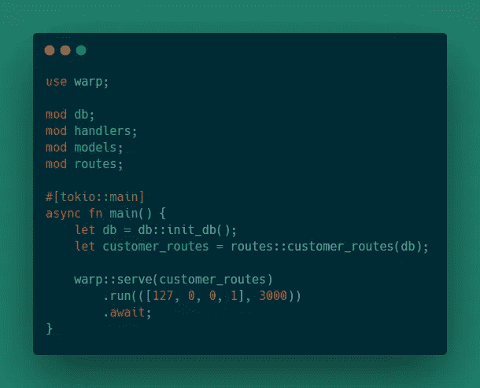

我们已经看到了前几行，所以让我们看看主函数。

函数属性`#[tokio::main]`为`tokio`运行时设置入口点。这允许我们将`main`函数声明为`async`。

`main`的前两行只是从我们的模块中调用函数。第一个初始化数据存储，第二个获取我们的客户路由包装器。

最后一行使用`warp::server`创建一个服务器，然后使用`run`在提供的主机和端口上启动服务器。我们使用`await`关键字让步，直到`run`函数完成。

# 回顾

这使用 Rust 和 Warp 框架完成了一个简单的 API。代码库可以在[这里](https://github.com/andrewleverette/rust_warp_api)找到。

然而，还是有可以改进的地方。

这里有一些想法:

*   可以添加测试来确认端点的行为符合预期
*   可以向`db`模块添加功能，以允许通过覆盖 JSON 文件来保存数据存储。
*   简单的数据存储可以用 PostgreSQL 甚至 MongoDB 这样的实际数据库来代替。
*   此外，当使用来自命令行的中断信号停止服务器时，会引发错误。这可以被重构以执行正常关机。

*原载于 2020 年 5 月 21 日*[*https://andrewleverette . github . io*](https://andrewleverette.github.io/warp-api/)*。*

