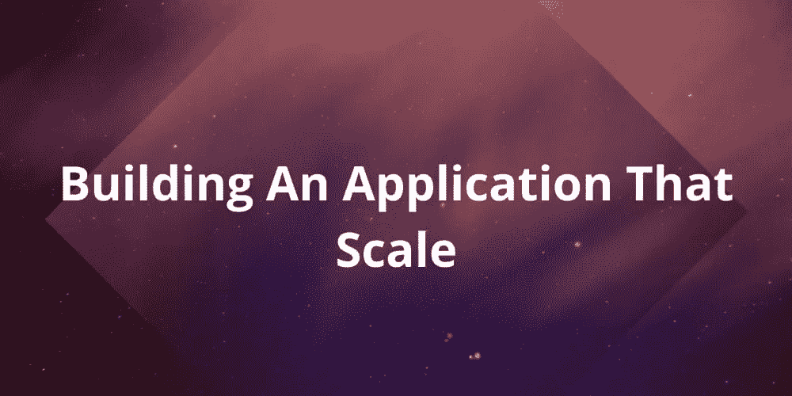

# 构建可扩展的应用程序

> 原文：<https://levelup.gitconnected.com/building-an-application-that-scale-f7020eceaa8d>

可伸缩性是应用程序处理越来越多的用户、顾客和客户的潜力。它还定义了应用程序的可维护性。在本文中，我们将研究生产应用程序可能出现故障的方式，以及我们如何修复它。我们将以一个假设的应用程序为例，看看我们如何从有限数量的用户扩展到支持大量用户。我们还将探讨生产应用程序中可能出现的一些问题，以及如何解决这些问题。

# 先决条件

您需要有在任何云提供商(如 Digital Ocean、AWS 或 Azure)上部署应用程序的经验，才能充分利用这一点。

让我们假设我们正在构建一个允许用户创建、读取、更新和删除 todo 任务的应用程序。这是一个简单的 reactjs 应用程序，它与 nodejs 后端对话，数据存储在类似 Postgres 的数据库中。在某个时间点，应用程序已经准备好了，现在是时候将应用程序部署到像数字海洋这样的云提供商，以便人们可以使用它。

# 初始应用程序设置

假设我们在数字海洋上提供了一个液滴。在数字海洋上，**虚拟私服** (VPS)被称为水滴。我们的 VPS 运行的是 Linux 分发系统(1GB 的 RAM 和 1vCPU ),我们的数据库和应用程序都运行在一台服务器上。

我们为我们的服务器配备了 1GB 的 RAM 和 1 个 vCPU，足以每天处理 100 个用户，一切都运行得非常好，但是有一天我们开始收到用户的投诉，说我们的网站不可用。我们查看服务器，发现由于数字海洋平台上的一些问题，我们提供的实例被删除，我们无法访问我们的数据库和应用程序。我们继续设置一切并重新部署网站，一切又都恢复了。但后来我们开始收到用户的投诉，说他们无法登录，我们查看了数据库，发现因为服务器崩溃，我们所有的数据都丢失了，我们没有任何备份。因此，我们向我们的用户道歉，并要求他们创建一个新帐户，从头开始。

因此，我们开始实施备份策略，我们编写一个 **cron 作业**，它每天运行两次，以获取数据库的备份并将其存储在服务器上，这样无论何时出现问题，我们都可以恢复数据。但是我们不能将备份保存在服务器上，因为当服务器崩溃时，它将与备份一起消失，我们无法恢复它。为了解决这个问题，我们将备份推送到 amazon s3，这样即使我们的服务器没有了，我们也可以访问备份。我们还会不时验证备份，以确保我们的备份是可恢复的。现在我们有了一个数据库备份，我们的用户很高兴并且有信心使用我们的应用程序。

过了一段时间，我们发现我们的应用程序又停机了，我们的用户收到 500 和404 的错误消息。我们转到服务器，发现 droplet 在那里，与第一种情况不同，它被删除了，所以我们决定通过 ssh 查看服务器的日志，找出问题所在，但我们没有找到任何日志。这是因为我们正在写入标准输出，所以我们试图猜测问题所在，因为我们的用户收到了 404 错误消息。 这可能意味着应用程序关闭，即节点服务器没有运行来解决这个问题，我们重新启动服务器，一切工作正常。 因此，我们改进了我们的逻辑，并开始将日志写入文件，这样无论何时我们的应用程序关闭，我们都可以从文件中访问日志。我们还实现了自动重启逻辑，这样每当我们的应用程序关闭时，它就会自动重启。我们在一些流程管理器的帮助下实现了这一点，如 **PM2** 或 **systemd** ，一切都恢复正常。

随着时间的推移，尽管我们的应用程序启动了，我们的用户开始收到一些 500 的错误消息，但由于我们有一个日志，我们可以很容易地查看服务器日志，并知道什么是错误的。因此，我们查看服务器日志，发现我们的**数据库连接池已经饱和**，我们的应用程序无法访问数据库，这是因为它无法创建到数据库的连接。

# 什么是连接池？

连接池是一种保持数据库连接开放和重用的策略。连接到数据库可能是一项开销很大的任务，因此有一个连接池，每当数据库客户机使用完它时，它就释放它，以便任何人都可以重用它，而无需打开新的连接。

在我们当前的情况下，可能是一些客户端没有关闭连接，所有连接都已用完，客户端无法创建到数据库的新连接，这就是为什么我们会收到 500 的错误消息。这是因为我们使用数据库默认配置，我们没有正确配置数据库，所以我们重新访问数据库连接并增加池大小。我们的应用程序已修复并恢复正常。

现在，我们的应用程序是正常的，但同时对美国用户来说很慢，这是因为到达服务器需要太多的跳跃。我们目前的服务器在南非，但我们的目标是全球市场。为了解决这个问题，我们决定在客户端和服务器端使用一些**缓存机制**来加快请求速度，我们还通过以下方式改变了一些部署策略:

*   将静态资产部署到 s3
*   用 Redis 缓存动态内容。有了这些改变，我们的应用程序更快了，我们的用户也很高兴。

我们发现我们的存储在增加，日志占据了大部分存储，这种空间不足导致我们的流程变慢。为了解决这个问题，我们实现了**日志旋转**

# 什么是日志轮换？

日志轮换是系统管理中使用的一个自动化过程，在该过程中，一旦日志文件太旧或太大，就会对其进行压缩、移动(归档)、重命名或删除(此处还可以应用其他指标)。在我们的例子中，我们按日期分割日志，一段时间后日志被删除，这意味着我们的日志不会堆积在服务器上。

我们再次注意到我们的**内存和 CPU** 消耗在增加。这是因为我们只有一台服务器，我们的数据库和应用程序都运行在同一个服务器上，并且在竞争资源。为了解决这个问题，我们决定将数据库和应用程序的服务器分开，现在我们有**内存和 CPU** 用于分开的服务器，两者不再争夺资源，我们的应用程序现在可以服务更多用户。

我们不断获得越来越多的牵引力，这意味着我们的数据库有更多的负载要处理，我们有 **cron 作业**每天运行两次来备份我们的数据，我们有如此多的数据要处理，我们的应用程序变慢了，因为我们的数据库忙于 **cron 作业**实施备份。为了解决这个问题，我们注意到我们的应用程序有更多的**读**而不是**写**这是因为用户检索待办事项多于创建它们，所以我们决定拆分读/写副本:

*   正在写入主数据库。
*   读取辅助数据库。有了这些，因为我们知道我们的读取比写入多，所以我们可以不断添加更多的数据库来读取。

# 什么是数据库复制？

数据复制是制作多个数据副本并将它们存储在不同位置以提高它们在网络中的整体可访问性的过程。数据库复制通过将主服务器上的负载分散到分布式系统中的其他节点上，有效地减少了主服务器上的负载。这修复了我们的数据库问题，一切都恢复正常。

一段时间后，我们的应用程序无法承受来自用户的负载，我们查看了基础架构，发现我们的单个应用程序无法承受我们的负载，因此我们决定添加更多应用服务器，并使用**负载平衡器**

# 什么是负载平衡器？

负载平衡是在多个计算资源之间分配工作负载。对于 web 应用程序，这意味着将 web 流量分布在多个服务器实例上。为了横向扩展我们的应用程序，我们创建了一个负载平衡服务器，它平衡运行我们应用程序的所有应用服务器的流量。负载平衡器将接收传入我们站点的流量，并将该流量代理到所有应用服务器。这解决了我们的问题，我们的服务器可以处理更多的用户。

我们又遇到了一个不同的问题，因为我们有多台服务器，我们的日志被分成这些实例，每当我们遇到问题时，我们都必须通过 ssh 访问所有实例，并逐个查看日志来识别问题。为了解决这个问题，我们决定整合 **ELK 栈**。

# 麋鹿栈是什么？

ELK stack 是一个缩写词，用来描述由三个流行的开源项目组成的堆栈:Elasticsearch、Logstash 和 Kibana。因此，我们没有将日志写入服务器文件，而是决定将日志写入 logstash，从那里将日志索引到弹性搜索，kibana 为我们提供了对服务器上日志的搜索和利用，通过这种设置，我们可以在不停机的情况下为大量用户提供服务。

总的来说，系统设计还有更多的东西，还有很多细节，我就不一一赘述了。