# 为 Salesforce 图像处理构建 AWS 集成

> 原文：<https://levelup.gitconnected.com/building-an-aws-integration-for-salesforce-image-handling-d85cec41297>

# 介绍

在本文中，我们将了解一种解决方案，它不仅可以将您的 Salesforce 图像存储卸载到 Amazon Web Services (AWS ),还可以按需调整和渲染这些图像。通过将图像存储卸载到其他解决方案，您的组织可以释放 Salesforce 存储容量。

我们将从 Salesforce 现场服务构建一个示例用例，但是还有许多其他场景可以利用这些技术。安装了现场服务的 Salesforce 组织和 AWS 帐户是本文的先决条件。

# 用例

对于我们的示例，我们将查看一个虚构的物业维护公司 Acme Maintenance。Acme 代表其客户管理财产安全检查。现场检查员使用 Salesforce 现场服务记录他们在访问中的发现。

作为现场访问的一部分，检查员在他们的移动设备上拍摄大量照片，并将这些照片保存回 Salesforce。Acme 希望在提供给客户的服务报告中使用这些图像。

Acme 发现，随着站点访问量的增加，再乘以每次访问的图像数量和这些图像的大小(除此之外，他们还希望在 Salesforce 中看到这些图像的合理大小的缩略图，并将其显示在服务报告中)，他们将达到 Salesforce 上的初始默认文件存储限制。虽然他们可以轻松地在 Salesforce 中购买更多文件存储，但他们的 Salesforce 架构师建议平台外存储可能更好。

为了解决这个问题，我们将研究图像存储和图像处理(调整大小、裁剪、定向等)与 AWS 的接口。

# AWS 服务

对于我们的用例，我们将查看 AWS 参考架构之一，[无服务器图像处理器](https://aws.amazon.com/solutions/implementations/serverless-image-handler/)，并利用 [AWS CloudFormation](https://aws.amazon.com/cloudformation/) 来部署它。在某些方面，您可以将 CloudFormation 比作 Salesforce 元数据，这是一种以声明性的、基于脚本的方式部署资源的方法。

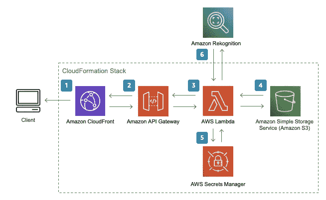

[AWS 文档](http://docs.aws.amazon.com/solutions/latest/serverless-image-handler/welcome.html)更为详细，但总的来说，我们将利用以下组件:

*   **Cloudfront** :将请求负载平衡到 API 中
*   **API 网关**:发布外部 API 供使用
*   **λ**:处理图像处理的无服务器应用
*   **S3** :原始上传图像和日志文件的存储
*   **秘密管理器**(可选):如果您使用图像 URL 签名功能，那么您可以从这里检索数字签名的秘密。
*   **Rekognition** :如果你需要内容审核、智能裁剪、面部识别等等。

# AWS 配置

通过使用 CloudFront 模板，我们不需要对这些 AWS 技术了解很多；我们只需完成几个配置步骤。请注意，在本例中，我们将采用默认设置，而不是启用高级功能。建议您通读[实施指南](https://docs.aws.amazon.com/solutions/latest/serverless-image-handler/welcome.html)。

## 为你的图像创建一个 S3 桶

第一个任务是创建一个 S3 存储桶来存储我们的原始图像文件。选择一个唯一的小写 bucket 名称，然后选择地理上离您最近的地区。选中“阻止所有公共访问”复选框

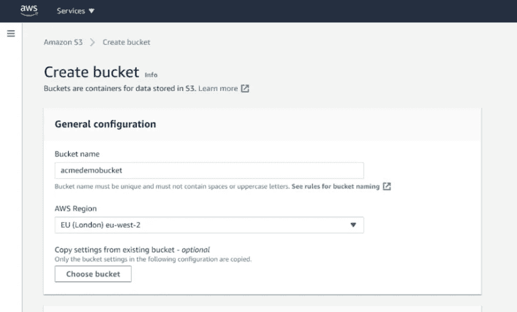

## 部署云架构堆栈

从[无服务器图像处理程序主页](https://aws.amazon.com/solutions/implementations/serverless-image-handler/)，点击 AWS 控制台中的**启动，开始部署您自己的实例。**

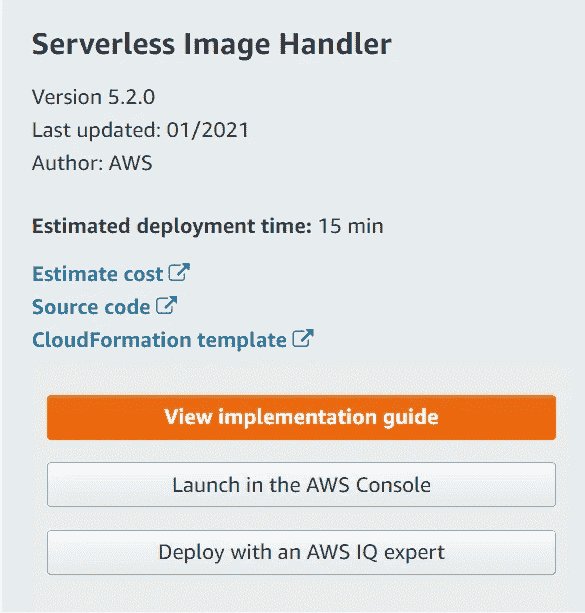

在开始填充字段之前，请确保在 CloudFormation 页面的屏幕右上角选择您的 AWS 区域。选择与上一步中的 S3 时段相同的区域。

CloudFormation 模板的路径应该是预先填充的。点击下一个的**。**

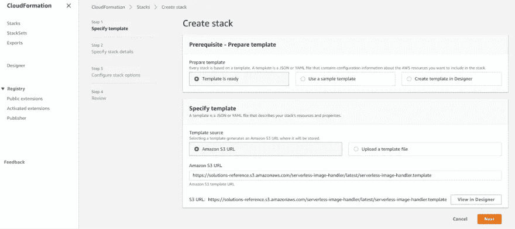

在下一个屏幕上，我们为堆栈指定一个名称，并提供我们的 S3 存储桶的名称。在“演示用户界面”中选择“否”,然后再次点击下一步。在“配置堆栈选项”页面上，接受默认值并再次单击下一步。

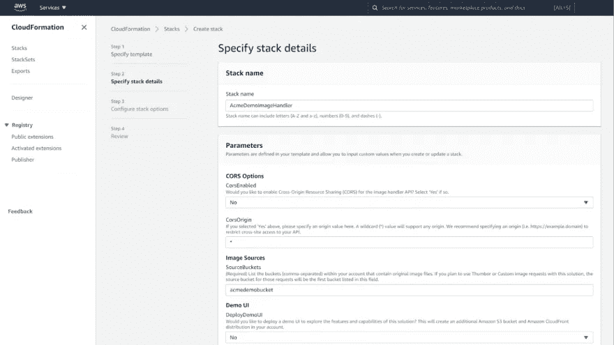

最后，在查看页面上，单击**创建堆栈**按钮。刷新页面时，您将看到堆栈构建的进度，这可能需要几分钟时间。然后，你会看到这个:

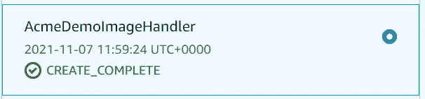

最后一步，我们需要转到构建的**输出**选项卡并复制`ApiEndpoint`参数的值，因为我们将在我们的 Salesforce 构建中使用它。

# Salesforce 构建

## 自定义对象和字段

在 Salesforce 中，我们将首先创建一个名为**工作订单附件图像**的新自定义对象，它将保存与工作订单相关的任何图像附件的信息。需要注意的关键字段是**图像 RTF** 、**原始图像 URL** 和**调整图像 URL** 。当询问是否将相关列表添加到工作单页面布局时，请务必选择它。

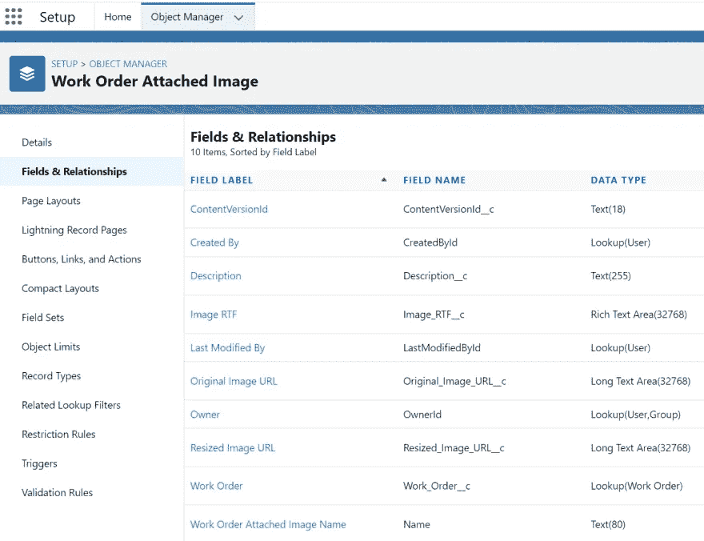

# 自定义元数据

接下来，我们需要创建一个定制的元数据类型来存储我们的配置设置。在设置中，搜索**自定义元数据**，并使用如下所示的自定义字段创建一个名为 **AWS 设置**的新类型:

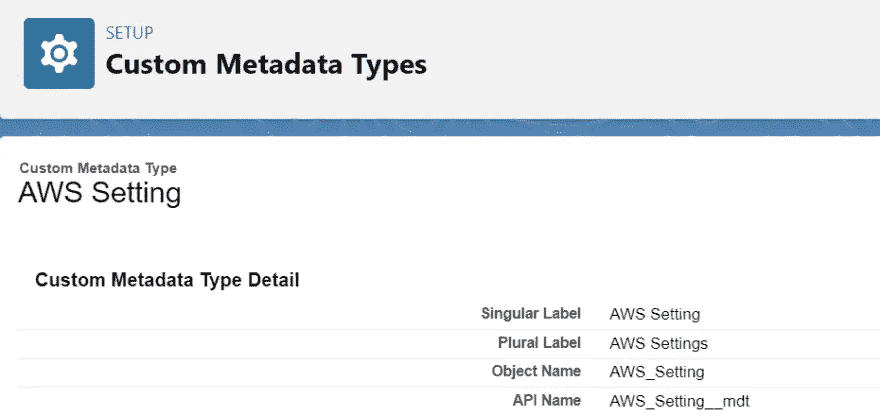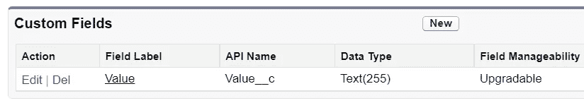

创建完成后，点击**管理 AWS 设置**按钮，添加以下三个设置并保存。

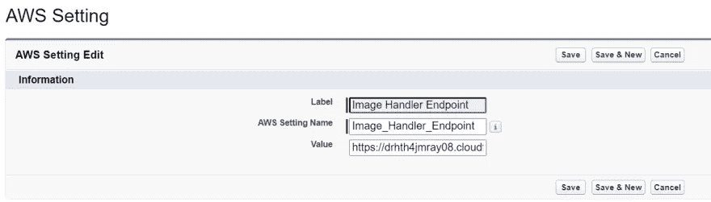

对于图像处理程序端点值，使用来自 AWS CloudFormation 的`ApiEndpoint`值。

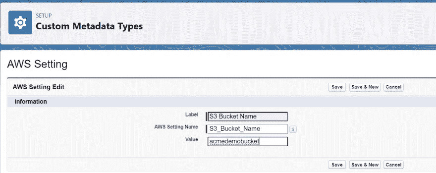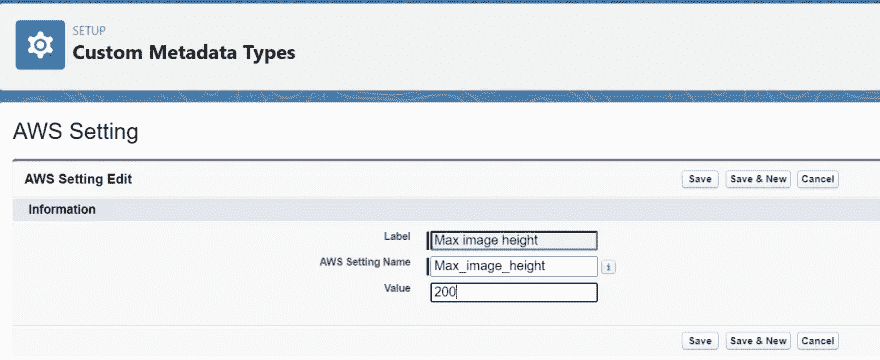

# 命名凭据

我们的下一个配置项目是安全处理从 Salesforce 对 AWS 的访问。在设置中，搜索**命名凭证**并创建以下两个凭证，替换您自己的 AWS URL、区域和来自您的 AWS 用户的访问密钥/密码。确保**名称**字段如屏幕截图所示，因为这将在后面的代码中使用。

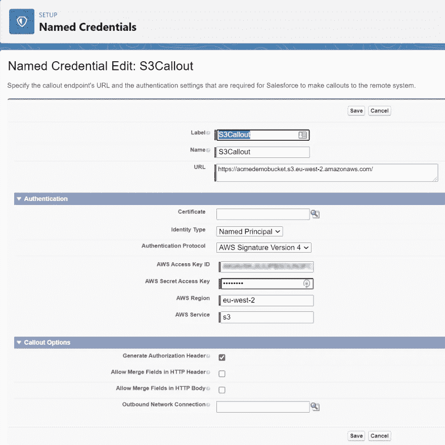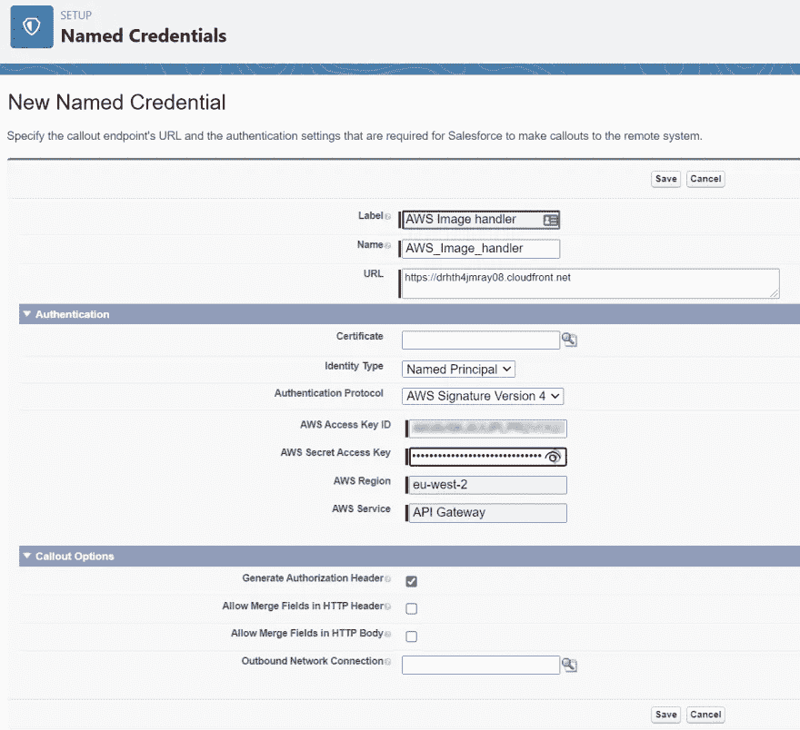

# 远程站点设置

为了让来自 AWS 的图像出现在我们的服务报告中，我们需要通过**远程站点设置将 API 端点添加为可信域。**

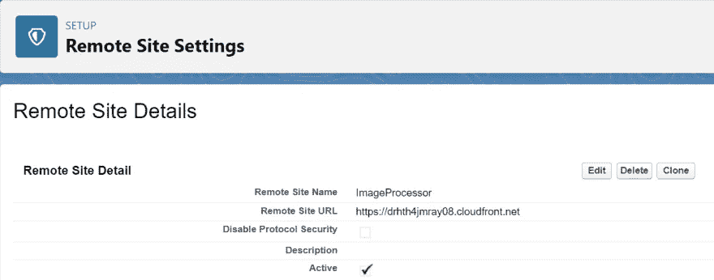

# 触发器和类

回到我们的场景，来自现场服务的图像附件作为`ContentDocument`对象和相关支持对象填充 Salesforce。他们的对象模型是这样的:

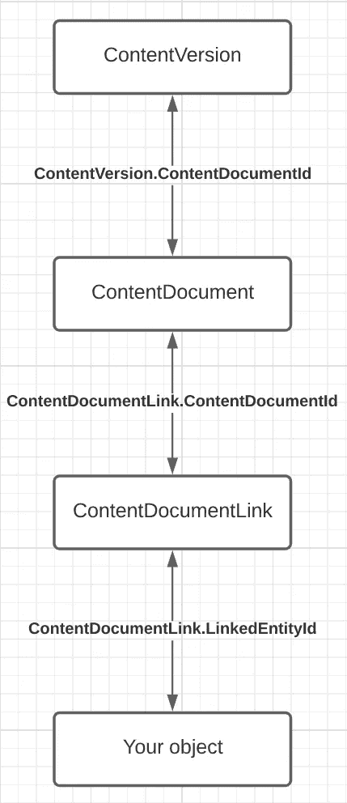

为了捕捉模型中新附加的图像，我们可以简单地向`ContentDocumentLink`对象添加一个新的 Apex 触发器。这将允许我们引用附件和它所附加的对象。

## ContentDocumentLinkTrigger 和 ContentDocumentLinkTriggerHandler

我们构建了一个`ContentDocumentLinkTrigger`(GitHub 上的[视图代码](https://bit.ly/acmedemo-01))将处理交给 Apex 类来处理触发器。

我们的触发器处理程序`ContentDocumentLinkTriggerHandler`(GitHub 上的[视图代码)，获取新`ContentDocumentLinks`的列表，并将它们整理到一个`Map`中，以链接的实体 ID 为关键字。然后检查它们以查看链接实体的类型，如果是工作订单，将它们添加到`Set`进行处理。](https://bit.ly/acmedemo-02)

该处理包括构建进一步的集合，以将实体映射到关联的`ContentDocument`记录，然后将该数据交给批处理 Apex 类进行异步处理。

## workorderatchattachmentbatch

工单附件的批处理类`WorkOrderAttachmentBatch` ( [查看 GitHub](https://bit.ly/acmedemo-03) 上的代码)，遍历提供的集合，从 AWS S3 存储桶的映像文件名和基本 URL 建立新的`WorkOrderAttachedImage`记录。

对`ImageRotationHandler`类进行了一次调用，以获取用于调用图像 API 的精心编制的 URL。然后，它用一些简单的 HTML 构建一个 RTF 字段来呈现结果图像。

一旦创建并保存了记录，图像附件列表将传递给另一个批处理类进行上传。

## 图像旋转处理程序

`ImageRotationHandler`(GitHub 上的[视图代码)是一个小类，处理对图像 API 处理程序的有效请求的构造。它从参数构造所需的 JSON 结构，将其序列化为字符串，编码为 Base64，然后将其附加到图像处理程序端点的 URL。格式化请求包含在](https://bit.ly/acmedemo-04)[部署章节](https://docs.aws.amazon.com/solutions/latest/serverless-image-handler/deployment.html)下的 AWS 模板文档中。

## S3UploadHandler

最后一个批处理类，`S3UploadHandler` ( [查看 GitHub 上的代码](https://bit.ly/acmedemo-05))，通过一个简单的 REST API 调用处理将附加的图像上传到我们的 S3 桶。

# 服务报告

现在我们已经有了 S3 的图像和填充了图像链接的自定义对象，现在我们可以返回到我们的现场服务用例了。在 Salesforce 设置中，搜索并点击**服务报告模板**。出于演示目的，我们将创建一个新模板。

在模板页面上，从相关模板下拉列表中选择**工单**。在模板的 Body 区域，基于工单附加图像对象，添加一个新的 **List** section 元素，如下图所示:

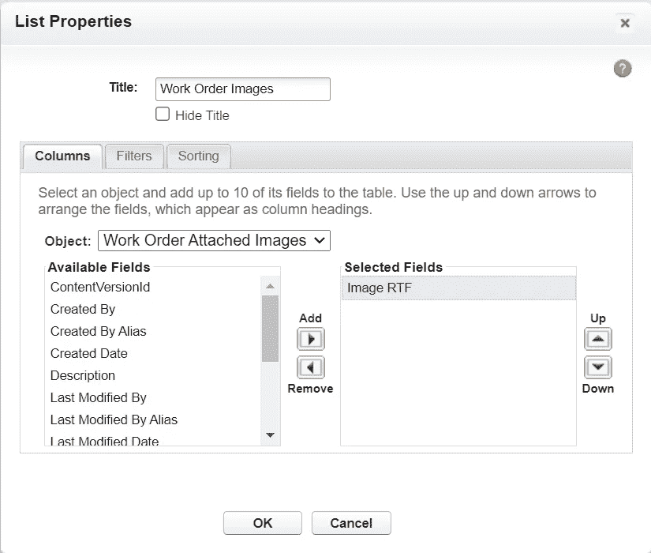

保存模板并激活它。

我们现在准备测试。在 Salesforce 中创建新的工作订单并保存它。然后，上传一个图像文件(JPG 或 PNG 格式)到文件部分。上传图像后，刷新页面。然后，您应该会在**工作指令附加图像**相关列表中看到一条新记录。单击该记录应该会显示一条与此类似的记录，并显示 S3 图像:

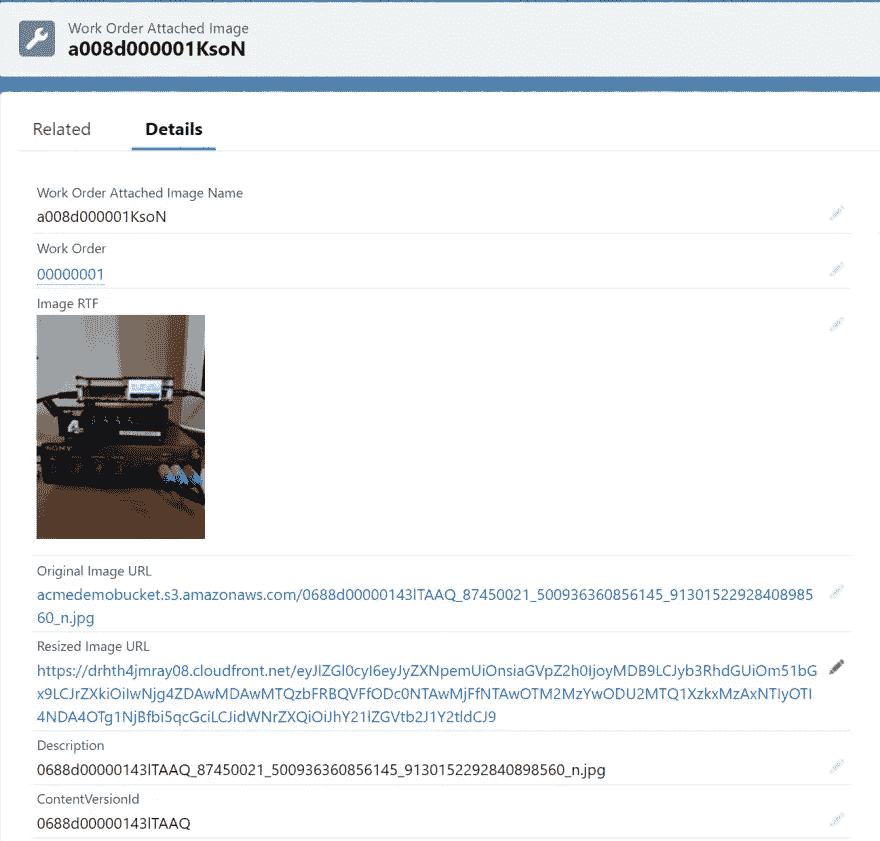

从工单中，点击**创建服务报告**按钮。(可能在溢出菜单下拉列表中):

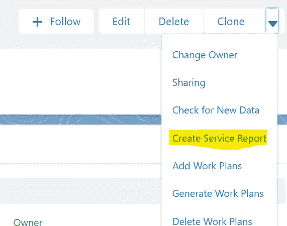

选择我们之前创建的服务报告模板，然后单击**创建 PDF** 按钮。服务报告 PDF 的预览应该呈现，并在适当的部分显示您上传的图像的缩略图。

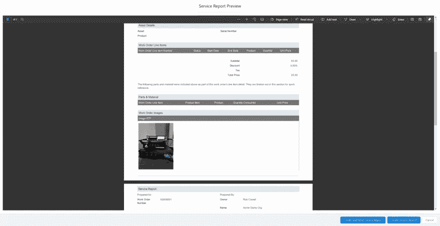

# 结论

在本文中，我们使用 AWS 解决方案库中的参考实现，成功地为 AWS 部署了一个完整的图像处理程序解决方案。我们已经在 Salesforce 中实现了带有支持对象和配置的代码，以将上传的图像附件传输到 S3，并在平台和服务报告中显示它们。

借助此架构，我们有可能降低 Salesforce 中图像文件的存储需求。

在现场服务之外，还有许多其他减少图像存储需求的使用案例。例如，另一个流行的场景是 Salesforce 支持的 web 体验，其中用户需要提交图像文件。

# 后续步骤和资源

以下是进一步发展这种架构的一些想法:

*   一旦 S3 获得原始 Salesforce 文件，实施删除
*   创建一个定制的 Lightning Web 组件来显示上传的图像
*   扩展该实现以支持其他文件类型，如 PDF 文档

以下是一些与此实现相关的有用链接:

*   [AWS 无服务器图像处理器](https://aws.amazon.com/solutions/implementations/serverless-image-handler/)
*   [夏普库](https://sharp.pixelplumbing.com/)，它提供了我们在 AWS 中使用的图像处理能力