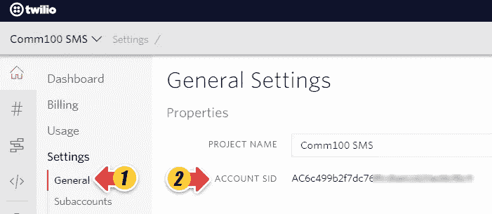

# 在 2021 年构建电子传真解决方案

> 原文：<https://levelup.gitconnected.com/building-an-e-fax-solution-in-2021-fb57f4dc7114>

## Twilio +无服务器+亚马逊 S3


照片由[西格蒙德](https://unsplash.com/@sigmund?utm_source=unsplash&utm_medium=referral&utm_content=creditCopyText)在 [Unsplash](https://unsplash.com/s/photos/fax?utm_source=unsplash&utm_medium=referral&utm_content=creditCopyText) 上拍摄

都 2021 年了你还想讨论怎么发传真？嗯，像房地产、医疗保健和银行这样的行业仍然严重依赖传真。

在本文中，我们将构建一个简单的服务，它将允许我们在没有传真机的情况下发送传真。

## 技术

*   Twilio:我们将使用 Twilio 可编程传真 API。**你需要有一个 Twilio 账户和一个带传真功能的 Twilio 电话号码。**
*   无服务器框架:我们将使用这个框架来构建一个可以快速部署的快速解决方案。
*   亚马逊 S3:我们将需要一个亚马逊 S3 桶来存储我们需要发送的文件。

## 创建项目

为了构建服务，我们将使用[无服务器框架](https://www.serverless.com/framework/docs/providers/aws/guide/installation/)。让我们创建一个新项目。在要存储项目的目录中运行以下命令:

```
serverless create --template aws-nodejs --path eFaxService
```

完成后，我们将拥有服务的样板代码。

## 安装所需的依赖项

这项服务将使用 Twilio 发送传真。为了能够从 Node.js 使用 Twilio 客户端，请转到服务根目录并运行

```
npm install twilio
```

我们还需要一个库来实现调用 AWS 函数时的承诺。为此，请安装以下依赖项

```
npm install bluebird
```

## 正在初始化 Twilio 客户端

要使用 Twilio 客户机，我们需要用 Twilio 帐户 SID 和 Twilio Auth 令牌对它进行初始化。

*   登录您的 [Twilio 账户](https://www.twilio.com/console)
*   在您的 project Twilio 仪表板上，您可以找到帐户 SID 和 Auth Token。您也可以进入**设置**、**常规**，定位您的**账户 SID** 。



初始化客户端

```
const accountSid = '***<account_sid>***';
const authToken = '***<account_token>'***;
const twilioClient = require('twilio')(accountSid, authToken);
```

您可能会想，将帐户 id 和令牌放在代码中并不是一个好的做法。没错，为了安全加密地存储这些值，我们将使用 AWS SSM。

## 在 AWS 中创建加密参数

1.  在[https://console.aws.amazon.com/systems-manager/](https://console.aws.amazon.com/systems-manager/)打开 AWS 系统管理器控制台。
2.  在导航窗格中，选择**参数存储**。
3.  选择**创建参数**选项。
4.  在**名称**框中，输入 TWILIO_ACCOUNT_SID。
5.  在**描述**框中，输入`Twilio account SID`
6.  对于**类型**，选择**固定**。
7.  在**值**框中，输入从 Twilio 控制台获得的帐户 SID 值
8.  最后，点击**创建参数按钮**。

对 Twilio 帐户令牌执行相同的操作。

## 在无服务器功能中使用 AWS 参数

要使用我们的无服务器函数中的两个新参数，请将以下内容添加到`serverless.yml`

```
functions:
  hello:
    handler: handler.hello
    environment:    
      TWILIO_ACCOUNT_SID: ${ssm:TWILIO_ACCOUNT_SID~true}
      TWILIO_AUTH_TOKEN: ${ssm:TWILIO_AUTH_TOKEN~true}
```

无服务器框架将使用 AWS SSM 来检索值，解密它，并存储解密后的值。

然后在我们的代码中使用它

```
const accountSid = ***process***.env.TWILIO_ACCOUNT_SID;
const authToken = ***process***.env.TWILIO_AUTH_TOKEN;
const twilioClient = require('twilio')(accountSid, authToken);
```

## 发送测试传真

既然我们已经初始化了客户端，我们将发送一份传真来测试 Twilio 是如何工作的。让我们在`handler.js`中创建新函数

```
const sendFax = async () =>{

    let faxId;
    await twilioClient.fax.faxes
        .create({
            from: <YOUR_TWILIO_PHONE_NUMBER>,
            to: <FAX_NUMBER_YOU_WANT_TO_SEND_TO>,
            mediaUrl: 'http://www.orimi.com/pdf-test.pdf',
            storeMedia: false
        })
        .then(fax => {
            ***console***.log(fax);
            faxId = fax.sid;
        });
    return faxId;
}
```

Twilio 传真解决方案名为 [Twilio 可编程传真](https://www.twilio.com/fax)。您需要将电话号码替换为您想要使用的号码。让我们回顾一下其他参数的平均值

*   `mediaUrl`:将要通过传真发送的 PDF。它需要在网上提供。
*   `storeMedia`:是一个布尔值，它决定我们是否要在 Twilio 基础结构中存储已发送传真的副本。
*   `faxId`:每次 Twilio 发送传真，都会生成一个 FaxId。

要运行测试，您可以将这个函数添加到`hello`函数中，如下所示

```
await sendFax();
```

然后[在本地调用该功能](https://www.serverless.com/framework/docs/providers/aws/cli-reference/invoke-local/)

```
serverless invoke local --function hello
```

## 正在检索传真状态

好了，我们的测试运行成功，我们有了`faxId`。如何才能知道传真状态？Twilio 提供了一个 URL，我们可以点击它来验证传真的状态

```
[https://fax.twilio.com/v1/Faxes/<](https://fax.twilio.com/v1/Faxes/FXace0348c775599fb7aa38c513335bc8c)faxId>
```

系统将提示我们输入用户名和密码。我们需要使用帐户 SID 作为用户，使用帐户令牌作为密码。

我们还可以定义一个[回调函数](https://www.twilio.com/docs/fax/api/fax-resource#fax-status-callback)，当传真的状态改变时，Twilio 将调用这个函数。

让我们给我们的`serverless.yml`添加一个新函数

```
faxCallback:
  handler: handler.faxCallback
  memorySize: 128
  timeout: 40
  description: Receives fax callback status
  environment:
    TWILIO_ACCOUNT_SID: ${ssm:TWILIO_ACCOUNT_SID~true}
    TWILIO_AUTH_TOKEN: ${ssm:TWILIO_AUTH_TOKEN~true}
  events:
    - http:
        path: callback
        method: post
```

并将代码添加到`handler.js`

```
const Busboy = require('busboy');module.exports.faxCallback = (event, context, callback) => {

    parserFormData(event).then(result => processFaxStatus(result));

    let response = {
        statusCode: 200,
        body: JSON.stringify({message: "Notification received"})
    };

    callback(null, response);
};

const getContentType = (event) => {
    const contentType = event.headers['content-type']
    if (!contentType) {
        return event.headers['Content-Type'];
    }
    return contentType;
};

const parserFormData = (event) => new ***Promise***( (resolve, reject) => {
    const busboy = new Busboy({
        headers: {
            'content-type': getContentType(event)
        }
    });

    const result = {};

    busboy.on('field', (fieldname, value) => {

        result[fieldname] = value;
    });

    busboy.on('error', error => reject(error));
    busboy.on('finish', () => {
        event.body = result;
        resolve(event.body);
    });

    busboy.write(event.body, event.isBase64Encoded ? 'base64' : 'binary');
    busboy.end();
});const processFaxStatus = (fax) => {
    const TWILIO_STATUS_PENDING = ["queued", "processing", "sending"];

    if (TWILIO_STATUS_PENDING.indexOf(fax.Status) === -1){ console.log(`Fax SID ${fax.FaxSid} - Status ${fax.Status}`);
    }
};
```

该函数接收来自 Twilio 的传真状态响应并对其进行处理。它使用`busboy`库来处理响应，因为它以`Form data`的形式到来。最后，如果状态与 Twilio 未决状态不同，则打印状态。

要获得回调 URL，您需要将解决方案部署到 AWS。这将生成一个 API 网关 URL

```
sls deploy
```

从部署结果中选择 API 网关 URL，并将其添加到发送传真功能，如下所示

```
const sendFax = async () =>{

    let faxId;
    await twilioClient.fax.faxes
        .create({
            from: <YOUR_TWILIO_PHONE_NUMBER>,
            to: <FAX_NUMBER_YOU_WANT_TO_SEND_TO>,
            mediaUrl: 'http://www.orimi.com/pdf-test.pdf',
            storeMedia: false,
            statusCallback: <YOUR_CALLBACK_URL>
        })
        .then(fax => {
            ***console***.log(fax);
            faxId = fax.sid;
        });
    return faxId;
}
```

## 从 S3 检索 PDF 文件

此时，我们可以发送传真并检索其状态。但是我们怎样才能发送我们自己的文件而不公开它们呢？

AWS S3 拥有[预签名网址](https://docs.aws.amazon.com/AmazonS3/latest/dev/ShareObjectPreSignedURL.html)。这将允许我们在确定的时间内暴露一个文件。让我们创建一个新函数

```
const AWS = require('aws-sdk');
AWS.config.setPromisesDependency(require('bluebird'));

const s3 = new AWS.S3();const getPdfUrl = async () => {
    const signedUrlExpireSeconds = 15 * 60;

    return await s3.getSignedUrlPromise('getObject', {
        Bucket: <YOUR_BUCKET_NAME>,
        Key: `<YOUR_FILE_NAME>`,
        Expires: signedUrlExpireSeconds
    });
}
```

将`hello`功能修改为

```
const pdfUrl = await getPdfUrl();
await sendFax(pdfUrl);
```

和`sendFax`功能

```
const sendFax = async pdfUrl =>{

    let faxId;
    await twilioClient.fax.faxes
        .create({
            from: <YOUR_TWILIO_PHONE_NUMBER>,
            to: <FAX_NUMBER_YOU_WANT_TO_SEND_TO>,
            mediaUrl: pdfUrl,
            storeMedia: false,
            statusCallback: <YOUR_CALLBACK_URL>
        })
        .then(fax => {
            ***console***.log(fax);
            faxId = fax.sid;
        });
    return faxId;
}
```

最后，部署解决方案

```
sls deploy
```

## 结论

传真技术的使用仍然比你想象的要多。如果您需要快速、经济的解决方案，我们在本文中讨论的技术可以作为创建简单的电子传真解决方案的起点。

在某些情况下，您可能希望在发送之前合并几个 PDF 文件。发送过程将是相同的。要合并 pdf 文件，你可以按照我以前的文章。

[](https://medium.com/javascript-in-plain-english/how-to-merge-pdf-files-with-serverless-functions-7b7e8e4d770a) [## 如何用无服务器功能合并 PDF 文件

### 使用 Ghostscript 形成 AWS Lambda 函数

medium.com](https://medium.com/javascript-in-plain-english/how-to-merge-pdf-files-with-serverless-functions-7b7e8e4d770a)