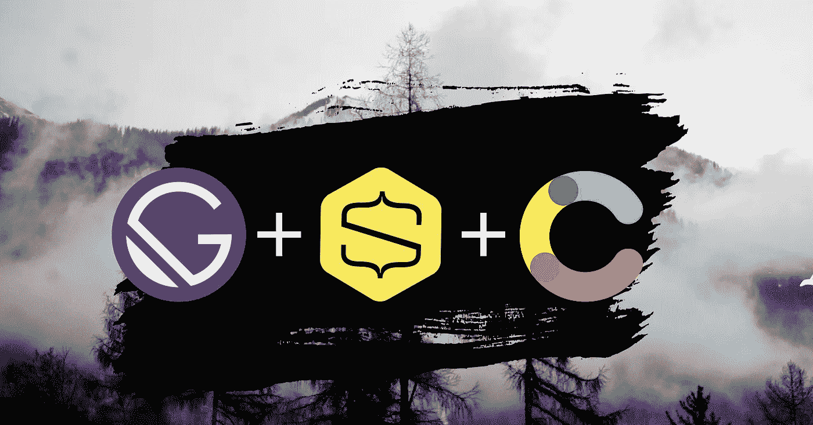
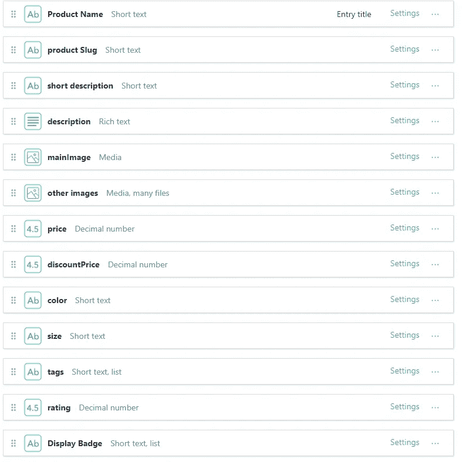
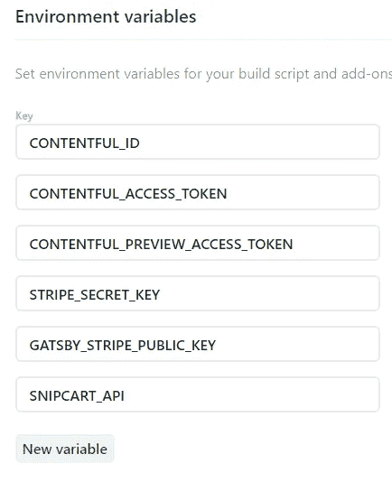
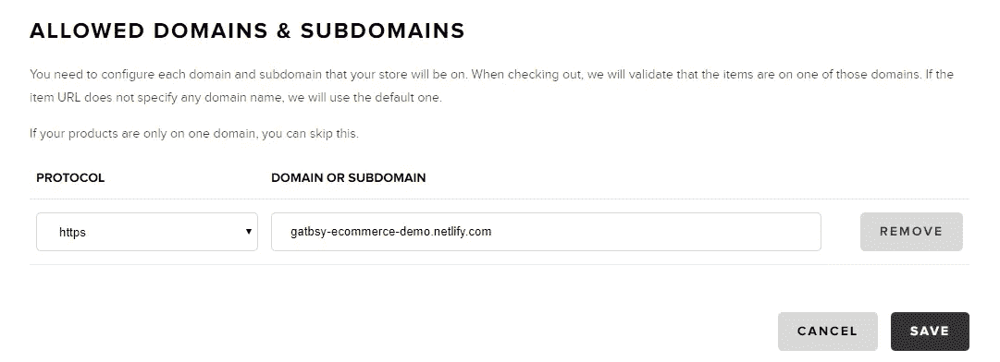

# 用 Gatsby、Contentful 和 Snipcart 建立一个电子商务网站

> 原文：<https://levelup.gitconnected.com/building-an-ecommerce-site-with-gatsby-contentful-and-snipcart-cae848206db2>



缺乏速度会致命。这是一个众所周知的事实，有许多文章都是关于慢速网站如何扼杀流量的。事实上，谷歌的一项研究表明，超过一半的手机用户会留下一个加载时间超过 3 秒的页面。随着移动用户的持续增长，对更快的页面加载速度的需求和期望比以往任何时候都大。

不仅仅是手机用户没有耐心。来自亚马逊的一项[研究](https://www.gigaspaces.com/blog/amazon-found-every-100ms-of-latency-cost-them-1-in-sales/)显示，100 毫秒的页面速度让他们损失了 1%的销售额！

我尝试了几个大型电子商务平台，如 Shopify 和 Woo-commerce。Woo-commerce 带着 WordPress 的包袱而来，而 WordPress 本质上又慢又笨重。Shopify 也很慢，尤其是当你有很多产品的时候。当我创建并推出一个 Shopify 商店时，它有大约十几个产品，我在有快速 WiFi 的桌面上体验了 5 秒或更快的加载速度。这种速度是令人痛苦的，我知道我需要建立一个更好的网站，有更快的加载时间和更好的用户体验。我也知道，如果我想转向完全定制和自由，我必须超越任何平台，如 WordPress 或 Shopify。

因为更快的页面加载转化为更多的网站访问，更好的用户体验，更多的转换和最终更大的收入，我决心建立一个以速度为第一要务的电子商务网站。

还有就是开发者体验。虽然 Woo-commerce 和 Shopify 易于开箱即用，但定制更困难，尤其是如果你不熟悉或不擅长 php 或 Liquid。

盖茨比出场了。 [Gatsby](https://www.gatsbyjs.org/) 将自己标榜为速度惊人的静态网站生成器。熟悉 React 之后，这个以速度为卖点、构建在 React 之上的开源框架是一个显而易见的选择。

下一个任务是找到一个现代的 CMS 解决方案，它可以很容易地与 Gatsby 集成，并且可以提供一个简单的、可扩展的方法来创建、更新和管理产品。为此，心满意足来拯救。

最后，最后一块是用户如何购买产品。我选择了 [Snipcart](https://snipcart.com/) ,因为它提供了一个易于实施的解决方案，与其他相关竞争对手相比成本最低。它的新版本 V3 是我一直追求的流畅、精简和优化的结账流程。使用 Snipcart，您还可以获得经过测试的产品，以增加您的销售和转化率。开发者模式是免费的，你只需在上线后付费。起价 10 美元/月，是更实惠的选择之一，有许多支持的电子商务支付网关，如 Stripe、PayPal 和 Square。

有了这三个支柱，我就可以开始构建我的原型了。在这篇文章中，我概述了我是如何做到这一点的一步一步的过程。

# 先决条件

了解一下盖茨比会有所帮助。此外，假设您具备基本的 React、JavaScript 开发人员知识。我还假设您已经安装了节点，且熟悉 npm。

# 概观

我们将使用一些令人惊叹的现代技术，创建一个基本的，但非常快速，强大和可扩展的电子商务启动器。会有一些可选的部分，如果你熟悉的话，可以略读或跳过。让我们开始吧。

# 1.启动 Gatsby(可选)

让我们直接跳到盖茨比身上。你需要在你的电脑上安装盖茨比。

安装 Gatsby CLI

```
npm i -g gatsby-cli
```

创建一个新网站，并给它一个如下的名字

```
gatsby new fashion-two
```

或者，如果您已经在您的根项目文件夹中，您可以简单地去

```
gatsby new .
```

这将创建一个 Gatsby Starter 默认项目。导航到文件夹内部(如果需要)并启动开发服务器。

```
gatsby develop
```

现在，您应该会在 localhost: 8000 上看到一个新的 Gatsby 站点，有一个看起来很时髦的宇航员侍者，或者其他一些欢迎页面。

# 2.初始设置

## a)安装一些附加的依赖项。

让我们现在安装一些依赖项。我将根据需要安装我们稍后需要的其他依赖项。

```
npm i @emotion /core @emotion /styled emotion-theming gatsby-plugin-emotion gatsby-image
```

这些依赖项应该足够开始使用了。

## b)我的 VS 代码，Gatsby 设置(可选)

在这个可选的部分中，我将快速浏览一下我在一个给定项目中使用的一些开销，为了简洁起见，我将主要保持现有的 starter 文件不变。

如果你转到 *layout.js* 文件，我们可以通过去掉大部分内容并保留下面的代码来清理它

```
// layout.jsimport React from "react"
import PropTypes from "prop-types"

import Header from "./header"
import "./layout.css"

const Layout = ({ children }) => {
  return (
    <>
      <Header siteTitle="Gastby Fashion Demo" />
    </>
  )
}

Layout.propTypes = {
  children: PropTypes.node.isRequired,
}

export default Layout
```

我将保留标准的 layout.css 文件，其中包含一些我们希望在应用程序中使用的全局 css 样式。您可以选择用 scss 文件替换它，以使您的全局样式更加模块化和有组织。

在这个应用程序中会有一些最小的造型，使用[情感](https://github.com/emotion-js/emotion)

要添加情感，请将以下内容添加到 gatsby-config.js 文件的插件数组中

```
{ resolve: `gatsby-plugin-emotion` },
```

我希望我的颜色一致，易于维护。你可以使用 scss 变量，但是因为我们使用了 Emotion，我将把一个 **emotion 主题**插入到布局组件中，使所有的颜色变量对任何组件都可用。这样，如果我们决定改变我们正在使用的红色的阴影，我们只需要在一个地方。请确保安装了以下导入的依赖项。

完成后，starter layout.js 文件将如下所示:

```
import React from 'react';
import PropTypes from 'prop-types';

import { ThemeProvider } from 'emotion-theming';
import styled from '@emotion/styled';

import Header from './header';
import './layout.css';
import { Footer } from './footer';

const theme = {
  colors: {
    primary: 'rgb(92, 52, 145)',
    primaryDark: 'rgb(63, 3, 122)',
    primaryLight: 'rgb(148, 103, 206)',
    primaryVeryLight: 'rgb(232, 213, 250)',
    primaryTransparent: 'rgba(92, 52, 145,0.2)',
    white: '#fff',
    black: '#1a1a1a',
    blackTransparent: 'rgba(41, 43, 46, 0.4)',
    red: 'rgb(218, 18, 31)',
  },
  pageWidth: {
    fixed: '800px',
  },
  screenSize: {
    mobileL: '600px',
  },
};

const Main = styled.section``;

const Layout = ({ children }) => {
  return (
    <>
      <ThemeProvider theme={theme}>
        <Header siteTitle="Gastby Fashion Demo" />
        <Main>{children}</Main>
        <Footer />
      </ThemeProvider>
    </>
  );
};

Layout.propTypes = {
  children: PropTypes.node.isRequired,
};

export default Layout;
```

# 3.满足的

## a)内容模型

Contentful 是一个现代化的，受欢迎的 CMS，我们将在那里存储我们的产品。我们将使用 Contentful 创建一个 ***包*** 内容模型。这个内容模型就像是我们将要添加的包产品的蓝图或模式。

在这里注册[之后](https://www.contentful.com/)通过点击内容*模型- >添加内容类型创建一个新的内容模型。*

我的新内容模型叫做***fashion two bags***。在内容模型中，我们可以在一个超级直观的用户界面中声明字段名、字段类型和任何相关的验证。我们商店的任何产品都将包含以下字段。



*slug 字段*是一个简短的文本，我们应该将其设置为必填。此外，我们可以指定它在字段设置中具有“slug”的外观。

*标签字段*是一个简短的文本列表字段，对于存储一组值非常有用。在这种情况下，我将使用标签来描述我的包产品的某些属性，如经典、现代、新。等等。

*描述字段*是一个用于长文本的富文本字段，我们可以在其中访问标题和段落等标记选项以及粗体、斜体和下划线等样式。此外，该 WYSIWYG 内容编辑器允许您将其他资源和条目直接嵌入其中。

我们不能在内容丰富的用户界面中做任何自定义样式。但是，稍后我们将为呈现的富文本内容添加自定义格式。

其余的领域相对简单。虽然您的字段可能名称不同，但基本原则是相同的。除了*其他图片*，我把每个字段都保留为必填字段。我把这个字段留为可选的，因为有时我们可能有也可能没有特定产品的许多图像。

在 Contentful 中，我们还可以创建对另一个内容模型的引用。对其他内容模型的引用(也称为关系)可能会派上用场。您可能有 ***品牌*** 内容模型，它将存储关于品牌的字段，如名称、大小、创始人和历史。另一个创建参考的好例子是作者和文章。为了简单起见，这个演示不会使用任何对其他内容模型的引用，但是您可以在 Contentful 中轻松地设置这些关系。

# 4.内容丰富—创建内容

创建新的内容模型后，让我们导航到*内容- >添加条目*。在这里，我们可以根据我们设置的字段添加一些新内容。我最喜欢的按钮是*动作- >复制*，它允许我们轻松地复制内容。

对于内容和图像，您应该使用什么？显然，你应该使用你在网站上销售的任何东西。如果你是一名客户开发人员，Lorem Ipsum generator 或任何其他[变体](https://hipsum.co/)是一个方便的工具。对于图像，Adobe Stock 很棒，但是很贵。免费替代品包括 [unsplash](https://unsplash.com/) 和 [pixabay](https://pixabay.com/) 。

在创建几个新产品条目并发布它们之后，让我们创建一些 ***GraphQL*** 查询来在我们网站的屏幕上呈现一些内容。

# 5.在《盖茨比》中展示我们所有的产品

## a)《盖茨比》——初始设置

还有很多其他教程将 GraphQL 与 Gatsby 一起使用，所以我将快速浏览这一部分。

首先转到或创建一个 *gatsby-config.js* 文件，在这个文件中，我们存储我们的站点元数据和其他插件。如果该文件添加在顶部

```
// gatsby-config.js
require('dotenv').config({
  path: `.env.${process.env.NODE_ENV}`,
});
```

这允许我们引入存储在 *.env.development* 和 *.env.production* 文件中的环境变量。你可以在 https://gatsby.dev/env-vars 了解更多关于环境变量的知识

此外，我们将在插件数组中添加以下内容

```
// gatsby-config.js
{
   resolve: `gatsby-source-contentful`,
   options: {
    spaceId: process.env.CONTENTFUL_ID,
    accessToken: process.env.CONTENTFUL_ACCESS_TOKEN,
    },
}
```

在 *.env.development* 文件中，您应该有这样的内容

```
// .env.development
CONTENTFUL_ID=YourId 
CONTENTFUL_ACCESS_TOKEN=YourToken CONTENTFUL_PREVIEW_ACCESS_TOKEN=aaa111
```

你可以通过*内容设置- > Api Keys = >访问令牌*找到这些值

> 注意:确保没有用引号将值括起来，并且没有提交*。env* 文件到 GitHub

最后，让我们安装一些令人满意的插件:

```
npm i gatsby-source-contentful @contentful/rich-text-react-renderer @contentful/rich-text-types
```

如果你遇到一个错误，确保你的内容模型中有一些内容！

## 盖茨比——图表

重启 gatsby dev 服务器后，转到[http://localhost:8000/_ _ _ graph QL](http://localhost:8000/___graphql)

在这个 graphQL 界面的左侧，您应该会看到一个带有大量 graph QL 查询的浏览器。您可以使用 explorer 界面构建查询。另一个方便的命令是使用 ctrl+spacebar 来预览您可以使用的选择。

随着 Contentful 插件成功安装，你也应该在那里看到你的 Contentful 查询(刷新页面后)。

由于这不是 graphQL 教程，我就不深入解释查询了。我使用下面的查询从 Contentful 内容模型中获取所有条目。下面的字段指定如下。

```
{
  allItems: allContentfulFashionTwoBags {
    nodes {
      id
      productName
      productSlug
      shortDescription
      price
      discountPrice
      tags
      rating
      displayBadge
      mainImage {
        fluid(quality: 90, maxWidth: 300) {
          src
        }
      }
    }
  }
}
```

在 Graphiql 中运行这个查询应该会返回一个包含所有字段的响应对象。

## c)盖茨比——渲染我们所有的产品

接下来，我们需要在我们的 *index.js* 文件中调用这个查询。为此，我们只需从 Gatsby 导入 graphql 并呈现页面查询，我们在上面创建的页面如下:

```
import React from 'react';
import { Link, graphql } from 'gatsby';
import styled from '@emotion/styled';
import Image from 'gatsby-image';
import Layout from '../components/layout';

export const query = graphql`
  {
    allItems: allContentfulFashionTwoBags {
      nodes {
        id
        productName
        productSlug
        shortDescription
        price
        discountPrice
        tags
        rating
        displayBadge
        mainImage {
          fluid(quality: 90, maxWidth: 300) {
            ...GatsbyContentfulFluid_withWebp
          }
        }
      }
    }
  }
`;

const StyledImage = styled(Image)`
  width: 20rem;
  height: 20rem;
`;

const index = ({ data }) => {
  const products = data.allItems.nodes;
  return (
    <Layout>
      {products.map(product => (
        <Link key={product.productSlug} to={`/products/${product.productSlug}`}>
          <h4>{product.productName}</h4>
          <div> $ {product.price} USD</div>
          <div>
            <StyledImage fluid={product.mainImage.fluid} />
          </div>
        </Link>
      ))}
    </Layout>
  );
};

export default index;
```

这个查询的结果是一个数据对象，我们将它传递给如上所示的索引页面组件。

还要注意，我们已经用***…GatsbyContentfulFluid _ with webp***替换了 *src* ，因为我们想利用 **Gatsby 的内置图像优化**功能，你可以在这里阅读更多关于[的内容。这个新的 Contentful 钩子将返回一个项目数组，这些项目是我们所有的 Contentful 条目。](https://www.gatsbyjs.org/packages/gatsby-image/)

太好了，我们有所有的产品名称和每个产品的链接，还有一张经过 Gatsby 优化的图片。

你可能已经注意到了，链接现在指向了一个 404 页面。在下一节中，我们将通过编写一些代码来以编程方式为这些产品中的每一个*创建一个新页面，从而解决这个问题。*

# 6.在盖茨比中呈现每个产品页面

## a)盖茨比—盖茨比节点

我们想为我们的 *fashionTwoBags* 内容模型中的每个内容条目以编程方式创建一个新页面。我们希望编写一个 GraphQL 查询，输出我们所有的产品 slug，并为每个 slug 创建一个页面。幸运的是，我们可以使用 Gatsby createPages API 来做到这一点。在下面的代码中，我写了一些注释来帮助初学者。

```
// gatsby-nodes.js const path = require ( 'path' ) ;// use gatsby create pages api and query for all product slugs
exports.createPages = async ({ actions, graphql }) => {
  const { createPage } = actions;
  const { data } = await graphql(`
    {
      allBags: allContentfulFashionTwoBags {
        nodes {
          productSlug
        }
      }
    }
  `);

 // create page for each product and list
// them all in /products/:productSlug 
data.allBags.nodes.forEach(item => {
    createPage({
      path: `products/${item.productSlug}`,
      component: path.resolve('./src/templates/Bag.js'),
      context: {
         // Data passed to context is available
         // in page queries as GraphQL variables.
        slug: item.productSlug,
      },
    });
  });
};
```

你可能已经注意到了，我们需要创建一个新的模板组件 *Bag.js.* 现在，创建一个简单的 react 组件，里面有一些虚拟文本。

## b) GraphiQL —页面特定的查询

在 graph QL([http://localhost:8000/_ _ _ graph QL](http://localhost:8000/___graphql))中，您会看到另一个名为 *contentfulFashionTwoBags* 的查询。这将返回一个包，而不是所有的包。为了指定要返回的行李，我们需要创建一个新的查询。在这个查询中，我们将创建一个新的 slug 变量，并将其作为 string 类型传入

```
query bagTemplateQuery($slug: String!) {

    item: contentfulFashionTwoBags(productSlug: { eq: $slug }) {
      id
      productSlug
      productName
      shortDescription
      description {
        json
      }

      mainImage {
        fluid {
          src
        }
      }
      otherImages {
        fluid {
         src
        }
      }
      price
      discountPrice
      tags
      rating
      color
    }
  }
```

在查询变量中，在界面的底部，从您的内容中传递一个特定的 slug 名称。

```
{
  "slug":"monnet-lime-green-bag"
}
```

回想一下，Contentful 中的*描述字段*是一个富文本字段，它返回一个 **JSON** 数据对象。在这里解析它并将其呈现在页面上看起来相当吓人。我们将使用一个库来帮助我们渲染这个。

## c)Gatsby——产品模板

我们可以创建名为 *Bag.js* 的产品模板，并使用我们在上面的 GraphiQL 中创建的查询，将 *src* 替换为*…GatsbyContentfulFluid _ with webp*，就像前面一样。

我还调用了 library @ content ful/rich-text-react-renderer 来帮助我们格式化描述字段中的 json 数据对象。

```
// src/templates/Bag.js
import React from 'react';
import styled from '@emotion/styled';
import { graphql } from 'gatsby';
import Img from 'gatsby-image';
import { documentToReactComponents } from '@contentful/rich-text-react-renderer';
import Layout from '../components/layout';// run template query
export const query = graphql`
  query BagTemplateQuery($slug: String!) {
    item: contentfulFashionTwoBags(productSlug: { eq: $slug }) {
      id
      productSlug
      productName
      shortDescription
      description {
        json
      } mainImage {
        fluid {
          ...GatsbyContentfulFluid_withWebp
        }
      }
      otherImages {
        fluid {
          ...GatsbyContentfulFluid_withWebp
        }
      }
      price
      discountPrice
      tags
      rating
      color
    }
    site {
      siteMetadata {
        siteUrl
      }
    }
  }
`;const StyledImage = styled(Img)`
  width: 30rem;
  height: 30rem;
`;const BagTemplate = ({ data: { item } }) => {
  const options = {
    // options for rich text formating
  }; return (
    <Layout>
      <h2>{item.productName}</h2>
      <div>{item.rating} stars</div>
      <div>{item.shortDescription}</div>
      <StyledImage fluid={item.mainImage.fluid} />
      {/* render the rich text format description */}
      <main>{documentToReactComponents(item.description.json, options)}</main>
    </Layout>
  );
};export default BagTemplate;
```

重新启动开发服务器后，每个产品页面的链接应该工作，我们应该有一个独特的产品页面为每个蛞蝓。我们正在取得良好的进展！

注意，我还在最后添加了一个小查询，这样我们就可以获得我们的站点 url，它将在我们的 Snipcart 部分中使用

为了呈现我们的富文本格式，我们调用了函数***documentToReactComponents***，该函数将 JSON 对象和 options 对象作为参数。

如前所述，我们可以从内容丰富的 WYSIWYG 内容编辑器定制块、标记和内联样式。

将以下内容添加到 *Bag.js* 文件中，以橙色为背景，将段落标签和超链接设置为紫色。

```
// import rich-text-types 
import { BLOCKS, MARKS, INLINES } from '@contentful/rich-text-types' // Add in some styling
const Bold = styled.span`
  font-weight: bold;
  color: red;
`;

const P = styled.p`
  color: orangered;
`;

const StyledHyperLink = styled.span`
  color: purple;
  padding: 1px 2px;
  background: orange;
  cursor: pointer;
`;

// render the styling
const RTFBold = ({ children }) => <Bold>{children}</Bold>;
const Text = ({ children }) => <P>{children}</P>;
const HyperLink = ({ children }) => (
  <StyledHyperLink>{children}</StyledHyperLink>
);

// modifying the options
 const options = {
    renderMark: {
      [MARKS.BOLD]: text => <RTFBold>{text}</RTFBold>,
    },

    renderNode: {
      [BLOCKS.PARAGRAPH]: (node, children) => <Text>{children}</Text>,
      [INLINES.HYPERLINK]: (node, children) => (
        <HyperLink>{children}</HyperLink>
      ),
    },
  };
```

我们现在已经使用 js 中的 emotion CSS 创建了自定义渲染样式，其范围仅限于 *Bag.js* 模板。当然，你可能不希望你的模板有紫色、橙色背景的超链接，但是定制的选项是有的。有关渲染富文本的更多信息，请参考此处的库

现在，我们将所有产品都存储在 Contentful 中，这是一个强大的内容模型，产品显示在屏幕上。我们项目的最后一个主要部分是结账流程，这样用户就可以购买我们的产品。

# 7.狙击车

## a)开始使用

现在我们已经呈现了一些内容，我们可以添加 Snipcart 来帮助我们的结帐过程。Snipcart v3 最近发布(2019 年 10 月)，所以我将使用它。你还需要设置一个支付网关。我用 Stripe 来做这个。如果您没有 Stripe 帐户，并且希望使用 Stripe 作为支付网关，您还需要设置一个 Stripe 开发者帐户。

报名参加狙击车:[https://snipcart.com/](https://snipcart.com/)

带条纹报名:【https://stripe.com/en-ca 

## b) Snipcart 仪表板

在 Snipcart 仪表板中有两个主要的导航选项卡。左边黑色的，有你的订单，销售，废弃的购物车，折扣，产品和一系列其他功能的信息。另一个导航选项卡是商店配置/帐户导航栏，可通过单击右上角的用户图标来访问。

在我们仪表板的中间顶部，我们可以在实时模式和测试模式之间切换。确保选择了测试模式。

在账户导航中，您可以在*账户- > api 密钥*下找到您的 API 密钥。

在“域和 URL”下的商店配置导航中，您需要添加您的站点域名。此时，您可能还没有域名。如果是这种情况，请在本文的末尾重新考虑这个步骤(我们将使用 Netlify 进行部署，并创建一个您可以使用的临时 url)

在您首选的支付网关中，获取相关的 API 密钥。对于条纹，你可以访问[https://dashboard.stripe.com/dashboard](https://dashboard.stripe.com/dashboard)

## c)将 Snipcart 添加到 Gatsby

安装 snipcart gatsby 插件

```
npm i gatsby-plugin-snipcart
```

在 gatsby-config.js 文件中，我们需要将以下内容添加到插件数组中

```
{
      resolve: 'gatsby-plugin-snipcart',
      options: {
        apiKey: process.env.SNIPCART_API,
        autopop: true,
        js: 'https://cdn.snipcart.com/themes/v3.0.0/default/snipcart.js',
        styles: 'https://cdn.snipcart.com/themes/v3.0.0/default/snipcart.css',
      },
 }, 
```

靠近顶部还需要添加我们的网址，你可以现在或在你有一个域名网址设置:

```
// Define site URL here
let URL;
if (process.env.NODE_ENV === 'production') {
  URL = 'https://gatbsy-ecommerce-demo.netlify.com';
} else {
  URL = 'http://localhost:8000';
}

module.exports = {
  siteMetadata: {
    title: `Gatsby Ecommerce Demo`,
    description: `Your next ecommerce Gatsby site powered with Contentful and Snipcart.`,
    author: `aquasar.io`,
    siteUrl: URL,
  },
```

在 *.env.development* 文件中添加不带引号的 SnipCart API 键。

```
SNIPCART_API=aaa111 
STRIPE_SECRET_KEY=sk_test_aaa111 GATSBY_STRIPE_PUBLIC_KEY=pk_test_aaa111
```

要使用的 Snipcart api 键是在 Snipcart 站点顶部以粗体显示的公共测试 api 键。重启 Gatsby dev 服务器，将下面的代码添加到您希望 checkout 按钮出现的 *Bag.js* 模板中。

```
// src/templates/bag.js 
 <button
        className={`snipcart-add-item`}
        data-item-id={item.id}
        data-item-name={item.productName}
        data-item-image={item.mainImage.fluid.src}
        data-item-price={item.discountPrice ? item.discountPrice : item.price}
        data-item-url={`${site.siteMetadata.siteUrl}/products/${item.productSlug}`}
      >
        Add to Cart
    </button>
```

结帐按钮现在应该工作，当您点击“添加到购物车”时，您应该会看到一个包含购物车详细信息的弹出窗口

您可以使用一些 VISA 测试号码来测试这个结账流程。如果不进行一些额外的设置，这在 localhost 上是行不通的。如果你需要在本地主机上测试，请参考本文[这里的](https://snipcart.com/blog/develop-a-snipcart-powered-website-locally-using-ngrok)

在支付网关下，您可以连接并从 Stripe、PayPal 和 Square 等多个选项中进行选择。除了您选择的网关之外，您还可以使用 PayPal express。我相信 [Stripe](https://stripe.com/en-ca/pricing) 在这个时候对于一个新成立的电子商务网站来说有最好的价格。然而，费率将因地区和数量而异。我目前看到的起始费率是每次成功刷卡收费 2.9%+0.30 美元，没有月费。

在订单和发票下，您可以添加您的公司名称和公司徽标。这将在客户购买时作为订单确认发送给客户。

在 Snipcart 商店配置中，有大量其他选项，如运输、税收和电子邮件模板，我们不会涵盖这些选项，因为它们不是基本功能。但是，您应该尝试这些设置，并根据您的业务或客户进行定制。

# 8.部署到网络

Netlify 是一个前端现代网站的惊人服务。如果您还没有这样做，请创建一个网络帐户。在部署到 Netlify 之前，让我们将这个 repo 推送到 Github。

在推送到 Github 之前，确保不要将敏感的 API 键推送到存储在. env.development 和. env.production 文件中。对于本演示，开发和生产文件将具有相同的密钥，并且完全相同。这里的. env.production 文件仅供参考。一定要去。gitignore 并添加以下内容以确保这些文件不会被发送到 Github。

```
// .gitignore
# dotenv environment variables file
.env
.env.production
.env.development
```

将这些文件推送到 github(在 VS 代码集成终端中)

```
git add .
git commit -am 'first commit'
git push origin master
```

现在，在 Netlify 内部，您需要找到我们刚刚推送的回购，并从 github 部署您的新站点。

除非我们在部署设置中添加环境变量，否则部署将会失败。这可以通过进入*设置- >构建&部署- >环境- >环境变量- >编辑变量找到。*



添加与. env.development 或. env.production 文件中完全相同的所有键和值。

然后我们可以选择*触发部署- >部署站点来重新部署。*

这通常需要几分钟，但你应该有一个新的网站启动和运行。

Netlify 会给你一个随机的网址，以 *.netlify.com* 结尾

您可以在域名设置下添加您自己的 url，或者通过进入自定义域名->编辑网站名称将这个随机名称更改为一个更可取的名称

# 9.测试

如果您没有域名，此时您应该将 Netlify 创建的域名添加到 Snipcart 域和 URL 设置中。您可以添加任意数量的域或子域。



我们还没有测试我们的结帐过程。根据您所在的地区，您可以使用例如

美国:4242 4242 4242 4242

加拿大

csv 或安全代码可以是任何三位数，日期可以是未来的任何日期。您也可以使用您喜欢的任何名称和有效地址。

# 10.创建一个有内容的钩子

如果我们更新我们的产品，那么理想情况下，我们希望自动触发站点部署，以便我们的新产品可以在您的站点上使用，而不必再次手动部署我们的站点。

为此，在 Netlify 中创建一个新的钩子，然后转到 Contentful 并通过 Contentful -> Settings -> Webhooks 跳过这个新钩子

现在，一旦我们添加新产品，就会自动触发站点部署。您可以查看 webhook 设置，以确保您只在真正需要时才触发部署，即发布新产品或内容。Netlify 已经开始对超过 300 分钟/月的构建限制收费，所以请记住这一点。

# 概述:

我们有一个简单的 MVP 电子商务网站，由 Gatsby，Contentful 和 Snipcart 提供支持。很高兴与你分享我的电子商务 JAMstack 经验，我希望这篇文章对你的电子商务项目有所帮助。如果您有任何问题或想要报告任何错误，请联系我。

完整的 github repo 位于

[https://github.com/arhoy/gatsby-ecommerce-demo](https://github.com/arhoy/gatsby-ecommerce-demo)

要观看现场演示，请:

【https://gatbsy-ecommerce-demo.netlify.com/#/ 号

*最初发布于*[*https://aqua sar . io*](https://aquasar.io/articles/building-an-ecommerce-site-with-gatsby-contentful-and-snipcart)*。*