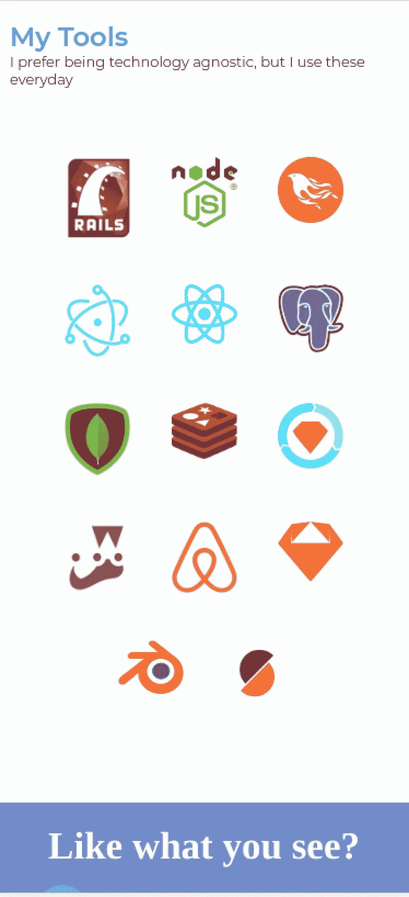
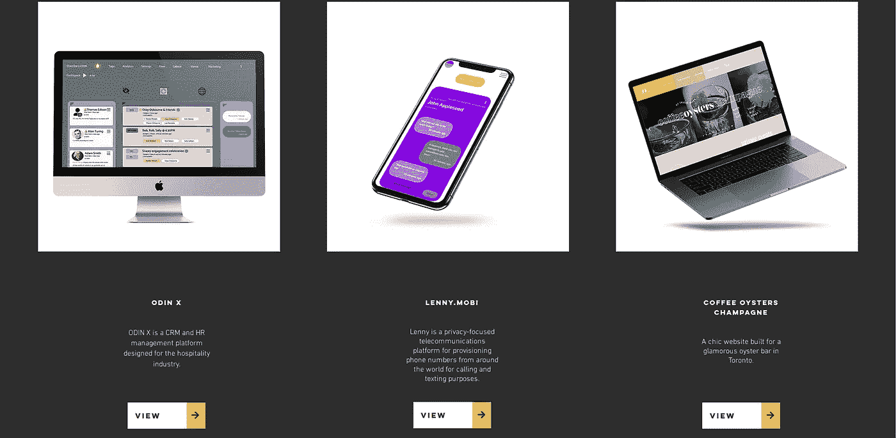
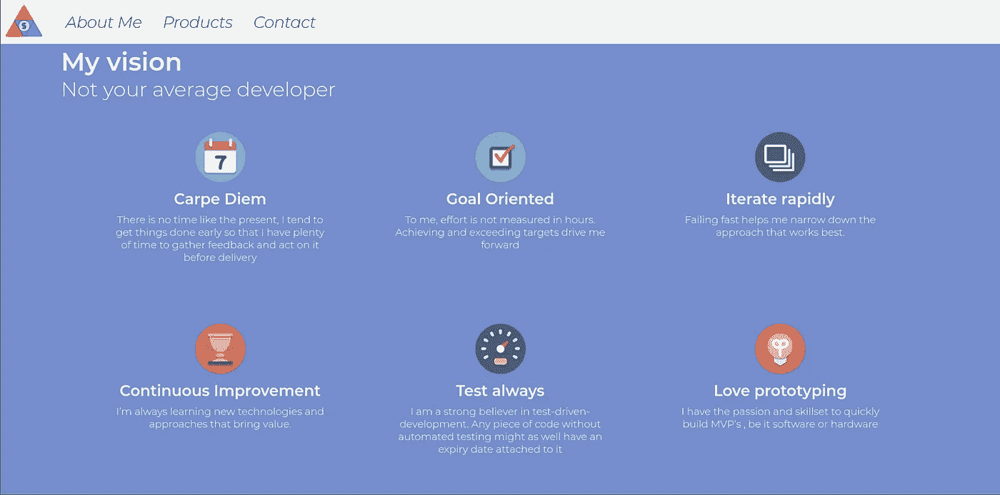

# 建立一个有效的投资组合网站

> 原文：<https://levelup.gitconnected.com/building-an-effective-portfolio-website-a5b214167a49>

## 启动或推进您的软件开发职业的 8 个技巧

几个月前，我开始着手从头开始重建我的投资组合。以下是我一路走来收集的一些见解；

## **1。确定你的优势&找出你的定位**

特别是当你试图开始你的软件开发生涯时，通过在你的网站上列出一个技能清单来撒网是很有诱惑力的。这样做弊大于利，因为会给读者留下这样的印象:你充其量是个一无是处的大师，最坏的情况是个庸医。

我没有列出一堆技能，而是选择展示我过去工作过的技术的标识

首先，列出你目前拥有的所有可展示的技能，并从中挑选一些你有信心的技能。不容易在作品集网站上展示的技能(例如；优化、数据库设计等)应通过实际项目展示(即:指向你在之前的工作中帮助优化的高流量消息应用的外部链接)或者根本不存在。

## **2。挑选几个展示你技能的项目**

在展示项目时，不要列出那些需要读者去 Github 查看代码的项目(唯一需要注意的是，如果你是一个有很好的自述和例子的流行库的作者)。

如果您必须将读者引向代码，请确保存储库中有大量运行中的应用程序的屏幕截图和一个简单的自述文件，以便读者可以在需要时以最少的麻烦在本地设置应用程序。

投资组合中展示的理想项目是已经部署/在生产中的项目。一个读者看得见摸得着的项目对你的宣传是无价的。如果你刚刚起步，以前没有任何项目，考虑从头开始建立一些。这可能很简单，但只要你给他们一个个人的接触/扭转，他们应该脱颖而出。

我选择展示目前正在生产的 3 个淘汰赛项目

## 3.想出你的故事，以及它如何融入你的个人品牌

虽然拥有令人惊叹的项目可以鼓励雇主和自由职业者联系你，但这只是第一步；向他们保证，最终——他们将与一个他们喜欢合作的人一起工作。

你是自学成才的开发者吗？你童年时面临过逆境吗？现在是时候把你的奋斗、努力和毅力放到网页上，并把它编织成一个引人注目的故事。

我不擅长讲故事，所以我选择把我的愿景/价值观作为我的个人品牌来表达

## 4.将所有这些与严格的品牌流程结合在一起

想出一个调色板，字体和标志。一旦这样做了，去给自己买一个自定义域名。

## 5.制作一个网站应该是什么样子的模拟

你的大部分时间和精力应该花在这里，不要留下任何未定义的东西——为每个页面创建模型，以及它们应该如何在不同的屏幕尺寸上呈现。

用图形和图像来说明你的立场，以及你所精通的技术。

## 6.发送模型以获得朋友和家人的一轮反馈

从广泛的人群中获得反馈。这是非常重要的，通过收集和实现他们的反馈，确保你在模型上至少迭代一次。

## 7.**考虑你的优势和你想如何推销自己，选择你的实施方案**

如果你主要是一个后端开发人员，并且想这样推销自己，考虑使用像 Wordpress 或 Wix 这样的网站构建器。这样你就能得到一个坚实的最终产品，而不用过多地纠结于 CSS 和其他前端技术。如果您认为自己是前端/全栈开发人员，可以考虑使用时下流行的 JavaScript 框架并编写自己的 CSS。

## 8.在部署之前，确保你的网站已经准备就绪

要特别注意加载时间，并考虑使用像 S3 这样的 CDN 来服务资产。确保 SSL 已启用，流量会自动定向到您网站的 HTTPS 版本。当你试图获得工作面试或给自由职业客户留下深刻印象时，这些小细节很重要。

希望这些建议对你有所帮助，万一我忘记了什么(我很可能忘记了)，请在下面的评论中提出来。

[沙施克](https://www.linkedin.com/in/shashike-jayatunge/)是一名来自多伦多的软件工程师，也是 [Restarone Inc](https://www.restarone.com) 的创始人。当他不开发软件时，他在 Medium 和 YouTube 上创作内容，帮助人们过渡到技术领域。