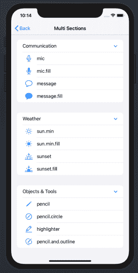

# 使用 UICollectionView 构建可扩展列表:第 1 部分

> 原文：<https://levelup.gitconnected.com/building-an-expandable-list-using-uicollectionview-part-1-703312c2d773>

## **从来没有这么容易过！**


*本文原载于 2020 年 9 月 10 日*[*https://swiftsenpai.com*](https://swiftsenpai.com/development/collectionview-expandable-list-part1/)*。*

可扩展列表或一些人可能称之为可扩展表格视图，是一种非常常见的用户界面设计，在各种各样的应用程序中使用。尽管 UIKit 如此受欢迎，但它没有任何支持这种布局的本地 API。

随着 iOS 14 的推出，这一点不再成立！

据苹果公司称，开发者现在可以通过使用新的`UICollectionView`列表布局 API 轻松创建可扩展列表。不幸的是，在查看了苹果提供的[样本代码](https://developer.apple.com/documentation/uikit/views_and_controls/collection_views/implementing_modern_collection_views)后，我发现它极其混乱，非常难以理解。

因此，我想尝试写一篇文章，清楚地解释如何使用`UICollectionView`有效地构建一个可扩展列表。

这是两篇博文的第一部分。在第一部分中，我们将着重于在单个部分的集合视图中构建一个可扩展的列表。在第二部分中，我们将尝试修改我们在第一部分中构建的列表，以便在多部分集合视图中显示相同的模型对象。到第 2 部分结束时，您应该能够清楚地理解创建可扩展列表所涉及的每个组件之间的关系。

在继续之前，如果您不熟悉`UICollectionView`列表的基本概念，请务必阅读我以前的文章“[在 Swift 中使用 UICollectionView 构建列表](https://swiftsenpai.com/development/uicollectionview-list-basic/)”。

说了这么多，我们开始吧。

# 示例应用程序

下面的动画 GIF 展示了我们将要构建的示例应用程序。


示例应用程序

如图所示，集合视图由一个部分组成。在该部分中，有标题单元格和符号单元格，负责显示根据类别分组的不同`SFSymbol`。


标题单元格和符号单元格

# 定义所需的数据类型

在开始构建可扩展列表之前，我们必须首先定义所有需要的数据类型。

让我们从定义集合视图部分开始。

```
enum Section {
    case main
}
```

之后，让我们定义保存标题和符号单元数据的数据类型。

接下来，我们将定义一个名为`ListItem`的枚举。此枚举类型将充当集合视图的数据源项标识符类型。

此时，您可能想知道为什么我们需要使用`ListItem`作为数据源项标识符类型。一旦我们开始配置集合视图的数据源，我将详细解释这一点。

最后，让我们定义集合视图将使用的样本模型对象。请注意，在大多数情况下，模型对象将由后端服务器以 JSON 数据的形式提供。

所有需要的数据类型都准备好了，我们现在可以开始构建可扩展列表了。

# 配置集合视图

首先，让我们设置集合视图来占据整个视图控制器的视图。像往常一样，我们将使用`insetGrouped`作为我们的列表外观。

# 执行小区注册

如前所述，我们的可扩展列表由两种类型的单元格组成— **标题单元格**和**符号单元格**。

即使它们都是类型`UICollectionViewListCell`，我们仍然需要创建两个不同的`CellRegistration`实例。这是因为它们有不同的项目标识符类型和不同的行为。

标题单元格注册将使用`HeaderItem`作为其项目标识符类型。同时，在单元格注册处理程序中，我们必须向标题单元格添加一个大纲显示附件。这是为了启用标题单元格的展开/折叠行为。

另一方面，符号单元注册将使用`SFSymbolItem`作为其项目标识符类型。

准备好标题和符号单元格注册后，我们可以继续配置集合视图数据源。

# 正在初始化数据源

还记得我们之前定义的`ListItem`枚举吗？这就是它发挥作用的地方。

您可能已经知道，`UICollectionViewDiffableDataSource`只支持 1 种物品标识符类型。然而，在我们的可扩展列表中，我们有两种类型的数据- `HeaderItem`和`SFSymbolItem`。

为了解决这个问题，我们可以利用带有关联值的[枚举将`HeaderItem`和`SFSymbolItem`包装成一个名为`ListItem`的数据类型。这样，我们将能够使用`ListItem`作为项目标识符类型来初始化`UICollectionViewDiffableDataSource`。](https://docs.swift.org/swift-book/LanguageGuide/Enumerations.html#ID148)

由于`ListItem`是一个枚举，我们现在可以在单元提供者闭包中使用`switch`语句来检查所有可能的数据类型，并相应地将集合视图单元出队。

请注意，在将可重用单元出队时，必须始终将项目的数据类型与相应的单元注册项目标识符类型相匹配。


将项目的数据类型与小区注册项目标识符类型相匹配

# 设置快照

## 了解不同种类的快照

为了以可扩展的方式在集合视图中显示模型对象，我们将不得不使用`NSDiffableDataSourceSnapshot`和`NSDiffableDataSourceSectionSnapshot`。

`**NSDiffableDataSourceSnapshot**`是 iOS 13 中引入的。一般来说，`NSDiffableDataSourceSnapshot`是用来为集合视图(或者表格视图)提供数据的。我们可以使用它来定义集合视图部分，以及每个集合视图部分中的项目。

另一方面，`**NSDiffableDataSourceSectionSnapshot**`与 iOS 14 一起在今年的 WWDC 上推出。用于为**特定集合视图(或表格视图)部分**提供数据。它的功能与`NSDiffableDataSourceSnapshot`相似，我们可以用它来表示部分和项目。因此，我们可以将其视为集合视图(或表格视图)部分的迷你`NSDiffableDataSourceSnapshot`。

总结一下:

*   一个收藏视图只能有**一个**一个`NSDiffableDataSourceSnapshot`。
*   在一个集合视图内只能有一个**一个**一个`NSDiffableDataSourceSectionSnapshot`。
*   一个集合视图可以有多个`NSDiffableDataSourceSectionSnapshot`**。**
*   `NSDiffableDataSourceSectionSnapshot`与集合视图节无关，它用于定义集合视图节内的多节数据。**如果在集合视图部分中没有多部分数据，则不需要创建** `**NSDiffableDataSourceSectionSnapshot**`。

好了，理论到此为止。是时候构建快照了。

## 构建快照

对于我们的示例应用程序，我们试图在集合视图部分中显示多部分数据。因此，我们将需要建造 1 座`NSDiffableDataSourceSnapshot`和 1 座`NSDiffableDataSourceSectionSnapshot`。

下图说明了我们需要构建的快照的结构。


快照的结构

构建`NSDiffableDataSourceSnapshot`相当简单。由于集合视图只包含 1 个部分，我们只需要将`main`部分添加到快照中，就这样。

请注意，数据源快照和我们之前初始化的数据源必须具有相同的节标识符类型和项标识符类型。

接下来，让我们构造`NSDiffableDataSourceSectionSnapshot`。我们是这样做的:

让我们详细检查一下上面的代码:

1.  创建一个截面快照，其项目标识符类型为`ListItem`。请注意，节快照项标识符类型必须与数据源项标识符类型相匹配。
2.  遍历`modelObjects`中的每个`HeaderItem`实例，以构建一个表示与`modelObjects`相同的数据层次的部分快照。
3.  用`headerItem`创建一个`ListItem`作为关联值，并将其附加到截面快照。这将在截面快照中创建一个截面。
4.  将`headerItem`的`symbols`数组转换成`ListItem`的数组，并附加到`headerListItem`表示的部分。
5.  默认情况下，`headerListItem`代表的部分应该展开。
6.  通过将节快照应用于数据源的`main`节，显示节快照中的数据。

所以你有它！构建并运行示例代码，查看运行中的一切。

你可以在这里获得完整的示例代码[。](https://github.com/LeeKahSeng/SwiftSenpai-UICollectionView-List)

# 包扎

这就结束了“**使用 UICollectionView** 构建可扩展列表”的第一部分。您可能已经注意到，我特意在单个部分的集合视图中创建可扩展列表，这样您就不会混淆集合视图部分和`NSDiffableDataSourceSectionSnapshot`部分。

在第二部分中，我们将修改到目前为止编写的代码，使用多节集合视图创建一个可扩展的列表。下面先睹为快，看看我们在[第二部分](https://swiftsenpai.com/development/collectionview-expandable-list-part2/)中试图构建的内容:



第 2 部分示例应用程序

敬请期待！

如果你喜欢这篇文章，请随时关注我的 [Twitter](https://twitter.com/Lee_Kah_Seng) 。

感谢阅读。👨🏻‍💻

**【更新日期:2020 年 9 月 22 日】**

您可以在这里找到本文的第 2 部分:

🔗[使用 UICollectionView 构建可扩展列表:第 2 部分](/building-an-expandable-list-using-uicollectionview-part-2-92a0836573dd)

# 进一步阅读

*   [使用 Swift 中的 UICollectionView 构建列表](https://swiftsenpai.com/development/uicollectionview-list-basic/)
*   [具有自定义单元格和自定义配置的 UICollectionView 列表](https://swiftsenpai.com/development/uicollectionview-list-custom-cell/)
*   [在界面构建器中设计自定义 UICollectionViewListCell](https://swiftsenpai.com/development/custom-uicollectionviewlistcell-in-ib/)
*   [重新加载表格和集合视图单元格的现代方法](https://swiftsenpai.com/development/modern-ways-reload-cells/)
*   [声明式 UICollectionView 列表页眉和页脚](https://swiftsenpai.com/development/declarative-list-header-footer/)
*   [带有交互式自定义标题的 UICollectionView 列表](https://swiftsenpai.com/development/list-interactive-custom-header/)