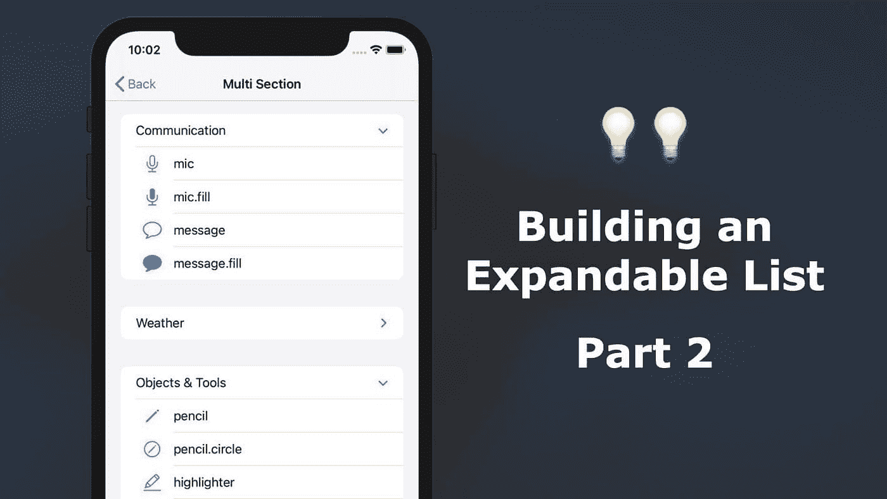
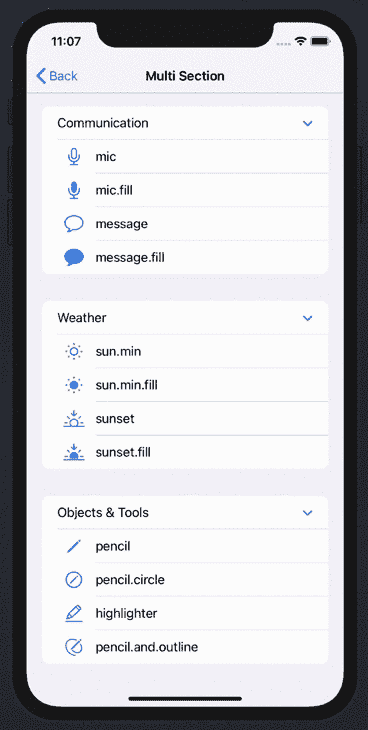
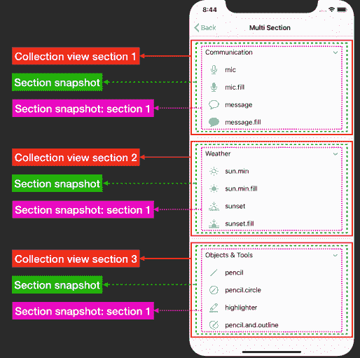
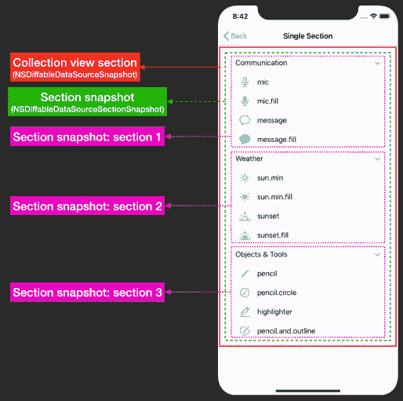
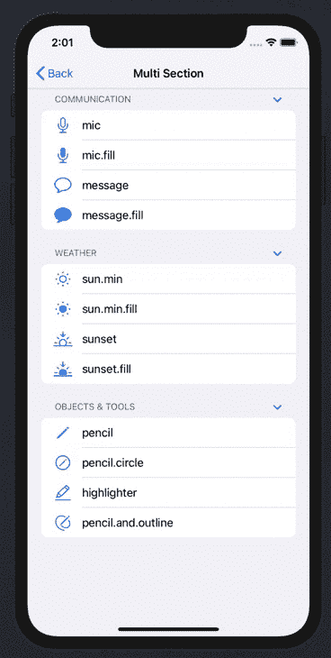

# 使用 UICollectionView 构建可扩展列表:第 2 部分

> 原文：<https://levelup.gitconnected.com/building-an-expandable-list-using-uicollectionview-part-2-92a0836573dd>

## 从来没有这么容易过！

*本文原载于 2020 年 9 月 22 日 https://swiftsenpai.com**的* [*。*](https://swiftsenpai.com/development/collectionview-expandable-list-part2/)

在上周的文章中，我们学习了如何利用`NSDiffableDataSourceSectionSnapshot`在单节集合视图中创建可扩展列表。在本文中，我们将通过修改上周的示例应用程序，在一个多节集合视图中显示相同的模型对象集，来继续我们的工作。

下面的动画 GIF 展示了我们将在本文中构建的内容。

示例应用程序

如果您还没有阅读我上周的文章—“使用 UICollectionView: Part 1 构建可扩展列表”，我强烈建议您在继续之前查看一下。

也就是说，让我们开始吧！

# 定义所需的数据类型

示例应用程序所需的数据类型与第 1 部分基本相同。唯一的区别是我们不再需要`Section`枚举作为节标识符类型。这是因为`Section`枚举只适合表示具有固定数量部分的集合视图。

以下是示例应用程序所需的所有数据类型和模型对象:

# 配置集合视图和执行单元注册

配置集合视图和执行单元注册的代码与第 1 部分完全相同。因此，如果您需要以下代码的更详细解释，请随意参考[第 1 部分](https://swiftsenpai.com/development/collectionview-expandable-list-part1/)。

# 正在初始化数据源

如前所述，我们不再能够使用`Section`枚举(在第 1 部分中定义)作为数据源部分标识符类型。为了用动态数量的部分表示集合视图，我们必须使用模型对象数据类型(`HeaderItem`)作为部分标识符类型。

通过将节标识符类型从`Section`更改为`HeaderItem`，意味着我们正在更改集合视图中表示节的数据类型。

此时，您可能想知道，更改部分标识符类型会影响单元提供者闭包吗？答案是“没有”。

这是因为单元提供者闭包的主要目的是基于项目标识符类型将单元出队，它与部分标识符类型无关。因为我们仍然使用`ListItem`作为项目标识符类型，所以让单元出列的逻辑应该保持不变。

# 设置快照

为了在多节集合视图中显示我们的模型对象，我们必须重建数据源快照(`NSDiffableDataSourceSnapshot`)和节快照(`NSDiffableDataSourceSectionSnapshot`)。

如果您不熟悉快照的概念，可以参考[第 1 部分](https://swiftsenpai.com/development/collectionview-expandable-list-part1/)中的“*了解不同种类的快照*”一节。

下图说明了我们需要构建的快照结构。

示例应用快照结构

为了便于比较，下面是单部分集合视图的快照结构。

第 1 部分快照结构

可以看出，我们需要构建一个包含 3 个集合视图部分的数据源快照。在每个集合视图部分内将包含一个单部分部分快照。换句话说，对于整个集合视图，我们总共需要 3 个截面快照。

让我们首先关注构建数据源快照。如前所述，我们使用`HeaderItem`作为部分标识符类型，这意味着 1 个`HeaderItem`实例将代表 1 个集合视图部分。因此，构建包含 3 个部分的数据源快照相当简单，只需像 sections 一样添加`modelObjects`即可。

之后，让我们构建所需的部分快照。我们是这样做的:

让我们详细检查一下上面的代码:

1.  对于代表集合视图部分的每个`headerItem`，创建一个部分快照，将`ListItem`作为其项目标识符类型。
2.  用`headerItem`创建一个`ListItem`作为关联值，并将其附加到截面快照。这将在截面快照中创建一个截面。
3.  将`headerItem`的`symbols`数组转换成`ListItem`的数组，并附加到`headerListItem`表示的部分。
4.  默认情况下，`headerListItem`代表的部分应该展开。
5.  将截面快照应用于由`headerItem`表示的集合视图截面。

差不多就是这样！您已经使用多节集合视图成功创建了一个可扩展列表。构建并运行您的示例代码，查看它的运行情况。

# 带有可扩展部分的列表

与此同时，我们致力于制作一个点击时可以展开/折叠的单元格(标题单元格)。但是，如果您想要一个包含如下所示的可扩展部分的列表，该怎么办呢？

带有可扩展部分的列表

幸运的是，苹果让实现这种布局变得极其容易。我们需要做的就是将集合视图布局的标题模式设置为`[.firstItemInSection](https://developer.apple.com/documentation/uikit/uicollectionlayoutlistconfiguration/headermode/firstiteminsection)`。

通过将标题模式设置为`.firstItemInSection`，集合视图部分中的第一个`UICollectionViewListCell`将自动使用标题外观。

# 包扎

这篇文章有三个要点:

1.  截面标识符类型(`HeaderItem`)仅用于集合视图截面表示。它与集合视图上显示的数据无关。它也与可扩展部分无关。
2.  集合视图的展开/折叠行为主要由`NSDiffableDataSourceSnapshot`的结构控制。与区段标识符类型(`HeaderItem`)无关。
3.  要创建具有可扩展部分的列表，只需将集合视图标题模式设置为`.firstItemInSection`即可。

所有这些乍一看可能有点令人困惑。但是一旦理解了背后的概念，构建一个可扩展列表就只是正确构建所需快照的问题了。

您可以在 [GitHub](https://github.com/LeeKahSeng/SwiftSenpai-UICollectionView-List) 上找到第 1 部分和第 2 部分的完整示例代码。

你觉得这篇文章有帮助吗？请在下面的评论区告诉我。你也可以通过推特[联系我，订阅我的每月时事通讯。](https://twitter.com/Lee_Kah_Seng)

感谢阅读。👨🏻‍💻

# 进一步阅读

*   [使用 Swift 中的 UICollectionView 构建列表](https://swiftsenpai.com/development/uicollectionview-list-basic/)
*   [具有自定义单元格和自定义配置的 UICollectionView 列表](https://swiftsenpai.com/development/uicollectionview-list-custom-cell/)
*   [在界面构建器中设计自定义 UICollectionViewListCell](https://swiftsenpai.com/development/custom-uicollectionviewlistcell-in-ib/)
*   [重新加载表格和集合视图单元格的现代方法](https://swiftsenpai.com/development/modern-ways-reload-cells/)
*   [声明式 UICollectionView 列表页眉页脚](https://swiftsenpai.com/development/declarative-list-header-footer/)
*   [带有交互式自定义标题的 UICollectionView 列表](https://swiftsenpai.com/development/list-interactive-custom-header/)