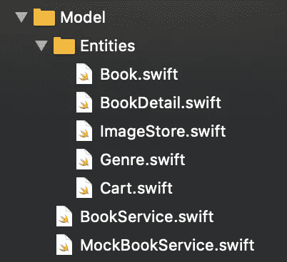

# 使用 SwiftUI + Combine + MVVM 构建 iOS 应用程序(第 1 部分)

> 原文：<https://levelup.gitconnected.com/building-an-ios-app-using-swiftui-combine-mvvm-architecture-part-1-7e5a1683a7aa>

## 逐步了解如何使用全新的 Apple 框架构建 iOS 应用程序。

苹果最近发布的框架 SwiftUI 和 Combine 正在彻底改变开发 iOS 应用的方式。它们提供了实现 UI 和处理事件的新方法。

本文将指导您使用这些框架构建一个完整的应用程序。不仅如此，我们还将使用在 Apple devs 社区越来越受欢迎的设计模式。这是 MVVM 建筑。

您可以在以下链接中找到其余零件:

*   [第二部分](/building-an-ios-app-using-swiftui-combine-mvvm-part-2-a0a703269907)
*   [第三部](https://finsi-ennes.medium.com/building-an-ios-app-using-swiftui-combine-mvvm-part-3-c90dc6a32e0d)

# 我们将建造什么

我们将开发*书目。这是一个商店应用程序，用于搜索和购买你想看的所有书籍。*

如您所见，它有几个特点:

*   **产品列表**:商店中所有可用书籍的列表。每一行都包括关于这本书的主要信息，如书名、作者和价格。
*   **产品详情**:该屏幕包含所选图书的更多详情。此外，向用户呈现了几个动作。他们将能够购买或访问购物车。
*   **结帐**:购物车的汇总视图。它包括选定的项目及其数量。结帐按钮完成购买，该动作使我们已经购买的书籍可用。因此我们可以阅读它们。

在这第一部分教程中，我们将关注如何使用 MVVM 设计模式来构建应用程序代码。我们还将实现代表应用程序基础的模型。

# 让我们从头开始

软件架构模式对于正确设计、实现和解释你的应用架构是必不可少的。如果我们回避它们，我们很容易陷入如下情况:

摘自[https://quickbirdstudios.com/](https://quickbirdstudios.com/)

在本教程中，我们将使用 MVVM 设计模式来实现我们的应用程序架构。请注意，该解决方案可以使用简单的 Swift 来实施，但大多数情况下，该解决方案需要 RxSwitft，这是一个基于反应式编程的第三方库。

现在有了 SwiftUI，这一切都变了。它的声明性方法不仅完全改变了实现我们的接口的方式，而且还允许我们完全在本地实现像这样的模式。

# 查看 MVVM 州

在我们开始之前，让我们解释一下这个设计模式的基础，更重要的是，我们将要实现的方法。

在我们的应用程序中，我们正在基于视图状态架构模式构建一个 MVVM 架构。这是受 Airbnb 的 MvRx 方法的启发，这是这种模式的完美版本。基本上，这使用了特定于视图的状态，而不是全局的应用程序状态。

顾名思义，MVVM 模式将业务逻辑和视图细节分成三个独立的部分。

MVVM 结构

*   **视图**:定义 UI 的布局、结构和外观。每个视图都有一个视图模型，为它们提供特定的视图状态。视图还通知它的视图模型关于用户交互。
*   **ViewModel** :包含通过输入对象触发的动作，视图使用这些动作将事件传递给模型。他们还负责包装模型。请注意，他们无权访问该视图。
*   **模型**:表示真实状态内容，实现应用业务逻辑。它独立于表示层。

# 模型

第一步包括创建代表应用程序数据和行为的数据实体和用例。如果我们检查项目代码，我们会看到几个实体，但是让我们把注意力集中在主要的实体上。

模型结构

对于书单，我们将使用一个`Book`实体来呈现每一卷的基本但重要的信息:

关于这一点的一些说明:

*   我们将在这里构建的所有实体都是定义良好的，具有简单的数据类型，它们之间不需要复杂的关系。这就是为什么我们使用`struct`而不是`class`。
*   注意 SwiftUI 的`List`不需要数据源或委托，只需要实现`Identifiable`协议来惟一地标识每一行。

一旦我们在列表中选择了一本书，我们就可以访问它的详细信息。`BookDetail`将包括关于它的几个数据，例如流派、种类、描述或可用性:

当用户选择了最喜欢的书籍后，他们将进入结帐界面。在我们的例子中，我们将有一个`Cart`实体，它包含关于所选商品、数量和最终购买价格的信息:

从所有这些实体中，我们现在可以声明将定义我们的应用程序特性的用例。我们将把所有用例组合成一个服务。这是包含所有数据访问和缓存的责任。因此，考虑到这一点，让我们实现一个`BookService`协议:

正如我们之前看到的，我们的应用程序的每个视图将包含几个功能。我们使用以下方法包含所需的内容:

*   `bookList()`:商店 app 在售图书列表。
*   `bookDetails(bookId:)`:按 id 搜索图书详情。
*   `numberOfCartItems()`:购物车中包含的书籍数量。
*   `addToCart(bookId:)`:将选中的一本书加入购物车。
*   `cartItems()`:提供与用户购物车相关的所有详细信息。
*   `checkout()`:结账正确完成。这意味着将所有选中的书标记为可用，并清空购物车。

在本教程中，我们将使用一个模拟服务来实现该协议。我们将创建`MockBookService`类，它包含一个列表`Book`，另一个列表`BookDetail`和一个空的`Cart`。除此之外，以前的方法会有它们相应的实现:

*   这些方法包括管理项目实体所需的逻辑。正如你所看到的，这是简单的逻辑，它们是不言自明的。
*   在实际的项目解决方案中，我们遵循另一种方法。例如，这些方法可以通过网络和图像加载和缓存来获取数据。这将取决于你的要求。
*   还要注意，在这段代码中，为了进行总结，我们省略了一些细节。您可以查看项目资源库以了解更多详细信息。

# 下一步是什么

至此，我们已经学会了如何使用 MVVM 结构来组织我们的应用程序。此外，我们实现了数据层，这是应用程序的基础。我们现在准备只使用 SwiftUI 和 Combine 框架来实现表示层。我们将在下一部分继续讨论这个问题。

我很快就会回来！请在下面留下你的问题或建议。谢谢😁

注意:一旦我们完成这个系列教程，代码项目就可以使用了。

# 本部分使用的资源:

*   [模型-视图-视图模型](https://en.wikipedia.org/wiki/Model%E2%80%93view%E2%80%93viewmodel)
*   [SwiftUI 架构](https://quickbirdstudios.com/blog/swiftui-architecture-redux-mvvm/)
*   [Airbnb 的 MvRx](https://github.com/airbnb/MvRx)
*   [MVVM 建筑](https://applecoding.com/guias/arquitectura-mvvm-con-swiftui)
*   [MVVM 设计模式与 iOS 上的组合框架](https://medium.com/flawless-app-stories/mvvm-design-pattern-with-combine-framework-on-ios-5ff911011b0b)
*   [使用 MVVM 开始使用 SwiftUI 和 Combine](https://medium.com/swlh/getting-started-with-swiftui-and-combine-using-mvvm-and-protocols-for-ios-d8c37731a1d9)