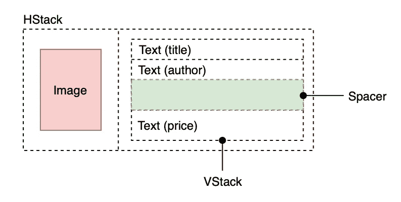
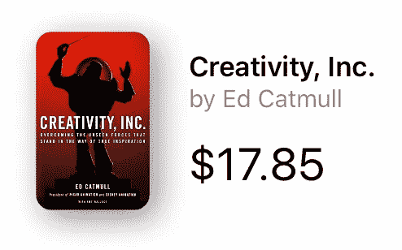

# 使用 SwiftUI + Combine + MVVM 构建 iOS 应用程序(第 2 部分)

> 原文：<https://levelup.gitconnected.com/building-an-ios-app-using-swiftui-combine-mvvm-part-2-a0a703269907>

## 逐步了解如何使用全新的 Apple 框架构建 iOS 应用程序。

本文将指导您使用这些框架构建一个完整的应用程序。不仅如此，我们还将使用在 Apple devs 社区越来越受欢迎的设计模式。这是 MVVM 建筑。

开始之前，请注意这是教程的第二部分。为了更好地理解这个练习，请查看前面的部分。它包括应用程序演示和所有与使用 MVVM 的代码结构相关的细节。在第一部分中，我们还实现了模型:

*   [使用 SwiftUI + Combine + MVVM 构建 iOS 应用【第一部分】](https://medium.com/@ennes.finsi/building-an-ios-app-using-swiftui-combine-mvvm-architecture-part-1-7e5a1683a7aa)

在本文中，我们将开始使用 SwiftUI 和 Combine，因此我们假设您在这些框架中有一些这方面的知识。如果不是这样，我建议您从基础开始:

*   [SwiftUI 教程](https://developer.apple.com/tutorials/swiftui/creating-and-combining-views)。
*   [联合收割机基础](/basics-of-combine-framework-64dbd18da341)框架和[联合收割机教程](https://www.vadimbulavin.com/swift-combine-framework-tutorial-getting-started/)。

# 我们将建造什么

此时，我们有了一个定义良好的模型。它包括几个实体和用例，代表我们应用程序的业务逻辑。因此，我们已经具备了开始构建表示层的一切。

正如我们在第一部分教程中所评论的，我们实现了一个受 Airbnb 的 MvRx 方法启发的 MVVM 架构。这使用特定于视图的状态，而不是全局应用程序状态。考虑到这一点，我们将了解如何使用 SwiftUI+Combine 来调整该解决方案。

我们将开始为 *ViewModel* 组件构建一个通用实现。一旦我们清楚了它是如何工作的及其功能，我们就可以用它们特定的视图模型来构建应用程序视图了。在这一部分，我们将实现图书列表视图。

# ViewModel 通用实现

众所周知，设计模式可以通过几种方法来实现。在这个练习中，我们寻找一个遵循 MvRx 方法的*视图模型*的通用实现。这样，QuickBirdStudios 提供的解决方案完全符合我们的要求:

*   QuickBirdStudios 的视图模型解决方案

我们的目的是构建一个尽可能灵活的视图模型。换句话说，我们想要改变一个*视图模型*的动作和状态，而不修改视图组件。因此，让我们从定义一个`ViewModel`协议开始:

这个协议代表了我们的应用程序中的一个重要组成部分，所以让我们专注于我们正在做的事情。可以看到，此时*联合收割机*出现在现场。在我们的例子中，我们将使用这个框架来处理状态更新事件。

我们的`ViewModel`协议符合`ObservableObject`。换句话说，我们的对象将包含一个在改变之前发出的发布者。因此，正如我们稍后看到的，我们可以像使用任何其他`@ObservedObject`属性一样使用它。

除此之外，协议还有两种相关类型:

*   `State`:指特定视图的状态(包装模型)。
*   `Input`:用户动作将使用`trigger`方法触发这些输入。

注意`associatedtype`在这种情况下是多么有用。它只是为这种类型的协议提供了一个占位符名称。但是在协议被采用之前，这些关联类型所使用的实际类型并没有被指定。

最后，我们将有一个`AnyViewModel`类型，它将作为一个符合`ViewModel`协议的包装器，关联的类型是指定的泛型类型`State`和`Input`。

*   看看存储的属性。我们的`wrappedObjectWillChange`返回了`Publisher`的一个具体实现，它的类型包含了我们不想跨越 API 边界公开的细节。它的`Output`是`Void`，它的`Failure`是`Never`类型，这意味着它不会失败。
*   注意，我们最终将为每个具体实现使用的是`state`变量和`trigger(_ input:)`函数。

# 视图特定的实现

此时，我们可以开始实现应用程序视图。使用前面的代码，我们将为它们中的每一个定义一个单独的状态和输入。然后，正如我们在本文开头所说的，我们将重点关注应用程序主图书列表中涉及的视图和组件。

查看代码结构

## 图书行视图

让我们从基础开始，我们将创建一个 SwiftUI 视图来表示图书列表的一行。我们知道，`body`属性只返回单个视图。我们可以在*堆栈*中组合和嵌入多个视图，将视图水平、垂直或前后组合在一起。这样，我们按如下方式组织行视图:

我们将使用一个水平堆栈来放置主要元素:产品图片及其相关细节。对于这些细节，我们使用一个`VStack`来垂直显示一本书的基本信息，比如书名、作者和价格。

如果我们转到代码项目，我们将有一个如下图所示的`BookRow`:

*   我们用很少的元素实现了一个简单的视图。此外，使用一个`Book`作为视图属性就足以显示这些信息。目前，`ViewModel`还不需要。
*   注意`BookImage`只是我们定义的自定义视图。我们将在其他视图中使用它，因此它位于 *Utils* 文件夹中。

在画布中，点击 *Resume* 显示预览。结果如下:

图书行视图的预览

## 图书列表视图

我们将创建一个显示集合元素的列表和一个为集合中的每个元素提供视图的闭包。该收藏是为我们的服务提供的图书收藏。此外，我们对这些元素使用了`BookRow`视图。

开始定义视图状态。服务将出现在所有视图状态中，因为我们需要它来访问数据层。该视图状态还包括将要显示的`Book`列表。

由于没有导致状态改变的用户输入，我们可以使用`Never`作为输入类型。考虑到所有这些，我们将视图的`viewModel`属性定义如下:

`BookListViewModel`的实现相当简单，因为它只提供一个静态状态:

最后，有了这些，我们现在可以构建`BookListView`:

*   记住`Book`数据类型符合`Identifiable`协议。因此，我们可以使用`List`来显示这些信息。
*   通过从闭包返回一个`BookRow`来完成动态生成的列表。这为`viewModel.state.books`数组中的每个元素创建了一个`BookRow`。
*   为了避免 SwiftUI 立即加载目标视图，我们使用了那个`NavigationLazyView`。这只是对这个框架的一个限制的[解决方法](https://stackoverflow.com/a/61234030)。

恭喜，我们已经完成了本教程的第二部分。构建并运行应用程序，查看最终结果，如下所示:

# 下一步是什么

我们已经学会了如何使用 SwiftUI 和 Combine 来调整 MVVM 架构。我们为 *ViewModel* 组件构建了一个通用实现，它允许我们实现图书列表视图。在下一部分中，我们将完成应用程序，用各自的*视图模型*定义和构建剩余的视图。

很快就会回来！请在下面留下你的问题或建议。谢谢😁

注意:一旦我们完成这个系列教程，项目代码就可以使用了。

# 本部分使用的资源:

*   [SwiftUI 架构](https://quickbirdstudios.com/blog/swiftui-architecture-redux-mvvm/)
*   QuickBirdStudios 的[视图模型解决方案](https://github.com/quickbirdstudios/SwiftUI-Architectures/blob/master/QBChat-MVVM/QBChat-MVVM/MVVM/ViewModel.swift)
*   [Airbnb 的 MvRx](https://github.com/airbnb/MvRx)
*   [MVVM 建筑](https://applecoding.com/guias/arquitectura-mvvm-con-swiftui)
*   [MVVM 设计模式与 iOS 上的组合框架](https://medium.com/flawless-app-stories/mvvm-design-pattern-with-combine-framework-on-ios-5ff911011b0b)
*   [使用 MVVM 开始使用 SwiftUI 和 Combine](https://medium.com/swlh/getting-started-with-swiftui-and-combine-using-mvvm-and-protocols-for-ios-d8c37731a1d9)
*   [NavigationLazyView 工作区](https://stackoverflow.com/questions/57594159/swiftui-navigationlink-loads-destination-view-immediately-without-clicking/61234030#61234030)