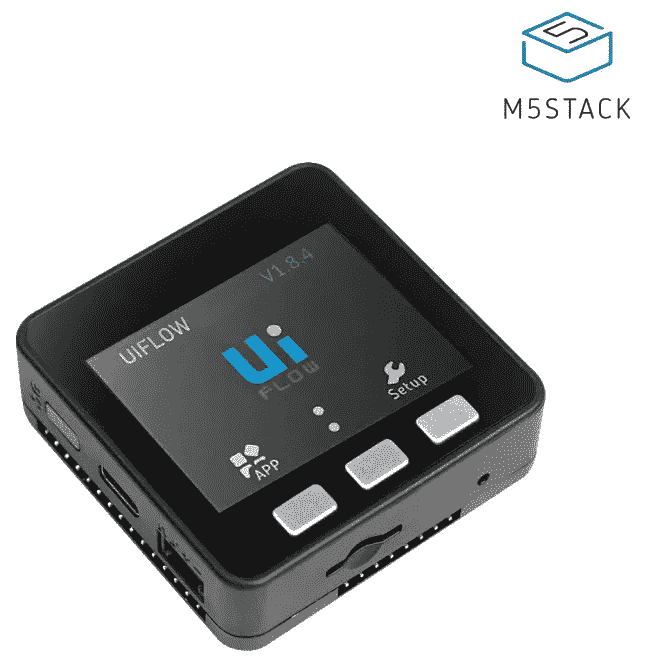
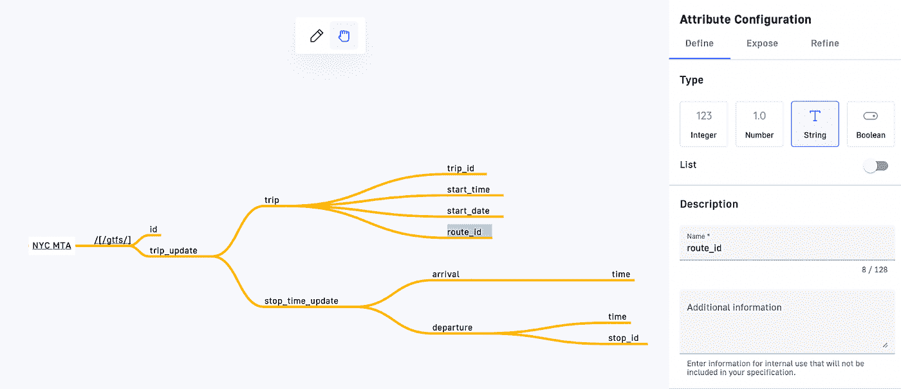
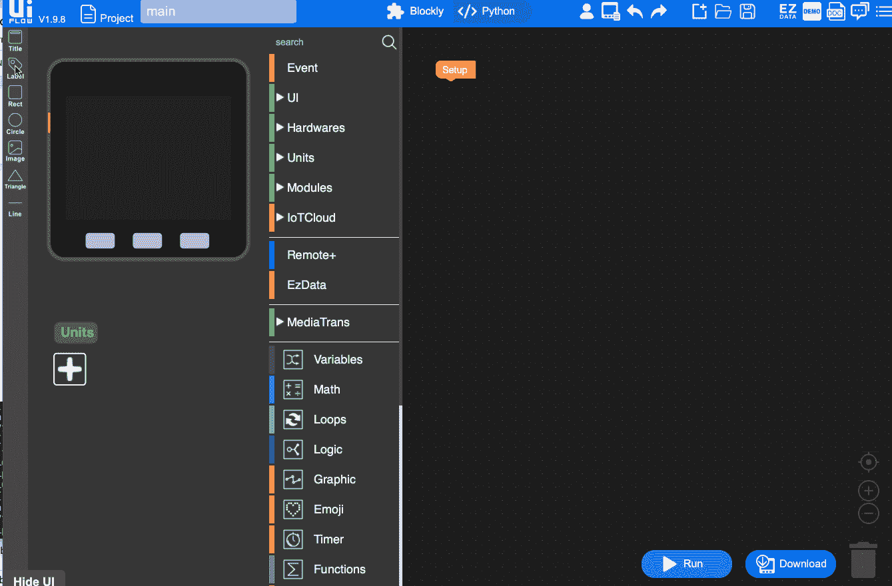
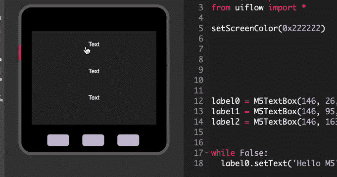

# 使用 HTTP API 构建物联网应用

> 原文：<https://levelup.gitconnected.com/building-an-iot-application-using-an-http-api-d60d42ac2599>


照片由[关峰](https://unsplash.com/@kwan_fvng?utm_source=unsplash&utm_medium=referral&utm_content=creditCopyText)在 [Unsplash](https://unsplash.com/?utm_source=unsplash&utm_medium=referral&utm_content=creditCopyText) 上拍摄

## 咖啡店里的编码

## M5Stack、纽约市 MTA 和 Gravitee 设计师

多年来，世界上一直充斥着物联网设备。这些设备从显示当前天气的闹钟到显示附近食品价格的冰箱。无论具体情况如何，这些设备都依赖 API 与数据源进行通信。但是，我们究竟如何连接消息、数据和设备呢？

在本帖中，我们将向您展示如何为物联网设备设计和建模数据的示例。我们将使用[M5 stack](https://m5stack.com)——一种带有显示屏的小型模块化物联网设备——并连接到纽约市大都会运输管理局(MTA 纽约市)的 [API，以呈现各个车站的最新地铁时间。](https://new.mta.info/developers)



虽然我们将重点关注 M5Stack，但我们将讨论的概念将适用于跨各种设备设计物联网应用。

所以让我们开始吧！

# 先决条件

在本教程中，我们将围绕如何从 API 请求数据来关注更大的概念。*一些*编程知识会很有帮助。虽然你不需要一个 M5Stack，但是如果你*有一个*的话，那么你可以跟着做，把完成的项目上传到你自己的设备上。

记住这一点，你可以下载 [VS 代码 IDE](https://code.visualstudio.com) 和[M5 stack 插件](https://marketplace.visualstudio.com/items?itemName=curdeveryday.vscode-m5stack-mpy)。如果你以前从未启动过 M5Stack，[按照他们的指导](https://m5stack.github.io/UIFlow_doc/en/en/base/Setting_WIFI.html)来设置 WiFi 和必要的固件。对于这个项目，我们将使用 [Python 3](https://www.python.org/downloads/) ，这是 M5Stack 使用的主要编程语言。

你需要[注册一个纽约 MTA 开发者账户](https://api.mta.info/#/landing)，获得一个免费的开发者 API 密匙来访问他们的实时地铁数据。

最后，您应该注册一个免费的 Gravitee 帐户来使用 [API 设计器](https://www.gravitee.io/platform/api-designer?hsLang=en)，这将使您更容易可视化和理解 API 调用中的数据流！

这个项目原始资料是受[这个开源项目](https://github.com/neoterix/nyc-mta-arrival-notify)的启发，所以如果有帮助的话，就开始创建这个库吧。

# 设计 API 交互

在写一行代码之前，让我们后退一步，考虑一下完成这个项目需要什么样的信息:

*   相关地铁站的信息
*   哪趟列车经过那些车站
*   关于那些火车的最新实时数据

根据文档，API 分为[静态数据馈送](http://web.mta.info/developers/developer-data-terms.html#data)和[实时数据馈送](https://api.mta.info/#/subwayRealTimeFeeds)。

静态数据馈送保存有关电台的信息。有了这些信息，我们就可以从实时数据馈送 API 获得实际的实时训练数据。MTA 提供的数据采用以下 CSV 格式:

```
stop_id,stop_code,stop_name,stop_desc,stop_lat,stop_lon,zone_id,stop_url,location_type,parent_station
```

因为我们需要的唯一静态信息是电台 ID，所以我们可以简单地选取一个随机的电台 ID，并将其用于实时提要。在这种情况下，我选择[Hoyt–Schermerhorn 站](https://en.wikipedia.org/wiki/Hoyt%E2%80%93Schermerhorn_Streets_station)是因为它相对复杂:两列独立的火车通过它(A 和 C)。车站也通过它们是北行还是南行来识别。

```
A42,,Hoyt-Schermerhorn Sts,,40.688484,-73.985001,,,1,
A42N,,Hoyt-Schermerhorn Sts,,40.688484,-73.985001,,,0,A42
A42S,,Hoyt-Schermerhorn Sts,,40.688484,-73.985001,,,0,A42
```

从这些行中，我们需要的只是父站点 ID (A42)来标识通过该站的列车，包括北行(A42N)和南行(A42S)。

实时信息以谷歌的 GTFS 格式表示，该格式基于协议缓冲区。虽然纽约 MTA 没有记录在案的具体信息来源，但 GTFS 却有。从 GTFS 的文档中，我们可以知道如何以 protobuf 格式获得最新列车到达特定车站的时间。

下面是一个来自 GTFS 端点的响应示例，为了便于可视化，它被转换成了 JSON:

```
{
  "trip":{
     "trip_id":"120700_A..N",
     "start_time":"20:07:00",
     "start_date":"20220531",
     "route_id":"A"
  },
  "stop_time_update":[
     {
        "arrival":{
           "time":1654042672
        },
        "departure":{
           "time":1654042672
        },
        "stop_id":"H06N"
     },//…more stops…{
        "arrival":{
           "time":1654044957
        },
        "departure":{
           "time":1654044957
        },
        "stop_id":"A42N"
     }
  ]
}
```

由于纽约市 MTA API 会向您提供大量信息，因此使用 Gravitee API 设计器对 API 返回的内容进行建模、绘制和可视化数据会非常有帮助。这是我们的 API 设计者思维导图的快照:



API 设计器帮助您识别 API 的所有资源(端点),以及与我们的资源相关的数据属性。这些属性将包括端点需要的输入和它提供的输出。

在我们的地图中，我们有一个路径为`/gtfs/`的资源。我们可以根据需要附加任意多的属性，并且可以用数据类型来注释这些属性。通过查看我们的地图，我们可以绘制一条从终点到右下角标识的到达和离开时间的直接路径。

因此，为了表示我们需要的数据，我们需要:

*   识别我们要获取列车信息的车站的 ID
*   针对我们感兴趣的火车线路，向纽约市 MTA 的 GTFS feed 发出 HTTP 请求
*   迭代结果，将响应数组中的 stop_id 与我们的站 id 进行比较
*   然后，我们可以根据特定车站和列车的时间信息采取行动

这代表了几个移动的部分，但它不应该是我们不能处理的任何事情！

# 编码它

在我们的 M5Stack 上运行任何东西之前，让我们首先确保我们的代码在本地工作。我们将安装几个 Python 包来使我们的项目更容易构建。

```
pip3 install - upgrade gtfs-realtime-bindings
pip3 install protobuf3_to_dict
pip3 install requests
```

前两个包将协议缓冲区转换成 Python 字典(或散列)，这使得数据模型更容易使用。最后一个包使得从 Python 发出 HTTP 请求变得更加容易。

我们将从导入 Python 包开始我们的程序:

从 google.transit 导入 gtfs_realtime_pb2
导入请求
导入时间

接下来，我们将向纽约 MTA GTFS 提要发出 HTTP 请求:

```
api_key = "YOUR_API_KEY"# Requests subway status data feed from the NYC MTA API
headers = {'x-api-key': api_key}
feed = gtfs_realtime_pb2.FeedMessage()
response = requests.get(
    '[https://api-endpoint.mta.info/Dataservice/mtagtfsfeeds/nyct%2Fgtfs-ace'](https://api-endpoint.mta.info/Dataservice/mtagtfsfeeds/nyct%2Fgtfs-ace'),
    headers=headers)
feed.ParseFromString(response.content)
```

到目前为止，一切顺利。我们在这里使用的 GTFS 端点是用于 A/C/E 列车的端点，我们可以通过 URL 上的后缀`-ace`来识别它。(除此之外，对于这个 demo，我们不关心 E 火车——对不起，E 火车！)

让我们将 GTFS 协议缓冲响应转换成一个字典:

```
from protobuf_to_dict import protobuf_to_dict
subway_feed = protobuf_to_dict(feed)  # converts MTA data feed to a dictionary
realtime_data = subway_feed['entity']
```

此时，我强烈建议发出 print(realtime_data ),这样我们就可以看到实际的数据结构是什么样子。如果这是一个真实的项目，这样的分析可能会帮助您确定需要迭代字典中的哪些键和值——但是由于这是一个教程，我们已经讨论过了。

```
def station_time_lookup(train_data, station):
   for trains in train_data:
       if trains.__contains__('trip_update'):
           unique_train_schedule = trains['trip_update']
           if unique_train_schedule.__contains__('stop_time_update'):
             unique_arrival_times = unique_train_schedule['stop_time_update']
             for scheduled_arrivals in unique_arrival_times:
                 stop_id = scheduled_arrivals.get('stop_id', False)
                 if stop_id == f'{station}N':
                     time_data = scheduled_arrivals['arrival']
                     unique_time = time_data['time']
                     if unique_time != None:
                         northbound_times.append(unique_time)
                 elif stop_id == f'{station}S':
                     time_data = scheduled_arrivals['arrival']
                     unique_time = time_data['time']
                     if unique_time != None:
                         southbound_times.append(unique_time)# Keep a global list to collect various train times
northbound_times = []
southbound_times = []# Run the above function for the station ID for Hoyt-Schermerhorn
station_time_lookup(realtime_data, 'A42')
```

突然我们有了很多代码！但是不要担心——我们正在做的事情并不复杂:

*   我们迭代 A/C 线的列车信息数组。
*   对于每个数组条目，我们验证我们拥有所有需要的键的值。这是防御性编码，因为我们不能 100%确定这个第三方服务在我们需要的时候有我们需要的东西！
*   之后，我们迭代所有的车站信息，并在到达北向和南向列车都需要的父 ID(`A42`)时停止。
*   最后，我们在两个单独的全局变量中保存了即将到来的火车到达时间的列表。

接下来，让我们展示这些信息:

```
# Sort collected times in chronological order
northbound_times.sort()
southbound_times.sort()# Pop off the earliest and second earliest arrival times from the list
nearest_northbound_arrival_time = northbound_times[0]
second_northbound_arrival_time = northbound_times[1]nearest_southbound_arrival_time = southbound_times[0]
second_southbound_arrival_time = southbound_times[1]### UI FOR M5STACK SHOULD GO HERE ###def print_train_arrivals(
        direction,
        time_until_train,
        nearest_arrival_time,
        second_arrival_time):
    if time_until_train <= 0:
        next_arrival_time = second_arrival_time
    else nearest_arrival_time:
        next_arrival_time_s = time.strftime(
            "%I:%M %p",
            time.localtime(next_arrival_time))
    print(f"The next {direction} train will arrive at {next_arrival_time_s}")# Grab the current time so that you can find out the minutes to arrival
current_time = int(time.time())
time_until_northbound_train = int(
    ((nearest_northbound_arrival_time - current_time) / 60))
time_until_southbound_train = int(
    ((nearest_southbound_arrival_time - current_time) / 60))
current_time_s = time.strftime("%I:%M %p")
print(f"It's currently {current_time_s}")print_train_arrivals(
    "northbound",
    time_until_northbound_train,
    nearest_northbound_arrival_time,
    second_northbound_arrival_time)
print_train_arrivals(
    "southbound",
    time_until_southbound_train,
    nearest_southbound_arrival_time,
    time_until_southbound_train)
```

我们上面做的大部分是数据格式化。关键步骤如下:

*   我们在车站对北上和南下列车的到达时间进行排序。
*   我们乘坐前两次(到达的“最快”列车)。
*   我们将这些时间与当前时间进行比较，以获得火车到达的分钟距离。我们将这些火车到达时间传递给 print_train_arrivals。
*   如果下一班火车不到一分钟就要到达，我们会显示第*秒*到达时间——恐怕你赶不上那班火车了！否则，我们将显示最近的到达时间。

如果您在终端上运行这个脚本，那么您应该会看到类似如下的消息:

```
It's currently 05:59 PM
The next northbound train will arrive at 06:00 PM
The next southbound train will arrive at 06:02 PM
```

# 部署到 M5 堆栈

既然我们已经在本地测试了我们的 Python 代码可以与纽约 MTA API 通信，那么是时候让这段代码在我们的 M5Stack 上运行了。对 M5Stack 编程最简单的方法是通过免费的 UI Flow IDE 进行[，这只是一个通过 WiFi 与您的设备进行通信的网页。您可以通过](https://flow.m5stack.com)[他们的文档](https://docs.m5stack.com/en/quick_start/core2/uiflow)了解有关如何配置您的设备进行 WiFi 访问的更多信息。

虽然 M5Stack 可以通过 WYSIWYG UI 元素进行编程，但它也可以接受(并运行)Python 代码。然而，WYSIWYG 元素的主要优点是它使得在屏幕上绘制的文本更加容易可视化:



在这个 GIF 中，我在示例 M5Stack 屏幕上用默认字符串“Text”创建了一个标签。当我切换到 Python 时，我们看到标签是一个名为 M5TextBox 的对象的实例化。当拖动标签时，其 X 和 Y 坐标(构造函数中的前两个参数)在 Python 中会发生变化。这使得很容易看到你的程序将如何显示。您还可以通过单击标签本身来更改 Python 代码中使用的变量(以及其他属性):



在大多数情况下，我们编写的 Python 脚本可以在 M5Stack 上使用，只需稍加修改。我们可以从本地机器复制 Python 代码，并将其粘贴到 UI 流 IDE 的 Python 选项卡中。

在我们的代码中，我们找到了`### UI FOR M5STACK SHOULD GO HERE ###`注释并用下面的代码替换它下面的所有内容:

```
time_label = M5TextBox(146, 27, "", lcd.FONT_Default, 0xFFFFFF, rotate=0)
northbound_label = M5TextBox(146, 95, "", lcd.FONT_Default, 0xFFFFFF, rotate=0)
southbound_label = M5TextBox(146, 163, "", lcd.FONT_Default, 0xFFFFFF, rotate=0)def print_train_arrivals(
        direction,
        label,
        time_until_train,
        nearest_arrival_time,
        second_arrival_time):
    if time_until_train <= 0:
        next_arrival_time = second_arrival_time
    else nearest_arrival_time:
        next_arrival_time_s = time.strftime(
            "%I:%M %p",
            time.localtime(next_arrival_time))
    label.setText(f"The next {direction} train will arrive at {next_arrival_time_s}")while True:
    # Grab the current time so that you can find out the minutes to arrival
    current_time = int(time.time())
    time_until_northbound_train = int(
        ((nearest_northbound_arrival_time - current_time) / 60))
    time_until_southbound_train = int(
        ((nearest_southbound_arrival_time - current_time) / 60))
    current_time_s = time.strftime("%I:%M %p")
    time_label.setText(f"It's currently {current_time_s}")print_train_arrivals(
        "northbound",
        northbound_label,
        time_until_northbound_train,
        nearest_northbound_arrival_time,
        second_northbound_arrival_time)
    print_train_arrivals(
        "southbound",
        southbound_label,
        time_until_southbound_train,
        nearest_southbound_arrival_time,
        time_until_southbound_train)

    sleep 5
```

这其中的大部分应该看起来很熟悉！要让这段代码在 M5Stack 上运行，有两个主要的修改。

首先，我们创建了标签，作为时间和训练数据的占位符:

*   `time_label`
*   `northbound_label`
*   `southbound_label`

第二，我们把所有东西都放在了一个`while`循环中，这个循环将获取当前时间并设置标签文本。循环将休眠五秒钟，然后重新开始该过程。

就是这样！当我们点击 **Run** 按钮时，我们应该看到我们的火车字符串每五秒更新一次最新的路线数据。

# 结论

就是这样！爱好者经常使用物联网设备，但如果你继续从事这个项目，有几个现实世界的考虑因素。一个考虑是速率限制，确保您从 MTA API 以有效的方式请求数据。另一个考虑是连接性。如果您的设备暂时失去 WiFi 访问，它将如何重新建立连接以获取所需的信息？

一旦您开始考虑这些生产级的问题，或者如果您想要跨多个设备扩展您的项目，您还需要考虑 API 管理。我在本文前面提到过 Gravitee Designer，它在设计阶段非常有用。Gravitee 拥有其他 API 管理工具，如 API 网关、监控和实时分析、部署。

对于习惯于为传统服务器和 web 浏览器编写代码的开发人员来说，物联网应用开发似乎令人望而生畏。然而，向物联网设备的飞跃实际上相当小。今天的设备，凭借其对流行语言和框架的内置支持，使物联网成为构建或集成 API 和应用程序的有趣和创新的方式。

# 分级编码

感谢您成为我们社区的一员！在你离开之前:

*   👏为故事鼓掌，跟着作者走👉
*   📰查看[升级编码出版物](https://levelup.gitconnected.com/?utm_source=pub&utm_medium=post)中的更多内容
*   🔔关注我们:[Twitter](https://twitter.com/gitconnected)|[LinkedIn](https://www.linkedin.com/company/gitconnected)|[时事通讯](https://newsletter.levelup.dev)

🚀👉 [**软件工程师的热门职位**](https://jobs.levelup.dev/jobs?utm_source=pub&utm_medium=post)