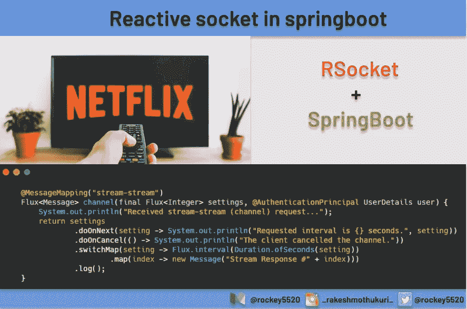
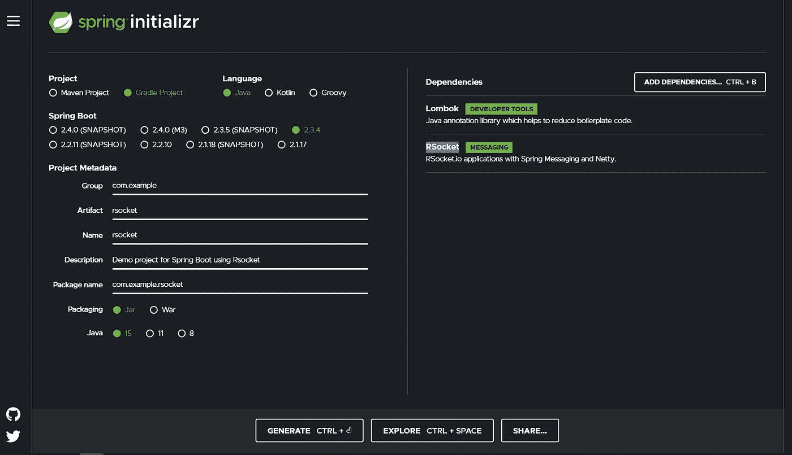
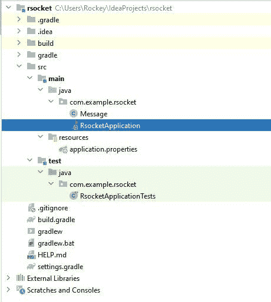

# 构建基于 RSocket 的 Springboot 应用程序

> 原文：<https://levelup.gitconnected.com/building-an-rsocket-based-springboot-application-e386c84ec801>

## 权威指南

## RSocket 是一种二进制协议，用于 TCP、WebSockets 和 Aeron 等字节流传输。



# 介绍

RSocket(反应式套接字)是一种通过 TCP 或 Websockets 工作的消息传递协议。该协议提供的通信模式有“一劳永逸”、“请求-响应”和“流式传输”。因为 RSocket 是完全反应式的，所以它是高吞吐量应用程序的理想选择。

在本帖中，我们将探索三种通信模式，即`fire-and-forget`、`request-response`和`streaming`，并用`RSocket Client CLI (RSC)`进行测试，这是一种邮差类型的应用程序，但要通过套接字测试应用程序。

# 设置

1.  安装 Java 最好是版本 15。
2.  Spring boot 骨架项目
3.  导航到`start.spring.io`，选择`RSocket`作为 spring boot 版本的依赖和稳定版本，点击`Generate`会给出一个 zip 文件，其中包含一个可以开始运行的框架项目。



初始项目结构如下



1.  应用程序配置
2.  接下来，通过修改文件`application.properties`来设置运行该应用程序的端口

```
spring.rsocket.server.port=7000
spring.main.lazy-initialization=true
```

1.  测试服务器应用程序的客户端:
2.  这里我使用的是由 [Toshiaki Maki](https://github.com/making/rsc) 创建的 **RSC 客户端**。设置说明在他的 GitHub 页面上。

**数据模型:**

我们创建一个新的 POJO 类来表示客户机和服务器交换的数据。这个类现在将由两个成员变量组成，它们是`message` `created`

```
package com.example.rsocket;import java.time.Instant;public class Message { private String message; 
  private long created = Instant.now().getEpochSecond();  public Message(String message) {
    this.message = message;
  } public String getMessage() {
    return message;
  } public void setMessage(String message) {
    this.message = message;
  } public long getCreated() {
    return created;
  } public void setCreated(long created) {
    this.created = created;
  }
}
```

这应该得到基本项目设置，并准备好编写代码和通过套接字公开。

# 通信模式 1:请求-响应

**发展**

请求-响应是一种经典的通信方式，客户端发出的每个请求都会得到响应。这是通过包含以下代码片段来实现的(完整代码可从 Github 资源库获得:[https://github.com/rockey5520/rsocket](https://github.com/rockey5520/rsocket))

```
@MessageMapping("request-response")
	Mono<Message> requestResponse(final Message message) {
		System.out.println("Received request-response message: {}"+message);
		return Mono.just(new Message("You said: " + message.getMessage()));
	}
```

上面代码的关键部分是`@MessageMapping("request-response")`,我们让 spring boot 知道当客户端使用`request-response`通信模式进行调用时，应该调用这个方法`requestResponse`。这里我们使用 POJO 类`Message`作为从客户端接收和响应客户端的有效负载。

因为这是一个请求和响应模型，其中服务器对 Spring Reactor `reactor.core`的客户端`Mono`发出的请求发送响应，这是完美的，因为只需要对每个请求发送一次响应。

**测试**

使用安装的 RSC 客户端，如果您通过以下说明

```
rsc --debug --request --data "{\"message\":\"Hello\"}" --route request-response --stacktrace tcp://localhost:7000
```

如果运行成功，您将看到如下输出

```
Frame => Stream ID: 1 Type: REQUEST_RESPONSE Flags: 0b100000000 Length: 49
Metadata:
         +-------------------------------------------------+
         |  0  1  2  3  4  5  6  7  8  9  a  b  c  d  e  f |
+--------+-------------------------------------------------+----------------+
|00000000| fe 00 00 11 10 72 65 71 75 65 73 74 2d 72 65 73 |.....request-res|
|00000010| 70 6f 6e 73 65                                  |ponse           |
+--------+-------------------------------------------------+----------------+
Data:
         +-------------------------------------------------+
         |  0  1  2  3  4  5  6  7  8  9  a  b  c  d  e  f |
+--------+-------------------------------------------------+----------------+
|00000000| 7b 22 6d 65 73 73 61 67 65 22 3a 22 48 65 6c 6c |{"message":"Hell|
|00000010| 6f 22 7d                                        |o"}             |
+--------+-------------------------------------------------+----------------+
2020-10-11 10:15:29.750 DEBUG --- [actor-tcp-nio-1] i.r.FrameLogger : receiving -> 
Frame => Stream ID: 1 Type: NEXT_COMPLETE Flags: 0b1100000 Length: 56
Data:
         +-------------------------------------------------+
         |  0  1  2  3  4  5  6  7  8  9  a  b  c  d  e  f |
+--------+-------------------------------------------------+----------------+
|00000000| 7b 22 6d 65 73 73 61 67 65 22 3a 22 59 6f 75 20 |{"message":"You |
|00000010| 73 61 69 64 3a 20 48 65 6c 6c 6f 22 2c 22 63 72 |said: Hello","cr|
|00000020| 65 61 74 65 64 22 3a 31 36 30 32 34 31 31 33 32 |eated":160241132|
|00000030| 39 7d                                           |9}              |
+--------+-------------------------------------------------+----------------+
{"message":"You said: Hello","created":1602411329}
```

收到的响应由 3 个消息帧构成

**第 1 帧**

第一帧标记为元数据，显示发送到服务器的路由元数据(请求-响应)

**第二帧**

第二帧显示了我们发送给服务器的数据(在本例中是“Hello”)一个 JSON 字符串

**第三帧**

第三帧显示了发送回客户端的服务器响应。

# 沟通模式 2:解雇并忘记

**发展**

“一劳永逸”是另一种通信方式，在这种方式下，客户端发出的请求不会从服务器得到响应。这是通过包含以下代码片段来实现的(完整代码可从 Github 库获得:[https://github.com/rockey5520/rsocket](https://github.com/rockey5520/rsocket))

```
@MessageMapping("fire-and-forget")
	public Mono<Void> fireAndForget(final Message message) {
		System.out.println("Received fire-and-forget request: {}"+ message);
		return Mono.empty();
	}
```

上面代码的关键部分是`@MessageMapping("fire-and-forget")`,我们让 spring boot 知道，当客户端使用`fire-and-forget communication mode. Here we are using the POJO class` 消息作为从客户端接收的有效载荷进行调用时，应该调用这个方法`fireAndForget`。

**测试**

使用安装的 RSC 客户端，如果您通过以下说明

```
rsc --debug --fnf --data "{\"message\":\"Hello\"}" --route fire-and-forget --stacktrace tcp://localhost:7000
```

如果运行成功，您将看到如下输出

```
2020-10-11 10:31:28.398 DEBUG --- [     parallel-2] i.r.FrameLogger : sending -> 
Frame => Stream ID: 1 Type: REQUEST_FNF Flags: 0b100000000 Length: 48
Metadata:
         +-------------------------------------------------+
         |  0  1  2  3  4  5  6  7  8  9  a  b  c  d  e  f |
+--------+-------------------------------------------------+----------------+
|00000000| fe 00 00 10 0f 66 69 72 65 2d 61 6e 64 2d 66 6f |.....fire-and-fo|
|00000010| 72 67 65 74                                     |rget            |
+--------+-------------------------------------------------+----------------+
Data:
         +-------------------------------------------------+
         |  0  1  2  3  4  5  6  7  8  9  a  b  c  d  e  f |
+--------+-------------------------------------------------+----------------+
|00000000| 7b 22 6d 65 73 73 61 67 65 22 3a 22 48 65 6c 6c |{"message":"Hell|
|00000010| 6f 22 7d                                        |o"}             |
+--------+-------------------------------------------------+----------------+
```

收到的响应由两个消息帧构成

**第一帧**

第一帧标记为元数据，显示发送到服务器的路由元数据(请求-响应)

**第二帧**

第二帧显示了我们发送给服务器的数据(在本例中是“Hello”)一个 JSON 字符串

# 通信模式 3:请求流

**发展**

这种通信模式适用于客户端发出单个请求，服务器以一系列响应进行响应的通信。这是通过包含以下代码片段来实现的(完整代码可从 Github 资源库获得:[https://github.com/rockey5520/rsocket](https://github.com/rockey5520/rsocket))

```
@MessageMapping("request-stream")
	Flux<Message> stream(final Message message) {
		return Flux
				// create a new indexed Flux emitting one element every second
				.interval(Duration.ofSeconds(1))
				// create a Flux of new Messages using the indexed Flux
				.map(index -> new Message("You said: " + message.getMessage() + ". Response #" + index))
				// show what's happening
				.log();
	}
```

上面代码的关键部分是`@MessageMapping("request-stream")`,我们让 spring boot 知道，当客户端使用`request-stream communication mode. Here we are using the POJO class` 消息作为有效负载进行调用时，应该调用这个方法`stream`,以便每 1 秒钟从客户端接收和发送一次 Message 类型的响应流，这是通过使用`Flux`实现的。

**测试**

使用安装的 RSC 客户端，如果您通过以下说明

```
rsc --debug --stream --data "{\"message\":\"Hello\"}" --route request-stream --stacktrace tcp://localhost:7000
```

如果运行成功，您将看到如下输出

```
2020-10-11 10:42:40.638 DEBUG --- [     parallel-2] i.r.FrameLogger : sending -> 
Frame => Stream ID: 1 Type: REQUEST_STREAM Flags: 0b100000000 Length: 51 InitialRequestN: 9223372036854775807
Metadata:
         +-------------------------------------------------+
         |  0  1  2  3  4  5  6  7  8  9  a  b  c  d  e  f |
+--------+-------------------------------------------------+----------------+
|00000000| fe 00 00 0f 0e 72 65 71 75 65 73 74 2d 73 74 72 |.....request-str|
|00000010| 65 61 6d                                        |eam             |
+--------+-------------------------------------------------+----------------+
Data:
         +-------------------------------------------------+
         |  0  1  2  3  4  5  6  7  8  9  a  b  c  d  e  f |
+--------+-------------------------------------------------+----------------+
|00000000| 7b 22 6d 65 73 73 61 67 65 22 3a 22 48 65 6c 6c |{"message":"Hell|
|00000010| 6f 22 7d                                        |o"}             |
+--------+-------------------------------------------------+----------------+
2020-10-11 10:42:41.749 DEBUG --- [actor-tcp-nio-1] i.r.FrameLogger : receiving -> 
Frame => Stream ID: 1 Type: NEXT Flags: 0b100000 Length: 69
Data:
         +-------------------------------------------------+
         |  0  1  2  3  4  5  6  7  8  9  a  b  c  d  e  f |
+--------+-------------------------------------------------+----------------+
|00000000| 7b 22 6d 65 73 73 61 67 65 22 3a 22 59 6f 75 20 |{"message":"You |
|00000010| 73 61 69 64 3a 20 48 65 6c 6c 6f 2e 20 52 65 73 |said: Hello. Res|
|00000020| 70 6f 6e 73 65 20 23 30 22 2c 22 63 72 65 61 74 |ponse #0","creat|
|00000030| 65 64 22 3a 31 36 30 32 34 31 32 39 36 31 7d    |ed":1602412961} |
+--------+-------------------------------------------------+----------------+
{"message":"You said: Hello. Response #0","created":1602412961}
2020-10-11 10:42:42.707 DEBUG --- [actor-tcp-nio-1] i.r.FrameLogger : receiving -> 
Frame => Stream ID: 1 Type: NEXT Flags: 0b100000 Length: 69
Data:
```

收到的此响应是返回到 rsc 客户端的响应流。

# 沟通模式 4:渠道

**发展**

这种通信模式用于客户端和服务器可以发送消息流的通信，本质上是双向的消息流。这是通过包含以下代码片段来实现的(完整代码可从 Github 资源库获得:[https://github.com/rockey5520/rsocket](https://github.com/rockey5520/rsocket))

```
@MessageMapping("stream-stream")
	Flux<Message> channel(final Flux<Integer> input) {
		System.out.println("Received stream-stream (channel) request...");
		return settings
				.doOnNext(input -> System.out.println("Requested interval is {} seconds."+ setting))
				.doOnCancel(() -> System.out.println("The client cancelled the channel."))
				.switchMap(input -> Flux.interval(Duration.ofSeconds(input))
						.map(index -> new Message("Stream Response #" + index)))
				.log();
	}
```

上面代码的关键部分是`@MessageMapping("stream-stream")`,我们让 spring boot 知道当客户端使用`stream-stream`通信模式进行调用时，应该调用这个方法`channel`。

这里，我们为作为流的一部分发送的每个请求(`input`)返回`Flux`，通过实现`back pressure`，使用输入有效负载中发送的持续时间创建新的出站流量，其中客户端控制服务器响应流的速度。对于视频流等功能来说，这是一个非常好的特性，用户可以根据客户端的互联网速度来控制服务器传输视频的速度

**测试**

使用安装的 RSC 客户端，如果您通过以下说明

```
rsc --debug --channel --data - --route stream-stream --stacktrace tcp://localhost:7000
```

现在，命令行等待用户输入的时间间隔以秒为单位，假设 1 个服务器每 1 秒钟响应一次消息流，当消息流传输时，您可以更改为 10，并看到服务器将其传输速度从 1 秒钟更改为 10 秒钟，当您需要构建一个客户端需要施加反压力并让服务器知道它期望的响应速度的应用程序时，这是非常惊人的。

```
rockey@ubuntu:~/projects/rsocket$ rsc --debug --channel --data - --route stream-stream --stacktrace tcp://localhost:7000
3
2020-10-11 11:06:39.843 DEBUG --- [     parallel-2] i.r.FrameLogger : sending -> 
Frame => Stream ID: 1 Type: REQUEST_CHANNEL Flags: 0b100000000 Length: 32 InitialRequestN: 9223372036854775807
Metadata:
         +-------------------------------------------------+
         |  0  1  2  3  4  5  6  7  8  9  a  b  c  d  e  f |
+--------+-------------------------------------------------+----------------+
|00000000| fe 00 00 0e 0d 73 74 72 65 61 6d 2d 73 74 72 65 |.....stream-stre|
|00000010| 61 6d                                           |am              |
+--------+-------------------------------------------------+----------------+
Data:
         +-------------------------------------------------+
         |  0  1  2  3  4  5  6  7  8  9  a  b  c  d  e  f |
+--------+-------------------------------------------------+----------------+
|00000000| 33                                              |3               |
+--------+-------------------------------------------------+----------------+
2020-10-11 11:06:39.847 DEBUG --- [actor-tcp-nio-1] i.r.FrameLogger : receiving -> 
Frame => Stream ID: 1 Type: REQUEST_N Flags: 0b0 Length: 10 RequestN: 9223372036854775807
Data:2020-10-11 11:06:42.849 DEBUG --- [actor-tcp-nio-1] i.r.FrameLogger : receiving -> 
Frame => Stream ID: 1 Type: NEXT Flags: 0b100000 Length: 59
Data:
         +-------------------------------------------------+
         |  0  1  2  3  4  5  6  7  8  9  a  b  c  d  e  f |
+--------+-------------------------------------------------+----------------+
|00000000| 7b 22 6d 65 73 73 61 67 65 22 3a 22 53 74 72 65 |{"message":"Stre|
|00000010| 61 6d 20 52 65 73 70 6f 6e 73 65 20 23 30 22 2c |am Response #0",|
|00000020| 22 63 72 65 61 74 65 64 22 3a 31 36 30 32 34 31 |"created":160241|
|00000030| 34 34 30 32 7d                                  |4402}           |
+--------+-------------------------------------------------+----------------+
{"message":"Stream Response #0","created":1602414402}
10
2020-10-11 11:06:45.216 DEBUG --- [oundedElastic-1] i.r.FrameLogger : sending -> 
Frame => Stream ID: 1 Type: NEXT Flags: 0b100100000 Length: 29
Metadata:
         +-------------------------------------------------+
         |  0  1  2  3  4  5  6  7  8  9  a  b  c  d  e  f |
+--------+-------------------------------------------------+----------------+
|00000000| fe 00 00 0e 0d 73 74 72 65 61 6d 2d 73 74 72 65 |.....stream-stre|
|00000010| 61 6d                                           |am              |
+--------+-------------------------------------------------+----------------+
Data:
         +-------------------------------------------------+
         |  0  1  2  3  4  5  6  7  8  9  a  b  c  d  e  f |
+--------+-------------------------------------------------+----------------+
|00000000| 31 30                                           |10              |
+--------+-------------------------------------------------+----------------+
```

收到的此响应是返回到 rsc 客户端的响应流。

**附加阅读材料:**

[https://docs . spring . io/spring-framework/docs/current/spring-framework-reference/we B- reactive . html # r socket-annot-responders](https://docs.spring.io/spring-framework/docs/current/spring-framework-reference/web-reactive.html#rsocket-annot-responders)

[https://github . com/benwilcock/spring one-2020-rsocket-talk/tree/master/rsocket-server](https://github.com/benwilcock/springone-2020-rsocket-talk/tree/master/rsocket-server)

[https://benwilcock . WordPress . com/2020/06/25/getting-started-with-rsocket-on-spring-boot/](https://benwilcock.wordpress.com/2020/06/25/getting-started-with-rsocket-on-spring-boot/)