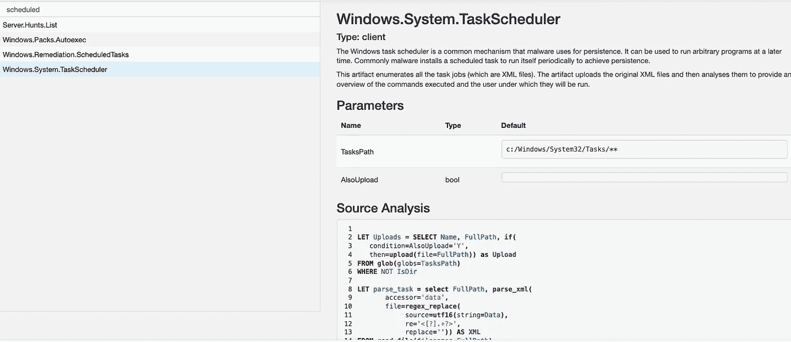

# 构建 Azure Cyber Ranges 用于学习和娱乐

> 原文：<https://levelup.gitconnected.com/building-azure-cyber-ranges-for-learning-and-fun-9df1debb2eae>

## 提升您的网络安全技能并获得 Azure 安全工程师助理认证

# 概观

研究显示，网络安全技能短缺的情况越来越严重。可悲的是，我们已经习惯于听到公司成为数据泄露受害者的消息。

现在是我们加强防守的时候了。如果你是网络安全的新手或者已经在这个领域，在新冠肺炎疫情期间，有什么比帮助你的职业生涯和缩小技能差距更好的方式来度过你的空闲时间呢？这篇文章介绍了一些自动部署到 Microsoft Azure 中的 Cyber Range 选项。它们允许您在学习和提高安全工具技能的同时享受一些乐趣。我很高兴谈论部署到 Azure 中的这三个基础设施安全项目:

1.  **Azure HELK:** 自动化部署可以在这里下载[。它部署了“](https://github.com/iknowjason/HELK_Azure)[猎麋鹿](https://github.com/Cyb3rWard0g/HELK)或“ [HELK](https://github.com/Cyb3rWard0g/HELK) ”，一个狩猎平台。
2.  **Azure Velociraptor:** 自动化部署可以在这里下载[。它部署了](https://github.com/iknowjason/Velociraptor_Azure) [Velociraptor](https://www.velocidex.com/about/) ，这是一个开源的端点监控、数字取证和网络响应平台。
3.  **PurpleCloud:** 这是一个带有端点和域控制器的企业 Microsoft Active Directory 环境的自动部署。 [PurpleCloud](https://github.com/iknowjason/PurpleCloud) 还部署了渗透测试对手系统。

# 所需资源:

*   带有信用卡的 Microsoft Azure 帐户
*   虚拟化软件，如 VMWare 或 virtualbox
*   安装在 VMware 或 virtualbox 中的 Linux 操作系统客户机。对于这些演示，我使用的是 Ubuntu Linux 20.04。
*   安装在 Linux 操作系统客户虚拟机中的一些软件:Terraform、Ansible

# 选项 1:在 Azure 狩猎麋鹿

这个实验室选项将在 Azure 中部署一个小型网络安全范围的[狩猎麋鹿](https://github.com/Cyb3rWard0g/HELK)或“HELK”。HELK 是一个基于 ELK stack 的开源搜索平台，它包含了很多很好的功能，比如带有 Jupyter 笔记本的数据科学。HELK 支持通过高保真安全日志(如 Sysmon 或 Windows 事件日志)进行检测、安全监控和调查，这些日志可以通过 Winlogbeat 代理使用 Kafka 输出来提供。然后这些日志被索引到 Elastic 中，用 Kibana 进行可视化和搜索。该部署包括一个 HELK 服务器和一个 Windows 10 Professional 端点，该端点被自动配置为将日志转发到 HELK。这种部署不是使用虚拟化软件在本地运行安全实验室，而是使用带有 Terraform 和 Ansible 的基础设施即代码(IaC ),以便在云服务提供商(在这种情况下是 Azure)内快速启动网络范围。你也可以在完成后迅速把它拆下来。这些术语是什么？

*   ***基础设施即代码(IaC)*** 是一种使用模板或定义文件实现基础设施(即虚拟机)自动化部署和管理的技术。IaC 有很多不断增长的网络安全用例。
*   Terraform.io 是一家为 IaC 提供商业和开源工具的公司。使用 Terraform，我们以 terraform 文件格式指定定义，并使用 terraform 免费工具在 Azure 中自动快速部署我们的虚拟机。Terraform 对所有三个 CSP(AWS、Azure、Google)以及其他提供商都有灵活丰富的支持。
*   ***Ansible*** 是一款流行的配置管理软件，允许我们在 Terraform 部署虚拟机后进行部署后软件实施和配置。我们使用 Terraform 从我们的 Terraform 文件中调用 Ansible。不错！

## **让我们开始在 Azure 创建狩猎麋鹿**

为了让这个实验室产生最大的影响，我们将在 Azure 项目中安装 HELK 的选项 2。选项 1 仅支持独立的 HELK 服务器，而选项 2 支持 HELK 和 Windows 10 端点一起使用 Kafka 接收日志。为了开发这些模板和这个演示，我使用了 VMWare Fusion 和 Ubuntu 20.04 虚拟机。但是任何现代的 Linux 操作系统应该也能工作。在您使用这些详细说明安装了先决条件之后，在您的 ***terraform.tfvars*** 文件中配置您的 Azure 服务主体凭证，这将让 terraform 使用您的 Azure 帐户来自动管理基础架构。它应该看起来像下面这些假凭证:

```
subscription_id = "aa9d8c9f-34c2-6262-89ff-3c67527c1b22"
client_id = "7e9c2cce-8bd4-887d-b2b0-90cd1e6e4781"
client_secret = ":+O$+adfafdaF-?%:.?d/EYQLK6po9`|E<["
tenant_id = "8b6817d9-f209-2071-8f4f-cc03332847cb"
```

如果您想让 Azure 网络安全组(NSGs)防火墙提供额外的安全性以将您的源 IP 地址列入白名单，请取消注释***terraform . TF vars***中的以下行以将您的源前缀列入白名单。如果你不这样做，HELK 基础设施的监听端口将对公共互联网开放。

```
# Set variable below for IP address prefix for white listing Azure
# https://ifconfig.me/
# curl https://ifconfig.me
src_ip = "192.168.87.4"
```

解决这个问题后，只需运行几个 terraform 命令来构建 HELK 基础设施:

```
$ cd HELK_Azure/option2_helk_endpoint/deploy
$ terraform init
$ ./create.sh
```

嘣！现在拿一杯咖啡，大约 15 分钟后，你就可以开始工作了。

## **生成一些日志工件**

让我们快速做两件事来生成一些测试日志工件数据。首先，访问 HELK 服务器的 Kibana UI。HELK 的 IP 地址列在:

```
/modules/helk/hosts.cfg
```

使用 Firefox 接受自签名证书警告，并浏览到*https://<HELK _ IP>*。用户名/密码为: ***helk/hunting***


赫尔克·基巴纳图片，由杰森·奥斯特罗姆拍摄

这是 Kibana 接口，用于搜索和监控将从我们的 Windows 目标发送的安全日志。此时，您可能不会在 Kibana UI 中看到任何数据，因为 Windows 端点没有生成任何感兴趣的流量。

接下来，使用 RDP 远程访问我们的 Windows 10 虚拟机。Azure 为 Windows 10 虚拟机提供了一个公共 IP 地址，该地址列在以下文件中:

```
/modules/win10-vm1/hosts.cfg
```

RDP 用用户名/密码进入这个 IP:***HELKAdmin/password 123***

如下所示启动 Windows 命令提示符(cmd.exe)。我们只是想生成一个非常简单的父进程(Windows 资源管理器)调用子进程(cmd.exe)的例子，刚好够这个 HELK 例子生成一个日志条目。


Jason Ostrom 创建的屏幕截图

现在回到基巴纳界面，在搜索窗口中输入“***【cmd】***”并回车。您应该看到日志刷新显示命令执行的证据。


查看基巴纳搜索，与探险家发射 cmd.exe；杰森·奥斯特罗姆创作的图像

## 关闭并摧毁基础设施

```
$ cd HELK_Azure/option2_helk_endpoint/deploy
$ ./destroy.sh
```

## **赫尔克结论**

这是对 HELK 安全日志摄取功能的高度介绍。本实验配置为使用 HELK 配置设置将 Sysmon 与 Winlogbeat 一起提供。Sysmon 可以跟踪进程执行，包括完整的命令行执行和可疑恶意进程的事件跟踪。这可以用于研究和早期预警系统，以调查恶意进程执行，如恶意软件。该配置使用 HELK 推荐的设置，并对 Sysmon 进行 [SwiftOnSecurity](https://github.com/SwiftOnSecurity/sysmon-config) 调整。HELK 部署脚本是硬编码的，用于部署硬件选项#4，该选项为需要数据科学和 Jupyter 笔记本功能的用例部署 8gb RAM。

HELK 我最喜欢的一个特性是对 [Mordor](https://mordordatasets.com/introduction.html) 的支持，这是预先录制的 JSON 文件格式的攻击模拟。研究人员可以运行模拟并共享它，在这里可以使用 Kafkacat 工具通过 Kafka 将它导入 HELK。由于 Kafka 已经在 HELK 中得到支持，并且 Azure NSGs 允许 Kafka 端口从您的源前缀进入，您可以将 Mordor 数据集从您的 Terraform 系统直接上传到 HELK，以便在 Kibana 中进行分析。那是另一种美好。

## **更多阅读**

*   “[如何用 Sysinternals Sysmon 从响应到狩猎](https://published-prd.lanyonevents.com/published/rsaus17/sessionsFiles/5011/HTA-T09-How-to-go-from-responding-to-hunting-with-Sysinternals-Sysmon.pdf)”(Mark Russinovich 在 2017 年 RSA 大会上)
*   "[进入魔多:模拟对抗技术预先录制的安全事件](https://posts.specterops.io/enter-mordor-pre-recorded-security-events-from-simulated-adversarial-techniques-fdf5555c9eb1)"

# 选项 2:天蓝色的迅猛龙

[Velociraptor](https://www.velocidex.com/about/) 是一款专注于端点实时取证的数字取证和搜索工具。从其[网站](https://www.velocidex.com/about/):

> Velociraptor 在端点监控、数字取证调查和网络事件响应方面提供了下一代产品…Velociraptor 最强大的功能是其用于创建高度定制的**工件**的框架，允许用户收集、查询和监控单个端点、端点组或整个网络的几乎任何方面。

[Velociraptor Azure](https://github.com/iknowjason/Velociraptor_Azure)项目提供自动化 IaC 部署，构建 Velociraptor 服务器，安装带有 Velociraptor 代理的 Windows 10 端点，并配置代理以注册到 Velociraptor 服务器。整个部署时间大约为 8 分 50 秒。

## 进入迅猛龙:DFIR 野兽模式！

遵循来自 [Github 库](https://github.com/iknowjason/Velociraptor_Azure)的所有先决条件和设置说明，并简单地运行这些命令来在 Azure 中部署 Velociraptor 实验室:

```
$ cd Velociraptor_Azure/deploy
$ terraform init
$ ./create.sh
```

让我们快速参观一下迅猛龙。首先，记下您的 Velociraptor 服务器的 Azure 提供的公共 IP 地址:

```
$ cat modules/velociraptor/hosts.cfg
```

将 Firefox 浏览器指向 Velociraptor IP 地址 web 管理控制台的以下端口，并接受默认警告(此部署使用自签名证书):***https://<IP>:8889***

用户名/密码为:***VAD min/VAD min***

登录后，左上角“显示全部”应显示“Win10-Lars”自动注册的 Windows 10 端点计算机。


显示端点的迅猛龙仪表板，Jason Ostrom

迅猛龙有很多奇妙的法医调查特征。用户可以深入到虚拟文件系统(VFS)按钮，在这里他们可以浏览文件系统并提取文件工件、原始 NTFS 访问和注册表项。调查员可以查询已安装的服务、已安装的软件程序、带预取的流程执行和已调度的任务。Velociraptor 与代理建立了持久的命令和控制通道，允许管理员近乎实时地查询代理。Velociraptor 拥有强大而灵活的查询引擎，允许管理员使用 Velociraptor 查询语言(VQL)在所有注册的端点上运行查询。这些“搜索”可以按时间间隔安排，并在所有端点上运行。

## 调度任务持续机制

Velociraptor 包括许多预构建的工件流收集器，可以查询工件的端点。恶意软件中使用的一种常见的持久性机制是 Windows 任务计划程序。Velociraptor 包含一个 VQL 查询，用于枚举 windows 系统上的所有调度任务进行分析。Velociraptor 还包括一个 VQL 查询，用于计划任务的补救。



用于计划任务的 VQL 工件收集器；杰森·奥斯特罗姆创作的图像

在这个例子中，我创建了一个持久 ping 任务作为模拟恶意任务。然后我运行了迅猛龙藏物收集器。可以下载 CSV 格式的结果进行分析，并且在寻找持久性机制时，查询可以在您的所有企业中运行。


迅猛龙计划任务工件收集器结果的图像；杰森·奥斯特罗姆创作的图像

## 进一步调查

在最近的一篇 SANS 博客文章中，乔什·赖特描述了对手用来隐藏 windows 服务的红队战术。这是对一种鲜为人知的持久性机制的有趣描述:使用服务描述符定义语言(SDDL)来修改服务权限的语法。他随后发表了一篇蓝队博客，展示如何检测这一点。作为对读者的一个练习，哪些迅猛龙的 VQL 神器收藏家能察觉到这种敌手战术？

*   "[红队战术:隐藏 Windows 服务](https://www.sans.org/blog/red-team-tactics-hiding-windows-services/)"
*   "[国防聚焦:寻找隐藏的 Windows 服务](https://www.sans.org/blog/defense-spotlight-finding-hidden-windows-services/)"

# 选项 3:天蓝色的紫色云

[紫色云](https://github.com/iknowjason/PurpleCloud)是一个模拟真实企业配置的网络范围，在内部活动目录域中更为普遍。包括一台 Windows 2019 域控制器和三台 Windows 10 专业版机器。Windows 10 端点会自动加入域。每个 Windows 10 虚拟机都有一个具有交互式域登录的关联域用户。这种配置能够探索计算机之间的策略和技术，并模拟权限提升。紫云还部署了一个 Linux 对手系统，安装了 Docker 渗透测试容器。整个配置在大约 24 分钟内自动部署到 Azure 中。紫色云电脑系列有无数的紫色团队使用案例，可以保存为一篇专门的文章。


贾森·奥斯特罗姆创作的紫色云网络图

# 结论

商业赛博靶场在市场上不断增长，包括更新的赛博靶场“即服务”(CyRaaS)产品( [Schiappa，2019](https://medium.com/swlh/cyber-training-through-games-and-ai-752549704888) )。这篇文章给了你几个免费的小模板来创建你自己的网络范围，并用它们来提升你自己。他们使用 Terraform for infra structure as Code(IaC)。IaC 提供了诸如速度、成本降低和灵活性等好处。这些模板也可以帮助你参加微软 AZ-500 安全考试。构建 Azure 虚拟机基础设施和管理网络安全组(NSG)的概念与考试蓝图一致，可以帮助您获得 Azure 安全工程师助理认证。

# 与作者联系

*   [领英](https://www.linkedin.com/in/jason-ostrom-a94b9b2/)
*   [推特](https://twitter.com/securitypuck)
*   [Github](https://github.com/iknowjason)