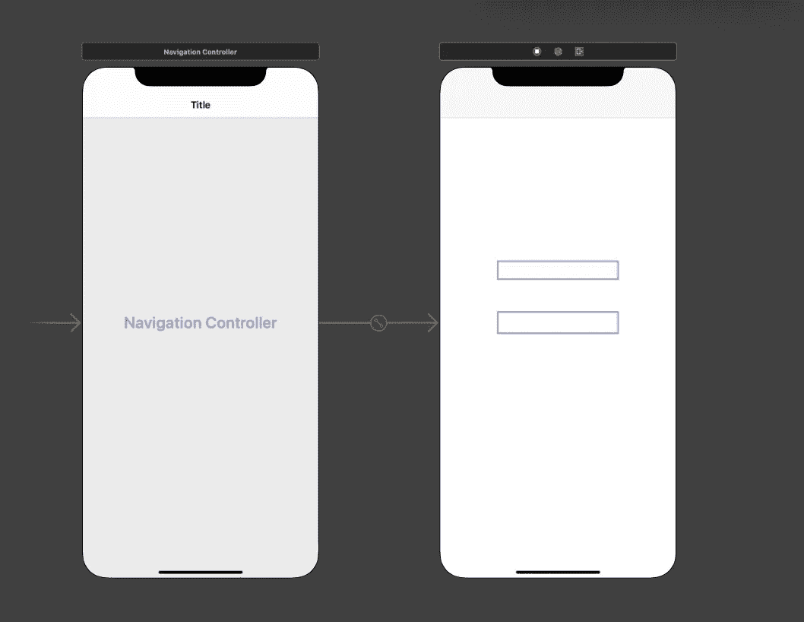
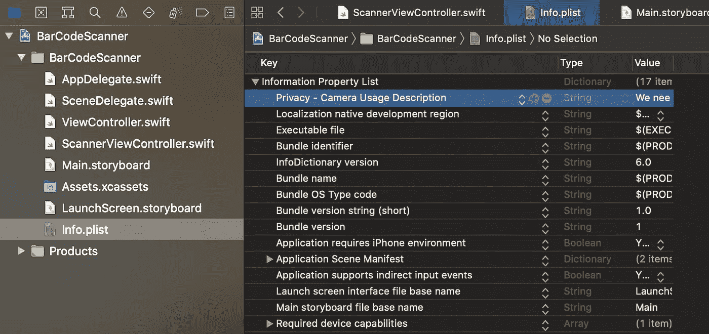

# 在 Swift 中构建条形码扫描仪应用程序

> 原文：<https://levelup.gitconnected.com/building-bar-code-scanner-app-in-swift-1de4ab1e1079>

## 使用本地库 AVFoundation

[david pl](https://unsplash.com/@d_dandelion?utm_source=medium&utm_medium=referral) 在 [Unsplash](https://unsplash.com?utm_source=medium&utm_medium=referral) 上拍摄的照片

## 你有没有想过如何使用你的 iOS 设备扫描条形码？

在 iOS7 发布之前，我们必须使用第三方库来完成我们的愿望。然而，我们现在有了一个非常整洁和有用的内置库，叫做 **AVFoundation** 。只需几个步骤，我们就能构建自己的应用程序，扫描条形码并回调其代码号。在文章的最后，你可以找到我已经完成的项目的链接。

# 我们开始吧

*   像往常一样，要做的第一步是为你未来的扫描仪准备一些基础。我的意思是创建一个将带回条形码的`textField`和一个将引导我们找到`ScannerViewController`的`button`。

> 注意:为了让你看得更清楚，我跳过了`updateUI`和 textField 的`ScannerViewDelegate`。稍后，我们也将浏览它们。

*   第二步是最有趣的，因为我们正在创建`UIViewController`的`ScannerViewController.swift`子类，并让它在`AVFoundation.`的帮助下扫描条形码

您所需要做的就是更新`**found(code:)**`方法来采取一些有趣的动作，然后在准备好的时候弹出这个视图控制器。

*   第三步，我们需要创建一个委托机制，将扫描的代码带回给`textField.`

如果我们现在编译并运行我们的应用程序，它将意外崩溃，并出现以下错误:

> 此应用程序已崩溃，因为它试图在没有使用说明的情况下访问隐私敏感数据。应用程序的 plist.info 必须包含一个 NSCameraUsageDescription 键，该键带有一个字符串值，向用户解释应用程序如何使用这些数据。

为了解决这个问题，我们需要在`Info.plist`文件中添加一个名为`NSCameraUsageDescription`的键。打开文件，右键单击任何空白区域以添加新行。将键设置为*隐私摄像头使用说明*，值设置为*我们需要访问您的摄像头来扫描条形码*。

完成编辑后，再次在真实设备上运行应用程序。点击扫描按钮应该会调出内置摄像头并开始捕捉视频。一旦相机找到条形码，它就会返回主屏幕，显示已填充的文本字段。

# 包扎

在本主题中，我们讨论了两个主要概念:

*   使用`AVFoundation`以便扫描条形码。
*   委托模式的使用。

我希望你喜欢这篇文章，并发现它很有趣！

现在是时候向你展示我创造的项目了。你可以在我的 GitHub 的回购中找到它:

 [## abboshonshukurulaev/条形码扫描仪

### 使用 AVFoundation GitHub 扫描条形码的应用程序是超过 5000 万开发人员共同工作的家园…

github.com](https://github.com/AbboskhonShukurullaev/BarcodeScanner) 

如果你有任何批评、问题或建议，欢迎在下面的评论区发表！

感谢阅读。