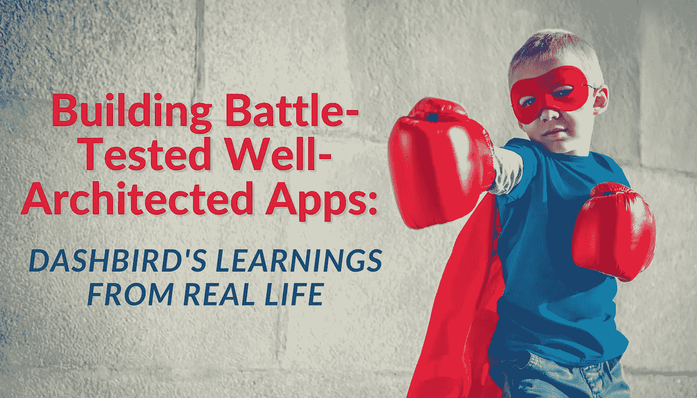
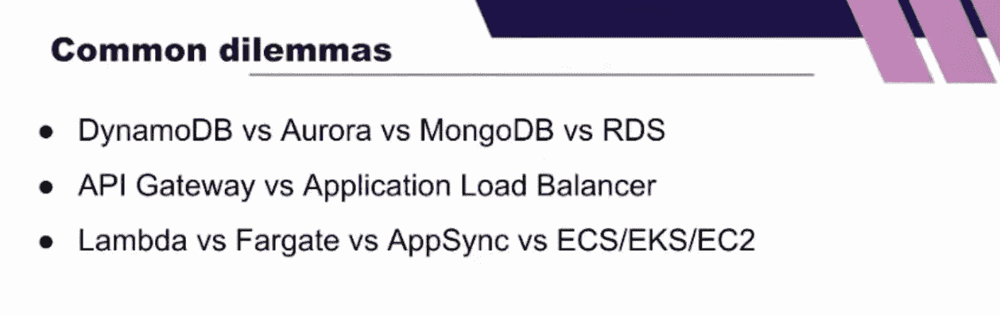
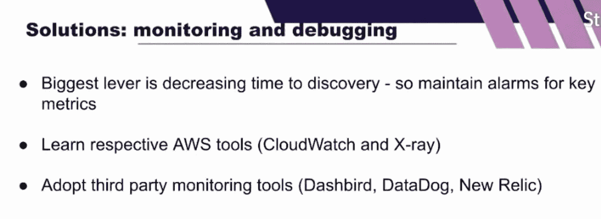
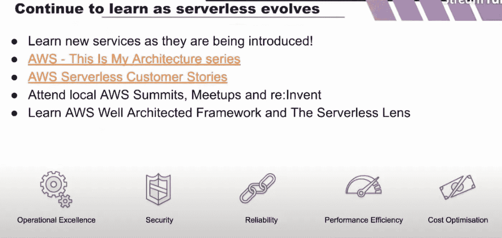

# 构建经过战斗考验的架构良好的应用程序:从现实生活中学习

> 原文：<https://levelup.gitconnected.com/building-battle-tested-well-architected-apps-learnings-from-real-life-ddb7c5b883e0>

原文在此:[https://dash bird . io/blog/building-battle-tested-well-architected-server less-apps-lessons/](https://dashbird.io/blog/building-battle-tested-well-architected-serverless-apps-lessons/)

在本文中，我将分享我自己在 Dashbird 构建可靠的、架构良好的无服务器应用程序方面的经验，以及无论您处于无服务器之旅的哪个阶段，都需要关注的影响最大的领域。

# 使用正确的 AWS 服务

我花了很长时间才意识到并意识到，花时间选择正确的 AWS 服务是值得的；随着规模的扩大，以后的影响可能会非常大。根据我的经验，确保长期性能、成本效率、可靠性和健壮性的最大因素是花费在选择最佳服务和使用最佳架构模式上的时间。

大多数构建良好的无服务器应用程序就像一个拼图，通过尝试查看哪些服务最符合逻辑的方式来拼凑服务。这通常意味着，虽然需要创造力，但也需要了解每种服务能提供什么，包括在交换它们的优势时你将面临的妥协。因此，识别和研究能够满足应用程序需求的所有可能的工具非常重要。评估这些服务的延迟、成本、可扩展性、运营开销以及监控和故障情况，然后考虑您能够做出的合理妥协。我要回顾的个人领域包括:

*   费用
*   表演
*   它有多坚固
*   它如何扩展
*   使用该服务构建会有多快。

*那么，我如何决定这些呢？*

嗯，在我看 AWS 服务之前，我先规划了产品需求。在我早期和缺乏耐心的时候，我会简单地做一个概念验证(PoC ),然后尽快构建。但是今天，我正确地评估了需求，并深入到诸如期望的延迟和预期的请求数量等方面，这通常有助于我做出决定。例如，如果我需要低于 5 毫秒的延迟，这是不可协商的，这将限制我能够使用的服务，并对数据存储的选择产生连锁反应。

有一些常见的服务选择困境，我也经常看到，所以这些是我的想法。

*   说到数据库，有很大的选择余地，所以我建议任何开发人员都要深入思考这个问题。
*   当谈到 API 网关与应用负载均衡器时，我看到的是:特异性和丰富的功能与更简单、更快和更便宜。重要的是要记住，后者不一定是一个糟糕的选择或服务。
*   对于计算平台来说，它不需要总是 Lambda。事物可以是无服务器的，不使用 Lambda。不可否认，计算平台是一个重要的领域，每次都要根据您自己的要求进行导航和评估。例如，对于大规模的数据处理，事情就不那么抽象了。

查看这个[列表，这是每个人的入门工具包](https://dashbird.io/blog/5-core-aws-serverless-tools-starterkit/)中都应该有的 5 个 AWS 服务，来帮助你开始。

# 未充分利用的概念和常见挑战

架构模式是错误和挑战的主要因素之一，主要是因为无服务器与以服务器为中心的架构有很大的不同。此外，如此多的无服务器被推向托管服务，因此使用代码和函数的外围应用现在减少了。

我们可以经常掩饰这些，但不幸的是，一些非常有价值的概念没有被充分利用，导致了可以避免的困难。

# 去耦和异步模式

由于在 Lambda 扩展时没有在您的架构中使用异步消息传递模式，下游的服务可能不会这样做，从而导致限制和耗尽数据库连接。这将是你首先遇到的事情之一。相反，通过添加 SQS、死信队列，并保留保护下游服务的函数的并发性，您将看到更好、更一致的负载，而没有大的峰值。

> 这是构建真正可伸缩和健壮的无服务器应用程序中最重要的概念转变之一。

# 避免代码中的编排

流程编排和代码等待意味着您不必要地增加了成本，没有任何实际收益，反而降低了可用性、可靠性和速度。这就是[步骤功能](https://dashbird.io/knowledge-base/step-functions/what-is-aws-step-functions/?utm_source=dashbird-blog&utm_medium=article&utm_campaign=insights&utm_content=kinesis-stepfunctions)作为一个真正的英雄出现的地方。使用阶跃函数，您能够实现重试和退回机制，并内置错误处理。除此之外，Step 函数的最大好处之一是能够将单一用途的服务引入到您的工作流中，方法是获取可以替换的代码片段，并更容易地将代码片段插入到数据库中。好消息是 [Dashbird Insights 现在支持阶跃函数监控](https://dashbird.io/blog/dashbird-supports-aws-kinesis-step-functions/)，使您能够快速检测与状态机定义或任务执行失败相关的错误。

# 不要构建可以重用的东西

我现在就是靠这个想法生活的。使用[无服务器应用程序库](https://aws.amazon.com/serverless/serverlessrepo/)，大多数预构建的应用程序都是经过深思熟虑且可靠的，因此真的没有必要通过构建自己的应用程序来花费时间在无差别的价值上。您将节省时间和资源，并更快地进入市场。

# 开发人员工作流程和操作工具

在 Dashbird，我们看到很多时间和精力都花在导航数据、挖掘日志以及从本质上试图理解应用程序中正在发生的事情上。

复杂性已经从代码级别转移到基础架构级别，这意味着所使用的模式和构建应用程序的方式更加难以理解，因为它们以完全不同的方式工作，特别是当大部分(如果不是全部)是托管服务时。此外，还需要了解多种服务，包括它们失败的方式。随着这么多事情的发生，扩展和理解您的应用程序变得越来越困难，作为开发人员，您可能会感到控制力不如以前。但是，有解决办法和工具，像[和](https://dashbird.io/features/)这样的大鸟，不用害怕！

# 提高和学习

[监控](https://dashbird.io/blog/ultimate-guite-monitoring-serverless-applications/)和调试对于成功的无服务器应用至关重要。本质上，通过成功的监控和调试，我们希望减少发现时间，即从中断本身到故障被发现的时间。因此，我将此作为一个优先事项，并将其设置在我的 KPI 中，明确说明什么不能失败，并为端点设置警报。

> 在这本[免费的无服务器最佳实践电子书](https://sls.dashbird.io/en/serverless-best-practices)中，你可以学到更多关于监控、调试、日志、架构模式和框架的知识。

像 CloudWatch 这样的 AWS 工具是一个很好的起点，我一直建议在这里投入时间来了解它的功能以及您自己的特定需求。当您的应用程序开始扩展或对其用户变得重要时，无论是客户还是开发人员，采用第三方监控和操作工具如 [Dashbird](https://dashbird.io/features/) 是关键。这里有一个 CloudWatch 和 Dashbird 的解决方案的快速[对比表，供你参考。对于无服务器监控工具，我最优先考虑的是:](https://dashbird.io/blog/dashbird-vs-aws-cloudwatch/)

*   良好的数据可用性
*   自动化警报覆盖
*   可行的见解。

当地的开发环境是早期要考虑的事情，并且要继续考虑。正如我们所知，虽然 Lambda 可以很容易地在本地运行，但数据库并不一样，这意味着在本地模拟整个云环境并不容易。然而，仍然有一些好的选择:

1.  将本地资源连接到云资源。我们可以将本地 Lambda 连接到开发阶段的 DynamoDB 表，或者让它们与云中的 SQS 队列进行交互。
2.  使用“CloudLocally”，它允许您每次将功能代码部署到云上并进行测试，每次推出一个小的更改。可以理解的是，这将意味着您的本地环境永远不会完全反映云环境，并且元素仍然可能出现故障，但这是我们以前很好地使用过的一个选项。
3.  实现测试驱动的开发，这种开发使用单元测试来测试一小部分，以降低迭代速度。

当谈到在无服务器的世界中学习时，我们必须保持谦逊，并不断投入时间进行学习和实验。了解新服务的发布，并不断将它们放入最佳实践环境中，以及它们如何与无服务器框架和 [AWS 架构良好的框架](https://aws.amazon.com/architecture/well-architected/?wa-lens-whitepapers.sort-by=item.additionalFields.sortDate&wa-lens-whitepapers.sort-order=desc)相结合。

随着 AWS 不断发布新服务，无服务器也在不断发展，因此我们最有可能更好地了解我们的未来和最佳实践。如果我们回顾两三年前，在没有成熟工具的情况下，问题是非常不同的，但是今天，构建高级应用程序的一切都已经存在。

这里是我最喜欢的资源，无论是初学者还是经验丰富的无服务器开发人员都可以访问并不断重温。

[AWS——这是我的架构](https://aws.amazon.com/this-is-my-architecture/)

[AWS 客户案例研究](https://aws.amazon.com/lambda/resources/customer-case-studies/)