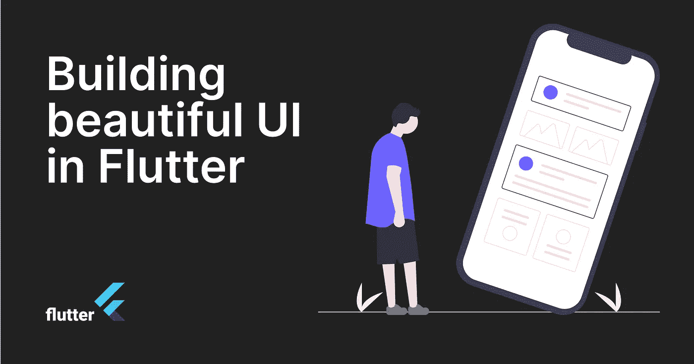
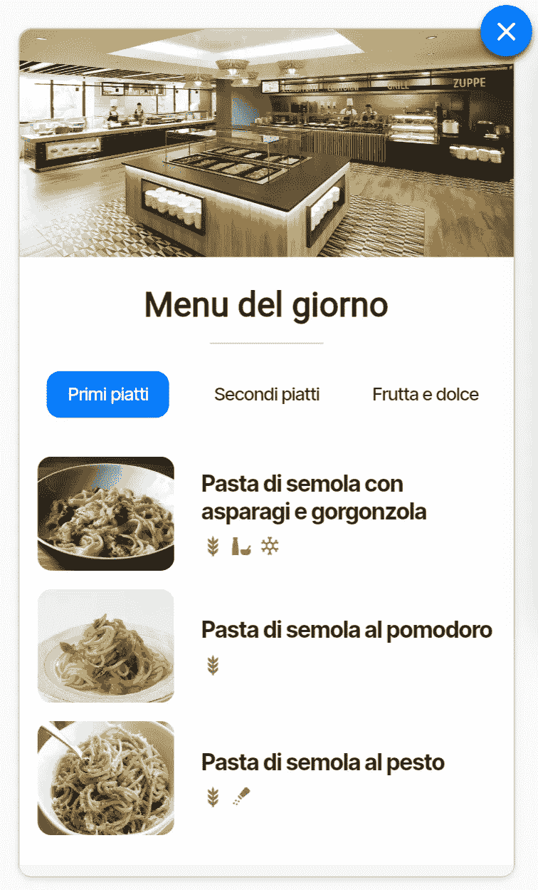
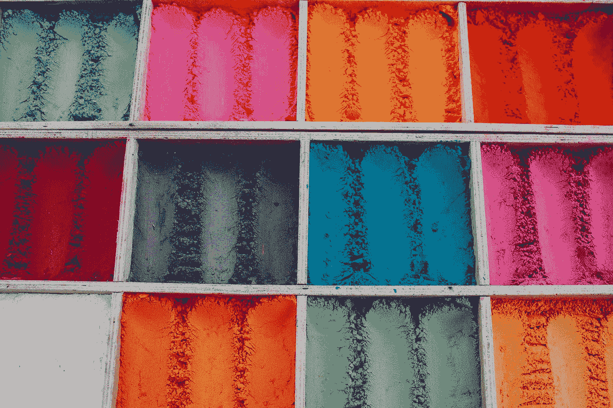
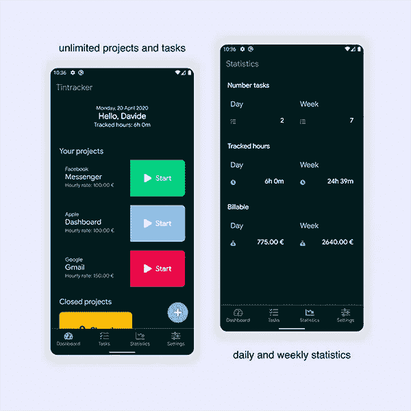
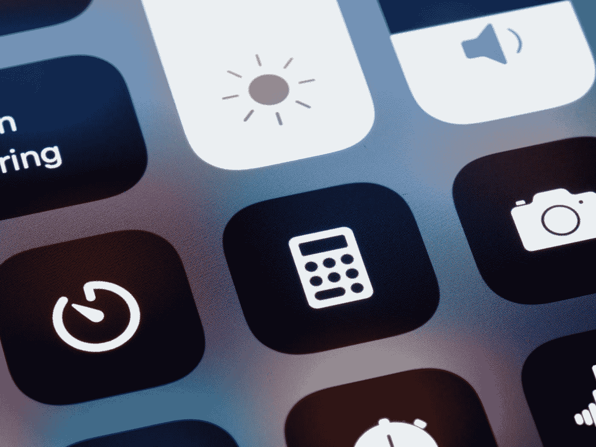
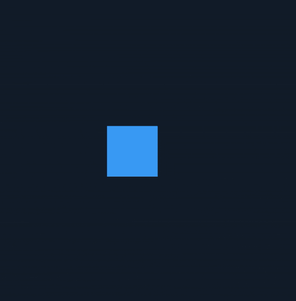
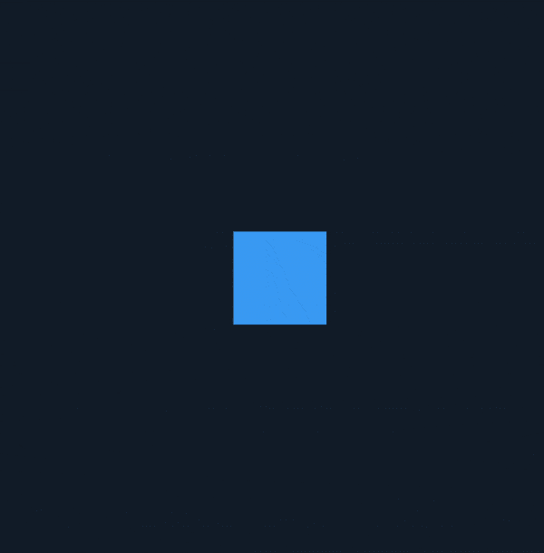
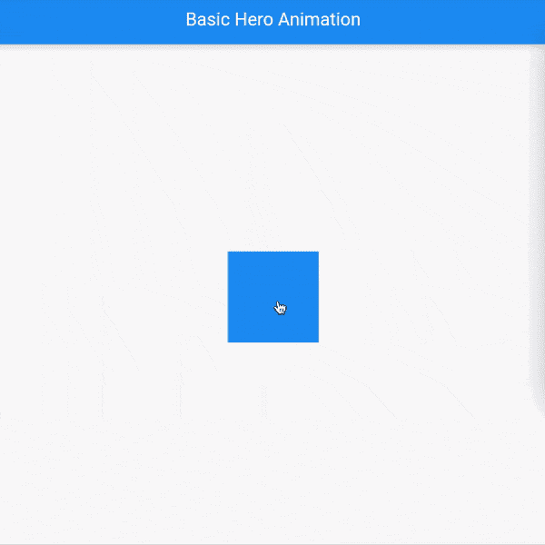

# 在 Flutter 中构建漂亮的 UI

> 原文：<https://levelup.gitconnected.com/building-beautiful-ui-in-flutter-8e75277aa980>

## 增强下一个 Flutter 移动应用程序设计的快速介绍指南

欢迎来到这个新的教程，在这里你将学到一些基本的概念，这些概念将会帮助你用 Flutter 设计一个移动应用程序。这篇文章是关于 Flutter 开发的，但是你可以在任何其他的界面开发中使用这些概念。

当我们开发应用程序时，我们更关注功能而不是细节。我可以向你保证，通过遵循这些简单而有用的提示，你的应用程序将呈现出另一个面貌，并被最终用户所考虑。

# 目录

*   **排版**
*   **白色空间**
*   **颜色**
*   **图标**
*   **动画**

# 排印

印刷术是一种排列字体(字母和字符)的艺术，目的是使语言可见。考虑我们如何写内容以及其他人将如何阅读它是很重要的。排版不仅要选择完美的字体，还要使用它来确保易读性和可读性。

> 一个完美的字体会影响你的内容如何被理解和感知。

基于以前的经验*，我鼓励你只选择一种家族字体*并使用它的样式(粗体、斜体、中、细)来分层排列你的文本。还可以调整行高，以增加最终用户的可读性。

iOS 的默认字体是**旧金山**，免费，美观，为了易读而设计。其他干净的字体有 *Helvetica 纽*、*开 Sans* 和 *Roboto* 。对于 Android 应用程序，我经常使用 **Open Sans** 或 **Roboto** 。

在 Flutter 中有一个有趣的包 [**google_fonts**](https://pub.dev/packages/google_fonts) 可以快速使用谷歌字体。

# 空格

设计 app 时最重要的概念之一是**间距**和**对齐**。规则是最小填充或边距为 **8pt** 。这使得布局更容易扫描，文本更易读。实现这个建议最简单的方法是使用 [**填充**](https://api.flutter.dev/flutter/widgets/Padding-class.html) 小部件。

行高应在字体大小的 **120%至**145%之间。

阅读正文的最佳字体大小为 **17pt 到 19pt** 。以及二级文本的**11–14pt**。将文本与其他元素对齐，以便于浏览。

正文和次要文本的使用。请注意文本的对齐方式。

# 颜色

颜色是设计过程的重要组成部分。选择正确的调色板是复杂的，因为每种颜色都传达了一些东西，知道我们想要传达什么是很重要的。在这篇文章中，我省略了色彩理论，但是我给你留下了一些链接，在选择色彩的过程中会对你有所帮助。

*   [酷哥](https://coolors.co/)
*   [土坯颜色](https://color.adobe.com/it/create)
*   [按钮](https://paletton.com/#uid=1000u0kllllaFw0g0qFqFg0w0aF)

一旦你选择了正确的调色板，使用 [**主题数据**](https://api.flutter.dev/flutter/material/ThemeData-class.html) 类的 Flutter 来定义你的应用程序的风格。

照片由 [Ronni Kurtz](https://unsplash.com/@ronnikurtz?utm_source=medium&utm_medium=referral) 在 [Unsplash](https://unsplash.com?utm_source=medium&utm_medium=referral) 上拍摄

# 图标

恰当地使用图标、图像和图形会带来巨大的不同，让你可以改变应用程序的外观。

图标的使用很重要，因为在某些情况下可以节省空间，特别是在小型设备中。当选择你的图标集时，确保它们简单易识别。

底部导航栏的图标有两种状态:灰色和彩色。

只使用两个图标表示状态，灰色表示未选中状态，彩色表示选中状态。我鼓励你将图标和标签文本合并，以避免混淆。

Flutter 默认提供了 [**图标**](https://api.flutter.dev/flutter/material/Icons-class.html) 类，但是有一些图标包可以帮助你搜索新图标。

*   [材料设计图标](https://pub.dev/packages/material_design_icons_flutter)
*   [字体劲爆招扑](https://pub.dev/packages/font_awesome_flutter)

> 当选择你的图标时，要小心不要让最终用户感到困惑。避免使用 iOS 或 Android 使用的相同图标，但用于不同的目的。

图标的重要性。—照片由[布雷特·乔丹](https://unsplash.com/@brett_jordan?utm_source=medium&utm_medium=referral)在 [Unsplash](https://unsplash.com?utm_source=medium&utm_medium=referral) 上拍摄

# 动画

最后，如果你想给你的应用程序一个原创的和迷人的触感，**动画扮演了一个重要的角色，因为它增强了应用程序的体验**。

不要滥用动画，只在绝对必要的时候使用它们，例如:从一个屏幕切换到另一个屏幕，或者给出交互反馈或直接操作的感觉。

Flutter 提供了许多基本的动画技术来使用从 X 点到 y 点的过渡。

下面我们将看到一些在移动平台和网络上最常用的基本动画。主要的有:

*   翻译
*   辐状的
*   规模
*   海罗（人名）；英雄（电影名）

## 1.翻译

[SlideTransition](https://api.flutter.dev/flutter/widgets/SlideTransition-class.html) 类显示小部件相对于正常位置的位置。

翻译容器小部件

在 Flutter 中翻译容器小部件

## **2。旋转**

[RotationTransition](https://api.flutter.dev/flutter/widgets/RotationTransition-class.html) 类动画显示小部件的旋转。

旋转容器小部件

在抖动中旋转容器小部件

## **3。比例**

[ScaleTransition](https://api.flutter.dev/flutter/widgets/ScaleTransition-class.html) 类动画显示变换后的小部件的比例。

缩放容器小部件

在 Flutter 中缩放容器小部件

关于**动画控制器**和 **TickerProvider** 的更多信息，请阅读我之前的帖子，在那里我将向你展示如何在 Flutter 中创建一个弹跳按钮动画。

 [## 在 Flutter 中创建弹跳按钮动画

### 在本教程中，你将学习如何在 Flutter 中创建一个简单而迷人的弹跳按钮动画。

medium.com](https://medium.com/codex/in-general-add-animations-to-your-applications-enriches-the-general-user-experience-68121522b57a) 

## 4.海罗（人名）；英雄（电影名）

最后一个可能在你的应用中派上用场的动画是英雄动画。如果你点击某个屏幕上的图像，就有可能让英雄从一条路线飞到一条新路线，通常降落在不同的位置，大小也不同。在 Flutter 中，将图像从一个屏幕飞到另一个屏幕被称为*英雄动画*。

一个基本的英雄动画

颤振中的基本英雄动画

想了解更多关于英雄动画的信息，请阅读官方文档**。**

**希望这篇教程对你接下来的 app 开发有所帮助。在结束之前，我建议你喜欢并分享这篇文章，并留下评论。**

**下节课再见。😉**

## **我博客上的其他帖子**

** [## 用 Flutter 构建一个 web 应用程序，并将其部署到 Firebase 主机上

### 在这篇文章中，在简要介绍了 Flutter 之后，我展示了一些 web 特性，我们将看到如何构建和部署一个简单的…

levelup.gitconnected.com](/build-a-web-app-with-flutter-and-deploy-it-to-firebase-hosting-3ee020b0e3db)  [## 在 Flutter 中构建著名的井字游戏

### 在这篇文章中，我将探索如何为著名的游戏井字游戏构建 UI 和业务逻辑。我将使用…

levelup.gitconnected.com](/build-the-famous-tic-tac-toe-game-in-flutter-8c6464869bca)**