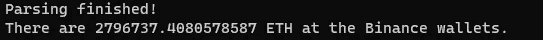

# 建立一个币安储备跟踪机器人。(第一部分)

> 原文：<https://levelup.gitconnected.com/building-binance-reserves-tracking-bot-part-1-4e8e633f8229>

我对数据的热情帮助我开发了几种工具来捕捉这些重要的信息。不幸的是，在本地托管这些工具并按计划运行变得单调乏味，所以我一直在寻找其他选择。这是我的发现。


贝南·诺鲁齐在 [Unsplash](https://unsplash.com?utm_source=medium&utm_medium=referral) 上的照片

**用例:**对于我的交易机器人来说，我需要在像币安这样的集中交易所捕获每小时的储备分组信息。虽然它可以从各种链上数据浏览器(如 IntoTheBlock 或 CryptoQuant)获得，但我希望在这里有一个低成本的解决方案来验证这个想法。

**要使用的 API:**[https://api.etherscan.io/api](https://api.etherscan.io/api)

他们提供免费的订阅服务，并有合理的费率限制。我的目标是通过 Python 调用端点并将数据存储在 DB 中。所有这些都需要每小时按时完成。为了获得关于作业状态的更多可见性，我附加了一些电报通知。

> 我刚刚在 Udemy 上发布了一个名为[“实用网页抓取课程”](https://www.udemy.com/course/practical-web-scraping-course/?referralCode=8EDD61CDBBB81B6998CA)的新课程。它包含视频教程，其中包含 web 抓取的编码技巧，可以帮助您立即构建基于数据的应用程序。您可以从这篇文章和我的其他教程中找到方便的可视化格式的代码和想法。

# 创造一只蜘蛛

解决方案的这一部分从收集所有带有与币安相关的姓名标签的[账户列表开始。对于概念验证类型的解决方案，我在浏览器中执行了以下 JavaScript 并复制粘贴了结果:](https://etherscan.io/accounts/label/binance?subcatid=3-0&size=100&start=0&col=1&order=asc)

```
arr = Array.from(document.querySelectorAll(‘tr td a’))arr.map((a) => a.innerText )
```

这个代码对于 POC 来说已经足够了，因为这些帐户不会经常改变。

要从 API 列表中捕获数据，您需要具备以下条件:

我从 Python 方法中获取帐户列表，并为每个帐户执行 API 请求，暂停 1 秒钟。这样做是为了防止 Etherscan 通过速率限制来阻止脚本。我还将返回的数字从 gwei 转换为 USD。

在下面的部分中，您将看到 send_telegram_notification 和 insert_records 方法的实现。

# 添加通知

有了通知，您可以在日常工作中一瞥应用程序的状态。接收器应用有多种选择，但我选择了 Telegram 作为我最常用的应用。这是一个关于网络抓取的教程，所以我会分享一个到 StackOverflow 的链接，在这里你可以找到通过 Python 向 TG 发送通知的所有细节。此外，下面是我用来给自己发送有意义的通知的代码:

# 手动测试

我的目标是在我将解决方案变得更加复杂和可部署之前，只证明它是可行的。要验证它的就绪性，只需将其作为 Python 模块启动:

```
python -m main
```

预期产出将是:



终端中的预期输出


终端中的预期输出

当然，ETH 值会改变:)

# 添加到数据库的连接

现在让我们稍微扩展一下解决方案。将输出存储在文件中有许多缺点，例如无法访问计算机外部的数据，以及由于某些硬件或软件故障而丢失数据的风险。让我们通过连接 PostgreSQL 数据库向应用程序添加一个持久层。从我以前的教程中，你知道我经常选择 Heroku 作为我的 POC 应用程序的主机，这次也不例外。

要向 dynos 添加 PostgreSQL 的新实例，请在 Heroku CLI 中运行以下命令:

```
heroku addons:create heroku-postgresql:hobby-dev
```

Heroku 鼓励应用程序创建者使用环境变量来隐藏敏感信息，如 API 键或连接字符串。要连接到新创建的数据库，您必须读取一个名为 DATABASE_URL 的变量:

对于 Python-PostgreSQL 通信，我使用了一个名为 psycopg2 的库。它公开了通过游标写入 DB 的熟悉接口。在插入新记录之前，您必须创建一个包含所有必需字段的表:

下面是帮助您将新记录插入数据库的方法:

# 部署到 Heroku

使用 Heroku CLI 推送您的代码并不是一件棘手的任务。

首先，用下面的代码建立一个 heroku.yml:

```
web: python -m main
```

然后将代码推送到

```
git push heroku HEAD:master
```

这不是我和 Heroku 的第一次辅导。我之前做过的一个是关于[如何在 24 小时内创建软件即服务](/how-to-create-saas-within-24-hours-part-2-6a60a5898882)。如果你对这个主题感兴趣，就给它一个机会。

# 对 Heroku 的测试

如果一切正常，运行以下命令从您自己的 PC 上触发部署的实例:

```
heroku run web
```

# 计划执行

正如我在本文开头提到的，我希望我的脚本每小时运行一次，所以我必须使用一些调度解决方案。因为我当前版本的脚本非常快，我决定使用 Heroku Scheduler，因为它是免费的，并且允许我需要的配置。像这样将其添加到您的应用程序中:

```
heroku addons:create scheduler:standard
```

配置如下所示:


# 结论

数据检索过程在很大程度上受到自动化的限制。如果你不得不手动一遍又一遍地运行它，你的刮刀将毫无用处，因为人类缺乏一致性，而数据在其中有着至关重要的需求。如果您希望它真正为您自己的利益服务，那么拥有一个调度作业来触发您的脚本是“必须的”。

在下一部分，我将向您展示如何可视化结果并与他人分享。如果你不想错过下一次更新，请关注此博客:

[](https://destiq.medium.com/subscribe) [## 每周获取我的编程和 ML 教程

### 获得我的编程和 ML 教程每周短和实用的实际用例实现通过注册，你…

destiq.medium.com](https://destiq.medium.com/subscribe)