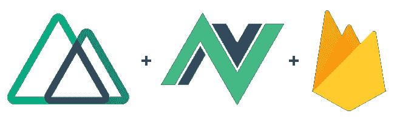
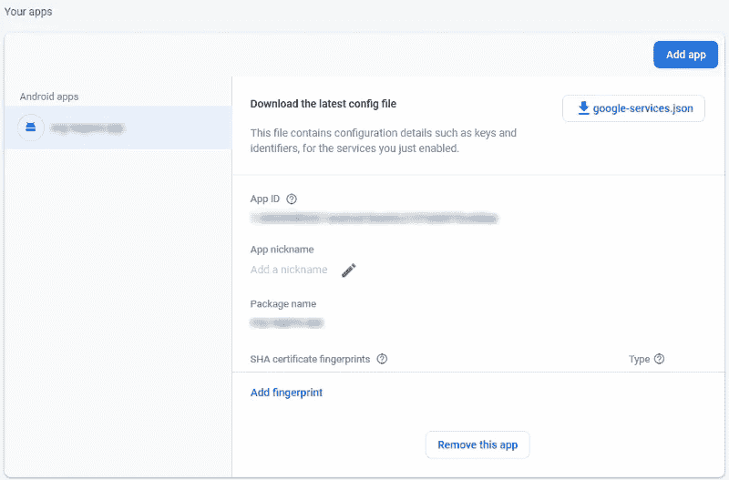
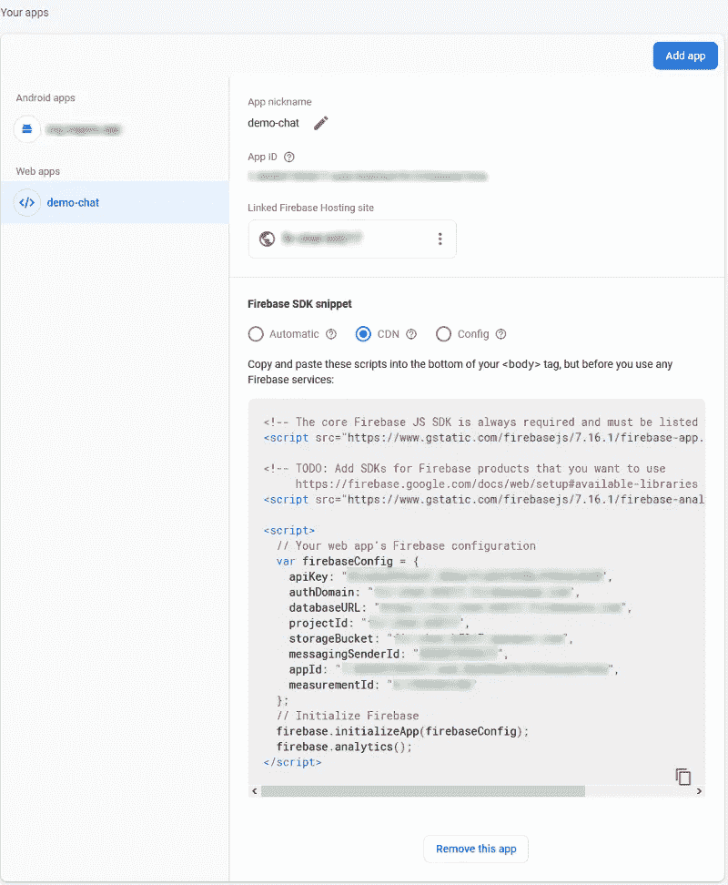
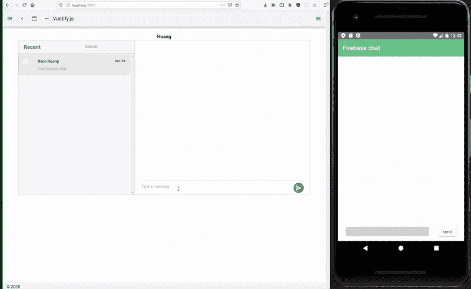

# 使用 Firebase 构建聊天应用程序；Android 应用(NativeScript) + Web 应用(NuxtJs)的跨平台

> 原文：<https://levelup.gitconnected.com/building-chat-app-using-firebase-cross-platform-with-mobile-app-nativescript-web-app-nuxtjs-44b5984e7b7a>



NuxtJS、NativeScript 和 Firebase 一起开发非常容易。

作为一名开发人员，我总是不断地自学新东西来提高我的编码技能。所以跟着做，你会发现你可以用 NuxtJs 和 NativeScript 构建一个跨平台的聊天应用。

# **要领**

*   [已安装节点](https://nodejs.org/en/)
*   [原生脚本](https://nativescript-vue.org)
*   [NuxtJs](https://nuxtjs.org/)
*   [燃烧基地](https://firebase.google.com/)

# 设置 Firebase

Firebase 是 Google 的移动应用开发平台，可以帮助您构建、改进和发展您的应用。

## 创建 Firebase 项目

前往[https://console.firebase.google.com/](https://console.firebase.google.com/)创建一个项目。

## 创建 Firebase 数据库

转到左侧导航的“数据库”,创建一个“云 Firestore”。确保创建数据库是“测试模式”，因为它将允许您在没有任何规则的情况下读取和写入数据库。

# 初始化 NativeScript

在您的终端中，无论您想在哪里创建这个项目，请执行以下操作:

```
vue init nativescript-vue/vue-cli-template firebase-chat
```

它会问你一些问题(名字，描述，编程语言，vuex 等。)，当回答时，项目被创建:

```
cd firebase-chat
npm install
```

这一步是导航到项目文件夹并安装所有依赖项以启动项目。

现在，您已经准备好使用 NativeScript 开发跨平台移动应用程序了。

接下来，您必须安装 Firebase 插件:

```
tns plugin add nativescript-plugin-firebase
```

该插件旨在为 Firebase 实例提供一个通用接口，可以方便地与 NativeScript 一起使用。安装这些插件时，它会问一些问题，一些问题必须回答是(y)，包括:

*   你用的是安卓吗
*   你在用 Firestore 吗？
*   你在使用实时数据库吗？

如果您选择“是”( y ),将在安装后生成 Firebase 配置 JSON。

```
Do you want to save the selected configuration. Reinstalling the dependency will reuse the setup from: firebase.nativescript.json. CI will be easier.
```

接下来，您需要在`App_Resources/app.gradle`中配置`multiDexEnable true`来避免这个错误:

```
Error: null, Cannot fit requested classes in a single dex file (# methods: 103413 > 65536).
```

## 将 Firebase 添加到 Android 应用程序

进入“项目设置”以添加“Android”应用程序并下载“google-services.json”



确保捆绑包 id 或包名与您在`package.json`中的`nativescript.id`相同，这样您就可以下载了。

## 将 Firebase 连接到您的 Android 应用程序

在`app/App_Resources/Android/google-services.json`将`google-services.json`添加到您的 NativeScript 项目中

## 构建应用程序

在这个项目中，我们将只使用 **App.vue** 组件。我们不会创建任何其他组件。打开 **App.vue** ，写下下面的代码。

App.vue

该方法从 Firebase 获取数据:

```
...
fetchMessages() {                             
  let vm = this;                             
  firebase                               
    .firestore()                               
    .collection("chat")                               
    .orderBy("createAt")                               
    .onSnapshot(querySnapshot => {                                 
      const allMessages = [];                                 
      querySnapshot.forEach(doc => {                                   
        allMessages.push(doc.data());                                 
      });                                 
      vm.messages = allMessages;                               
    });                           
},
```

此方法向 Firebase 发送消息:

```
...
saveMessage() {                             
  const vm = this;                             
  if (this.message) {                               
  firebase                                 
    .firestore()                                 
    .collection("chat")                                 
    .add({                                   
      message: this.message,                                   
      createAt: new Date(),                                   
      from: this.username                                 
    })                                 
    .then(function(docRef) {                                                                                     
      vm.message = null;                                 
    })                                 
    .catch(function(error) {                                              
      console.error("Error adding document: ", error);                                    
    });                             
  }                           
},
```

# 初始化 NuxtJS

在您的终端中，无论您想在哪里创建这个项目，请执行以下操作:

```
npx create-nuxt-app firebase-chat
```

它会问你一些问题(名字，Nuxt 选项，UI 框架，TypeScript，linter，测试框架等。)，我对这个项目的 UI 框架选择 Vuetify。回答后，它将安装所有的依赖项，因此下一步是导航到项目文件夹并使用以下命令启动它:

```
cd firebase-chat
npm run dev
```

你已经准备好让一些事情发生了！

## 将 Firebase 连接到您的 Web 应用程序

转到“项目设置”并添加 Web 应用程序。



项目设置中的应用程序

## 安装 Firebase 插件

安装此软件包支持 web(浏览器)、mobile-web 和 server (Node.js)客户端，其中包含可以在 Firebase 浏览器中运行的代码。

```
npm install firebase --save
```

在`/plugins`中创建新文件`firebase.js`并从 CDN 中复制 firebaseConfig。

## 安装过滤器插件

一个轻量级的 JavaScript 日期库，用于解析、验证、操作和格式化日期。

```
npm install moment moment-timezone --save
```

我创建了这个格式化日期的插件，它可以重复使用并缩短处理日期时间的代码。

## 配置插件

转到 nuxt.config.js，将以下代码添加到插件中:

```
plugins: ['~/plugins/firebase.js', '~/plugins/filter.js'],
```

## 构建应用程序

在这个项目中，我们将只在`/pages`使用 **index.vue** 。我们不会创建任何其他组件。打开 **index.vue** ，写下下面的代码。

该方法从 Firebase 获取数据:

```
...
fetchMessages() {
  const vm = this
  db.collection('chat')
  .orderBy('createAt')
  .onSnapshot((querySnapshot) => {
    const allMessages = []
    querySnapshot.forEach((doc) => {
      allMessages.push(doc.data())
    })
    vm.messages = allMessages
  })
},
```

此方法向 Firebase 发送消息:

```
...
saveMessage() {
  const vm = this
  if (this.message.trim()) {
    db.collection('chat')
    .add({
      message: this.message,
      createAt: new Date(),
      username: this.username,
    })
    .then(function (docRef) {
      vm.message = null
    })
    .catch(function (error) {
      // eslint-disable-next-line no-console
      console.error('Error adding document: ', error)
    })
  }
},
```

就这样，你们都完成了。嗯，这是草稿，所以它是相当多余的，你可以在你自己的时间更新风格或任何逻辑。但是现在我们成功地使用 NativeScript(移动)+ Nuxtjs (web)和 Firebase 创建了跨平台聊天应用。我爱上了 Vue，现在我要开始在我的项目中实现 firebase。



演示

您可以在这里查看我的代码:

[](https://github.com/bachhm-dev/nuxtjs-chat) [## bachm-dev/nuxtjs-chat

### 此时您不能执行该操作。您已使用另一个标签页或窗口登录。您已在另一个选项卡中注销，或者…

github.com](https://github.com/bachhm-dev/nuxtjs-chat) [](https://github.com/bachhm-dev/nativescript-chat) [## bachm-dev/native script-chat

### 在 GitHub 上创建一个帐户，为 bachhm-dev/nativescript-chat 开发做出贡献。

github.com](https://github.com/bachhm-dev/nativescript-chat) 

感谢您的阅读，我希望这有助于您进一步了解 Vue、Nuxtjs、NativeScript 和 Firebase。