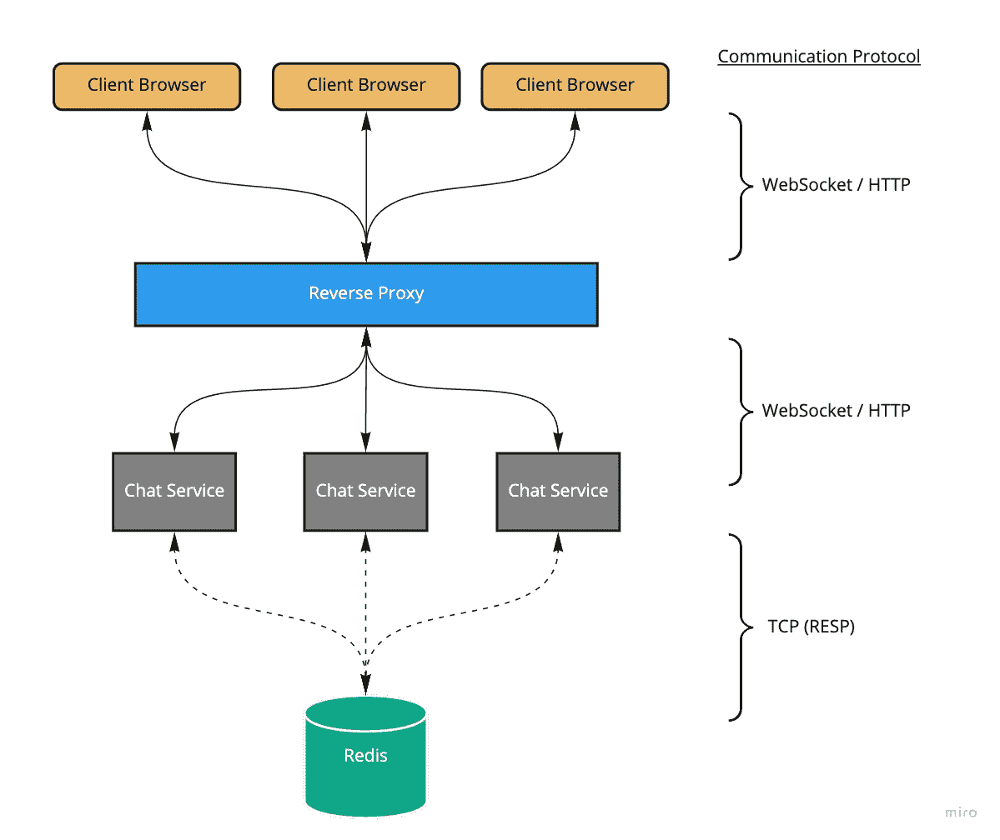
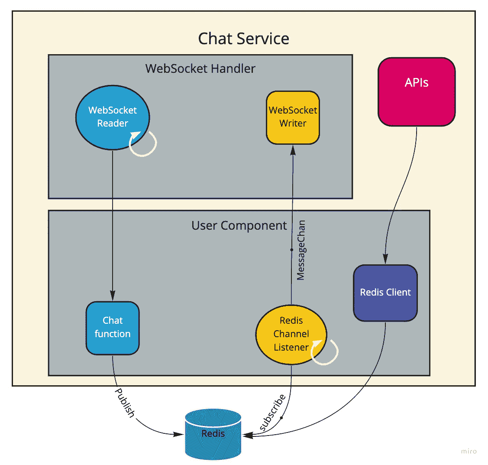
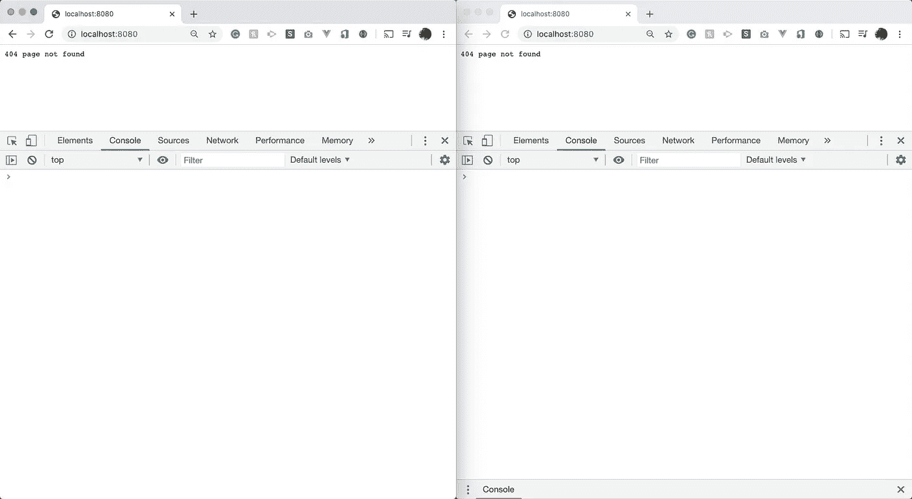
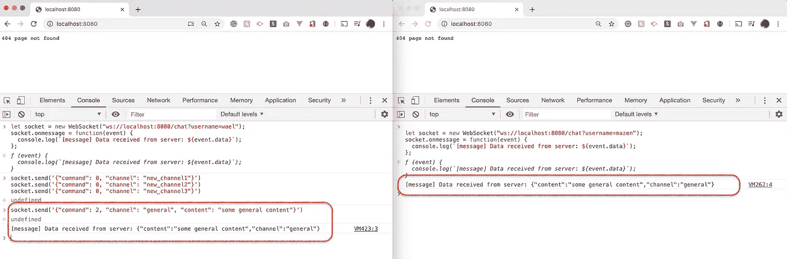
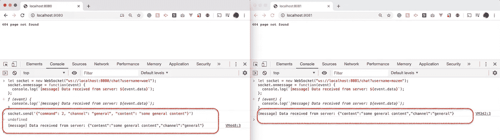

# 利用 Redis 构建 Golang 和 Websockets 聊天服务

> 原文：<https://levelup.gitconnected.com/building-chat-service-in-golang-and-websockets-backed-by-redis-b42a8784636c>



高层建筑的解决方案

这是 Redis 系列的第六篇帖子。

[**第一部分**:在 Ubuntu VM 内部安装 Redis](https://medium.com/swlh/install-redis-inside-a-ubuntu-vm-d5022d42d8cc) [**第二部分:** Redis 持久化实例](https://medium.com/@mhewedy_46874/redis-persistence-by-example-167aacf3a028)
[**第三部分**:使用 Redis 实现游戏排行榜](https://medium.com/@mhewedy_46874/implement-game-scoring-using-redis-75660f739760)
[**第四部分**:使用 Redis 实现作业队列](https://medium.com/@mhewedy_46874/implement-job-queue-in-redis-9f0f8d394561)
[**第五部分**:构建由 Redis 支持的 REST API](https://medium.com/@mhewedy_46874/building-rest-api-backed-by-redis-ae8ff4818460)
👈
[**第七部分** : Redis 集群配置示例](https://medium.com/@mhewedy_46874/redis-cluster-configurations-by-example-5480a178e884)
[**第八部分** : Redis 地理空间示例](https://medium.com/@mhewedy_46874/redis-geospatial-by-example-f5505a0962ef)

在这篇文章中，我们将看到如何使用 Redis 作为一个发布订阅来实现一个水平可伸缩的聊天服务:

💎什么是 Pub-sub？
💎设计决策
💎让我们编码(最无聊的部分🔥，敬请期待)
💎正在运行的聊天服务
💎测试水平可伸缩性

在这篇文章中，我们将使用安装在虚拟机上的 [Redis，使用**害虫**，智能虚拟机管理器，和一个](https://medium.com/swlh/install-redis-inside-a-ubuntu-vm-d5022d42d8cc)[现代 CLI 的流浪者](https://medium.com/@mhewedy_46874/vermin-a-modern-cli-for-vagrant-b115c9e97989)。

你可以从 Github 页面了解更多关于**害虫**的信息。

[](https://github.com/mhewedy/vermin) [## mhewedy/害虫

### 目录:害虫是一个智能，简单和强大的命令行工具，用于 Linux，Windows 和 macOS。它被设计成…

github.com](https://github.com/mhewedy/vermin) 

# 什么是 Pub-sub？

在本系列的文章“[使用 Redis](https://medium.com/@mhewedy_46874/implement-job-queue-in-redis-9f0f8d394561) 实现作业队列”中，我们已经看到了如何使用`list`操作及其`BLPOP`从列表中弹出并阻塞，直到新元素出现。在本帖中，我们将看到在 Redis 中拥有一流支持的发布-订阅模式。

## 那么什么是公共订阅呢？

发布-订阅模式允许称为*发布者*的消息发送者通过一个通道向称为*订阅者*的接收者发布消息，而不知道存在哪些订阅者——如果有的话。所有订阅者在收到消息时都可以同时收到消息。

与**消息队列**不同，后者在消息的*发送方*和*接收方*之间提供异步通信协议，因此它们不需要同时与消息队列交互。放入队列中的消息将被存储，直到收件人检索到它们。

这是一个在发布订阅合同中检索消息的回执，所有活动订阅者都将在发布订阅合同中接收消息。此外，在发布订阅中，如果没有活跃的订户，消息将会丢失。

# 设计决策

1.  聊天服务允许用户订阅多个频道。(可用于实现直接聊天)
2.  这个聊天服务被设计成*水平可伸缩的*。它是一个无状态服务(*状态仅在 WebSocket 连接打开时保存，用户可以建立到多个服务器的多个连接*)。我们可以根据 Reids 水平扩展聊天服务，而不用担心 WebSocket 协议的状态本质。
3.  Redis 客户端为每个订阅打开一个 TCP 连接，这需要打开太多从聊天服务到 Redis 的连接，如果我们为用户订阅的每个频道打开一个连接。
    为了避免这种情况，每当用户订阅新的频道，我都要取消旧的订阅，一次性订阅所有用户频道。(Redis 允许同时订阅多个频道)
4.  默认情况下，聊天服务在两个通道中注册所有连接的用户“*通用*和“*随机*”(遵循松弛约定)。用户可以在任何时间订阅任何任意频道，并且只有订阅了这些频道的用户才能看到消息。
5.  我使用 WebSockets 来处理 JavaScript 客户机和聊天服务之间的通信。(我喜欢)
6.  javascript 客户端用 JSON 向 Websocket API 发送消息，该 API 使用下面的结构`{"command": <0=Subscribe, 1=Unsubscribe or 2=Chat>, "channel": "channel name", "content": "content text"}`
7.  该服务提供了几个 REST APIs 来获取用户和特定用户订阅的频道。(将有助于在服务之上构建 GUI)
8.  聊天服务不处理用户管理或认证方面的问题。

# 让我们编码🚀🚀🚀

在这一(长)部分，我们将浏览最重要的代码片段，然而，完整的源代码是托管在 https://github.com/mhewedy-playground/Chat 的 Github 上

## 聊天服务的高级拱门



## 用户组件:

让我们从结构定义开始:

```
**type** User **struct** {
   name            string
   channelsHandler *redis.PubSub stopListenerChan **chan struct**{}
   listening        bool MessageChan **chan** redis.Message
}
```

`**name**`:用户的名字

`**channelsHandler**`:Redis subscribe 命令连接的处理程序。因此，每次用户订阅一个新频道时，我们使用该处理程序来结束当前订阅，然后开始对新频道列表(旧频道+新频道)的新订阅，然后通过 subscribe 函数返回的值来更新该引用。

```
// cancel current subscritpion
u.channelsHandler.Unsubscribe()
u.channelsHandler.Close()// start a new subscritpion on the new channels list (old channels list + the new channel user ask to subscribe to)
pubSub := rdb.Subscribe(channels...)
u.channelsHandler = pubSub
```

`**stopListenerChan**` : Golang 通道，用于停止当前用于处理当前订阅的 goroutine。它与`**channelsHandler**` 有关。

`**MessageChan**` **:** 在 Reids 订阅 goroutine 和 Websocket 发送方 goroutine 之间进行通信的 Golang 通道。因此，每当一条新消息到达 Redis 中的一个通道时，我们会立即将其发布到 web socket 连接。

```
*// The Listener Goroutine:* **go func**() {
   u.listening = ***true*** fmt.Println(**"starting the listener for user:"**, u.name, **"on channels:"**, channels)
   **for** {
      **select** {
      **case** msg, ok := <-pubSub.Channel():
         **if** !ok {
            **break** }
         u.MessageChan <- *msg **case** <-u.stopListenerChan:
         **break** }
   }
}()
```

下面是用户类型的`**Connect**`、`Subscribe`和`Unsubscribe`方法的实现，简单明了:

```
*//Connect connect user to user channels on redis* **func** Connect(rdb *redis.Client, name string) (*User, error) {
   **if** _, err := rdb.SAdd(***usersKey***, name).Result(); err != nil {
      **return** nil, err
   } u := &User{
      name:             name,
      stopListenerChan: make(**chan struct**{}),
      MessageChan:      make(**chan** redis.Message),
   } **if** err := u.connect(rdb); err != nil {
      **return** nil, err
   } **return** u, nil
}**func** (u *User) Subscribe(rdb *redis.Client, channel string) error { userChannelsKey := fmt.Sprintf(***userChannelFmt***, u.name) **if** rdb.SIsMember(userChannelsKey, channel).Val() {
      **return** nil
   }
   **if** err := rdb.SAdd(userChannelsKey, channel).Err(); err != nil {
      **return** err
   } **return** u.connect(rdb)
}**func** (u *User) Unsubscribe(rdb *redis.Client, channel string) error { userChannelsKey := fmt.Sprintf(***userChannelFmt***, u.name) **if** !rdb.SIsMember(userChannelsKey, channel).Val() {
      **return** nil
   }
   **if** err := rdb.SRem(userChannelsKey, channel).Err(); err != nil {
      **return** err
   } **return** u.connect(rdb)
}
```

简单直接地说，我们从 Redis 中检索频道，并通过订阅/取消订阅操作保持频道更新。然后调用订阅用户拥有的频道列表的`connect`方法。

下面是`connect`方法的实现:

```
**func** (u *User) connect(rdb *redis.Client) error {

   **var** c []string

   c1, err := rdb.SMembers(***ChannelsKey***).Result()
   **if** err != nil {
      **return** err
   }
   c = append(c, c1...)

   *// get all user channels (from DB) and start subscribe* c2, err := rdb.SMembers(fmt.Sprintf(***userChannelFmt***, u.name)).Result()
   **if** err != nil {
      **return** err
   }
   c = append(c, c2...)

   **if** len(c) == 0 {
      fmt.Println(**"no channels to connect to for user: "**, u.name)
      **return** nil
   }

   **if** u.channelsHandler != nil {
      **if** err := u.channelsHandler.Unsubscribe(); err != nil {
         **return** err
      }
      **if** err := u.channelsHandler.Close(); err != nil {
         **return** err
      }
   }
   **if** u.listening {
      u.stopListenerChan <- **struct**{}{}
   }

   **return** u.doConnect(rdb, c...)
}

**func** (u *User) doConnect(rdb *redis.Client, channels ...string) error {
   *// subscribe all channels in one request* pubSub := rdb.Subscribe(channels...)
   *// keep channel handler to be used in unsubscribe* u.channelsHandler = pubSub

   *// The Listener* **go func**() {
      u.listening = ***true*** fmt.Println(**"starting the listener for user:"**, u.name, **"on channels:"**, channels)
   **loop**:
      **for** {
         **select** {
         **case** msg, ok := <-pubSub.Channel():
            **if** !ok {
               **break loop** }
            u.MessageChan <- *msg

         **case** <-u.stopListenerChan:
            fmt.Println(**"stopping the listener for user:"**, u.name)
            **break loop** }
      }
   }()
   **return** nil
}
```

我们基本上检索用户的频道列表，然后清除旧状态(使用`channelsHandler`关闭任何现有的 TCP 连接，使用`stopListener`关闭正在运行的 Goroutines，如果有的话)

然后我们调用订阅频道列表的`doConnect`。`doConnect` *(这是迄今为止最重要的方法)*做如下工作:

1.  通过为一个连接中的所有频道列表打开一个 TCP 连接来订阅频道列表
2.  捕获对 TCP 连接的引用(`u.channelsHandler = pubSub`)
3.  启动一个 goroutine，它将处理我们在任何订阅的频道上从 Redis 收到的消息。(同样，我们可以通过关闭 Golang 通道`stopListener`来停止 goroutine)
4.  将从 Redis 收到的消息发送到 Golang 频道`u.MessageChan`。这个 Golang 通道正在被迭代，任何新消息都将被推送到 WebSocket 客户端。

此外，还有一种`Disconnect`方法，基本上与`connect`方法类似(通过清理资源)，但它不订阅新的频道列表，而且它关闭了`MessageChan` Golang 频道 Redis 和 WebSockets 之间的通信——因为它不再需要。

最后一个方法`Chat`，简单如下:

```
**func** Chat(rdb *redis.Client, channel string, content string) error {
   **return** rdb.Publish(channel, content).Err()
}
```

它只是将消息发布到一个通道。

## WebSocket 聊天处理方法:

```
**func** ChatWebSocketHandler(w http.ResponseWriter, r *http.Request, rdb *redis.Client) { conn, err := upgrader.Upgrade(w, r, nil)
   **if** err != nil {
      handleWSError(err, conn)
      **return** } err = onConnect(r, conn, rdb)
   **if** err != nil {
      handleWSError(err, conn)
      **return** } closeCh := onDisconnect(r, conn, rdb) // on recieve message from redis channels
   onChannelMessage(conn, r)**loop**:
   **for** {
      **select** {
      **case** <-closeCh:
         **break loop
      default**:
         onUserMessage(conn, r, rdb)
      }
   }
}
```

1.  我们升级连接(使用 Gorilla Toolkit WebSocket 实现)
2.  调用`onConnect`来检索 URL 的用户名，并调用`user.Connect`方法来建立到用户订阅的频道的连接，并将用户添加到***connected users***`map`。
3.  调用`onDiscounnect`它注册一个调用`user.Disconnect`的 WebSocket 关闭处理程序，并将用户从***connected users***`map`中移除，最后，它返回一个 Golang 通道，该通道用于中断 WebSocket 循环，我们将在到达该方法的 and 时看到。
4.  叫`onChannelMessage`那样子:

```
u := connectedUsers[username]**go func**() {
   **for** m := **range** u.MessageChan { msg := msg{
         Content: m.Payload,
         Channel: m.Channel,
         Command: 0,
      } **if** err := conn.WriteJSON(msg); err != nil {
         fmt.Println(err)
      }
   }}()
```

它从***connected users***映射中检索用户，并启动一个 goroutine，该 goroutine 将从订阅 Reids 通道的 go routine 正在编写的`u.MssageChan`中进行读取。然后，它将 WebSocket 连接的消息写回客户端。

5.WebSocket 循环:

```
**loop**:
   **for** {
      **select** {
      **case** <-closeCh:
         **break loop
      default**:
         onUserMessage(conn, r, rdb)
      }
   }
```

它基本上永远循环下去，直到一个`closeCh`(从上面#3 中的`onDisconnect`方法返回)调用`onUserMessage`方法，该方法解析来自 WebSocket 连接的消息并根据命令类型采取行动。实现如下:

```
**type** msg **struct** {
   Content string **`json:"content,omitempty"`** Channel string **`json:"channel,omitempty"`** Command int    **`json:"command,omitempty"`** Err     string **`json:"err,omitempty"`** }**const** (
   ***commandSubscribe*** = ***iota
   commandUnsubscribe
   commandChat*** )**func** onUserMessage(conn *websocket.Conn, r *http.Request, rdb *redis.Client) { **var** msg msg **if** err := conn.ReadJSON(&msg); err != nil {
      handleWSError(err, conn)
      **return** } username := r.URL.Query()[**"username"**][0]
   u := connectedUsers[username] **switch** msg.Command {
   **case *commandSubscribe***:
      **if** err := u.Subscribe(rdb, msg.Channel); err != nil {
         handleWSError(err, conn)
      }
   **case *commandUnsubscribe***:
      **if** err := u.Unsubscribe(rdb, msg.Channel); err != nil {
         handleWSError(err, conn)
      }
   **case *commandChat***:
      **if** err := user.Chat(rdb, msg.Channel, msg.Content); err != nil {
         handleWSError(err, conn)
      }
   }
}
```

它基本上读取来自 Javascript Websocket 客户端的 JSON，然后从***connected users***`map`检索用户，然后切换消息本身的`Command`字段，该字段可能是以下之一:

*   `**commandSubscribe**`:接受用户的频道名称，并为用户订阅该频道(通过调用`u.Subscribe`
*   `**commandUnsubscribe**`:接受用户的频道名称，取消用户对该频道的订阅(通过调用`u.Subscribe`)
*   `**commandChat**`:该命令调用`user.Chat`向频道发送文本消息。

## API 处理程序

除了用户和 Websocket 聊天组件之外，我们还有最后一个代表 API 的组件:

```
r.Path(**"/chat"**).Methods(**"GET"**).HandlerFunc(api.***ChatWebSocketHandler***)r.Path(**"/users"**).Methods(**"GET"**).HandlerFunc(api.***UsersHandler***)
r.Path(**"/user/{user}/channels"**).Methods(**"GET"**).HandlerFunc(api.***UserChannelsHandler***)
```

我们在上一节已经检查了函数***ChatWebSocketHandler****，我们来看看 UserHandler 和 userchandler:*的实现

```
**func** UserChannelsHandler(w http.ResponseWriter, r *http.Request, rdb *redis.Client) {
   username := mux.Vars(r)[**"user"**] list, err := user.GetChannels(rdb, username)
   **if** err != nil {
      handleError(err, w)
      **return** }
   err = json.NewEncoder(w).Encode(list)
   **if** err != nil {
      handleError(err, w)
      **return** }}**func** UsersHandler(w http.ResponseWriter, r *http.Request, rdb *redis.Client) { list, err := user.List(rdb)
   **if** err != nil {
      handleError(err, w)
      **return** }
   err = json.NewEncoder(w).Encode(list)
   **if** err != nil {
      handleError(err, w)
      **return** }
}
```

这就是编码部分的全部内容。你可以在 Github[https://github.com/mhewedy-playground/Chat](https://github.com/mhewedy-playground/Chat)看看整个实现

在下一节中，我们将看到聊天服务的运行。

# 聊天服务正在运行

让我们像下面这样并排打开两个 chrome 窗口，这样测试就容易了:



> 你需要首先启动 Golang 聊天服务，并确保它连接到 Redis 服务器，你可能会发现本系列的第一篇文章有助于在几分钟内安装和配置 Ubuntu VM 中的 Redis。

## 连接和订阅:

首先，我们需要启动聊天服务:

```
$ go build; ./chat
```

让我们在它们的每个选项卡上启动 WebSocket 客户端，在左侧选项卡上键入:

```
let socket = new WebSocket("ws://localhost:8080/chat?username=**wael**");
socket.onmessage = function(event) {
  console.log(`[message] Data received from server: ${event.data}`);
};
```

在右边的标签上写下:

```
let socket = new WebSocket("ws://localhost:8080/chat?username=**mazen**");
socket.onmessage = function(event) {
  console.log(`[message] Data received from server: ${event.data}`);
};
```

请注意聊天服务日志:

```
connected from: [::1]:55471 user: wael
starting the listener for user: wael on channels: [general random]
connected from: [::1]:55490 user: mazen
starting the listener for user: mazen on channels: [general random]
```

让我们注意一下使用`redis-cli`的 Redis 客户端:

```
127.0.0.1:6379> **client list**
id=325 addr=127.0.0.1:58944 fd=9 name= age=98745 idle=0 flags=N db=0 sub=0 psub=0 multi=-1 qbuf=26 qbuf-free=32742 obl=0 oll=0 omem=0 events=r cmd=client
id=852 addr=127.0.0.1:60006 fd=8 name= age=107 idle=104 flags=N db=0 sub=0 psub=0 multi=-1 qbuf=0 qbuf-free=0 obl=0 oll=0 omem=0 events=r cmd=smembers
id=853 addr=127.0.0.1:60008 fd=10 name= age=107 idle=17 flags=P db=0 sub=2 psub=0 multi=-1 qbuf=0 qbuf-free=0 obl=0 oll=0 omem=0 events=r cmd=ping
id=854 addr=127.0.0.1:60010 fd=11 name= age=104 idle=14 flags=P db=0 sub=2 psub=0 multi=-1 qbuf=0 qbuf-free=0 obl=0 oll=0 omem=0 events=r cmd=ping
```

注意，我们有 4 个客户端连接到 Redis:第一个是`redis-cli`本身。第二个是 Redis 命令在服务内部使用的连接(`publish`、`smembers`、`sadd`...等等)。最后两个是两个客户端(左标签客户端和右标签客户端)的订阅功能的连接。

> 注意，每个客户端只有一个到它监听的所有频道的打开的连接。

现在，让我们向左侧选项卡客户端添加另外 3 个通道，并重新检查命令。在左侧选项卡中键入:

```
socket.send('{"command": 0, "channel": "new_channel1"}')
socket.send('{"command": 0, "channel": "new_channel2"}')
socket.send('{"command": 0, "channel": "new_channel3"}')
```

> 同样，命令=0 表示订阅，命令=1 表示取消订阅，命令=2 表示发送聊天消息。

请注意聊天服务日志:

```
starting the listener for user: wael on channels: [general random new_channel1]
starting the listener for user: wael on channels: [general random new_channel2 new_channel1]
starting the listener for user: wael on channels: [general random new_channel3 new_channel2 new_channel1]
```

它指示使用“wael”(左边的用户)现在正在收听总共 5 个房间，但是让我们检查到 Redis 的 TCP 连接，以确保我们没有过多地使用它们:

```
127.0.0.1:6379> client list
id=325 addr=127.0.0.1:58944 fd=9 name= age=99646 idle=0 flags=N db=0 sub=0 psub=0 multi=-1 qbuf=26 qbuf-free=32742 obl=0 oll=0 omem=0 events=r cmd=client
id=882 addr=127.0.0.1:60066 fd=8 name= age=99 idle=83 flags=N db=0 sub=0 psub=0 multi=-1 qbuf=0 qbuf-free=0 obl=0 oll=0 omem=0 events=r cmd=smembers
id=884 addr=127.0.0.1:60070 fd=11 name= age=93 idle=3 flags=P db=0 sub=2 psub=0 multi=-1 qbuf=0 qbuf-free=0 obl=0 oll=0 omem=0 events=r cmd=ping
id=887 addr=127.0.0.1:60076 fd=10 name= age=83 idle=23 flags=P db=0 sub=5 psub=0 multi=-1 qbuf=0 qbuf-free=0 obl=0 oll=0 omem=0 events=r cmd=ping
```

很好，我们仍然使用 4 个通道，你可能会注意到连接的`id`已经改变。

## 发送消息:

现在让我们从左边的 ***客户端发送消息*** 到“通用”频道:

```
socket.send('{"command": 2, "channel": "general", "content": "some general content"}')
```

消息将被发布到***【general】***通道，然后它将被两个客户端接收并被推送到两个客户端上的 WebSocket:



现在，如果我们尝试将消息推送到左侧客户端独占的频道之一(例如“***【new _ channel 1】***),它将不会出现在右侧客户端。

让我们来看看 Redis 的数据结构:

```
127.0.0.1:6379> keys *
1) "users"
2) "user:wael:channels"
3) "channels"
127.0.0.1:6379> smembers users
1) "mazen"
2) "wael"
127.0.0.1:6379> smembers channels
1) "general"
2) "random"
127.0.0.1:6379> smembers user:wael:channels
1) "new_channel3"
2) "new_channel2"
3) "new_channel1"
```

我们注意到，与我们的聊天服务相关的所有数据都保存在 Redis 中，这有助于聊天服务在水平方向 ***扩展*** 。

> 我们可以依赖 Redis 使用`INCR`命令提供的原子性，并用惟一的 ID 标记每条聊天消息，以确保客户端收到的每条消息都是一致的。

## 断开连接:

让我们试着将 ***右边的*** 客户端断开，并再次检查`users`的 Redis 设置。在 chrome issue 的右侧选项卡上:

我们有一个 API 来列出我们拥有的用户:

```
watch curl -s [http://localhost:8080/users](http://localhost:8080/users)
```

在我的案例中显示:

```
Every 2.0s: curl -s [http://localhost](http://localhost)...  Muhammads-MacBook-Pro.local: Sun May 24 11:21:29 2020["mazen","wael"]
```

现在让我们转到 chrome 的右边标签，关闭连接:

```
socket.close()
```

您会注意到 curl watch 命令的结果发生了变化:

```
Every 2.0s: curl -s [http://localhost](http://localhost)...  Muhammads-MacBook-Pro.local: Sun May 24 11:22:16 2020["wael"]
```

让我们看看 Redis:

```
127.0.0.1:6379> smembers users
1) "wael"
```

# 👏👏👏

> 我用来调试发送给 Redis 的命令的一个方便的命令是`*MONITOR*`,它用来打印 Redis 服务器收到的每一个命令。

# 测试水平可伸缩性

接下来，让我们启动两个聊天服务，并将每个客户端连接到其中一个:

```
$ go build; PORT=8080 ./chat & PORT=8081 ./chat &
[1] 51535
[2] 51536
```

现在让我们打开 chrome，将左侧客户端指向 8080 服务，将右侧客户端指向 8081 服务:

在左侧的选项卡上，粘贴:

```
let socket = new WebSocket("ws://localhost:**8080**/chat?username=**wael**");
socket.onmessage = function(event) {
  console.log(`[message] Data received from server: ${event.data}`);
};
```

在右边的选项卡上，粘贴:

```
let socket = new WebSocket("ws://localhost:**8081**/chat?username=**mazen**");
socket.onmessage = function(event) {
  console.log(`[message] Data received from server: ${event.data}`);
};
```

在左侧的选项卡上，我们向双方都应该订阅的“通用”频道发送一条消息:

```
socket.send('{"command": 2, "channel": "general", "content": "some general content"}')
```

是的，它正在工作:



# 👏👏👏 🎉🎉🎉🎉🎉

我们已经看到了如何使用 Redis 和 Golang 强大的 goroutines 和使用 WebSocket 编译的通道，使用强大的库 Gorilla Toolkit WebSocket 和 Go-Redis 来构建一个****多通道*** 聊天服务。*

*请注意，该代码不是最好的，也不是生产级的，它是作为概念验证编写的。*

*同样，你可以在 Github 找到源代码:[https://github.com/mhewedy-playground/Chat](https://github.com/mhewedy-playground/Chat)*

*参考资料:*

*[](https://redis.io/topics/pubsub) [## 发布/订阅 Redis

### 订阅、取消订阅和发布实现发布/订阅消息传递范式，其中(引用维基百科)发送者…

redis.io](https://redis.io/topics/pubsub) [](https://www.wikiwand.com/en/Publish%E2%80%93subscribe_pattern) [## 发布-订阅模式|维基网

### 在软件架构中，发布-订阅是一种消息传递模式，消息的发送者(称为发布者)不…

www.wikiwand.com](https://www.wikiwand.com/en/Publish%E2%80%93subscribe_pattern) [](https://github.com/gorilla/websocket) [## 大猩猩/网络插座

### Gorilla WebSocket 是 WebSocket 协议的 Go 实现。Gorilla WebSocket 包提供了一个完整的…

github.com](https://github.com/gorilla/websocket) [](https://github.com/go-redis/redis) [## go-redis/redis

### 支持:API 文档:https://pkg.go.dev/github.com/go-redis/redis/v8?tab=doc.示例…

github.com](https://github.com/go-redis/redis)*