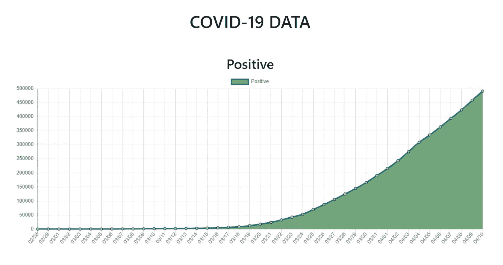
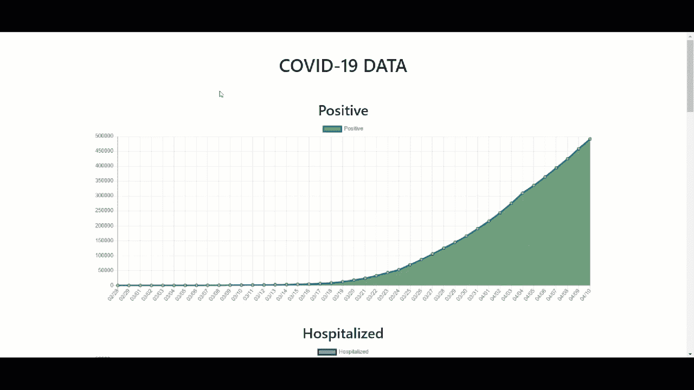

# 用 Chart.js 和 Vue.js 构建新冠肺炎仪表板

> 原文：<https://levelup.gitconnected.com/building-covid-19-dashboard-with-charts-js-and-vue-js-5b054443fa4>



新冠肺炎阳性病例

我们现在生活在恐惧和不确定的时代。随着新冠肺炎席卷全球，没有人的健康或生计是安全的。对我个人来说，我保持理智的一个重要方法就是保持忙碌。我也不看新闻，但仍然关注新冠肺炎是如何传播的。所以，我想我应该编写一个 web 应用程序来构建一个仪表板，并可视化病毒的传播。

在本教程中，我们将看看如何使用 Charts.js 和 Vue.js 非常容易地可视化数据。幸运的是，有一个很好的 API 可以用于这里找到的数据:[https://covidtracking.com](https://covidtracking.com)

*****滚动到底部查看视频教程*****

# 项目设置

首先，让我们创建一个 Vue 项目。打开您的终端，将 cd 放入所需的目录并运行以下命令:

```
npx vue create covid-19-visualization
```

接下来，在您选择的编辑器中打开项目(我将使用 [VS 代码](https://code.visualstudio.com/)，打开一个新终端(Terminal = > New Terminal)并运行以下命令:

```
npm install vue-chartjs chart.js axios moment bootstrap --save
```

# 式样

在 src/main.js 中，我们将导入 Boostrap，这样我们就有了一些基本的样式。在文件的顶部，将它添加到其他导入下:

```
import 'bootstrap/dist/css/bootstrap.css'
```

您的 main.js 应该如下所示:

# App.vue

接下来，打开 src/App.vue 并删除模板、脚本和样式标签中的所有内容。在文件的顶部，导入 axios 和 moment。我们将使用 axios 来发出 API 请求，并使用 moment 来格式化日期。

```
*import* axios *from* "axios";
*import* moment *from* "moment";
```

然后添加一个导出默认模块。在导出默认值中，我们将在数据属性中添加数组。这些将保存我们从 API 接收的图表数据。我们还将添加一些图表选项和颜色，我们将通过我们的图表组件。在选择图表颜色时，我使用了:[https://coolors.co/](https://coolors.co/)

```
*export* *default* {
  *data*() {
    *return* {
      arrPositive: [],
      positiveChartColors: {
        borderColor: "#077187",
        pointBorderColor: "#0E1428",
        pointBackgroundColor: "#AFD6AC",
        backgroundColor: "#74A57F"
      }, 
      arrHospitalized: [], 
      hospitalizedChartColors: {
        borderColor: "#251F47",
        pointBorderColor: "#260F26",
        pointBackgroundColor: "#858EAB",
        backgroundColor: "#858EAB"
      },
      arrInIcu: [],
      inIcuColors: {
        borderColor: "#190B28",
        pointBorderColor: "#190B28",
        pointBackgroundColor: "#E55381",
        backgroundColor: "#E55381"
      },
      arrOnVentilators: [],
      onVentilatorsColors: {
        borderColor: "#784F41",
        pointBorderColor: "#784F41",
        pointBackgroundColor: "#BBE5ED",
        backgroundColor: "#BBE5ED"
      },
      arrRecovered: [],
      recoveredColors: {
        borderColor: "#4E5E66",
        pointBorderColor: "#4E5E66",
        pointBackgroundColor: "#31E981",
        backgroundColor: "#31E981"
      },
      arrDeaths: [],
      deathColors: {
        borderColor: "#E06D06",
        pointBorderColor: "#E06D06",
        pointBackgroundColor: "#402A2C",
        backgroundColor: "#402A2C"
      },
      chartOptions: {
        responsive: true,
        maintainAspectRatio: false
      }
    };
  },
}
```

在数据属性下的导出默认值中，添加 Vue 生命周期挂钩创建。我们将使用它进行初始 API 调用来获取数据。当我们从 API 中获取数据时，我们将数据推入数组，这样我们就可以将它用于各个图表。

```
*async* *created*() {
  const{ *data* }= *await axios.get*("https://covidtracking.com/api/us/daily");

  *data.forEach*(d => {
    const *date* = *moment*(*d.date*,"YYYYMMDD")*.format*("MM/DD");

    const{
      *positive*,
      *hospitalizedCurrently*, 
      *inIcuCurrently*,
      *onVentilatorCurrently*,
      *recovered*,
      *death* }=d; this*.arrPositive.push*({ date, total: positive });
     this*.arrHospitalized.push*({
     date, total: hospitalizedCurrently 
    });
    this*.arrInIcu.push*({ date, total: inIcuCurrently });
    this*.arrOnVentilators.push*({ 
      date, total: onVentilatorCurrently 
    });
    this*.arrRecovered.push*({ date, total: recovered });
    this*.arrDeaths.push*({ date, total: death });
  });
}
```

# 折线图组件

在 components 文件夹中，删除 HelloWorld.vue 组件，并添加一个新文件，将其命名为 LineChart.vue。在此文件中，添加您的脚本标记，然后导入 vue-chartjs 库，以便在顶部绘制折线图:

```
*import* { Line } *from* "vue-chartjs";
```

接下来，我们将使用 extends 属性添加我们的导出默认值，以使用折线图和 4 个属性，我们将使用显示数据和样式化图表:

```
*export* *default* {
  extends: Line,
  props: {
  label: {
    type: String
  },
  chartData: { 
    type: Array
  },
  options: { 
    type: Object
  },
  chartColors: {
    type: Object
  } 
 }
}
```

接下来，在 export default 中，我们将添加一个名为 mounted 的 Vue 生命周期挂钩，我们将使用它来呈现图表，并向它传递我们传递到 props 中的数据和颜色。图表不接受对象的数组，所以我们必须用地图将它们展平。我们还必须颠倒它们，因为日期是按照 API 的降序排列的。

```
*mounted*() {
  const *dates* = *this.chartData.map*(*d* => *d.date*)*.reverse*();
  const *totals* = *this.chartData.map*(*d* => *d.total*)*.reverse*(); const{
    *borderColor*,
    *pointBorderColor*,
    *pointBackgroundColor*,
    *backgroundColor* }= *this.chartColors*; this*.renderChart*({
    labels: dates,
    datasets: [{
      label: this*.*label,
      data: totals,
      borderColor: borderColor,
      pointBorderColor: pointBorderColor,
      pointBackgroundColor: pointBackgroundColor,
      backgroundColor: backgroundColor
     }]
    },
    this*.*options);
}
```

最终的 LineChart.vue 文件应该如下所示:

LineChart.vue

现在，我们要做的就是将组件导入到 src/App.vue 中，并将组件添加到模板中。要导入组件，请将其添加到文件的顶部:

```
*import* LineChart *from* "./components/LineChart";
```

然后将其添加到导出默认值:

```
components: {
  LineChart
}
```

接下来，我们将组件添加到模板标记中，以便显示我们的图表。确保通过组件标签上的道具传递数据。在显示数组之前，我们添加一个 v-if 来检查数组中是否有数据，这一点很重要。这将防止我们的图表显示空白。

我们还将在模板中添加一些引导样式，这样看起来会更好。最终的 App.vue 文件应该如下所示:

# 结论

完成后，您应该会看到如下所示的内容:



就是这样！当然，这只是你可以使用的众多图表之一。而且，这只是一个简单的教程，但是我们很想看看你是如何改进它的！请在下面给我们留下您自己的项目和改进的评论。

# 视频教程

视频教程

你可以在这里找到这个项目的 git repo:[https://bit bucket . org/the ligent dev/新冠肺炎-数据可视化/src/master/](https://bitbucket.org/TheDiligentDev/covid-19-data-visualization/src/master/)