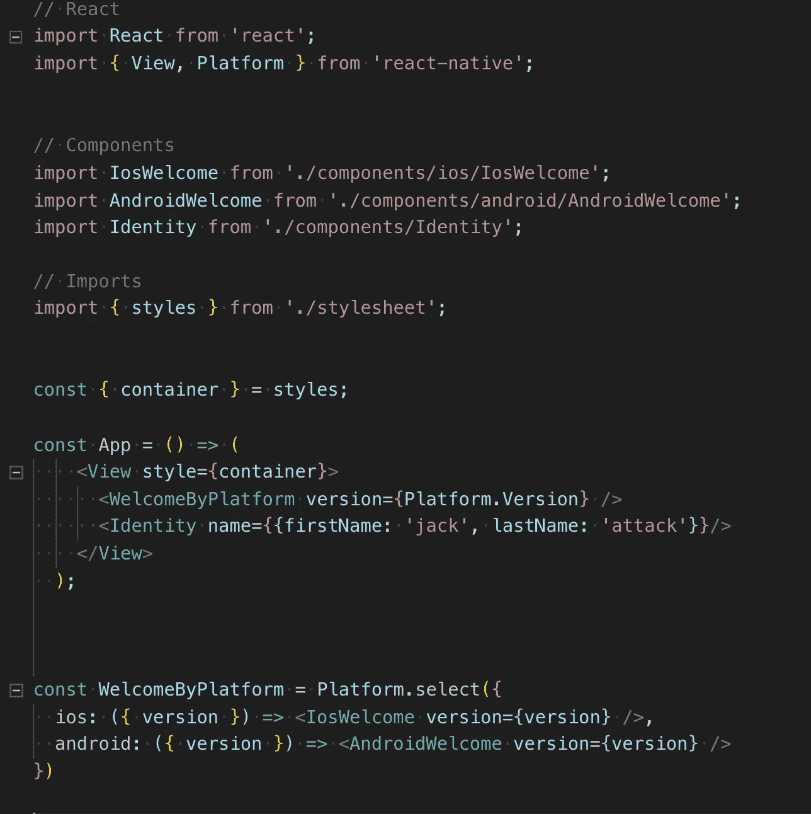
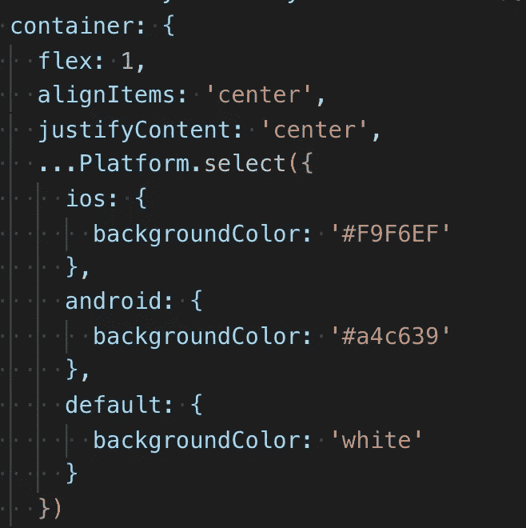
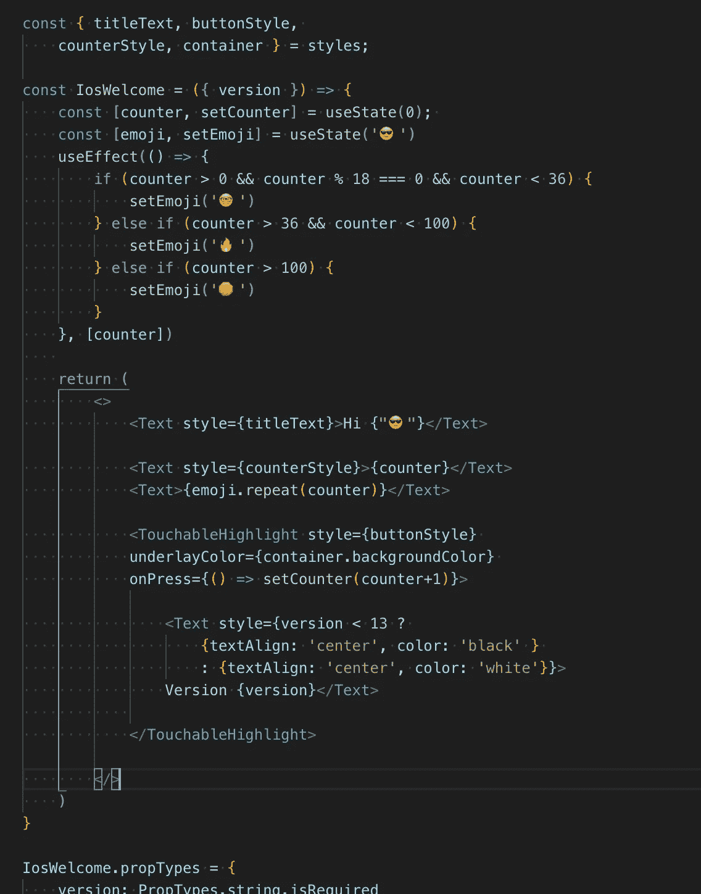
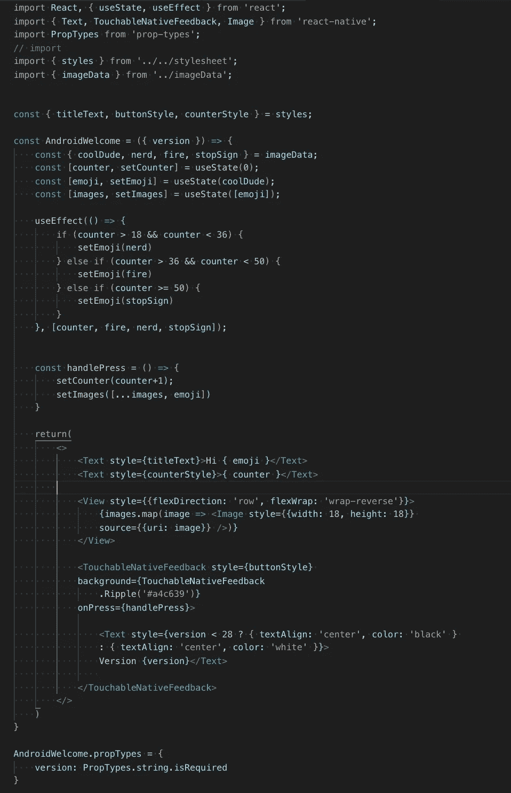
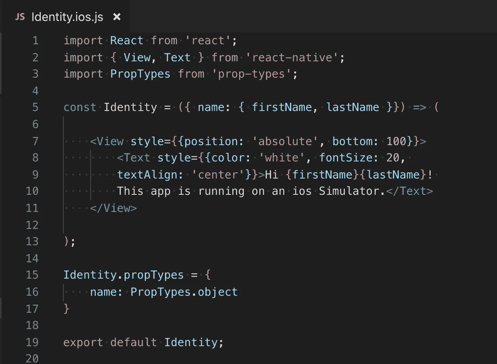
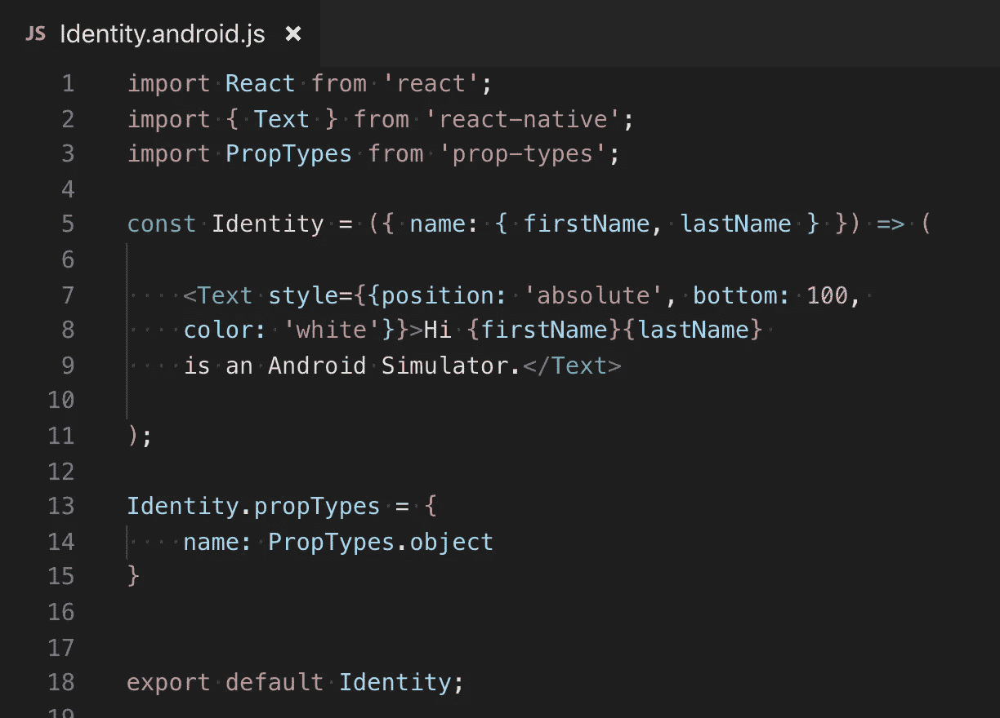
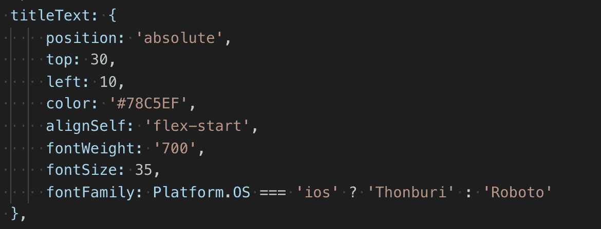
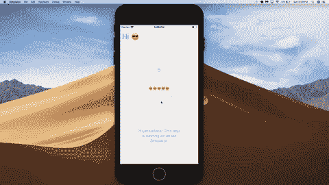

# 用 React Native 构建跨平台移动应用

> 原文：<https://levelup.gitconnected.com/building-cross-platform-mobile-applications-with-react-native-1e3e120e4a29>

被劫持

脸书的 React Native 是一个跨平台的移动开发框架。有了它，我们可以为不同的设备以及不同版本的设备开发应用程序。使用 React Native，我们编写 JavaScript 代码，这些 JavaScript 代码被编译成本机代码，分别用于每个运行它的操作系统。例如，View React 原生 UI 组件将被编译成 android 视图中的 ViewGroup 组件，iOS 中的 UIView，并转换成 web 上的 div。

虽然 React Native 作为一个框架允许我们为 iOS 和 Android 编写一致可用的代码，但我们经常希望或不得不为前者和后者设备分离代码，以构建所需的通用 UI/逻辑。一种方法是使用 React Native 提供的平台模块。为了演示跨平台开发的导航，我构建了一个小型的 React 本机应用程序。

上面是应用程序主容器的代码图像。出于这个例子的目的，我决定将样式表抽象出来，放在一个单独的文件中。如果我们查看应用程序功能组件的 return 语句，我们会看到视图原语中调用了两个组件:WelcomeByPlatform 和 Identity。WelcomeByPlatform 传递一个名为 version 的 prop，等于平台模块返回的版本。根据我们使用的设备，版本会有所不同。

例如，我在版本为 13.3 的 IOS 模拟器上运行这个应用程序！如果我们在 Expo Snack 上作为 Android 运行这个应用程序(也就是在发表本文的时候)，我们可能会看到 27 版。在第 26 行上，WelcomeByPlatform 被定义为 Platform.select。通过这种方法，我们可以根据正在使用的操作系统有条件地呈现一个组件。在 Platform.select 中，我们将版本作为道具传递给两个组件。如果设备是 iOS，我们会渲染 IosWelcome 如果没有，安卓欢迎。我们还可以将一个默认键传递给 Platform.select，它将为不属于上述两者的设备呈现一个组件，比如 web 视图。在样式表中可以看到一个使用 iOS、Android 和 default 的例子，对于这个迷你项目，我将它单独放在一个文件中。在容器键中，我们使用 Platform.select 根据操作系统有条件地呈现下列 backgroundColors 之一。

# 欢迎组件

在 IosWelcome 组件中，我们的 state 中有一个计数器，它最初被设置为 0，还有一个表情符号被设置为戴墨镜的酷酷的人。按下我们的可触摸突出显示，我们的计数器增加，一个表情符号被附加到屏幕上。计数器的每一个增量都会产生相应数量的表情符号，根据计数器的大小，我们会呈现不同的表情符号。这种依赖性是在我们的 useEffect 中定义的，我们根据计数器的大小来更新表情符号的状态。

我们还根据平台的版本有条件地呈现不同的按钮样式(*记住，版本是从我们的 App/WelcomeByPlatform 组件传递下来的)。如果 iOS 设备低于版本 13，则在按钮中显示黑色文本；否则显示白色文本。虽然这是一个相当微薄的例子，当然我们可以想象如何平台。版本可以在现实生活中发挥巨大作用。例如，假设您已经在应用程序中内置了一些依赖于新的 iOS 功能的新功能。如果用户有较新的 iOS，他们可以利用新功能，否则呈现没有新功能的旧组件。

如果没有 Android 上第三方的帮助，我们就无法获得同样的 iOS 表情符号体验，而我在日常生活中已经过于依赖这种体验了。因此，我决定在我们的 AndroidWelcome 组件中使用图标苹果表情符号的图像 URL 来执行相同的表情符号条件渲染。这些图像存储在一个名为 imageData 的对象中，并在 useEffect 中调用。你可能还注意到，在我们的 Android 版本中，我用 TouchableNativeFeedback 替换了 TouchableHighlight 一种只在 Android 上可用的可触摸的 React 原生原语。印刷时，它会产生动画涟漪效果！我们还必须改变相当多的逻辑，让表情符号显示出来，就像你会注意到的那样(可能也不是显示图像的最佳方式)。

React Native 还让我们能够通过文件名系统来分离文件。如果我们的应用变得更加复杂，我们可能会决定不仅仅依赖平台模块，而是实际上将 iOS 和 Android 的组件分离到单独的文件中。例如，在我们的 App 组件中，我们有一个名为 Identity 的组件。我们的代码库中的这个组件实际上由两个不同的文件表示:Identity.ios.js 和 Identity.android.js。当我们运行我们的应用程序时，React Native 能够根据它当前运行的操作系统来识别要运行这些文件中的哪个文件。

使用文件命名约定根据操作系统呈现组件，也反映了 React Native 编译本机代码的能力！！

虽然在很大程度上，Native 允许我们用 JavaScript 为 iOS 和 Android 编写代码，但由于基本的功能差异，某些方面仍然需要将代码分成不同的部分。键盘 API 就是这样一个例子，默认情况下，它在每个操作系统上的行为有很大不同。在 iOS 上，当用户关注输入字段时，默认情况下，键盘会与当前 UI 重叠，而在 Android 上，我们的 UI 主体会在 TextInput 焦点上调整大小。样式是跨平台程序需要一些逻辑的另一个领域。例如，假设您使用的字体在 iOS 上不可用，但在 Android 上可用，反之亦然。这是在样式表中使用三元组的最佳场景。

瞧吧。成品！这绝对惊人的应用程序，显示使用 iOS 模拟器！

