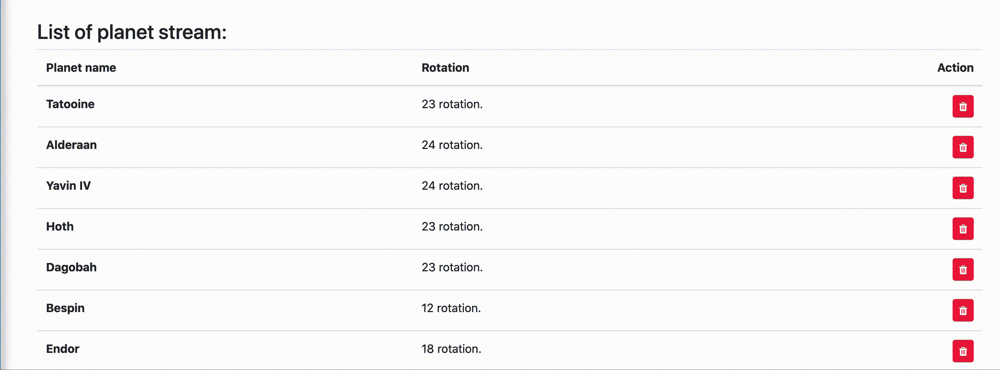
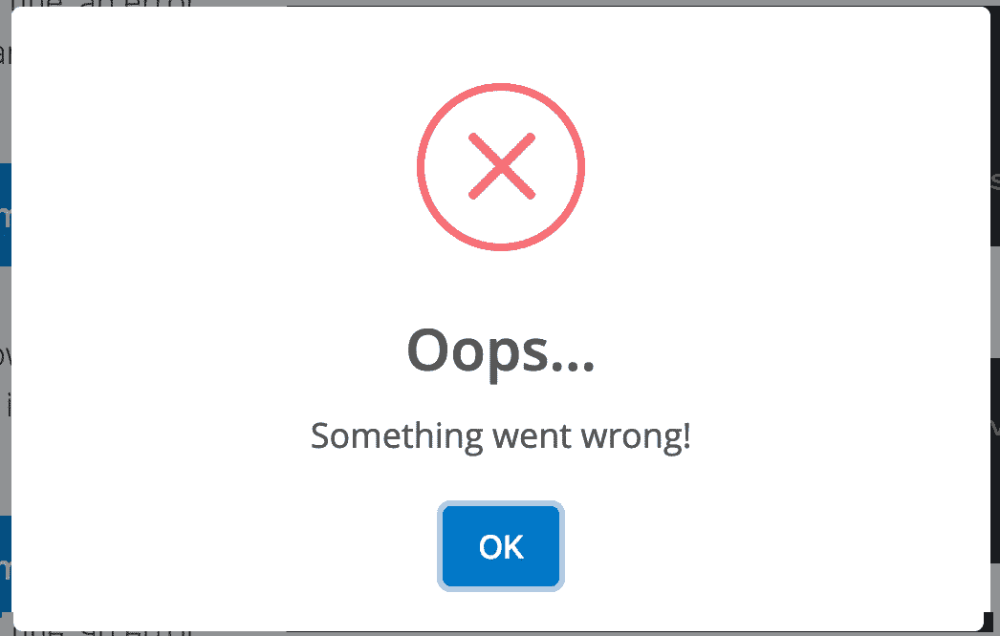
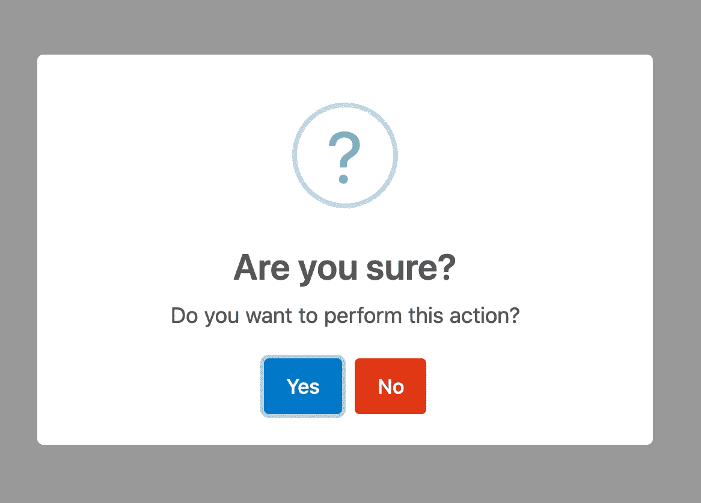

# 为 angular 构建自定义类型脚本装饰器

> 原文：<https://levelup.gitconnected.com/building-custom-typescript-decorators-for-angular-4595816e7b87>



作为前端开发人员，我们喜欢漂亮的用户界面。同样，我们真的应该努力拥有干净的可重用代码。现代工具和技术为我们提供了许多实现这一目标的方法。在本文中，我们将研究 typescript 装饰器，以及它们如何帮助我们向代码中添加抽象和可重用性。

为此，我们将创建一个自定义装饰器来启动一个 [Sweetalert](https://sweetalert.js.org/guides/) 。

但是首先让我们看看什么是装饰者。

当我第一次被介绍给装修工人时，我想知道我们为什么需要他们。当然，Angular 在任何地方都使用“无论什么”符号，但是它们实际上是如何工作的呢？最终它们看起来像黑匣子。当然，人们可以在不理解的情况下用 TS / Angular 构建应用程序。但是一旦我们挖掘得更深一点，我们就能理解它们是什么，以及使用它们的好处。

## 什么是装修工？

本质上，装饰器只是一个 JavaScript 函数。好吧，我知道这听起来像一个笑话，但真的！装饰器只是一个允许我们“扩展”代码做更多事情的函数。是的，现在它非常抽象，但是我们很快就会弄清楚。

让我们看看 typescript 中可用的不同类型的装饰器。

有四种主要类型:

*   类装饰器，用于给类添加功能，例如**@组件**和 **@NgModule**
*   属性装饰器，用于向类内部的属性添加功能，例如 **@Input** 和 **@Output**
*   类内方法的方法装饰器，例如 **@HostListener**
*   类构造函数内部参数的参数装饰器，例如 **@Inject**

每个装饰者都有一个独特的角色。有关不同装饰器类型及其在 angular 中应用的示例，请查看 Angular 中使用的[装饰器。](https://medium.com/@bilkiss.dulloo/decorators-in-angular-16e20efcd17c)

在我们进入有趣的部分(实际代码)之前，这些是您应该知道的基础知识:)如前所述，我们将创建一个方法装饰器，它将在方法执行之前显示一个 sweetalert 确认框。

## 好了，我们开始吧！

如前所述，decorators 实际上只是函数，就这么简单，用它们正在装饰的任何东西来调用。方法装饰器将在它所装饰的方法之前被调用，而类装饰器将在要装饰的类之前被调用。

我假设你已经有一个角度项目，但如果没有，你可以创建一个

```
ng new
```

让我们快速制作一个可以在类中使用的装饰器来进一步演示这一点。我们将要构建的装饰器是一个可确认的装饰器，它会在执行一个方法之前要求确认。我们将使用 [SweetAlert 2](https://sweetalert2.github.io/) 作为我们的弹出插件。

## **安装**:

要安装 sweetalert，我们需要在终端中运行以下命令

```
npm install --save sweetalert2
```

安装完成后，在 angular 中使用 sweetalert 非常简单。我们需要:

1.  在我们的组件中导入库
2.  调用 swal . fire()；显示弹出窗口。

例如，考虑下面的代码示例:

**example-swal-component . ts**

(此代码示例仅用于说明目的，项目中不需要此组件)。

在上面的例子中，当组件启动时，会出现一个警告框



现在我们已经了解了 sweetalert 的基本用法，让我们编写一些代码。首先，我们将创建一个组件，这将是我们这次冒险的起点。像往常一样，我们将使用 cli。

```
ng g c item
```

这将创建以下文件。

**item.component.ts**

```
import { Component, OnInit } from '@angular/core';@Component({
  selector: 'app-item',
  templateUrl: ‘./item.component.html',
  styleUrls: ['./item.component.scss']
})export class ItemComponent implements OnInit {constructor() {}ngOnInit(): void {}}
```

暂时不要太花哨。我们将向这个组件类添加一个删除方法，它将简单地向浏览器控制台记录一条消息。

**item.component.ts**

```
import { Component, OnInit } from '@angular/core';@Component({
  selector: 'app-item',
  templateUrl: ‘./item.component.html',
  styleUrls: ['./item.component.scss']
})export class ItemComponent implements OnInit { constructor() {} ngOnInit(): void {} deleteItem(): void {
  console.log(“An item was deleted”);
 }}
```

在组件的标记中，我们将添加一个按钮来触发新创建的方法。

**item.component.html**

```
<button (click)=”deleteItem()”>Delete item</button>
```

如果我们加载组件并单击按钮，控制台确实会记录消息。到目前为止一切顺利，但是如果我们想让用户确认这个操作而不是直接运行这个方法呢？

一种选择是在 deleteItem 方法本身中调用 sweetalert，这也可以，但是如果我们希望这是一个可重用的逻辑，这样我们就不需要在每次有需要用户确认的功能时都复制/粘贴它，该怎么办呢？我知道你在等它，这就是我们的室内设计师要来的地方！

因此，在下一步中，我们将在 app 目录中创建一个名为“decorators”的文件夹，并在其中添加一个名为`*confirmable.decorator.ts*`的新的空白 typescript 文件。

在该文件中，我们要做的第一件事是导入 sweetalert。

**confirm able . decorator . ts**

```
import Swal from 'sweetalert2';
```

接下来，还记得我们说过装饰者是简单的 TS 函数吗？对于方法装饰者来说，这些函数的签名如下所示:

```
function confirmable(target: Object, propertyKey: string, descriptor: PropertyDescriptor)
```

其中“target”表示包含我们正在修饰的方法的类，“propertyKey”表示方法名，“descriptor”将包含方法实现。在 decorator 函数中，我们能够在方法执行之前/之后做一些事情，或者根据任意条件完全跳过执行。例如

```
function decorator(target: Object, propertyKey: string, descriptor: PropertyDescriptor){ // we first cache the original method implementation
 const originalMethod = descriptor.value; // then we overwrite it with a new implementation,
 // ...args represent the original arguments descriptor.value = function (...args) { // do custom logic before executing the original method
  // execute original method with the original arguments
  const result = originalMethod.apply(this, args); // execute custom logic after executing the original method
   return result;
  } }; return descriptor;};
```

正如我们在上面的方法中看到的，使用 decorators，我们可以将逻辑注入到被修饰的方法中。然后，可以通过在我们的 component.ts 中导入函数来使用这个装饰器，并将其添加到我们的方法定义中，如下所示

```
@decorator
myDecoratedMethod(){.....}
```

有道理？现在让我们在我们的可确认装饰器上真正尝试一下:)

**confirmable.decorator.ts**

```
import Swal, {SweetAlertOptions} from 'sweetalert2';export function Confirmable (target: Object, propertyKey: string, descriptor: PropertyDescriptor) { // Again, cache the original method for later use
 const originalMethod = descriptor.value; // the configuration object for sweetalert
 const config: SweetAlertOptions = {
  title: 'Are you sure?',
  html: 'Do you want to perform this action?',
  showDenyButton: true,
  confirmButtonText: 'Yes',
  denyButtonText: 'No',
  icon: 'question'
 }; // we write a new implementation for the method
 descriptor.value = async function (...args) { const res = await Swal.fire(config);  
   // fire sweetalert with the config object if (res.isConfirmed){ // if user clicked yes, // we run the original method with the original arguments
   const result = originalMethod.apply(this, args);

   // and return the result
   return result;
  }
 }; return descriptor;
 };}
```

所以现在，任何用我们的 decorator 修饰的方法都会要求确认，只有当用户点击“是”时才会执行。我们现在将在项目组件中实现它。

**项目编号**

```
import { Component, OnInit } from '@angular/core';
import { Confirmable } from '../decorators/confirmable.decorator';@Component({
 selector: 'app-item',
 templateUrl: ‘./item.component.html',
 styleUrls: ['./item.component.scss']
})export class ItemComponent implements OnInit { constructor() {} ngOnInit(): void {} @Confirmable
 deleteItem(): void {
   //Code to delete your item
 }}
```

【item.component.html 

```
<button (click)=”deleteItem()”>Delete item</button>
```

我们开始吧。现在，当单击按钮时，我们的装饰器将触发请求确认，只有当用户单击“是”时，我们的 **deleteItem** 方法才会执行。

## **向装饰器传递数据**

我们之前的解决方案肯定有效，但在我看来，我们的实现中有一个小缺陷，这使得它有点不灵活:使用这个装饰器，确认标题和消息被硬编码在装饰器逻辑中，因此我们将在整个应用程序中为每个确认框提供相同的消息。虽然在某些用例中这可能是可以接受的，但绝对不总是这样！

解决这个问题的方法是使用装饰工厂。我们不是让 decorator ts 文件直接导出 decorator 函数，而是导出一个可调用的函数，它将返回我们的 decorator 函数。这里的细微差别是，我们的可调用工厂函数将能够接受参数，这些参数可用于进一步定制我们的装饰器的行为。

这听起来有点抽象，所以让我们再来看看代码:)

**confirmable . decorator . ts**

为了使用这个新版本的装饰器，我们现在必须更新组件代码，以反映这样一个事实，即“Confirmable”现在是一个返回我们的装饰器的可调用函数，而不是装饰器本身。

**item.component.html&item . component . ts**

现在我们可以从@Confirmable()调用本身传递不同的键。这里需要注意的几件事是:

*   options 参数是可选的。因此,@ Confirmable()也同样适用。
*   由于我们将选项的类型设置为“SweetAlertOptions”，typescript 和您的编辑器将开始工作，您应该可以自动完成选项对象的可用属性:)

同样，运行代码并单击删除按钮将显示我们的 sweetalert 确认框:)



现在，每当我们需要得到用户对某个动作的确认时，我们只需导入我们的可确认装饰器，并将其应用到我们需要确认的方法上。

这只是一个使用 decorators 可以实现什么的例子。目标是提取出可重用的功能，然后只需导入即可使用。

注意安全，坚持学习:)