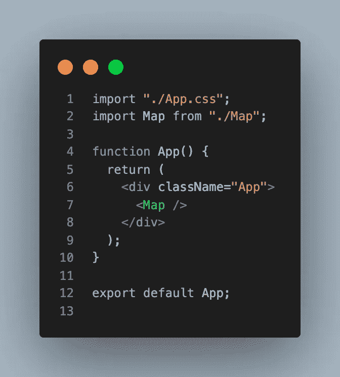
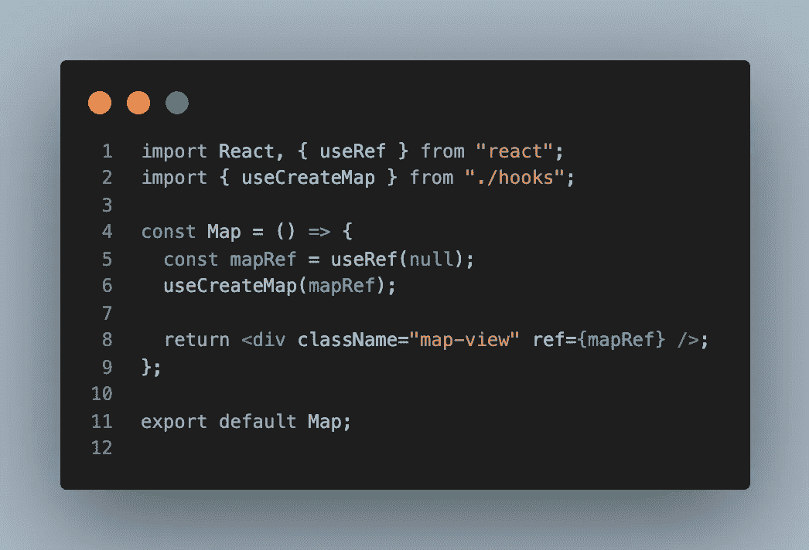
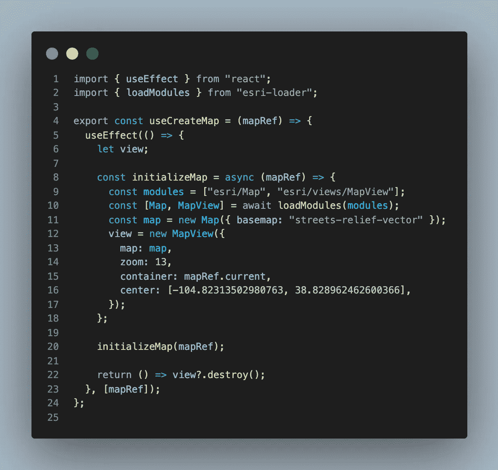

# 在 React Hooks 中构建 Esri ArcGIS 地图

> 原文：<https://levelup.gitconnected.com/building-esri-arcgis-map-in-react-hooks-fcb5d4189b42>


如果您曾经使用过 ArcGIS for JS 并浏览过它的文档，您就会知道有很多东西需要学习。值得庆幸的是，Esri 拥有杀手级的编码示例，可以让您立即开始使用 ol 的复制粘贴技巧。

然而，(我假设)为了“前端框架不可知”，似乎没有太多在 React 中构建 ArcGIS 地图的例子。

鉴于 React 的受欢迎程度和我目前作为前端开发人员处理大量 GIS 信息的工作，这成为了我的兴趣所在。

我不仅想在 React 中创建并运行地图，还想尽量避免创建 ArcGIS 地图时很容易出现的典型的巨型代码。

***解决方案:构造简单的组件，将 Esri 的业务逻辑分离到一个自定义的 React 钩子***

我们开始吧！

您需要一个 react 应用程序和 esri-loader:

```
npx create-react-app my-map
cd my-map
yarn add esri-loader
```

安装好 react 应用程序和 esri-loader 后，让我们从削减 App.js 组件开始:



超级简单。这总是好的！我们只是在 App.js 的 div 中导入并呈现地图组件。在我忘记之前，我们需要在 App.css 中添加一行代码:

```
.map-view { height: 100vh }
```

这种特殊的酱允许我们的地图 div 实际出现！

在地图上:让我们在 src 中创建 Map.jsx。为了简单起见，我们不会太关心我们项目的文件夹结构，但是您显然可以根据您自己的文件夹结构的组织偏好来修改本文。同样，另一个相当直接的组件:



需要注意的事项:

*   导入 useRef 是为了将一个 Ref 传递给包含我们的地图的 div
*   我们正在导入即将推出的定制钩子——useCreateMap
*   然后调用 useCreateMap 并接受 mapRef 作为参数
*   我们的 div 有一个利用 css 的类名“map-view”

最后，神奇的事情发生了…我们的用户创建了一个地图钩子！



快速分解:

*   我们导入并调用 useEffect 在加载时创建地图
*   esri-loader 用于异步访问 ArcGIS goodies
*   initializeMap 包含创建地图的基本 ArcGIS 代码([见文档](https://developers.arcgis.com/javascript/latest/sample-code/intro-mapview/))
*   initializeMap 是在接收 mapRef 时定义和调用的
*   作为负责任的公民，我们的目标是自己收拾行李，并计划在组件卸载时销毁地图视图

现在你知道了！启动您的应用程序

```
yarn start
```

你很快就会开始在地图上漫游了！

希望您发现这是一种通过自定义挂钩将 Esri 的 ArcGIS for JS 集成到 React 的框架中的有用方法。我继续使用这种模式来利用 Esri 微件、图层，甚至是 ArcGIS 世界中的地图事件处理程序。

让我知道它是如何为你工作的！更多的代码向你走来。干杯！