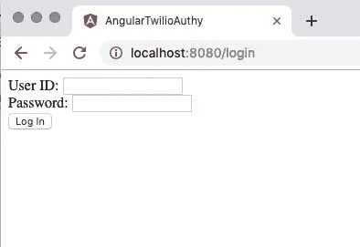
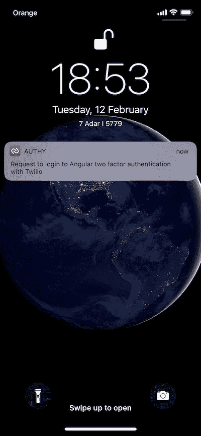
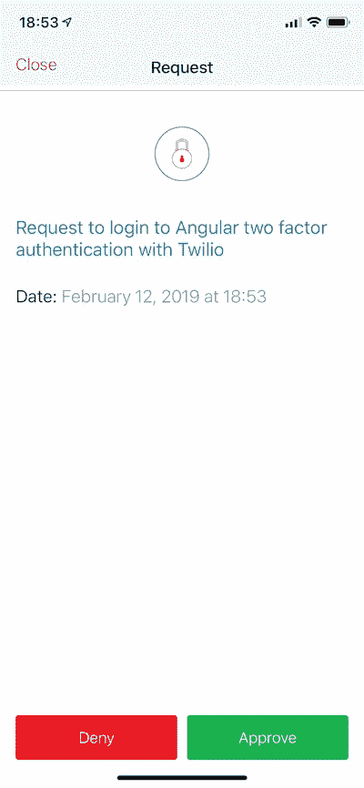
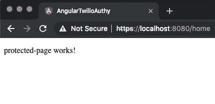
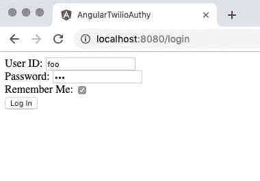
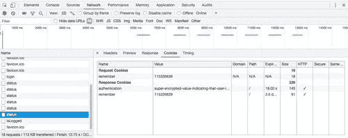
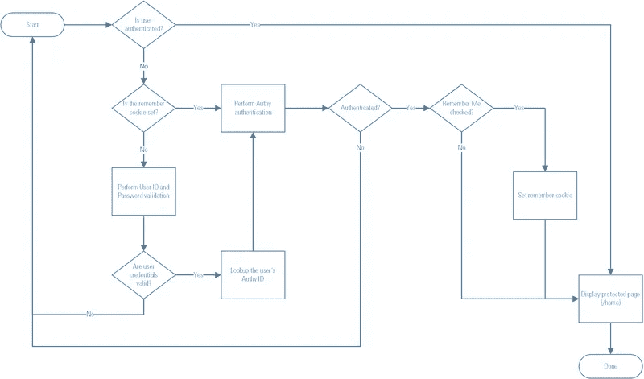

# 使用 Authy 在 Angular 应用程序中构建快速的双因素身份验证

> 原文：<https://levelup.gitconnected.com/building-expedited-two-factor-authentication-into-angular-apps-with-authy-903c182f32de>


[双因素认证(2FA)](https://www.twilio.com/docs/authy) 为 web 应用程序提供了一个重要的额外安全层，但是 2FA 要求用户在每次登录时执行一个额外的操作。对于频繁登录应用程序的用户来说，这一额外步骤可能会令人厌烦。在使应用程序方便回头客的同时，有可能保持第二个因素提供的安全性吗？就是用 Angular，Node.js，还有 [Twilio Authy](https://www.twilio.com/docs/authy) 。

在登录页面上实现“记住我”复选框是用户表明他们将成为回头客的一种便捷方式。在后台，加密的安全 cookie 是一种方便的机制，用于识别之前选中了“记住我”框并从特定机器成功登录的用户。

有了 [Twilio Authy](https://www.twilio.com/authy) 和一个加密的 cookie，比如一个 [JSON Web Token](https://jwt.io/) (JWT)，您可以让登录过程变得快速便捷，同时保持二元身份验证所提供的额外安全性。您的回头客将能够快速访问您的应用，而您的应用仍将受到 2FA 的保护，以防未经授权的访问。JWT 可以提供第三方验证的额外优势，增加额外的安全性元素。

虽然加密的 cookie 是在客户端安全存储数据的好地方，但是数据的范围应该限于用户知道的信息，如他们的用户 ID 和密码，或者与用户相关的数据，如他们的帐号和最近的订单日期。安全 cookie 不适合存放 API 密钥或用户与应用程序交互范围之外的其他敏感数据。

# 了解流程

有两种常见的方法可以缩短返回用户的登录过程:用户可以跳过输入他们的凭据(用户 ID 和密码)或跳过第二因素身份验证。在这两种方法中，跳过凭证输入是一种更安全的方法，因为它要求用户仍然拥有带有加密安全 cookie 的机器和 2FA 设备，通常是智能手机。第二种更安全的技术是本文所展示的。

确定用户登录和身份验证状态的过程涉及客户端和服务器。对于新用户，或者之前没有选中“记住我”复选框的用户，该应用程序需要创建加密的 cookie。对于在当前机器上拥有有效 cookie 的返回用户，客户机代码需要将 cookie 中的数据传递回服务器，这样服务器代码就可以确定用户 id 和密码，而不需要用户输入它们。有了用户的 ID，服务器就可以查找用户的 Authy ID 并调用 API 来启动 2FA 进程。当用户成功完成 2FA 过程时，可以创建或更新安全 cookie。

# 你将从这篇文章中学到什么

通过在这篇文章中构建这个项目，你将学会如何在 Angular Universal + Node.js 网站中添加“记住我”功能。“记住我”功能将使返回的用户能够通过在其设备上批准身份验证请求来登录应用程序；他们不需要重新输入他们的用户 ID 和密码，所以他们只需轻轻一点就可以登录。

您还将学习如何使用 cookie 来传输实现“记住我”和 2FA 所需的数据。为了使这个案例研究项目不那么复杂并且更容易理解，这个项目中的代码创建了一个明文 cookie。Cookie 加密和 JWT 实现将在另一篇文章中讨论。

# 先决条件

为了完成这篇文章中的任务，你需要:

*   [Node.js 和 npm](https://nodejs.org/)(node . js 安装也会安装 NPM。)
*   [角 CLI](https://cli.angular.io/)
*   [吉特](https://git-scm.com/downloads)
*   Twilio 账户([注册](https://www.twilio.com/try-twilio)获得[免费 Twilio 账户](https://www.twilio.com/try-twilio)。)
*   一个 [Twilio Authy](https://www.twilio.com/authy) API 密钥和一个注册用户(也是免费的，说明如下)

要从这篇文章中最有效地学习，你应该具备:

*   打字稿和 Angular 框架的工作知识
*   熟悉角度观察值、依赖注入、路由和管道

# 设置基线角度 2FA 项目

这篇文章使用了本系列上一篇文章中的 Angular + Node.js 项目:[用 Twilio Authy 在 Angular 中构建双因素认证。如果您已经从上一篇文章中成功地构建了项目，那么您可以继续使用现有的代码。](https://medium.com/javascript-in-plain-english/build-two-factor-authentication-in-angular-with-twilio-authy-b94f700d1866)

[如果你还没有构建那个项目，或者你想开始一个新的项目，你可以从](https://www.twilio.com/blog/two-factor-authentication-angular-twilio-authy) [GitHub repo 中为这篇文章](https://github.com/maciejtreder/angular-authy-remember)克隆代码。

通过在您想要创建项目目录的目录中执行以下命令来克隆它:

```
git clone [https://github.com/maciejtreder/angular-authy-remember.git](https://github.com/maciejtreder/angular-authy-remember.git)
cd angular-authy-remember
npm install
```

# 设置授权和授权用户

如果您已经从上一篇文章中完成了项目的构建，那么您可以使用 Authy application Production API 键和 Authy ID 作为您在该练习中设置的用户。

如果你重新开始，你需要设置 Authy 和一个用户。请遵循以下说明:

拥有 Twilio 帐户后，登录并导航至 [Twilio 控制台](https://www.twilio.com/console)的授权部分，然后完成以下步骤:

1.  在 Twilio 控制台的 Authy 部分，创建一个新的应用程序。
2.  将应用程序的生产 API 密钥复制到一个安全的地方。(如果您放错了，可以在应用程序的设置中找到密钥。)
3.  在您创建的应用程序中，使用您首选的电子邮件地址和手机号码将自己注册为新用户。
4.  将刚刚创建的用户的 Authy ID 复制到一个安全的地方。
5.  在手机上安装 Authy 应用程序。您应该会收到一条文本通知，其中包含获取代码以完成安装的链接。

# 将 Twilio 安全对象添加到服务器代码

打开*angular-authy-twilio/server . ts*，在下面的常量声明中用您的生产 API 键替换占位符:

```
const API_KEY = 'Production API key';
```

用您创建的用户的授权 ID 替换`authy_id`占位符:

```
authy.send_approval_request('authy id', {
```

*一旦您将您的生产 API 密钥和 authid 添加到* server.ts *文件中，* **不要将它** *签入一个公共可访问的地方，比如 GitHub 存储库。*

# 构建并测试应用程序

在命令行的 *angular-twilio-authy* 目录下运行以下指令:

```
npm run build:prod
npm run server
```

打开浏览器窗口，打开浏览器的开发者工具(F12)，然后选择网络选项卡。

导航到 [http://localhost:8080](http://localhost:8080) (或者 [https://localhost:8080](https://localhost:8080) ，如果你已经实现了 SSL/TLS)。您应该会看到*/登录*页面，如下所示:



输入凭证**用户 ID:** foo 和**密码:**栏。点击**登录。**

您应该会在与您在 Twilio 控制台的 Authy 部分为您注册的用户提供的电话号码相关联的设备上的 Authy 应用程序中收到授权请求。



批准请求。

授权后，您应该被重定向到 */home* 路径，该路径由应用程序中的授权守卫保护。(参见帖子[使用 Twilio Authy 在 Angular 中构建双因素身份验证](https://www.twilio.com/blog/two-factor-authentication-angular-twilio-authy)以了解更多关于其工作原理的信息。)



如果这个过程如所描述的那样工作，那么双因素身份验证在您的 Angular 应用程序中是有效的。

# 实现回访用户认可

授权服务`AuthService`需要根据`remember`字段的值做出不同的响应。如果值是`true`，并且用户通过了第二个认证因子，那么服务告诉服务器在 cookie 中包含`remember`字段的值。

打开*src/app/auth . service . ts*文件，用以下类型脚本代码替换`auth`和`secondFactor`方法:

加密的 cookie 是由服务器上的 */auth/status* 端点创建的，因此需要更新端点代码来生成 cookie 并设置过期时间`maxAge`，过期时间以秒为单位。

打开 *server.ts* 文件，并用以下内容替换 */auth/status* 端点的类型脚本代码:

注意在`maxAge`参数中设置的 cookie 超时相对较短，第二因子 cookie 为 1 分钟，记忆 cookie 为 5 分钟。这是因为 cookie 存在的时间足够长，即使用户注销了，您也可以看到快速的 2FA 登录在工作，但不会太长，因为旧的 cookie 一直存在，妨碍了您的端到端测试。如果您正在快速构建这个项目，您可能需要自己删除 cookie 来重置您的浏览器以进行端到端测试。

# 向登录页添加一个“记住我”控件

为了开始识别回头客，应用程序需要一种方式让用户表明他们希望被记住。除了使返回用户的登录过程更加方便之外，添加“记住我”控件还有助于符合[欧盟通用数据保护条例](https://eugdpr.org/)。

现有代码有一个`LoginPageComponent`，所以很容易添加另一个控件。

用以下 html 标记替换*src/app/log in-page/log in-page . component . HTML*中的代码:

打开*src/app/log in-page/log in-page . component . ts*文件，进行如下类型脚本修改。

将新创建的字段添加到`loginForm` `FormGroup`类初始化中:

将`remember`控件的值添加到`onSubmit()`方法中`AuthService.auth()`调用的参数中:

# 测试`remember` cookie 功能

此时，最好确保应用程序使用新的用户界面元素正确地处理输入，并正确地生成新的 cookie。

在 *angular-twilio-authy* 目录下执行以下命令行指令:

```
npm run build:prod
npm run server
```

打开浏览器选项卡。打开选项卡的开发工具(F12)并切换到网络选项卡，这样您就可以看到浏览器和 Node.js 服务器之间的通信。

导航到 [http://localhost:8080](http://localhost:8080) (或者 https，如果你已经实现了 SSL/TLS)。

你应该会看到*/登录*页面，如下所示。



输入登录凭证**用户 ID:** foo 和**密码:**栏。勾选**记住我**复选框。点击**登录**按钮，在浏览器中查看网络选项卡。当 */auth/status* 端点返回 HTTP 200 回复和`authResponse.approval_request.status`的值时，您应该会看到一系列的`status`消息。

在您的移动设备上批准 Twilio Authy 身份验证请求。在浏览器开发工具的网络选项卡中，您应该看到最后一个`status`响应包含一个 cookie，该 cookie 包含一个`authentication`字段和一个`remember`字段。

在生产应用程序中，cookie 和这些字段将被加密。在这个项目中它们是纯文本，因此您可以更容易地理解代码的行为。

`remember`字段的值是登录用户的授权 ID。虽然这个值是硬编码在 *server.ts* 文件中的，以简化这个演示项目，但是在生产应用程序中，您通常会在验证用户 ID 和密码之后，通过查询用户 ID 从持久数据存储中检索它。这可以防止在 cookie 中设置 Authy ID，除非输入了有效的用户 ID 和密码对。

因为 cookie 是`httpOnly`，所以不能从浏览器中运行的 JavaScript 访问它。因为它在生产应用程序中会被加密，所以很难在客户端机器上访问 Authy ID。客户端代码只需要知道设置了 cookie 中的`remember`字段，而不是它的值。



如果您想使用 GitHub 存储库中的代码赶上这一步，请在您想要创建项目目录的目录中执行以下命令:

```
git clone [https://github.com/maciejtreder/angular-authy-remember.git](https://github.com/maciejtreder/angular-authy-remember.git)
cd angular-authy-remember
git checkout step1
```

按照上一节*将 Twilio 安全对象添加到服务器代码*中的说明，将您创建的用户的 Authy Production API 密钥和 Authy ID 添加到代码中。

在 *angular-authy-remember* 目录中执行以下 npm 命令行指令:

```
npm install
```

按照本节开头的说明尝试“记住我”复选框功能。

# 将值传输到服务器端渲染的角度代码

您的应用程序不应该向客户端代码公开 API 密钥等生产机密。为了避免在我们的应用程序类型脚本中硬编码 Authy Production API 键，您可以使用与文章[如何在 Angular 和 Node.js 之间传输 JavaScript 应用程序中的文件和数据](https://medium.com/javascript-in-plain-english/how-to-transfer-files-and-data-between-angular-clients-and-node-js-backends-fb002ef3a1d)中相同的技术。

打开 *server.ts* 文件，找到以下类型脚本代码:

在`app.engine`方法调用中将`API_KEY`常量添加到提供者列表中，如下所示:

现在，您可以在负责在服务器端呈现内容的 Angular 应用程序部分中使用 Node.js 设置的 cookie。因为 cookie 是`httpOnly`，所以浏览器中执行的 JavaScript 无法访问它。该应用程序将检索记住的用户的 Authy ID，使用 Twilio Authy 发出身份验证请求，并通过使用 TransferState 技术将检索到的 Authy ID 提供给浏览器。(你可以在帖子里了解更多关于使用`TransferState`对象的知识:[如何在 Angular 和 Node.js](https://www.twilio.com/blog/transfer-files-data-javascript-applications-angular-node-js) 之间传输 JavaScript 应用中的文件和数据。)

打开*src/app/auth . service . ts*文件，将以下代码添加到`ìmport`指令列表中:

修改`AuthService`构造函数，用由 Node.js 提供的 Authy Production API 键注入`TransferState`对象。

用以下代码替换 *auth.service.ts* 文件中现有的构造函数代码:

`AuthService`需要一种方法来确定被记住的用户是否通过了 Twilio Authy 的第二因素验证。这个过程涉及到服务器和客户端的代码，使用一个叫做`getRememberedToken()`的`AuthService`方法。

在服务器上执行的代码调用 Twilio Authy API 并调用 Authy 身份验证过程。如果用户在他们的设备上接受 Authy 应用程序中的认证请求，那么`TransferState`对象中的`authyToken`的值将被设置为用户的 Authy ID。

如果代码在客户机上运行，则从`TransferState`对象中检索 Authy ID。

通过在类定义的底部(在最后一个`}`之前)插入以下类型脚本代码，将`getRememberedToken()`方法添加到 *auth.service.ts* 文件中:

该应用将需要一个*解析器*来实现角度`Resolve`接口。解析器截获一个链接点击，并返回一个可在调用方法的代码中使用的值或可观察值。

在这个应用程序中，`LoginResolverService`类将提供由`getRememberedToken()`方法返回的可观察值。

通过在 *angular-authy-remember* 目录中执行以下 Angular CLI 命令，生成登录解析器文件:

```
ng g s loginResolver --skipTests
```

通过用以下代码替换*src/app/log in-resolver . ts*文件的内容来实现`LoginResolverService`类:

当用户导航到*/登录*页面时，将使用解析器。

打开*src/app-routing . module . ts*文件，将以下代码添加到现有的`import`指令列表中:

用以下代码替换现有行，修改*/登录*路径的路由定义:

现在您可以重构`LoginPageComponent`类来使用解析器和第二因素认证。

用以下类型脚本代码替换*src/app/log in-page . component . ts*文件的内容:

对`LoginPageComponent`类的修改完成了许多任务:

在`LoginPageComponent`类中实现了`OnInit`接口，以支持解析器的使用。

一个`ActivatedRoute`对象被注入到`LoginPageComponent`类中，因此`authToken`的值可以从路由器数据中获得。

第二认证因素的处理被转移到私有方法`handleSecondFactor()`。

`handleSecondFactor()`接收`authService.auth()`方法的结果作为可观察值，指示第二因子请求是被授权(真)、被拒绝(假)还是超时(空)。

`handleSecondFactor()`在两个地方被称为:

1.  `onSubmit()`执行初始第一要素检查(用户 ID 和密码)。
2.  `ngOnInit()`使用解析器`LoginResolverService`提供的`TransferState`对象检查第二个因子的状态。

构建应用程序的最后一步是重构`AuthorizationService`类。

用以下类型脚本代码替换*src/app/auth . service . ts*文件中的代码:

上面的新代码添加了`pollStatus()`方法并重构了`secondFactor()`方法。

逐行检查`secondFactor`方法:

该方法返回一个可观察的。

用`timer()`方法初始化可观察对象:它将在 5 分钟内每秒发出一个值，5 分钟的限制由`take(5 * 60)`设置。

`concatMap()`将可观察对象的返回值更改为`pollStatus()`方法输出。

过滤`pollStatus()`输出以移除`pending`状态。

`map()`操作符返回一个基于认证状态的布尔值。

当`status`的值不是`true`(批准)时，该过程通过`takeWhile()`循环继续，或者直到迭代超时。

这就完成了应用程序的代码。应用程序流程如下图所示:



# 测试完成的应用程序

如果您成功地应用了所有代码更改，您应该能够看到应用程序的完整功能。

通过在 *angular-authy-remember* 目录中执行以下 npm 命令来构建并运行应用程序:

```
npm run build:prod
npm run server
```

打开一个新的浏览器标签，并打开浏览器的开发者工具(F12)。在开发者工具中选择网络选项卡。

转到 [http://localhost:8080。](http://localhost:8080.)输入您之前使用的登录凭证，并勾选“记住我”复选框。单击登录按钮。

您将在*/登录*页面上看到“等待第二个因素”,并且您应该开始在网络选项卡中看到`status`事件。

当您在设备上收到 Authy 身份验证请求时，请接受它。您将看到`status`事件结束，随后是一个`islogged`事件，应用程序会将您重定向到 */home* 路径，在那里您将看到“受保护页面工作！”消息。

刷新浏览器选项卡。因为您之前已经成功登录，已经设置了认证 cookie，所以*/登录*页面将立即开始显示“等待第二个因素”，并且网络选项卡将开始显示`status`消息。

您不需要输入用户 ID 或密码，不需要选中“记住我”复选框，也不需要单击“登录”按钮。

您应该还收到了来自设备上 Authy 应用程序的身份验证请求。批准它以完成登录序列。

就这样，您只需轻轻一点就可以登录到应用程序中！登录过程是安全的，因为只有当您在之前成功登录的设备上登录，并使用设备上的 Authy 应用程序验证自己时，登录过程才会有效。

如果您想赶上这一步，或者将您的工作与项目报告中的代码进行比较，请遵循以下步骤:

在要创建项目的目录中执行以下命令行指令:

```
git clone [https://github.com/maciejtreder/angular-authy-remember.git](https://github.com/maciejtreder/angular-authy-remember.git)
cd angular-authy-remember
git checkout step2
npm install
```

如上所述，在 *server.ts* 文件中添加您的授权生产 API 密钥和用户授权 ID。

在 *angular-authy-remember* 目录中执行以下 npm 命令行指令:

```
npm run build:prod
npm run server
```

执行*测试完成的应用*部分中的步骤。

# 使用角度和扭转身份验证的快速双因素身份验证摘要

在本文中，您了解了如何将“记住我”功能添加到 Angular Universal + Node.js 应用程序中。您还了解了如何使用 Angular `TransferState`对象和安全 cookie 来识别返回的用户。您让返回的用户只需点击 Authy 应用程序即可登录应用程序，绕过了重新输入凭据的步骤，同时保持了双因素身份验证的额外安全性。酷豆！

# 额外资源

[@angular/router](https://angular.io/api/router) API 文档，包括 Resolve 接口。

[Authy API](https://www.twilio.com/docs/authy/api) 获取 Twilio Authy 的完整 API 文档。

[jwt.io](https://jwt.io/) 了解更多关于 JSON Web Token 及其以标准格式传输数据并为 Web 应用程序增加额外安全性的能力。

*我是 Maciej Treder，请通过*[*【contact@maciejtreder.com】*](mailto:contact@maciejtreder.com)*[*https://www.maciejtreder.com*](https://www.maciejtreder.com/)*或@ maciejtreder on*[*GitHub*](http://github.com/maciejtreder)*[*Twitter*](https://twitter.com/maciejtreder)*和* [*LinkedIn*](https://www.linkedin.com/in/maciej-treder/)**

***本帖原载于* [*Twilio 博客*](https://www.twilio.com/blog/expedited-two-factor-authentication-angular-twilio-authy) *。***