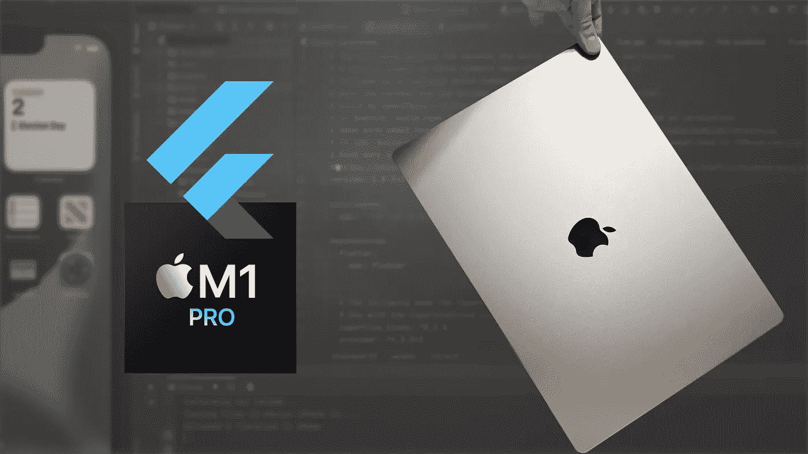
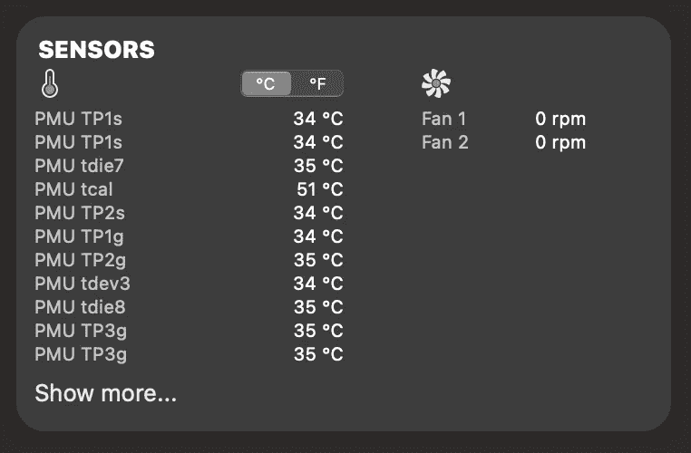
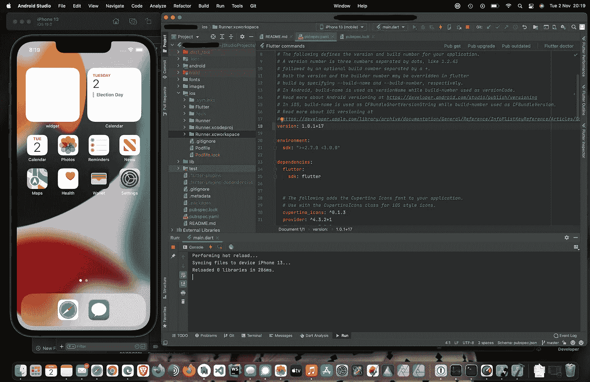
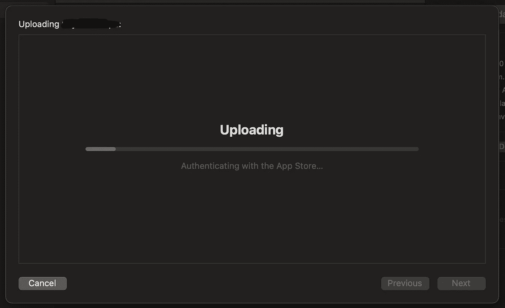
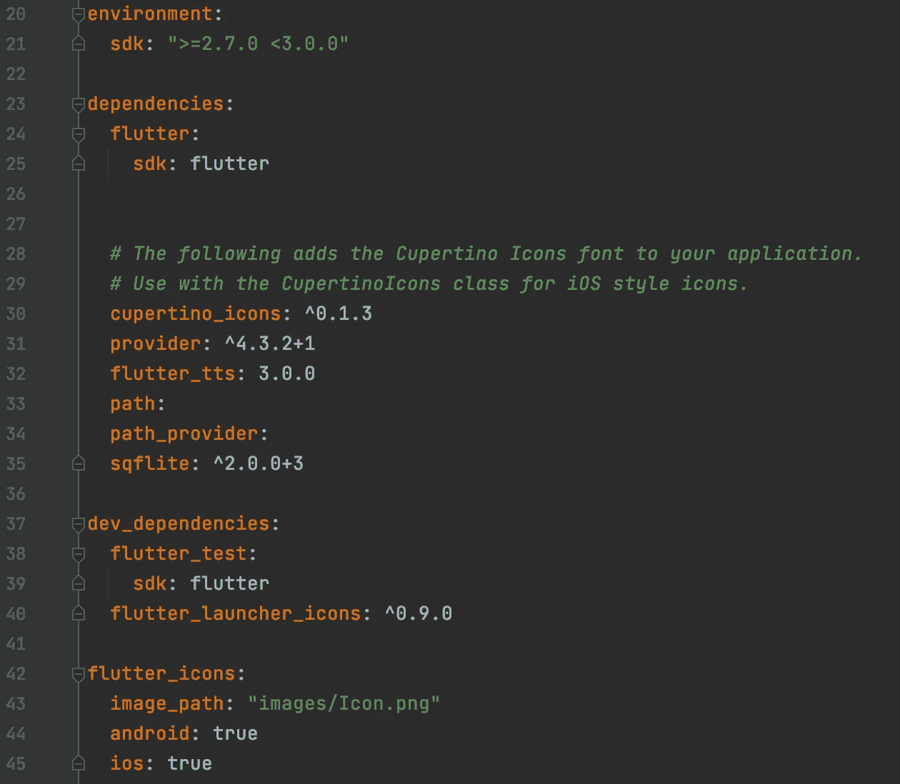
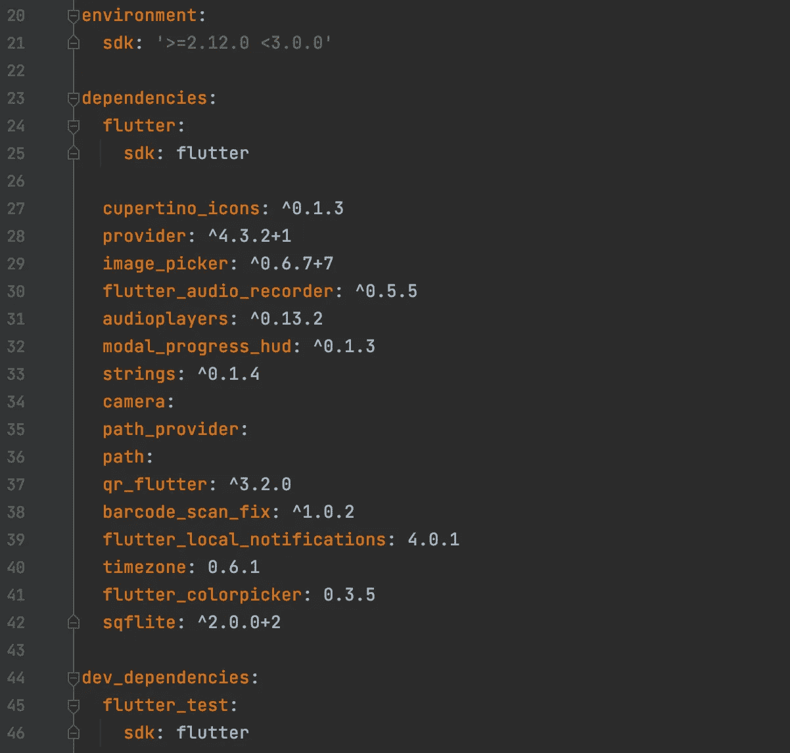
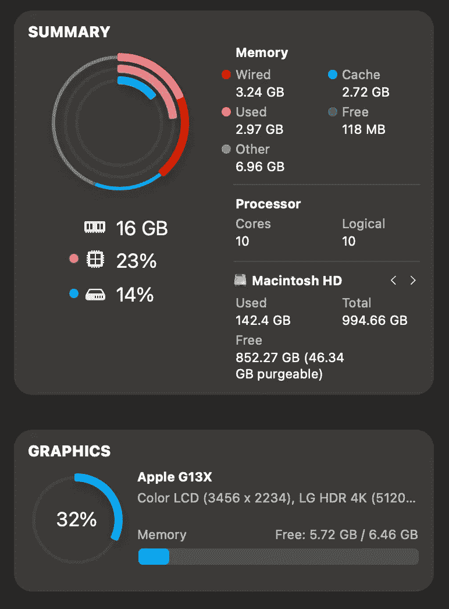

# 在 16 英寸 M1 专业版上构建颤振应用

> 原文：<https://levelup.gitconnected.com/building-flutter-apps-on-the-16-m1-pro-952d2325bbbe>



B ase 配置在某些方面，在另一些方面，没有那么多。16 寸，10 核 CPU，16 核 GPU，1TB SSD。不完全是入门级规格，但就内存而言，这是你能得到的最低内存——16GB。不是因为我便宜，而是因为**让我的钱得到最大的回报对我来说比在我的机器里塞满我永远不会利用的超级规格更有吸引力**。

**16GB 的内存也恰好是大多数人从商店拿起这台机器时会得到的内存。**因此，在更新笔记本电脑时，它会成为贵公司 it 部门的默认选择吗？我不想谈论那 1%的人购买的令人瞠目结舌的机器，而是一台可以完成工作的实用机器，大多数人都会购买。所以这里有 16GB 的内存，M1 专业版和你作为一个 Flutter 开发者可以用它做什么。

# 让我们弄清楚一些事实

这是一台又大又厚又重的机器。复古别致，但充满了漏洞，嗯，我的意思是港口。你不会在房间或办公室里一边打字一边做脚尖旋转，但是你也不会再在你的机器上烤鸡蛋了。这是一台冰冷、死寂的机器，任何颤振发展都不会改变这一点。你需要证明？给你。零转速。泽罗。相比之下，在我的 2018 年 15 英寸英特尔 i7 上，我短暂地醒来检查之前的版本，不到两分钟，我就变得很熟。我不喜欢煮熟的手指。除非他们是鱼手指。我会选择任何一天。请给我一些炸土豆条和一杯冰啤酒。



**那个 16 寸的屏幕？你需要全部 16.2 英寸的。**不是因为*【尺寸对你很重要】*，而是因为*【屏幕尺寸对你很重要】*。信不信由你，这对我也很重要。为了降低成本，你可能会选择 14 英寸。不要。如果可以，就不要做。你以后会感谢自己的。16 英寸将为您提供足够的空间，让您在没有扩展屏幕的日子里不会发疯。14 英寸会让你在 7 小时的飞行中抱怨和咒骂，你试图为你的演示组装功能原型。你不想在一个太小的屏幕上花一个多小时来展示你的想法，感到沮丧和疲惫。**这是一个漂亮的 16 英寸屏幕。你的眼睛值得拥有。它刚好适合边上有 iPhone 模拟器的 Android Studio。有了这么大的空间，您仍然可以轻松地编写代码。**



**电池是你用过的最好的。**从安装所有先决条件，如 Flutter、Dart、Android Studio，甚至 Xcode 和 OhMyZsh，设置所有路径，从 Git 中提取 repo，到安装和运行项目，开发、运行和测试，这款 16 英寸外壳的高效硬件将让您轻松度过一天。连接到 4K 显示器上，我花了三个小时消耗了 25%的电池电量。一点也不差。这意味着，一个工作日完全符合它的能力。相比之下，我的 15 英寸英特尔机器可能已经开始尖叫着要电源适配器了，不，等等，它没电了。

# 一些不可避免的打嗝…

**啊，又是那些椰子…** 正如我的语气恰当地暗示的那样，设置并非完全没有痛苦，尽管可能会更糟。[我在最初的评论中说过](/macbook-pro-2021-early-hands-on-impressions-development-and-content-creation-workflow-setup-4fc8e92f3ee2)设置 Flutter 没有带来任何问题。信不信由你，我没撒谎。声称一切都很好！阳光灿烂，疫情结束了，世界和平终于实现了。直到…这些都不是真的，我不得不运行这个项目。事实证明，当你按照 flutter doctor 的分析输出指示运行`sudo gem install cocoapods`时，安装 CocoaPods 似乎可以很好地得到它们。但这只是故事的一半。尝试运行该项目，您将最终处理一个与 [this StackOverflow page](https://stackoverflow.com/questions/66037493/pod-install-error-on-m1-mac-flutter-project-with-native-code-like-shared-prefe) 上记录的错误非常相似的错误。

这里有几个建议，一个比另一个更复杂、更详细，但最有可能的是，您真正需要做的是运行这个命令，您将变得很棒:

```
arch -x86_64 sudo gem install ffi
```

所有这一切，都是因为 Rosetta2。我想这是一个很小的代价来换取一次很棒的经历。

不过，我确实注意到了一些奇怪的事情，你可能想记在心里。例如，当将应用程序部署到 App Store Connect 时，Xcode 的用户界面似乎卡在了上传屏幕上，顺便说一句`flutter build ipa`工作得很好。



*出现了*这个关键词——我不确定我是否应该认为这是一个巧合——但这是一个奇怪的巧合，因为它确实上传了`.ipa`文件，没问题。

另一个有趣的花絮是，**看起来苹果现在正在本地机器上做一些检查，**而不是在上传后远程进行。**初始验证步骤需要大约 2-3 分钟**，而在上传后，在 App Store Connect 上，新版本立即可用，这在过去**(如 2021 年 9 月)可能需要 5-15 分钟**。

# 测试过哪些 app？

**你会很高兴地知道，我已经构建、运行和测试了不止一个，而是两个应用**，它们都不是一个简单的项目。这两个应用程序都是我目前正在开发的项目。一个即将退出测试版并在一月份上线，另一个正处于相当高级的开发阶段。只是为了让你知道这些应用程序真正的复杂程度，也许最简单，但最能说明问题的方式是两个应用程序的`pubspec.yaml`。

## 小 app:

在不提前泄露应用程序的业务逻辑或处理 NDA 噩梦的情况下，主要的技术亮点是:

*   将提供程序用于公共状态
*   依赖于用户可以保存和删除的内部 sqflite 数据库
*   将文本翻译成声音
*   有导航和模态
*   它响应迅速，具有针对移动设备和平板电脑的定制布局



## 更大的应用程序:

虽然它不会被归类为一个特别大的应用程序，但它是一个相当雄心勃勃的项目，利用了相当多的 Flutter 插件，导致了一些技术亮点，如:

*   将提供程序用于公共状态
*   允许访问设备的照片库
*   允许拍摄照片并保存
*   使用本地 sqflite 数据库来记录项目
*   播放声音
*   利用二维码生成和扫描功能
*   在设定的时间发出通知
*   允许用户自定义项目的颜色
*   使用导航和模态

不，这不是一个 Covid 疫苗接种追踪应用程序。



这第二个应用我最初有点担心。我已经有一段时间没碰它了，但这似乎并不重要。一切安装和运行良好。

我承认这些应用程序可能不会提供完全详尽的证据收集方式，所以**如果你知道一个或多个你想在 M1 Pro 上测试和审查的大型开源 Flutter 项目，请发表评论，我会尝试一下。**

# 令人瞠目结舌的表现是轻描淡写

好吧，我不得不说。令人印象深刻。我不仅仅停留在单独运行这些应用程序。我在 Android Studio 的两个独立实例中，在同一个仿真器上同时运行了它们。顺便说一下，**我正在使用 ARM64 预览版——Android Studio 北极狐| 2020.3.1 Patch 3** ，所以我预计事情只会变得更好，尽管不是他们需要的。当最终版本出来后，[我计划带着另一篇文章回来，所以请继续关注](https://attilavago.medium.com/subscribe)。在我安装、运行和构建这些应用程序的整个过程中，我没有遇到任何问题。**一次非常顺利的经历。**幸运的是，我有三合一的 MacBook Pros 可以用来比较一些东西。我将对每台机器进行总结:

*   **13 英寸专业 M1 CPU，8GB 内存** —在 Android Studio 上偶尔会有缓慢的体验，仿真器偶尔会结巴，非常安静，冰冷，电池续航时间长。
*   **15 英寸 Pro，2018 i7 英特尔 CPU，16GB RAM** —在 Android Studio 上的流畅体验，在模拟器上没有口吃，但运行多个似乎偶尔会降低机器的速度。一个非常嘈杂和热的机器，糟糕的电池寿命。
*   **16 寸 Pro，10 核 M1 Pro CPU，16GB RAM** —在 Android Studio 的多个实例上体验流畅，没有仿真器卡顿，机器死寂冰冷，电池续航时间出色。

更有趣的是，M1 Pro 是如何管理内存的。虽然它与 M1 非常相似，但在我的情况下，13 英寸 M1 上有 8GB，剩下的管理空间不多，因此不可避免地成为瓶颈。



然而，偶尔浏览一下 iStatistica，就会发现空闲内存是如何保持在 60MB 到 300MB 之间的，这很有趣。本质上，很少一部分是免费的。**也总是有相当大的一块内存为 GPU** 保留，在 5 到 6.5GB 之间，即使很少使用。为什么会这样，我还不完全确定。**其中大约 1GB 似乎被你运行的任何模拟器所使用。**非常有趣的是，打开另一个模拟器似乎不会影响 GPU 的内存消耗，如果有的话，可能会多 200MB。如果你想知道**交换内存**，它保持在 **4GB 左右**。

# 结论被高估了

我不是想搞笑…我就是搞笑。😂好吧，更严肃地说，在一台新机器上坐一天，重新创建一个人的正常工作流程，凭良心不能被认为是完全确凿的。是的，结果令人鼓舞。见鬼，他们真令人兴奋。10 核、16 英寸 M1 Pro 配有 16GB 内存和 1TB 固态硬盘**客观上是一台非常强大和节能的机器**，它很可能最终取代我的 15 英寸英特尔 i7，但我不得不提醒自己保持谨慎，因为这些新机器的真实面目将在一两个月后显现出来。**我现在已经完全转移到了 M1 Pro，所以它会受到与 15 英寸英特尔一样的打击**，打开几十个浏览器标签，打开 Android Studio，在后台忘记打开一两个模拟器，运行 Apple Music，打开照片编辑器，[运行下一个应用程序的节点服务器——很快会有更多内容](https://attilavago.medium.com/subscribe)——打开笔记，打开信号，桌面上堆满了东西， 本质上，这是一个异常凌乱的数字工作环境，让我在数周内变得手脚不灵，因为我从来没有真正关闭过应用程序或笔记本电脑，我知道你们中的许多人也没有，所以我有一个很好的公司。

# 更多来自我，关于 M1 专业

[](https://medium.com/codex/the-2021-macbook-pro-is-the-perfect-companion-for-the-airpods-max-91e4364ebb8c) [## 2021 MacBook Pro 是 AirPods Max 的完美伴侣

### 终于有一款苹果设备达到了 AirPods Max 的标准…

medium.com](https://medium.com/codex/the-2021-macbook-pro-is-the-perfect-companion-for-the-airpods-max-91e4364ebb8c) [](/macbook-pro-2021-early-hands-on-impressions-development-and-content-creation-workflow-setup-4fc8e92f3ee2) [## MacBook Pro 2021 早期动手体验、开发和内容创作工作流程设置…

### 我为新的 MacBook Pro 2021 设置了软件开发和内容创建，有趣的是…

levelup.gitconnected.com](/macbook-pro-2021-early-hands-on-impressions-development-and-content-creation-workflow-setup-4fc8e92f3ee2) [](/a-pragmatic-developers-thoughts-on-apple-s-2021-macbook-pro-189d41cb8ed8) [## 一个务实的开发者对苹果 2021 MacBook Pro 的想法

### 让我们现在就把事情解决掉。我喜欢苹果产品，而且在很大程度上，我喜欢苹果的一般产品…

levelup.gitconnected.com](/a-pragmatic-developers-thoughts-on-apple-s-2021-macbook-pro-189d41cb8ed8) 

**Attila Vago**——*高级软件工程师打造令人惊叹的 ed-tech 软件。永远的酷呆子，代码和博客的作者。网络无障碍倡导者，乐高迷，黑胶唱片收藏家。喜欢精酿啤酒！*