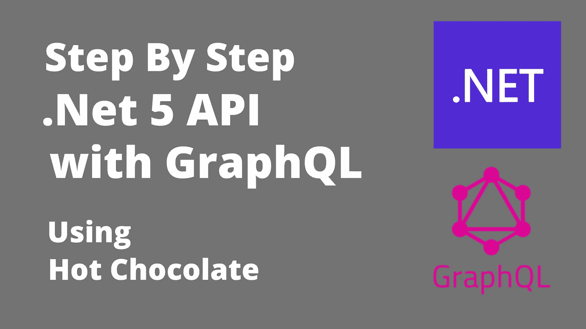

# 构建 GraphQL API。Net 5 — EF 核心和热巧克力

> 原文：<https://levelup.gitconnected.com/building-graphql-api-with-net-5-ef-core-and-hot-chocolate-ad1d2482dd69>

GraphQL-(。Net 5.0)

# 介绍

raphQL 是一种开源的查询语言，最初由脸书开发。正是在 2012 年，脸书选择修改其应用程序，以提高执行力和生产力。正是在这一点上，脸书的可移植方法由于组织的大量使用而不起作用。利用保留的增强技术可能已经改善了展示，但是由于应用是过度不可预测的，所以认为信息带来系统本身应该被改变。这是 GraphQL 的用武之地，如今它已经惊人地成为了全球先进的本地领域的主流。GraphQL 由脸书于 2012 年创建，并于 2015 年公开发布，目前由 GraphQL 基金会维护。本文分析了 GraphQL 的亮点和优点，然后展示了如何在。Net 5.0。

**涵盖的主题**

*   先决条件
*   为什么我们需要 GraphQL
*   什么是热巧克力
*   对 GraphQL 查询的深入理解
*   在中配置 GraphQL 中间件。网络 5

**先决条件**

1.  Visual Studio 2019 — [在此下载](https://visualstudio.microsoft.com/downloads/)
2.  。Net 5.0 SDK — [在此下载](https://dotnet.microsoft.com/download/dotnet/5.0)

 [## GitHub-JayKrishnareddy/graph QL _ HotChoclate _ ef core:带有 EFCIore &的 GraphQL API。网络 5

### 先决条件我们为什么需要 GraphQL？什么是 HotChocolate 对 GraphQL 查询配置的深入理解…

github.com](https://github.com/JayKrishnareddy/GraphQL_HotChoclate_EFCore) 

# 我们为什么需要 GraphQL？

*   GraphQL 是一种类似 JSON 的 API 查询语言，也是执行查询的服务器端运行时。与请求和响应由 API 定义的 REST 不同，在 GraphQL 中，客户端完全控制 API 应该返回什么数据。可以将 GraphQL 与 ASP.NET、ASP.NET 核心、Java、Python、Node.js 等集成。
*   如果您正在处理一个使用 RESTful 设计的应用程序，端点可能会持续很长时间，而跟上它们可能会变成一场噩梦。不管预期如何，使用 GraphQL，您只需要一个端点编程 *api/graphql* ，仅此而已。这是 REST 和 GraphQL 的另一个关键区别。
*   在使用 GraphQL 时，您需要更少的到工作器的往返，也就是说，您需要更少的到工作器的往返调用来获得您需要的所有信息。有了 REST，你将拥有一些端点，比如编程*API/understudes、api/educators、api/groups* 等等
*   与 REST 相反，在使用 GraphQL 时，您不会几乎什么都没有或者有很多信息——您可以描述您的问题和您需要的所有信息。
*   使用 GraphQL 时，您不需要强调过度成形。事实是，GraphQL 不需要形成，只要你不从排序中删除字段，API 的客户或购物者就不会中断。
*   就像 Swagger 为 REST 端点创建文档一样，GraphQL 也可以为 GraphQL 端点生成文档。

# 什么是热巧克力？

HotChocolate 是一个. Net GraphQL 平台，可以帮助您在现有的和新的应用程序上构建一个 GraphQL 层。hot chocolate 非常容易设置，并消除了编写 GraphQL 模式的混乱。

# 对 GraphQL 的深入理解

**模式**

GraphQL 模式是客户端可以从 GraphQL API 请求的数据的描述。它还定义了客户机可以用来从 GraphQL 服务器读取和写入数据的查询和变异函数。换句话说，您在 GraphQL 模式中指定您的客户机或应用程序 UI 数据需求。

该模式包含一个查询和变异

**查询**获取数据——就像*获取*一样在休息

**突变**改变数据——就像*删除*或*发布*一样。

有些人用查询这个词来指代 GraphQL 查询和变异。

# 配置 GraphQL 中间件

设置项目—选择空的 Asp.Net 核心项目。

图一

图二

**用于配置 EF 内核和 GraphQL 的包**

图三

创建一个空的文件夹模型，并在其中添加相应的模型和数据上下文。

图 4

使用代码优先的方法创建一个模型类来使用实体框架核心执行数据库操作

***Employee.cs***

定义这个 DatabaseContext 类中的所有类，并通过使用种子数据机制添加静态数据。

**database context . cs**

在 appsettings.json 文件中添加连接字符串

***appsettings . JSON***

在 Configure services 方法下的 Startup.cs 文件中添加 SQL server 配置设置。

***Startup.cs***

使用以下命令在 SQL server 中创建数据库和表。

1.  **Add-Migration‘Migration Name’**—在解决方案项目中创建脚本
2.  **更新数据库** —在 SQL server 中执行生成的脚本

在 SQL Server 中执行该表以检查数据

图五

现在，将添加服务，以便在其中包含我们所有的业务逻辑。

图 6

***employeeservice . cs***

***iemployeservice . cs***

在启动时添加此 Employeeservice 依赖项。ConfigureServices 方法下的 cs。

> 服务。add scoped<iemployeeservice>()；</iemployeeservice>

完成表的创建后，现在让我们一步一步地集成 GraphQL。

创建一个名为 GraphQL 的空文件夹，其中将添加查询类和变异类，以执行与其 GraphQLTypes 相关的 GraphQL 操作。

图 7

在查询和变异类中定义雇员服务

***query . cs***

***突变. cs***

**GraphQLTypes.cs**

通过使用 Hot chocolate 库调用对象类型内部的 Employee 类。

通过添加 GraphQL 模型类和 hot chocolate playground 来配置 Startup.cs 文件中的 GraphQL 中间件，该工具将有助于查询数据(GraphQL)。

***startup . cs***——最终版本

**运行项目**

将 **playground** 标签添加到 URL—[https://localhost:44330/playground/](https://localhost:44330/playground/)这个 playground 实际上会将我们带到热巧克力工具，我们可以在其中进行查询(GraphQL)。

**热巧克力平台概述**

图 8

使用查询获取所有雇员的列表

图 9

通过使用变异来创建用户

图 10

删除用户

图 11

# 结论

在本文中，我们讨论了与 GraphQl 及其用法以及与的集成相关的所有主题。Net 5.0，EF 内核执行 CRUD 操作。希望这能让你在理解和实现上有一个清晰的想法。

非常感谢阅读…！

快乐编码…！