# 使用 AWS 自动伸缩构建高可用性应用程序

> 原文：<https://levelup.gitconnected.com/building-highly-available-applications-using-aws-auto-scaling-6b3a6af2621e>

鸣谢——照片由 [RawFilm](https://unsplash.com/photos/ihMzQV3lleo?utm_source=unsplash&utm_medium=referral&utm_content=creditCopyText) 在 [Unsplash](https://unsplash.com/search/photos/wind-turbine?utm_source=unsplash&utm_medium=referral&utm_content=creditCopyText) 上拍摄

高可用性应用程序是指长时间持续运行且停机时间最短的应用程序。

这种应用的例子可以是谷歌、脸书、推特和亚马逊。

假设你喜欢写关于灵性的东西，你在一个 t2.micro 上运行一个 WordPress 博客，你注意到在晚上你有几千个访问者，而在白天，有成千上万的人访问你的网站。

这导致白天的延迟增加，需要几分钟来加载您的网站。那么，在这种情况下你能做什么呢？

似乎一个应用程序负载平衡器后面的两个 t2.micro 实例将完成这项工作。所以你就这么做了。

一周后，您注意到在夜间，一个实例足以处理负载，而另一个实例却处于空闲状态。即使您没有使用实例，也是在付费。

你会想，如果服务器的数量随着网站流量的变化而自动调整，那该有多神奇。

这正是 AWS 自动缩放允许您做的。它根据许多参数监控您的服务器，如平均 CPU 利用率、CloudWatch 事件等，并自动添加或删除实例。

使用自动缩放，您可以确保您的网站始终可供用户使用，并且您只需为您使用的内容付费。

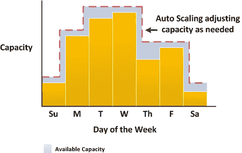

信用——aws.amazon.com

# 自动缩放的功能

1.  **更好的容错性—** 自动伸缩可以检测到实例不正常的情况，并用新实例替换它。当跨多个可用性区域(AZ)配置时，如果一个 AZ 关闭，自动扩展可以在另一个 AZ 中启动实例。
2.  **更高的可用性** —自动扩展通过保持适当的容量来确保您的应用程序始终可用。
3.  **更好的成本管理** —通过自动缩放，您只需为使用量付费。您只需为正在被利用的实例付费，并终止那些没有被利用的实例。

现在您已经了解了自动缩放及其特性，是时候学习如何配置自动缩放了。

# 创建启动配置

这是配置自动缩放的第一步。启动配置包含将通过自动缩放启动的实例的配置。

它存储像 Amazon 机器映像(AMI)、实例类型、实例细节、存储和安全组这样的信息。

首先，登录 AWS 控制台，选择 EC2 并向下滚动到左侧边栏中的**启动配置**。点击**创建启动配置**按钮。

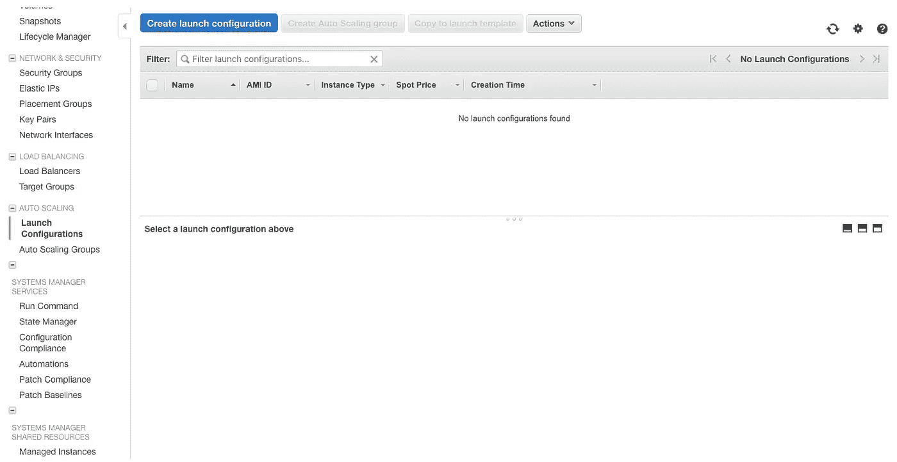

启动配置仪表板

**1** 。选择亚马逊 Linux AMI，点击**选择。**

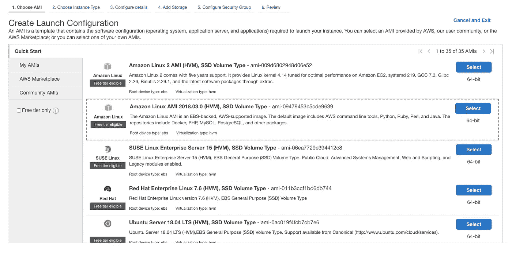

选择 AMI

**2** 。对于实例类型，选择 t2.micro 并单击**下一个**按钮。

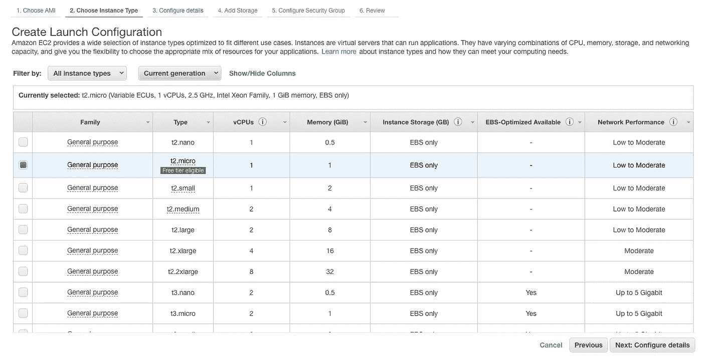

选择实例类型

**3** 。为您的启动配置命名。您还可以通过选中复选框来配置自动缩放的 spot 实例，但这里我将选择按需实例。点击**下一个**按钮。

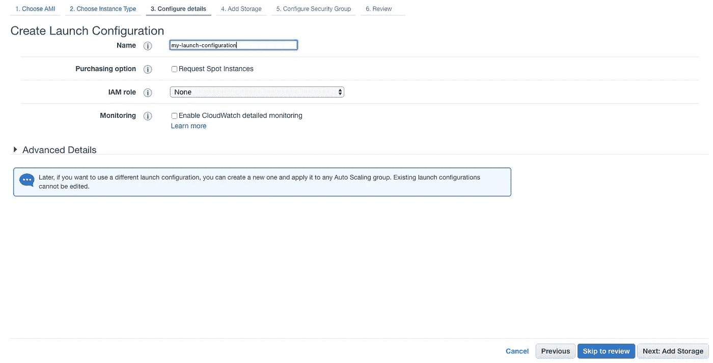

配置启动配置

**4** 。默认离开存储器，点击**下一步。**

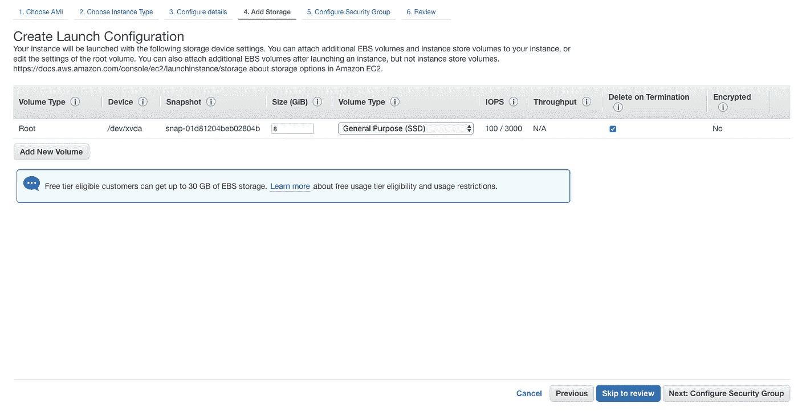

添加存储

**5** 。创建新的安全组并打开所需的端口。我在这里保留默认设置。现在点击**查看**按钮。

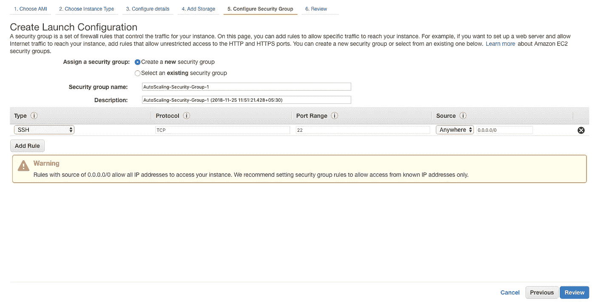

创建安全组

**6** 。查看详情并点击**创建启动配置**按钮。选择一个现有的密钥对或创建一个新的密钥对，并再次点击**创建启动配置**按钮。

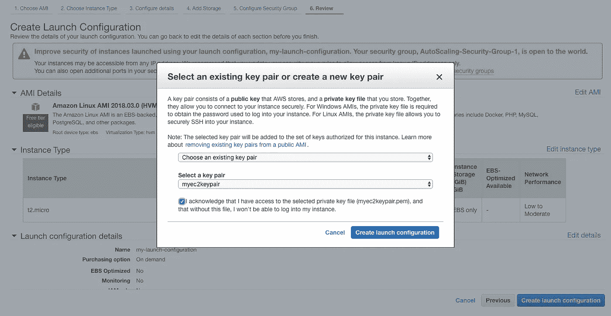

选择一个密钥对并创建启动配置

祝贺您，您刚刚创建了一个启动配置！
现在点击**关闭**并从左侧栏选择自动缩放组。

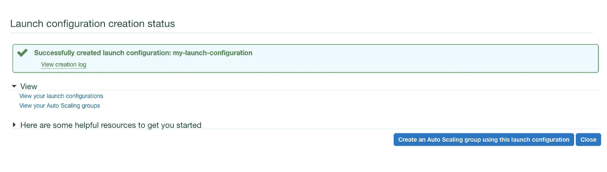

启动配置已创建

# 创建自动缩放组

这是配置自动缩放的第二步。

在自动缩放组中，您可以指定要启动的最小和最大实例数，以及启动和终止实例的阈值。

点击**创建自动缩放组**按钮。

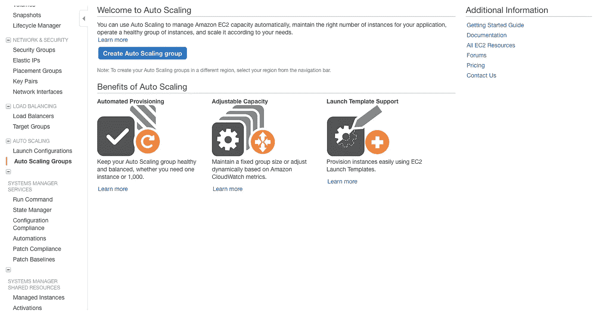

自动缩放仪表板

**1** 。选择您刚刚创建的启动配置，然后单击**下一步。**

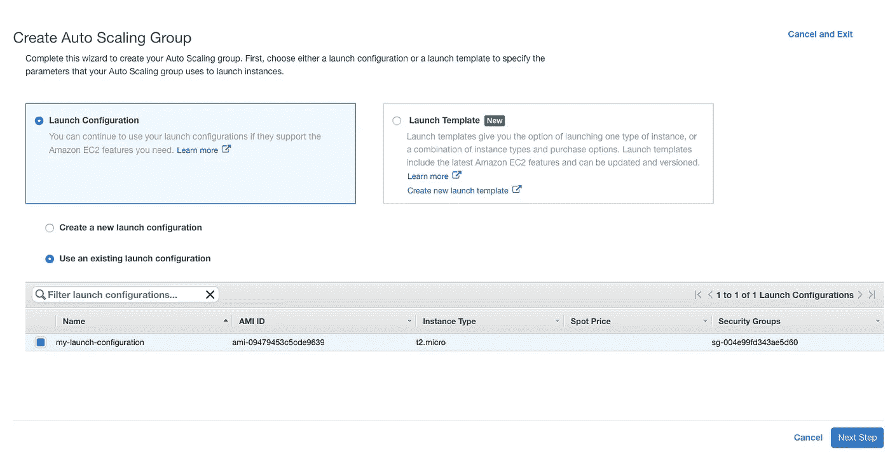

选择启动配置

**2** 。为您的自动缩放组命名。在组大小中，您可以指定组在任何时候应该拥有的实例数量。这也被称为**期望容量**。我现在将它指定为 3。

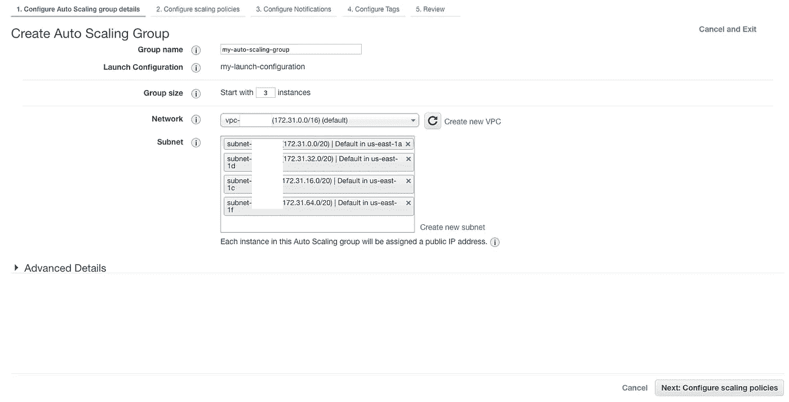

配置自动缩放组详细信息

在网络中，您可以指定您希望启动群组的 VPC。我在这里使用默认的 VPC。

在子网中，选择几个子网。这些将是自动扩展组可以启动实例的子网。

完成后，单击**下一步:配置扩展策略。**

**3** 。现在，您有两种选择，要么保持实例数量不变，要么根据扩展策略进行调整。

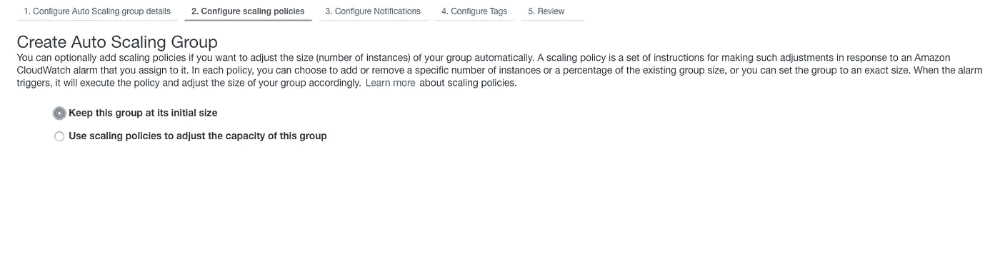

默认缩放策略

选择**使用扩展策略**选项查看更多选项。您可以指定要启动的最小和最大实例数。

## 目标跟踪缩放策略

在这里，您可以根据它们的值选择不同的度量类型和规模，比如当平均 CPU 利用率超过 75%时启动一个新实例。

在**实例需求中，**您指定实例启动后需要多长时间才能正常工作。如果您已经将实例配置为在第一次启动时运行几个脚本，这将很有帮助。

在实例准备好接受流量之前，脚本可能需要几分钟时间。

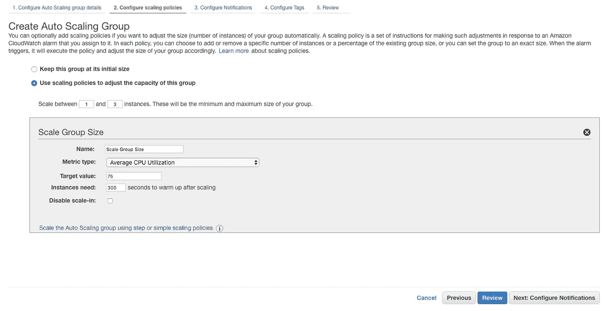

目标跟踪缩放组

## 分步或简单扩展策略

在这里，您可以使用 CloudWatch 警报来增加或减少组大小。CloudWatch 警报可以在 RAM 利用率超过 80%等事件时触发。

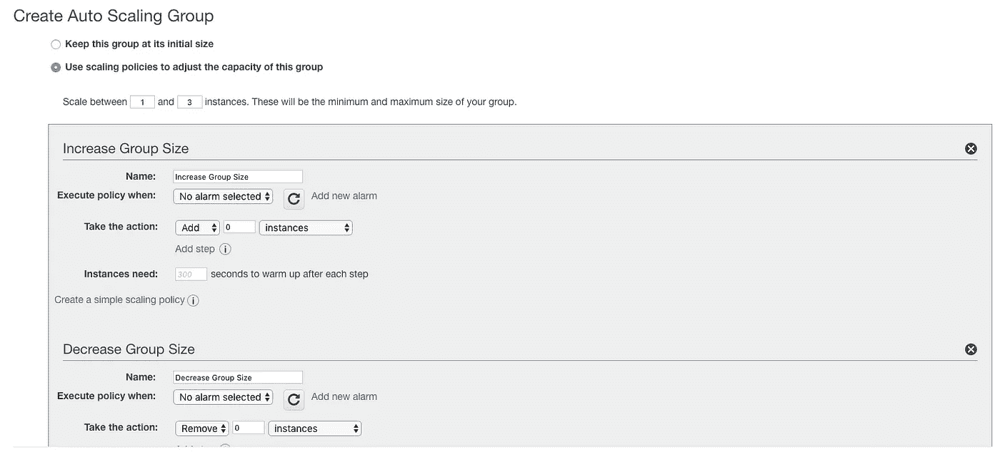

分步或简单扩展策略

我选择了**保持这个组的初始大小**选项。点击**下一步:配置通知**按钮。

**4** 。您可以将组配置为通过电子邮件接收启动、终止、启动失败和终止失败等事件的通知。

通知通过亚马逊简单通知服务(SNS)发送。

创建一个新主题，为其命名，并在**中输入您的电子邮件，在**字段中输入这些收件人。

创建群组后，您将收到一封电子邮件，要求 SNS 进行确认。单击该电子邮件中包含的链接，以接收与集团相关的通知。

点击**下一步:配置标签**按钮。

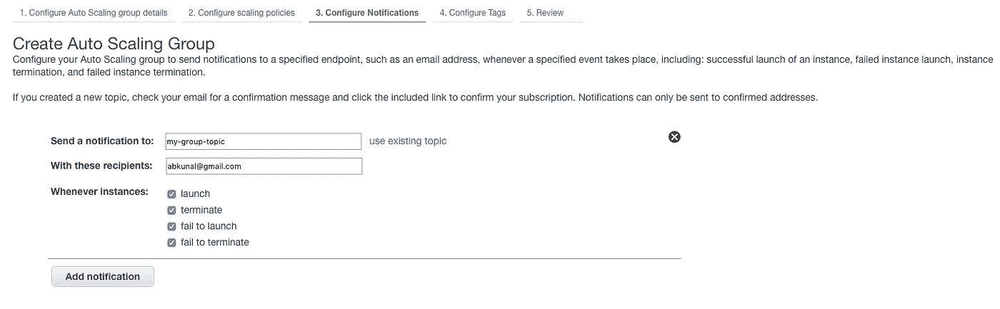

使用社交网络配置通知

**5** 。给标签加上关键字**名称**和**自动缩放实例**的值，点击**查看。**

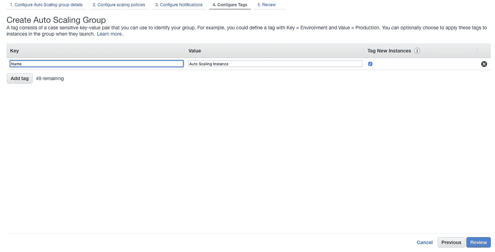

配置标签

**6** 。查看组详细信息，并点击**创建**按钮。

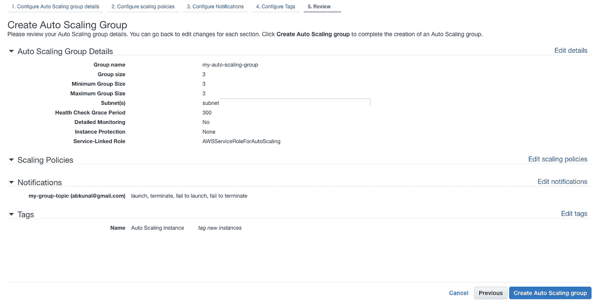

查看自动缩放组

恭喜你，你已经创建了一个自动缩放组！

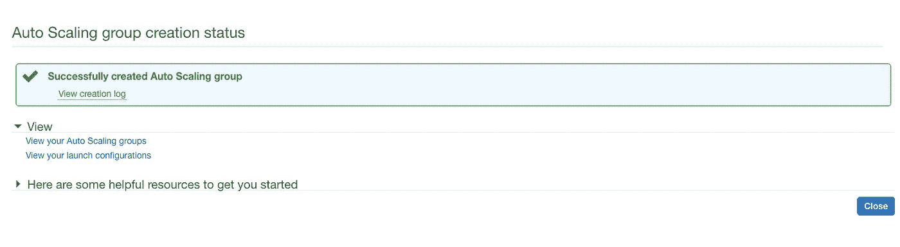

自动缩放组已创建

如果您已经使用 SNS 配置了通知，请检查您的电子邮件进行确认。

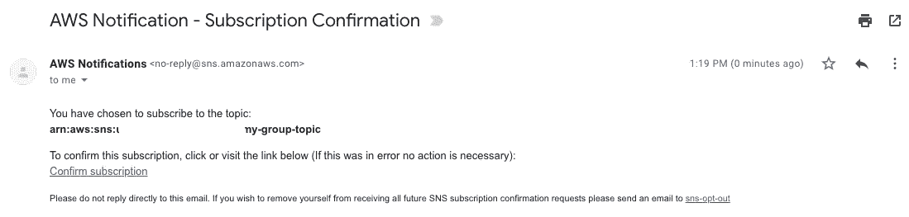

SNS 确认电子邮件

点击**关闭**并向上滚动到左侧工具条中的**实例**。您应该看到您的三个实例正在启动或运行。

现在，通过选择任意一个实例并从**动作**下拉按钮中设置实例状态为终止来终止它。

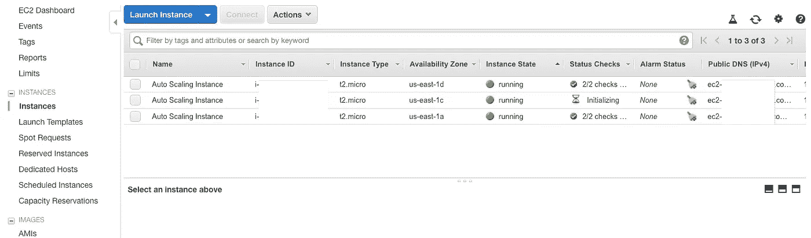

ec2 仪表板

终止几秒钟后，您应该会看到一个新实例自动启动。这是自动缩放小组的工作。

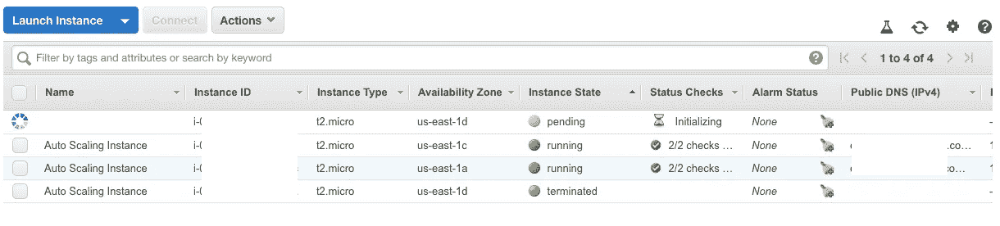

ec2 仪表板，自动缩放正在运行

我希望你从这篇文章中有所收获。如果您有疑问或问题，请评论。

**参考**
1。[亚马逊 EC2 自动缩放](https://docs.aws.amazon.com/autoscaling/ec2/userguide/what-is-amazon-ec2-auto-scaling.html)

**感谢您阅读本文。如果你喜欢它，请给一些掌声和分享，这样它就能让更多的人喜欢它！**