# 🔥使用 Web 3 堆栈构建 HOA DAO 应用程序:NextJs、ChakraUI 和 Thirdweb

> 原文：<https://levelup.gitconnected.com/building-hoa-dao-application-with-web-3-stack-nextjs-chakraui-and-thirdweb-9a9c3d586172>

你将最终理解什么是道，并且能够自己构建 web 3


# 内容

*   [**你会学到什么？**](#c9f3)
*   [**词汇**](#03b5)
*   [**简介**](#9a98)
*   [**概念验证**](#40c5)
*   [**创建自己的加密货币**](#146f)
*   [**建筑贵道智能合同**](#3b58)
*   [**编码 HOA 刀网 3 应用**](#5f58)
*   [**Github 链接**](#6fa2)
*   [**结论**](#20db)
*   [**了解更多**](#9667)

# 你会学到什么？

*   如何创建自己的加密货币；
*   如何使用加密货币构建 DAO web 3 应用程序；
*   如何用 NextJs 构建 Jamstack 应用；
*   使用 ChakraUI 创建没有 CSS 的布局是多么容易；

[](https://easy-web.medium.com/membership) [## 通过我的推荐链接加入 Medium 维塔利·舍甫琴科

### 作为一个媒体会员，你的会员费的一部分会给你阅读的作家，你可以完全接触到每一个故事…

easy-web.medium.com](https://easy-web.medium.com/membership) 

# 词汇表

*   [](https://www.bankrate.com/real-estate/what-is-an-hoa/#:~:text=An%20HOA%2C%20or%20homeowners%20association,that%20oversees%20the%20HOA's%20management.)**——是房主协会。换句话说，这群房主承担了管理社区的责任。他们提供社区中的限制和规则，并拥有满足社区需求的预算。**
*   **[**道**](https://cointelegraph.com/decentralized-automated-organizations-daos-guide-for-beginners/what-is-decentralized-autonomous-organization-and-how-does-a-dao-work#:~:text=A%20decentralized%20autonomous%20organization%20(DAO,and%20managed%20by%20their%20members.) —去中心化的自治组织。区块链应用程序通过参与者之间的共识自动做出决策。通常以加密货币的价值拥有国库。**
*   **[**NextJs**](https://nextjs.org/) —允许您使用 React 构建服务器端渲染和静态 web 应用程序的 Js 框架。**
*   **[**ChakraUI**](https://chakra-ui.com/) —组件库给你构建 React 应用的积木。**
*   **[**Thirdweb**](https://thirdweb.com/) —用于构建智能合约的 SDK，拥有大量现成的合约，如集合、令牌，当然还有 DAO。**

# **介绍**

**最近我收到了 HOA 的通知:**

> **你每月的 HOA 付款增加了 20 美元，以满足社区项目的需要**

**我的心碎了💔因为多重原因:**

*   **我不知道我们到底有什么项目；**
*   **预算及其在项目间的分配缺乏透明度；**
*   **甚至没有人问我是否可以接受。**
*   **但最可怕的原因是多了 20 美元，一年减 240 美元，或者 100 年减 24000 美元，这是一大笔钱。尤其是当你打算长寿的时候🤷‍♂️.**

**当然，你可以更积极，加入董事会，讨论提案和决定。当然，这可能行得通，但是仍然缺乏透明度，因为钱是从所有房主那里收取的。因此，在一个纯粹的民主社会中，他们都必须参与决策，甚至参与提出建议。**

**等一下，还有刀这种东西。分散自治组织有:**

*   **带密码的金库；**
*   **共识决策流程，能够设定投票值(对理事会参与者而言，投票值可以更高)；**
*   **每个人都可以提出建议；**
*   **如果建议被接受，资金可以通过区块链交易自动分配；**

# **概念证明**

**我已经深入挖掘了我们 HOA 刀必须具备的可能性和特点，让我们列举其中的几个:**

*   **每个人都应该能够创建一个提案；**
*   **提案必须有截止日期；**
*   **将有 3 种投票类型:赞成、反对和弃权；**
*   **投票后，用户不能使用同一个钱包 id 投票；**
*   **如果共识被存档，则提案可以自动执行；**

**让我们来看看最终产品是什么样的:**

**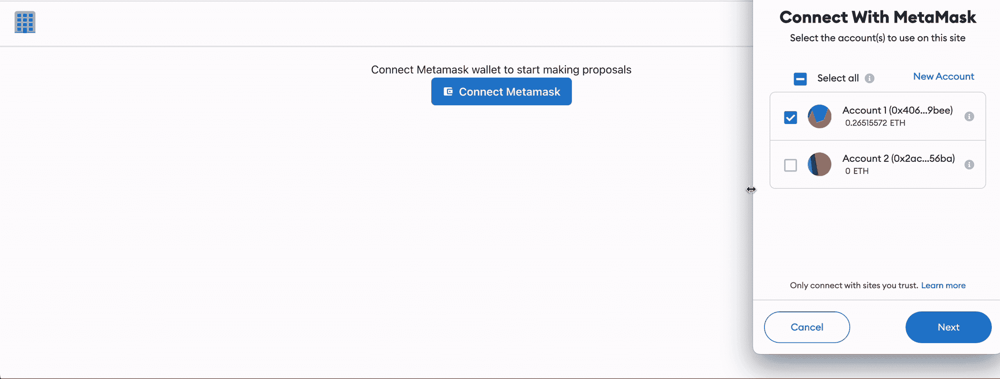**

**让我们开始营造这种美感👧**

# **创造你自己的加密货币**

**如果你还没有设置好你的 [**元蒙版**](https://metamask.io/) ，那就先做吧。我们会用到 Rinkeby 测试 [**网络**](https://www.rinkeby.io/#stats) ，所以别忘了弄点 [**龙头**](https://rinkebyfaucet.com/) (测试 ETH)。**

**让我们得到一些钱💰**

**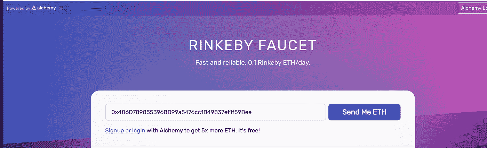**

**如果你能以同样的方式赚到真钱，那就太酷了。**

**现在，让我们转到第三个 web[](https://thirdweb.com/)**并部署我们的第一个契约——这将是治理令牌。它只是一种加密货币，参与者将使用它来管理我们的 HOA 道国库(预算)，并且它将用于投票。转到仪表板，点击`deploy new contract`。****

****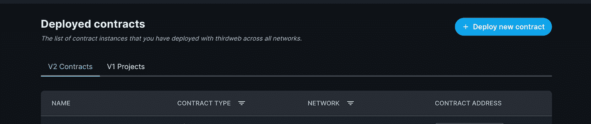****

****找到名为 token 的合同，点击`Deploy now`按钮****

****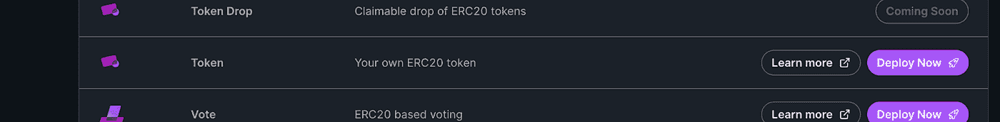****

****现在让我们调整一些设置****

****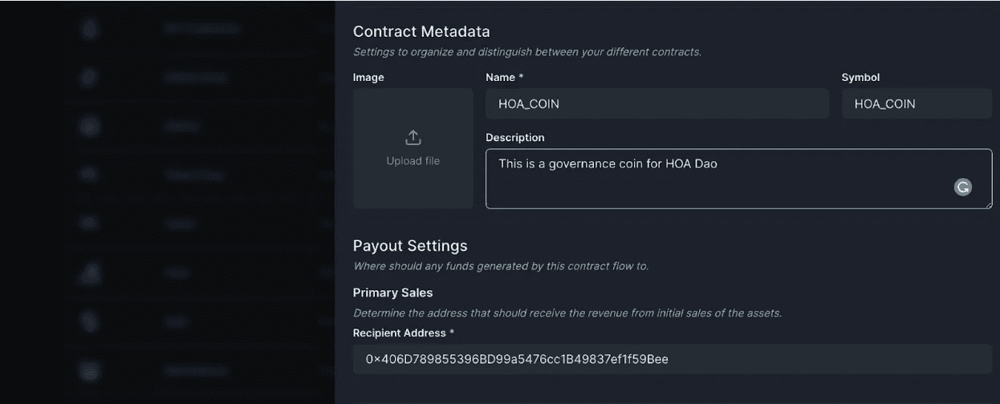********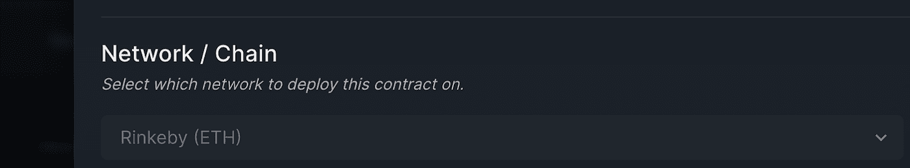****

*   ****名称和符号— HOA 硬币****
*   ****说明:这是 HOA 道的治理币****
*   ****网络:Rinkeby****

****现在扣动扳机，点击`Deploy`****

****我们的 HOA 硬币诞生了****

****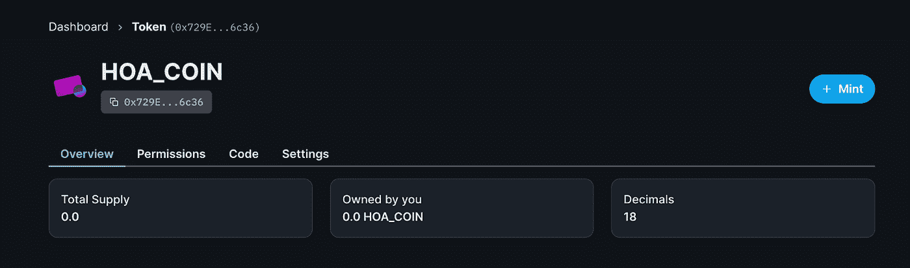****

****我们可以铸造第一个密码，从 1000 个开始😜****

****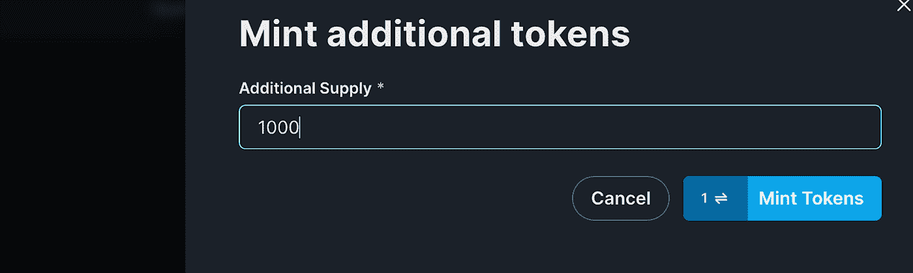********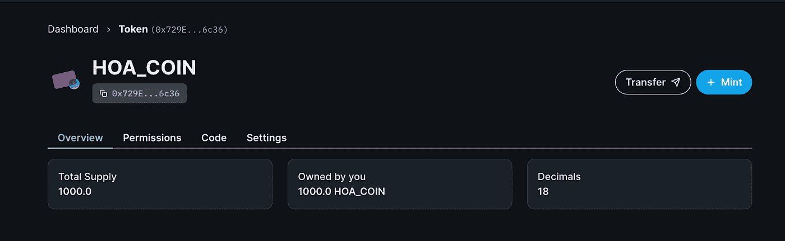****

****祝贺🎉我们现在有钱了，我们甚至可以在 **metamask** 钱包里看到我们的密码。单击导入令牌:****

****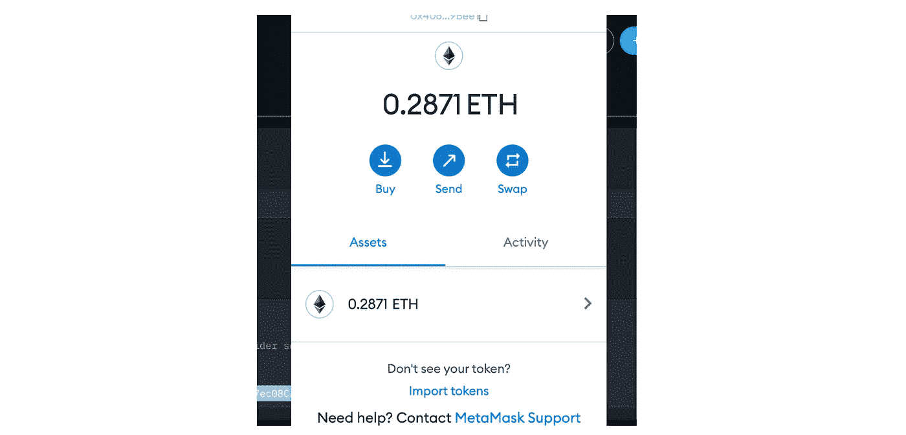****

****这里我们需要粘贴 HOA _ 硬币令牌地址，我们可以从合同设置中复制它:****

****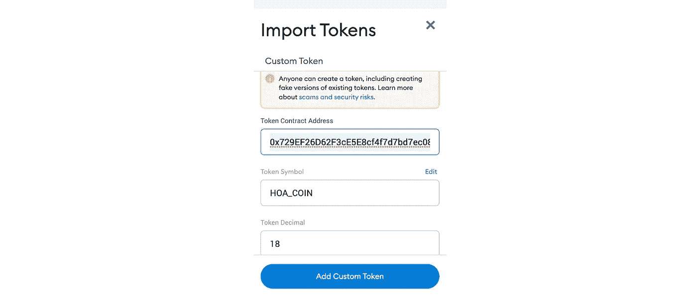****

****酷，神奇的事情发生了，我们可以看到我们钱包里的加密货币的数量****

****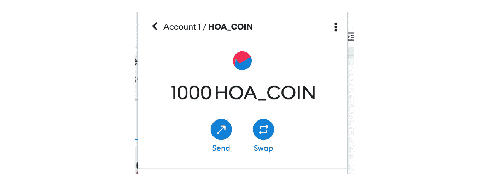****

****我们包装了加密货币，现在拥有一些资产。下一步，我们将启动我们的 DAO 项目，并使用硬币作为 web 3 应用程序的货币。****

# ****构建您的 DAO 智能合约****

****我们现在有一些虚拟货币，是时候花一点了。我们将创建 HOA 道，在那里我们将管理我们的 HOA 币预算。****

****让我们再次打开第三个 web 仪表板，并创建一个**投票** **合同。**点击`Create new contract`****

****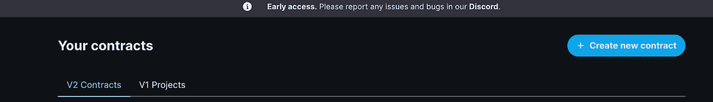****

****还有`Deploy Now`****

****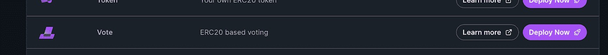****

****为了继续创建投票契约，我们需要复制令牌契约地址。打开`Code`标签就能找到****

****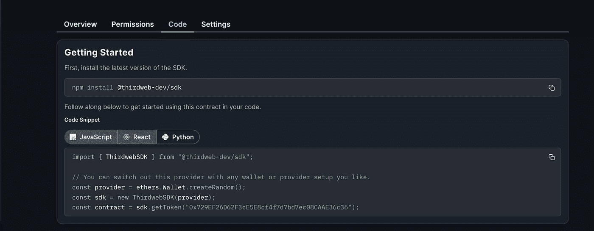****

****现在让我们在投票契约中进行一些设置:****

****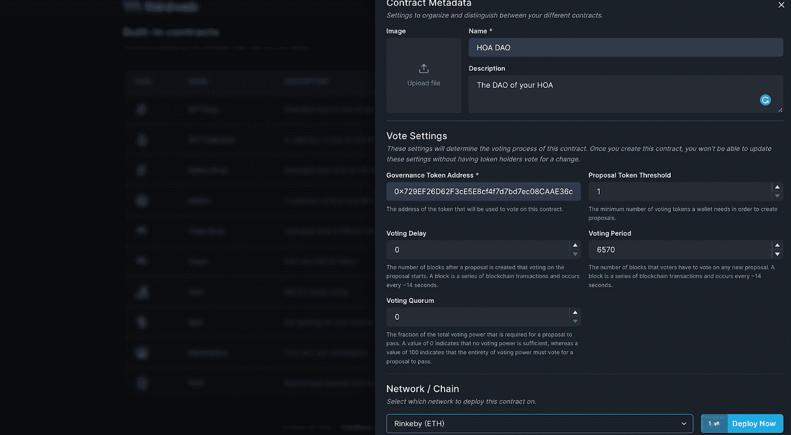****

*   ****姓名:道；****
*   ****描述:你 HOA 的刀；****
*   ****治理令牌地址:(令牌契约的地址)；****
*   ****网络 Rinkeby(以太坊测试网)；****
*   ****投票期——6570。*提案创建后，会员有多长时间可以投票？我们将它设置为 1 天= 6570 块*****
*   ****投票延迟— 0。*创建提案后，成员何时可以开始投票？现在，我们立即将它设置为 0。*****
*   ****投票法定人数— 0。*在建议时间结束后，需要投票支持建议有效的总供应的最小百分比。*****
*   ****建议令牌阈值— 1。允许用户创建建议书所需的最少令牌数是多少？如果设置为 0。这意味着允许用户创建提案不需要令牌。****

****Sweet 我们创建了 HOA 道，下一步，我们将开始编写 web 3 应用程序。****

****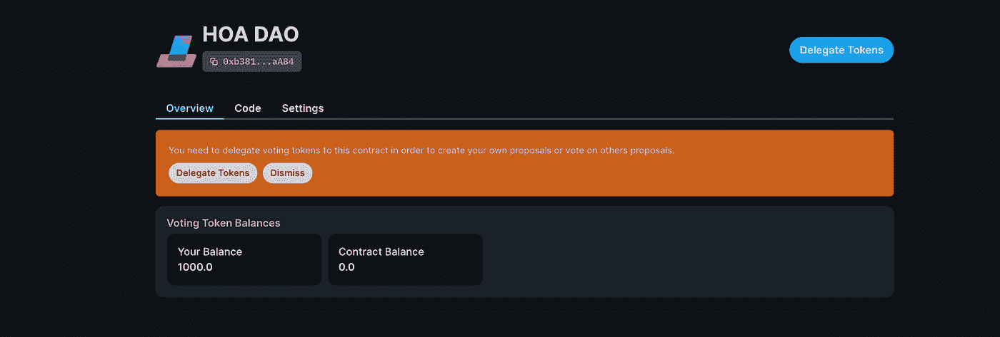****

# ****编写 HOA 道 web 3 应用程序****

****我们现在正处于发展中最有趣的部分。这里我们开始使用 NextJs、React 和 ChakraUI 构建应用程序。首先，我们正在建立项目。****

```
**yarn create next-app --typescript
>What is your project named? next-hoa-dao**
```

****然后让我们添加几个依赖项****

```
**yarn add @thirdweb-dev/react @thirdweb-dev/sdk ethers @chakra-ui/react @emotion/react@^11 @emotion/styled@^11 framer-motion@^6 react-icons**
```

****它包括 Thirdweb SDK 和 ChakraUI 软件包。****

****好了，编码时间，我们走🏃****

****我们可以从创建两个配置文件开始，这两个文件将存储我们的常量，包括合同地址****

```
**next-hoa-dao-app/pages/config/constants.ts**
```

```
**/Users/vitaliishevchuk/Documents/projects/next-hoa-dao-app/pages/config/contracts.ts**
```

****看起来不错，接下来我们开始工作，我们的组件****

```
**next-hoa-dao-app/pages/_app.tsx**
```

****我们还没有`MainLayout`，让我们创建`components`文件夹并在那里设置它:****

```
**next-hoa-dao-app/pages/components/MainLayout.tsx**
```

****我们还缺少`CreateProposalButton`和`ConnectMetamaskButton`，让我们创建它:****

```
**next-hoa-dao-app/pages/components/CreateProposalButton.tsx**
```

```
**next-hoa-dao-app/pages/components/ConnectMetamaskButton.tsx**
```

****接下来我们需要做的是我们的提议组件，我们称之为`ProposalList`。****

```
**next-hoa-dao-app/pages/components/ProposalList.tsx**
```

****最后，我们的主页，位于这里****

```
**next-hoa-dao-app/pages/index.tsx**
```

****差不多就是这样，如果你完成了教程并达到了这一步，你就是一个英雄。您可以通过下面的 Github 链接下载并自己玩这个项目:****

# ****Github 链接****

****[](https://github.com/Vitashev/next-hoa-dao-app) [## GitHub-Vitashev/next-Hoa-Dao-app

### 这是 DAO Web 3 应用程序的演示，来自教程 Easy Web First，run the development server: Open…

github.com](https://github.com/Vitashev/next-hoa-dao-app)**** 

# ****结论****

****希望这不会太让人受不了。这里的关键要点是，区块链可以用于决策过程，丰富管理和民主。您还了解了将帮助您建立自己的自治组织的工具。如果你想给花在本教程上的努力加分，请与鼓掌者分享一些爱❤️👏并关注我的未来内容。****

****[](https://easy-web.medium.com/subscribe) [## 每当维塔利·舍甫琴科发表文章时，就收到一封电子邮件。

### 每当维塔利·舍甫琴科发表文章时，就收到一封电子邮件。通过注册，您将创建一个中型帐户，如果您还没有…

easy-web.medium.com](https://easy-web.medium.com/subscribe)**** 

# ****了解更多信息****

****[](/building-the-nft-instagram-app-with-react-and-thirdweb-d6266c925b32) [## 🥺用 React 和 Thirdweb 构建 NFT Instagram 应用

### 为网络的未来做好准备，或者从 NFT 的炒作中分得一杯羹😜

levelup.gitconnected.com](/building-the-nft-instagram-app-with-react-and-thirdweb-d6266c925b32) [](https://itnext.io/top-3-web-3-0-architecture-layers-explained-frontend-backend-and-data-e10200f7fc76) [## 解释了 Web3 架构的顶层:前端、后端和数据

### Web 3.0 架构可能会令人困惑，但我们会让理解变得清晰

itnext.io](https://itnext.io/top-3-web-3-0-architecture-layers-explained-frontend-backend-and-data-e10200f7fc76) [](https://itnext.io/top-18-web-3-0-trends-every-frontend-developer-has-to-follow-in-2022-2861f9b63627) [## 🔥2022 年每个前端开发人员都必须遵循的 18 大 Web 3.0 趋势

### 这个列表将展示 Web 3.0 可以带来的新机会，并可能激发下一个百万美元的想法。😜

itnext.io](https://itnext.io/top-18-web-3-0-trends-every-frontend-developer-has-to-follow-in-2022-2861f9b63627)****