# 构建 Jason Chess —第 1 部分:渲染棋盘和棋子

> 原文：<https://levelup.gitconnected.com/building-jason-chess-part-1-rendering-the-board-and-pieces-b6cc039b8433>

## 一个正在进行的关于建立一个名为 Jason Chess 的 React 应用程序的系列，如果你的名字是 Jason，你就不会输。

# 这都是什么？

由于隔离，我对象棋上瘾了。我喜欢随机机会在游戏中扮演的小角色。相反，更好的球员是通过几个小时的痴迷学习表现出来的。越来越擅长国际象棋已经从我周围崩溃的世界中转移了很大的注意力，哈哈。

作为一名工程师，我的工作是构建问题的解决方案，对吗？没错。好吧，我会找出存在的一个问题:每当我下棋输了。解决这个问题是我的工作。我的解决方案是:杰森·切斯。

杰森国际象棋是一种国际象棋，如果你的名字是“杰森”，你就不会输。

本博客将跟踪杰森·切斯的发展。我的目标是给你提供一些有指导意义的东西，或者至少，我希望你能在这个想法中找到一些幽默。

我是一个初级开发人员，所以请原谅我的不精确。如果您有任何反馈，请评论或发邮件至`jason.melton2@gmail.com`给我。

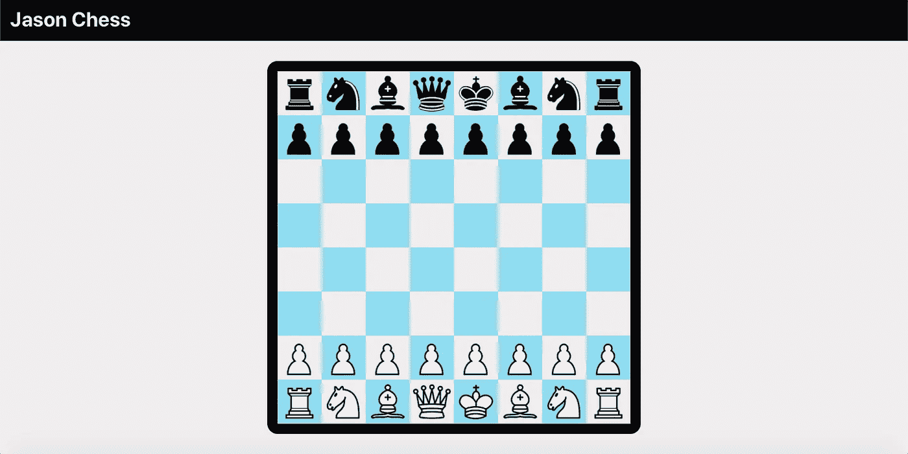

> [*跳转到 GitHub*](https://github.com/cooljasonmelton/jason-chess)

# 呈现棋盘和棋子

## 目录

*   初级垃圾
*   基本布局和菜单
*   渲染电路板
*   渲染作品
*   结论

## 初级垃圾

为了让这个坏男孩开始，我设置了一个 create-react-app，删除了默认垃圾，并创建了一个 GitHub 库。在继续之前，我花了一些时间做计划。我喜欢按计划写作，所以我会在自述文件中保留一些注释，直到项目完成。

我把工作分成两部分:逻辑和渲染——非常类似于前端和后端的划分。然而，在这种情况下，我不会有一个真正的后端。

棋盘的逻辑将是一个由八个数组组成的数组。每个数组的长度为 8，代表棋盘上的 64 个空格。棋子将用两个字符串编码。

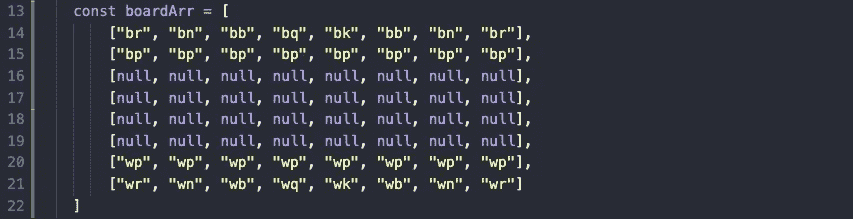

渲染将包括将`boardArr`映射到相应的组件中。

## 基本布局和菜单

现在，我将保持页面简单。将有两个主要元素:棋盘和菜单。

稍后，我还会在上面和下面添加一个框，用于输入玩家的姓名。记住，如果你输入“杰森”这个名字，你就不能被将死。

我从[Coolors.co](https://coolors.co/0a090c-f0edee-07393c-2c666e-90ddf0)中挑选了一些颜色，并给`App`组件添加了高度和宽度。我还创建了一个名为`.cfb`(代表 center flex box)的类，我用它在整个项目中居中放置东西。

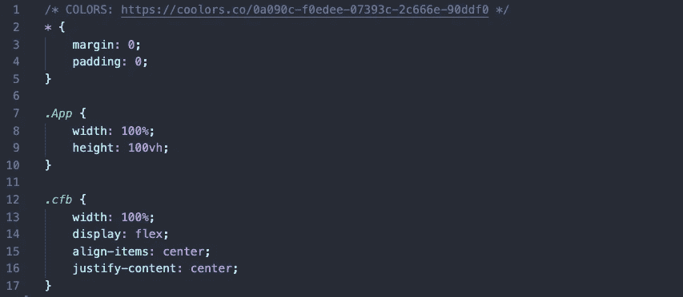

菜单是一个简单的组件，`Navbar`:

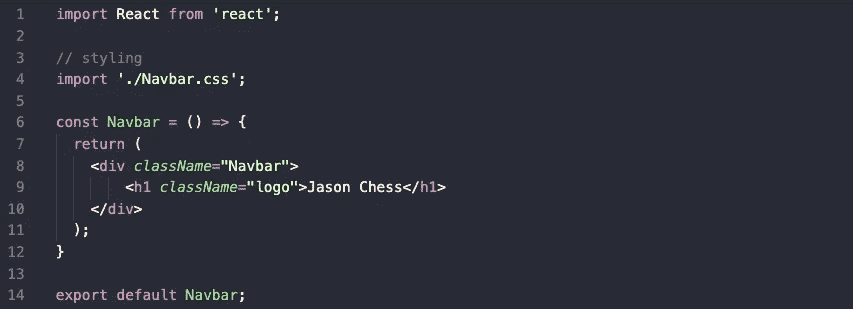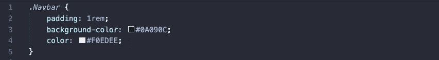

我将在接下来的两节中介绍棋盘。

## 渲染电路板

我对棋盘的计划是这样的:我将把我的`boardArr`映射成 64 个 div，这些 div 将使用 CSS 网格均匀显示。

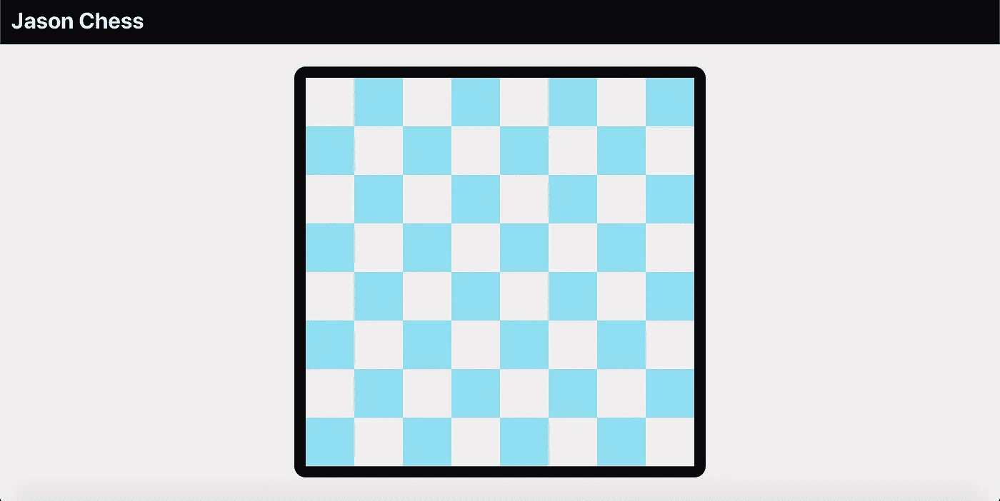

我将展示整个`Board`组件和 CSS 文件，并解释我的工作:

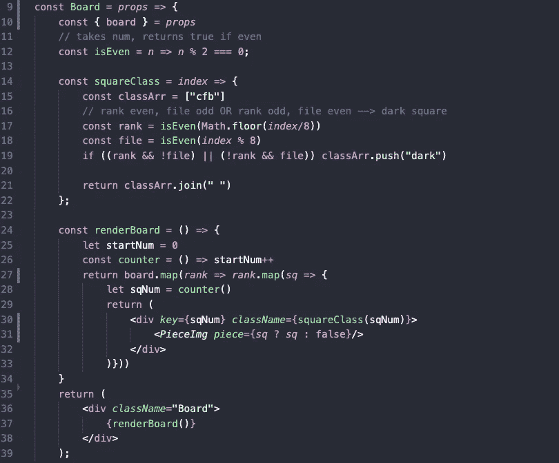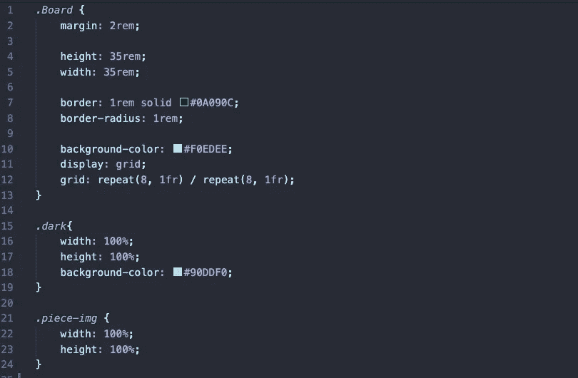

`Board`得到了`boardArr`作为道具。函数`renderBoard()`映射`boardArr`的每个等级，然后每个等级的每个方块返回一个 div。这样我们就能拿到 64 分。

我使用函数`squareClass()`来确定每个方块的类名。亮方块得到一类`cfb`，暗方块得到一类`cfb dark`。如前所述，`cfb`添加了一个居中的柔性框，`dark`添加了一个浅蓝色的背景色。

`squareClass()`也决定了哪些方块是暗方块。我使用助手函数`isEven()`来做这件事。从 0 开始，偶数行和奇数列是暗的，而在奇数行，偶数方块是暗的。我找到每个方块的等级和文件，并将`dark`添加到适当的 div 中。

## 渲染作品

我分两步渲染这些作品:

1.  我创建了一个可以通过对象访问的图片库。
2.  我创建了一个动态函数，为`boardArr`中的字符串代码插入正确的图像。

我为棋子 SVG 找到了这个伟大的[站点](https://commons.wikimedia.org/wiki/Category:SVG_chess_pieces)。我将这些图片放在一个文件夹中，并创建了一个名为`index.js`的文件。在那里，我创建了一个名为`pieceObject`的对象，它根据与数组中的字符串代码相对应的键来访问图像。

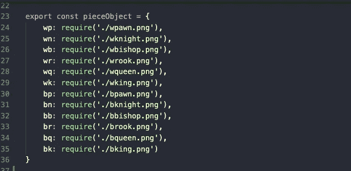

接下来，我将这个对象提供给一个名为`PieceImg`的组件。

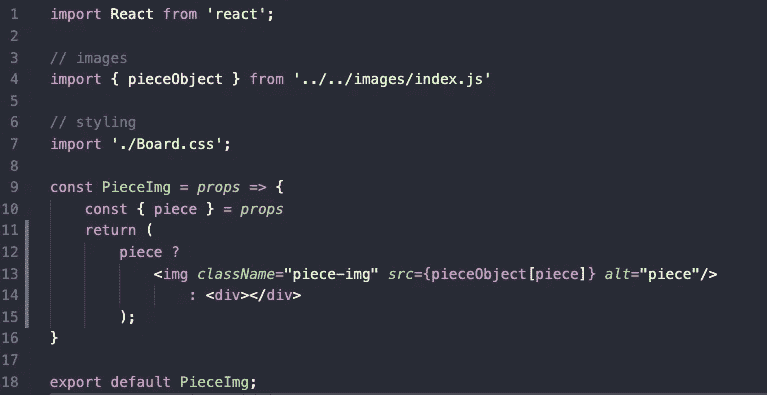

`PieceImg`拿道具的棋子将是一个代码，就像`bp`代表黑色棋子或者`wn`代表白色骑士。`pieceObject`查找相应的图像。同样，如果方块上没有块代码，`piece`将指向`false`，我将返回一个空的 div。

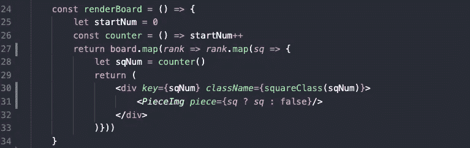

再看一下`Board`中的`renderBoard()`功能。在这里你可以看到`PieceImg`正在被喂一个片码或者`false`的道具。

## 结论

非常感谢你的阅读。我再次假设有一些很好的方法来制作象棋游戏。我想出了这个办法，并磨出了虫子。我相信有更好的方法，所以我喜欢你的反馈。请给我留言或发邮件。

这将是一个正在进行的项目，所以我可能会与博客不一致，但我感谢你阅读。

最好的，杰森