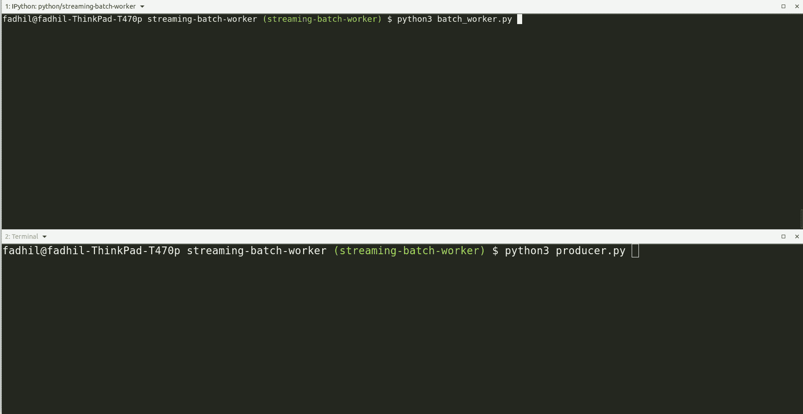

# 用 Python 构建 Kafka 兼容的流和批处理工作器

> 原文：<https://levelup.gitconnected.com/building-kafka-compatible-streaming-batch-workers-in-python-8762ef769974>

## 构建一个具有正常关机能力的可靠的工作器

本文原载[此处](https://www.fadhil-blog.dev/blog/streaming-batch-worker/)。


由[Isis frana](https://unsplash.com/@isisfra?utm_source=medium&utm_medium=referral)在 [Unsplash](https://unsplash.com?utm_source=medium&utm_medium=referral) 上拍摄

# 什么是工人？

worker 是一个程序，**监听你系统中的事件** **并在后台异步执行动作****。异步意味着工作者在请求-响应周期之外的背景中执行动作，因此用户不必等待执行完成。例如，当一个新用户注册到您的 SaaS 产品时，一个工作人员将监听用户注册事件并发送一封欢迎电子邮件。在本文中，我们将继续这个例子。**

**一般来说，有两种类型的工人:**

*   ****流式工作器**将立即处理工作器看到的每条消息。在我们的案例中，每次用户注册我们的服务，我们都会立即向他们发送一封欢迎电子邮件。**
*   ****批处理工作器**会将消息累积到一个缓冲队列中，并且只在它们满足特定条件时才进行处理，例如每 5 秒一次。在我们的例子中，当一个用户注册我们的服务时，工作人员将等待 5 秒钟来累积所有注册的用户，然后向他们批量发送一封欢迎电子邮件。**

**这两种类型的工作者在他们的用例中都很棒。在大多数情况下，流媒体工作者是为您服务的，就像在注册您的服务后立即向用户发送欢迎电子邮件一样。但是有些操作批量做的话效率会高很多。例如，由于其分析数据库引擎的性质，Clickhouse DB 更喜欢大批量插入的数据，而不是小批量频繁插入的数据。这时，您应该使用批处理工作进程，而不是流式工作进程。**

## **正常关机**

**正确处理服务终止至关重要。十二因素应用程序中的'[可处置性](https://12factor.net/disposability)'规则表明，这些过程可以随时开始或停止。**

**假设我们的工作人员在用户每次注册时执行两个操作:**

*   **向用户发送电子邮件**
*   **将用户记录从“待定”状态更新为“等待确认”**

**如果流工作器在刚刚向用户发送完电子邮件但尚未更新用户记录时被终止，会发生什么情况？数据库中的记录不会反映用户的最新状态。您已经发送了电子邮件，但是状态没有像预期的那样更新。**

**在批量工人的情况下，情况要糟糕得多。如果批处理工作器在刚刚发送完电子邮件并更新了队列缓冲区中 100 个用户的记录时被终止，那么当前在队列缓冲区中的其余用户将永远不会收到他们的欢迎电子邮件。**

**你应该做的是，当**工作者收到 SIGTERM 或 SIGINT** 信号时，**应该停止获取新消息，并在终止服务**之前完成手头的所有任务。这两个信号通常用来通知你的程序你想关闭服务；例如，当您在终端中点击`Ctrl+C`或在 Kubernetes 中终止一个 pod 时。**

# **我们将会建造什么**

****

****生产者:**将消息发布到消息队列代理的脚本。**

****消息队列代理:**我们将推出一个 [Redpanda](https://vectorized.io/redpanda) docker 容器。Redpanda 是一个 Kafka 兼容的消息代理。**

****收集工人:**会监听经纪人消息，假装发邮件的工人&更新用户状态。我们将在流方法和批处理方法中实现。**

****注意:**如果你使用的是 Django 或 Flask 这样的 web 框架，建议使用像 [Celery](https://docs.celeryproject.org/en/stable/index.html) 或 [RQ](https://python-rq.org/) 这样的异步任务队列库，因为它们集成得很好。**

**本文的目的是讨论流和批处理工作器是如何在幕后工作的。我们将构建最小化的工人来理解它们是如何工作的。**

# **环境设置**

## **Python 环境**

**对于本教程，我在 Ubuntu 19.04 上使用 Python 3.7.3。您需要安装 Python Kafka 库。**

```
$ pip3 install kafka-python
```

## **消息代理**

**运行以下命令启动 Redpanda 容器:**

```
docker run --name=redpanda-1 --rm -p 9092:9092 docker.vectorized.io/vectorized/redpanda:latest redpanda start --overprovisioned --smp 1 --memory 1G --reserve-memory 0M --node-id 0 --check=false
```

****

**启动 Redpanda 容器**

# **生产者**

**首先，我们会写信给我们的制作人。生产者将向我们的消息代理发布消息。创建包含以下内容的`producer.py`文件:**

**请记住，生产者可以有多种形式。您可以编写一个向消息代理发布消息的 API 端点，一个爬行网站并向消息代理发布消息的爬虫，等等。**

**以下是该生成器脚本的输出示例:**

****

**注意，生产者脚本正在创建一个`user_signups`主题，并向该主题发布 10 条消息。**

# **流媒体工作者**

**这是流式工作器的最小实现。它会监听 Kafka `user_signups`主题中的每一条消息，并在看到消息时立即进行处理。**

****设置一个组 ID** 非常重要，这样消费者就可以将偏移量提交给代理。否则，每次您启动 worker 时，它将从头开始读取消息，而不是从您上次的最后一条消息开始。**

**以下是该工作线程的输出示例:**

****

**按`Ctrl+C`退出脚本。**

**您可以看到它正在为每个用户逐一发送电子邮件和更新用户状态。**

## **正常关机**

**要正常关闭流工作进程，该工作进程必须处理完当前正在处理的消息，然后退出进程。**

**当它接收到一个 **SIGTERM 或 SIGINT 信号**时，它会将`is_shutting_down`全局变量设置为 True，关闭到代理的连接，并在处理完当前消息后立即退出脚本。关闭与代理的连接将提交分区中的偏移量，因此下次运行时不会处理相同的消息。**

**在运行这个脚本之前，记得再次运行`producer.py`脚本来再次发布消息。**

****

**在上面的示例输出中，我多次按下了`Ctrl+C`。但是，该工作线程在完成当前操作之前不会立即停止。成功更新用户状态后，只有 it 部门会终止该流程。这正是我们想要的。**

# **分批工人**

**对于批处理工作者，我们将利用 Python 多线程特性。主线程将每隔 5 秒处理一次队列缓冲区中的消息。我们将生成一个子线程来监听来自消息代理的消息，并将数据插入队列缓冲区。**

**您需要再次运行`producer.py`脚本来向主题发布消息。这是批处理工作程序的示例输出:**

****

**请注意，它同时发送电子邮件和更新用户。这就是批处理工作器的美妙之处，在一次调用中合并所有有效负载。**

## **正常关机**

**要正常关闭批处理工作进程，该工作进程必须:**

1.  **停止从代理获取新消息**
2.  **关闭代理连接**
3.  **最后一次处理当前缓冲区中的所有消息**
4.  **最后，退出流程**

**这是一个具有正常关闭功能的批处理工作脚本的示例。**

****

**正如您在这里看到的，当我按下`Ctrl+C`时，worker 将停止监听新消息，并处理队列缓冲区中的消息，直到所有消息都处理完。检查过了！**

# **结论**

**本教程中有两个重要的概念:**

*   **流式和批处理工人**
*   **正常关机**

**这两个概念都与语言和代理无关。这个概念适用于所有编程语言和所有代理。你可以把同样的概念带到 Go，Ruby，Javascript 等等。语言与卡夫卡、小熊猫、NATS、RabbitMQ 等。消息代理。**

**希望你能从这篇文章中学到一些东西。[请支持我多写些教程](https://www.buymeacoffee.com/sdil)。**

# **参考**

*   **https://github.com/dpkp/kafka-python/blob/master/example.py**
*   **【https://papercups.io/blog/genserver **